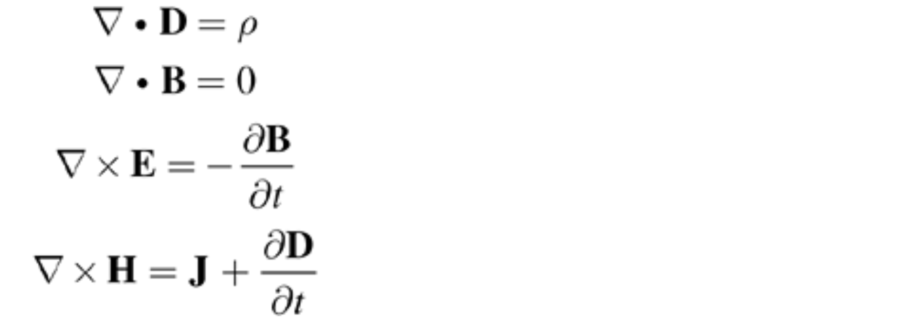
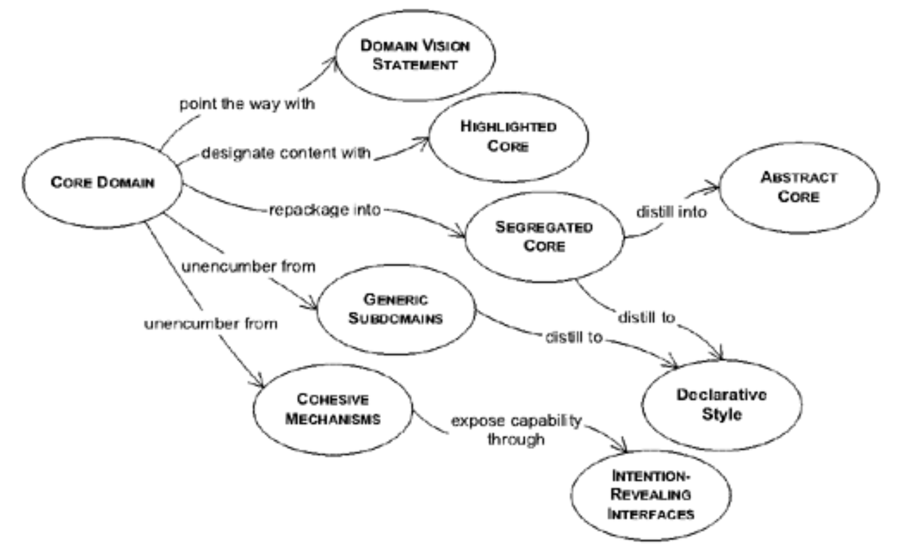

## 第 15 章 蒸馏

#### ▶[上一节](../ch14/14.md)

*这四条方程，连同其术语的定义和支撑它们的数学体系，完整地阐述了十九世纪经典电磁学的全部内容。*

—— James Clerk Maxwell，《A Treatise on Electricity and Magnetism》，1873 年

如何聚焦核心问题，避免在次要议题的汪洋中迷失方向？[LAYERED ARCHITECTURE](../glossary.md#layered-architecture) 将领域概念与驱动计算机系统运行的技术逻辑分离，但在大型系统中，即使被隔离的领域也可能变得难以掌控的复杂。

*蒸馏* 是分离混合物成分的过程，旨在提取更具价值和实用性的精华。模型即知识的蒸馏产物。每次重构都带来更深层的洞察，使我们得以抽象出领域知识与优先级的关键要素。此刻，让我们退后一步进行战略审视——本章将探讨如何区分模型的广阔领域，并提炼出完整的领域模型。

与许多化学蒸馏过程类似，分离出的副产品本身因蒸馏过程而变得更有价值（如`GENERIC SUBDOMAINS` 和`COHERENT MECHANISMS`），但这项努力的动机在于提取那个特别有价值的部分——正是这个部分使我们的软件与众不同，使其值得构建：即 “[CORE DOMAIN](../ch15/1.md)” 。

领域模型的战略提炼包括以下所有方面：

1. 帮助所有团队成员理解系统的整体设计及其各部分如何协作

2. 通过确定一个可管理规模的核心模型来促进沟通，从而形成 [UBIQUITOUS LANGUAGE ](../ch2/1.md)

3. 指导重构工作

4. 聚焦模型中最具价值的领域开展工作

5. 指导外包决策、现成组件的使用及任务分配决策

本章系统阐述了对 [CORE DOMAIN](../ch15/1.md) 进行战略提炼的方法论，阐释了如何在团队内部有效共享该领域的认知视角，并提供了描述我们所做工作的统一语言体系。

#### Figure 15.1

*战略提炼导航图*

如同园丁修剪树木，为主枝生长开辟道路，我们将运用一系列技术手段，剔除模型中的干扰因素，将注意力集中在最重要的部分……

#### ▶[下一节](1.md)
