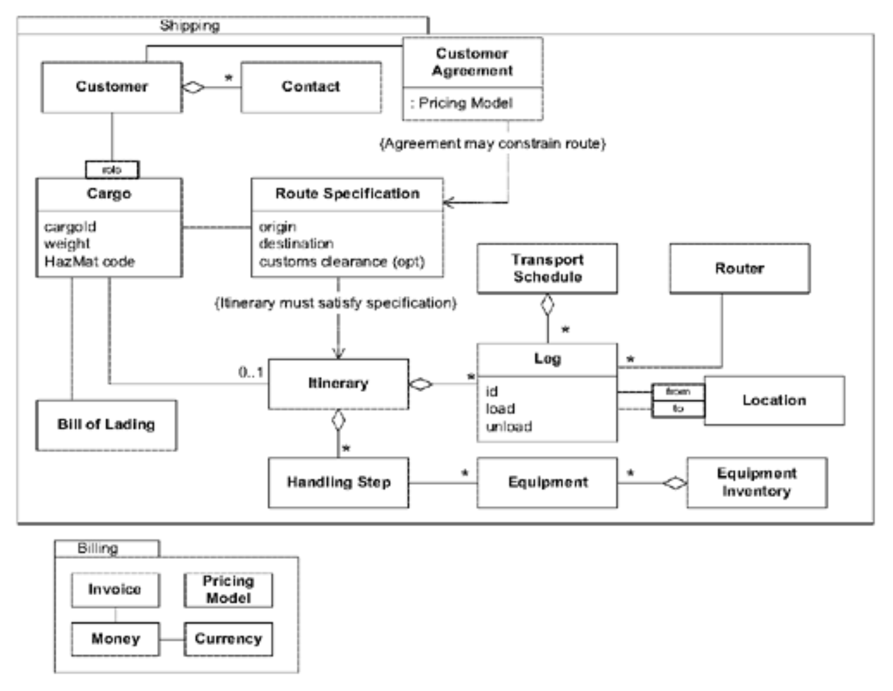
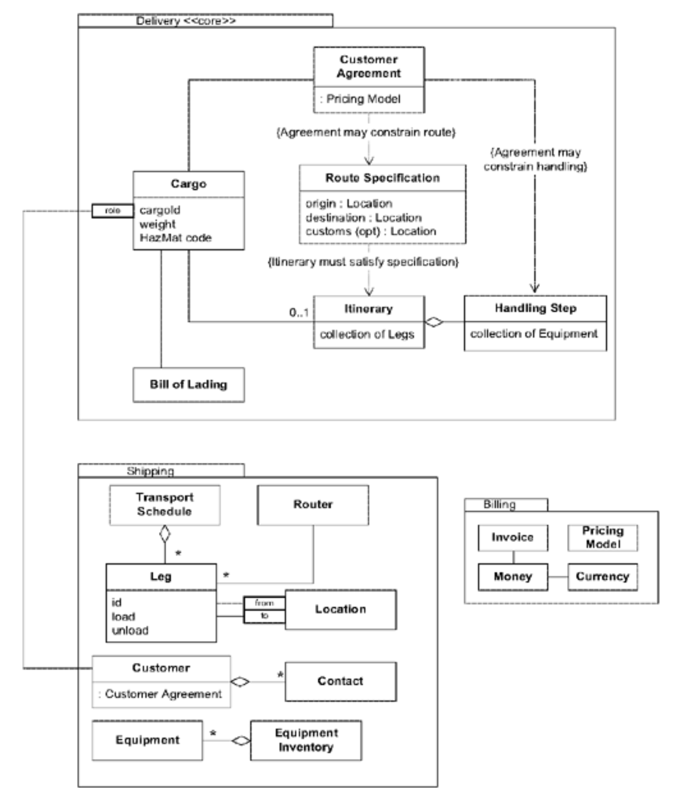
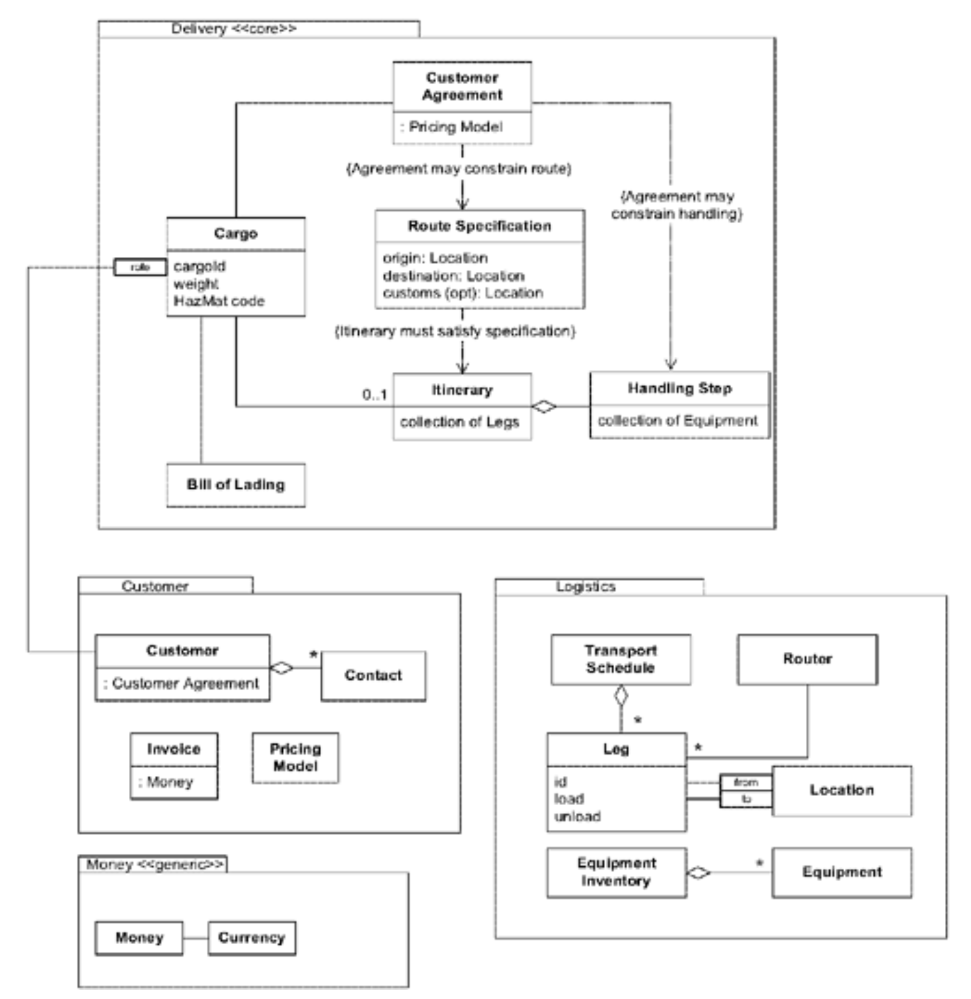

## 隔离的核心：`SEGREGATED CORE`

#### ▶[上一节](6.md)

<ins>**模型中的元素可能部分服务于 [CORE DOMAIN](1.md) ，部分扮演支持角色。`CORE`元素可能与通用元素紧密耦合。`CORE`的概念内聚性可能不强或不明显。所有这些杂乱和纠缠会阻塞`CORE`。设计者无法清晰地看到最重要的关系，从而导致设计薄弱。**</ins>

通过提取 [GENERIC SUBDOMAINS](3.md) ，你可以清除域中一些模糊的细节，使`CORE`更加清晰可见。但识别和理清所有这些子域是很费力的，而且其中一些似乎不值得花费精力。与此同时，最重要的 [CORE DOMAIN](1.md) 仍然与残留部分纠缠在一起。

因此：

<ins>**重构模型，将`CORE`概念与辅助部分（包括定义不清的部分）分离，并增强`CORE`的内聚性，同时减少其与其他代码的耦合。将所有通用或辅助元素提取到其他对象中，并放入其他包中，即使这意味着需要以分离高度耦合元素的方式重构模型。**</ins>

这基本上是将我们应用于 [GENERIC SUBDOMAINS](3.md) 的相同原理，但从另一个方向来应用。那些对我们的应用至关重要的内聚子域可以被识别出来，并划分到它们自己的内聚包中。对于剩下的未区分的部分应该做什么很重要，但没有那么关键。它们可以基本保持原状，或者根据显著的类划分到相应的包中。最终，越来越多的残余部分可以被整合到 [GENERIC SUBDOMAINS](3.md) 中，但在短期内，任何简单的解决方案都可以，只要能够保持对`SEGREGATED CORE`的关注。

🌼🌼🌼

将代码重构为`SEGREGATED CORE`模式通常需要以下步骤：

1. 确定一个`CORE`子域（可参考提炼文档进行选取）。
2. 将相关类迁移至新创建的 [MODULE](../ch5/5.md) 中，该模块名称应体现关联概念。
3. 重构代码以分离那些并非直接体现核心概念的数据与功能。将移除的部分放入其他包中的（可能新建的）类中。尽量将其与概念相关的任务归类，但不必过度追求完美。始终专注于清理`CORE`子域，确保其对其他包的引用明确且自明。
4. 重构新创建的`SEGREGATED CORE MODULE`，使其关联关系和交互更简洁清晰，同时最小化并明确其与其他 [MODULE](../ch5/5.md) 的关联。（此项成为持续重构的目标。）
5. 对另一个`CORE`子领域重复此过程，直至完成`SEGREGATED CORE`的构建。

### 创建`SEGREGATED CORE`的代价

隔离`CORE`有时会使与非核心类之间紧密耦合的关系变得更晦涩甚至更复杂，但这种代价远低于其带来的收益——它能清晰界定 [CORE DOMAIN](1.md) ，并大幅提升开发效率。

`SEGREGATED CORE`将使您能够增强该 [CORE DOMAIN](1.md) 的凝聚力。拆解模型的有效方式多种多样，有时在创建`SEGREGATED CORE`的过程中，可能需要打破原本凝聚力良好的 [MODULE](../ch5/5.md) ，以牺牲局部凝聚力为代价来强化 [CORE DOMAIN](1.md) 的整体凝聚力。这种取舍实为净收益，因为企业软件的核心价值增量，恰恰源于模型中那些企业特有的部分。

当然，另一个代价是分离`CORE`需要大量工作。必须承认，转向`SEGREGATED CORE`的决策可能会让开发人员忙于系统各处的变更。

创建`SEGREGATED CORE`的时机在于：当系统存在一个至关重要的庞大 [BOUNDED CONTEXT](../ch14/1.md)，但模型核心部分却被大量辅助功能所掩盖时。

### 演进中的团队决策

如同许多战略设计决策，整个团队必须共同迈向`SEGREGATED CORE`。这一步骤需要团队决策流程，以及具备足够纪律性与协调性的团队来执行决策。挑战在于约束所有人使用相同的`CORE`定义，同时避免决策僵化。由于 [CORE DOMAIN](1.md) 如同设计其他维度般持续演进，实践`SEGREGATED CORE`将带来全新洞见，厘清何为本质要素、何为辅助组件。这些洞见应反哺于 [CORE DOMAIN](1.md) 及`SEGREGATED CORE MODULES`的精进定义。

这意味着新见解必须持续与团队共享，但个人（或编程搭档）不能单方面采取行动。无论采用何种集体决策流程，共识决策或团队领导指令，都必须具备足够的敏捷性以反复调整方向。沟通必须足够高效，确保所有人始终保持对`CORE`的统一认知。

### 示例：分离货运模型中的`CORE`

我们以 [Figure 15.2](#figure-152) 所示的模型为基础，构建货运协调软件。

#### Figure 15.2

请注意，相较于实际应用所需的复杂程度，此处模型已高度简化。真实模型过于繁琐，难以作为示例呈现。因此，尽管本例尚未复杂到需要采用`SEGREGATED CORE`架构，但请发挥想象力，将此模型视为难以整体解读和处理的复杂系统。

那么，运输模式的本质是什么？通常，我们不妨从 “底线” 开始审视。这可能让我们聚焦于定价和发票。但我们真正需要关注的是 [DOMAIN VISION STATEMENT](4.md) 。以下是其中一段摘录：

*……提升运营透明度，提供工具以更快、更可靠地满足客户需求……*

该应用程序并非为销售部门设计，而是供公司一线操作人员使用。因此，让我们将所有与金钱相关的功能降级为（诚然重要的）辅助角色。有人已将部分功能独立封装为`Billing`模块，我们可以保留该模块，并进一步明确其辅助定位。

核心关注点应聚焦于货物处理：按客户要求完成货物交付。提取与这些活动最直接相关的类，在一个名为`Delivery`的新包中形成了一个`SEGREGATED CORE`，如 [Figure 15.3](#figure-153) 所示。

#### Figure 15.3

*可靠交付并符合客户要求是本项目的核心目标。*

目前大部分类已迁移至新包中，但模型本身也进行了若干调整。

首先，`Customer Agreement`现在约束了`Handling Step`。这是团队在分离`CORE`时经常会产生的典型见解。随着注意力集中在有效、正确的交付上，`Customer Agreement`中的交付约束显得至关重要，并且应该在模型中 *明确体现* 。

另一种变化更为务实。在重构后的模型中，`Customer Agreement`直接附加到`Cargo`上，而不再需要通过`Customer`进行导航。（它必须在`Cargo`预订时附加，就像`Customer`一样。）在实际交付时，与其协议本身相比，`Customer`对操作并不那么重要。在另一种模型中，需要根据客户在运输中扮演的角色找到正确的`Customer`，然后查询其`Customer Agreement`。这种交互会阻塞你试图讲述的每一个关于该模型的故事。新的关联使最重要的场景尽可能简单和直接。现在，将`Customer`完全从`CORE`中提取出来变得容易了。

那么将`Customer`抽离出来又如何呢？重点在于满足`Customer`的需求，因此初看之下`Customer`似乎应归属于`CORE`。然而在交付过程中，由于`Customer Agreement`可直接调用，通常无需涉及`Customer`类。况且`Customer`的基本模型相当通用。

有充分理由支持将`Leg`保留在`CORE`中。我倾向于在`CORE`中保持极简主义，而`Leg`与`Transport Schedule`、`Routing Service`和`Location`具有更紧密的凝聚力，这些组件本就不必纳入`CORE`。但若该模型中大量需要阐述的故事都涉及`Legs`，我会将其移入`Delivery`包，并忍受它与其他类分离带来的不便。

在此示例中，所有类定义均与之前相同，但通常蒸馏需要重构类本身，以分离通用职责与领域特定职责，从而实现职责分离。

现在我们拥有了`SEGREGATED CORE`，重构工作已告完成。但剩下的`Shipping`包不过是 “抽离`CORE`后剩余的所有内容”。我们可通过后续重构实现更具表达力的封装，如 [Figure 15.4](#figure-154) 所示。

#### Figure 15.4

*对于非`CORE`子域，有意义的 [MODULES](../ch5/5.md) 在`SEGREGATED CORE`完成后跟随出现。*

要达到这个阶段可能需要多次重构，不必一次性完成。最终我们形成了：一个`SEGREGATED CORE`包、一个 [GENERIC SUBDOMAINS](3.md) 包，以及两个承担辅助功能的领域专用包。随着理解的深入，未来可能为`Customer`创建独立的 [GENERIC SUBDOMAINS](3.md) ，也可能针对运输场景进行更专业的定制化设计。

识别有用且有意义的 [MODULES](../ch5/5.md) 属于建模活动（详见 [第 5 章](../ch5/0.md) ）。开发人员与领域专家在知识提炼过程中协同开展战略性提炼工作。

#### ▶[下一节](8.md)
