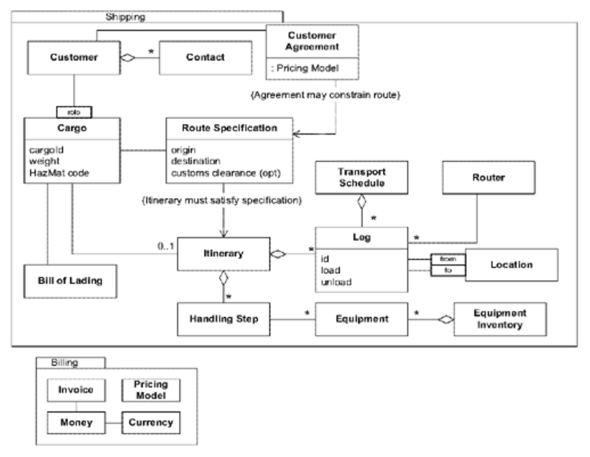
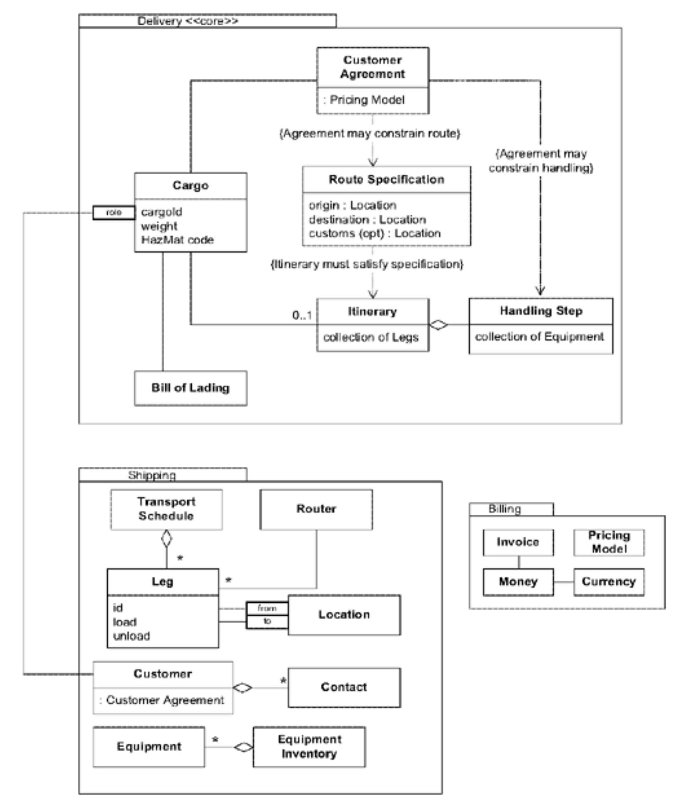
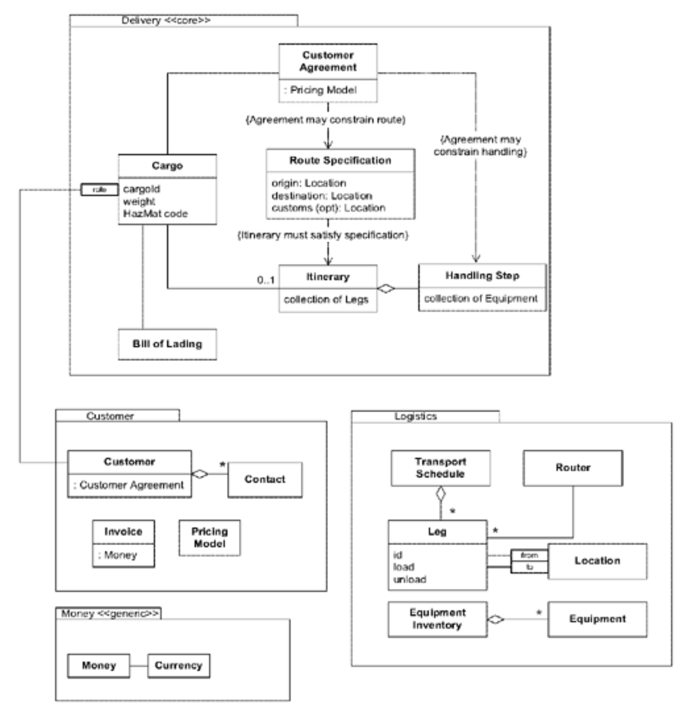

## 隔离的核心：`SEGREGATED CORE`

#### ▶[上一节](6.md)

<ins>**模型中的元素可能部分服务于 [CORE DOMAIN](1.md) ，部分扮演支持角色。
[CORE](1.md) 元素可能与通用元素紧密耦合。
[CORE](1.md) 的概念内聚性可能不强或不明显。
所有这些杂乱和纠缠都会压制 [CORE](1.md) 。
设计者无法清晰地看到最重要的关系，从而导致设计薄弱。**</ins>

通过提取 [GENERIC SUBDOMAINS](3.md) ，你可以清除域中一些模糊的细节，使 [CORE](1.md) 更加清晰可见。但识别和理清所有这些子域是很费力的，而且其中一些似乎不值得花费精力。与此同时，最重要的 [CORE DOMAIN](1.md) 仍然与残留部分纠缠在一起。

因此：

<ins>**重构模型，将 [CORE](1.md) 概念与辅助部分（包括定义不清的部分）分离，并增强 [CORE](1.md) 的内聚性，同时减少其与其他代码的耦合。将所有通用或辅助元素提取到其他对象中，并放入其他包中，即使这意味着需要以分离高度耦合元素的方式重构模型。**</ins>

这本质上是沿用我们应用于 [GENERIC SUBDOMAINS](3.md) 的同一套原则，只是方向相反。
我们可以识别出对应用至关重要的内聚子域，并将它们划分到各自独立、内聚的包中。
如何处理剩下那些未区分的部分很重要，但并非重中之重。
它们可以基本保留在原处，或是根据主要类划分到不同包中。
最终，越来越多的剩余部分可以被提取为 [GENERIC SUBDOMAINS](3.md) ；
但短期内，任何简便方案都可行，只要能保持对`SEGREGATED CORE`的聚焦即可。

🌼🌼🌼

重构为`SEGREGATED CORE`通常需要以下步骤：

1. 识别一个 [CORE](1.md) 子域（可参考提炼文档进行选取）。
2. 将相关类迁移至新创建的 [MODULE](../ch5/5.md) 中，该模块名称应体现关联概念。
3. 重构代码以分离那些并非直接体现核心概念的数据与功能。
将移除的部分放入其他包中的（可能新建的）类中。
尽量将其与概念相关的任务归类，但不必过度追求完美。
始终专注于清理 [CORE](1.md) 子域，确保其对其他包的引用明确且一目了然。
4. 重构新创建的`SEGREGATED CORE MODULE`，使其关联关系和交互更简洁清晰，同时最小化并澄清其与其他 [MODULE](../ch5/5.md) 的关联。（此项成为持续重构的目标。）
5. 对另一个 [CORE](1.md) 子领域重复此过程，直至完成`SEGREGATED CORE`的构建。

### 创建`SEGREGATED CORE`的代价

<ins>隔离 [CORE](1.md) 有时会让与紧密耦合的非核心类之间的关系，变得更晦涩甚至更复杂，但这种代价远低于其带来的收益，它能清晰界定 [CORE DOMAIN](1.md) ，并大幅提升开发效率。</ins>

`SEGREGATED CORE`使您能够增强 [CORE DOMAIN](1.md) 的内聚性。
分解模型的有效方式多种多样，有时在创建`SEGREGATED CORE`的过程中，可能需要打破原本内聚良好的 [MODULE](../ch5/5.md) ，以牺牲局部内聚性为代价来强化 [CORE DOMAIN](1.md) 的整体内聚性。
这种取舍实为净收益，因为企业软件的核心价值增量，恰恰源于模型中那些企业特有的部分。

当然，另一个代价是分离 [CORE](1.md) 需要大量工作。必须承认，转向`SEGREGATED CORE`的决策可能会让开发人员忙于系统各处的变更。

<ins>创建`SEGREGATED CORE`的时机在于：当系统存在一个至关重要的庞大 [BOUNDED CONTEXT](../ch14/1.md)，但模型核心部分却被大量辅助功能所掩盖时。</ins>

### 演进中的团队决策

<ins>如同许多战略设计决策，整个团队必须共同迈向`SEGREGATED CORE`。</ins>
这一步骤需要团队决策流程，以及具备足够纪律性与协调性的团队来执行决策。
挑战在于约束所有人使用相同的 [CORE](1.md) 定义，同时避免决策僵化。
由于 [CORE DOMAIN](1.md) 如同设计其他方面一样持续演进，实践`SEGREGATED CORE`将带来全新洞见，厘清何为本质要素、何为辅助元素。
这些洞见应反哺于 [CORE DOMAIN](1.md) 及`SEGREGATED CORE MODULES`的精炼定义。

这意味着新的认知必须持续在团队中共享，但个人（或编程搭档）不能单方面依据这些认知采取行动。
无论联合决策的流程是共识达成还是团队负责人指令，都必须足够敏捷，以便进行多次方向调整。
<ins>沟通必须足够有效，让所有人对 [CORE](1.md) 保持统一认知。</ins>

#### 示例：分离货运模型中的 [CORE](1.md)

我们以 [Figure 15.2](#figure-152) 所示的模型为基础，构建货运协调软件。

#### Figure 15.2

请注意，相较于实际应用所需的复杂程度，此处模型已高度简化。
真实模型过于繁琐，难以作为示例呈现。
因此，尽管本例尚未复杂到需要采用`SEGREGATED CORE`，但请发挥想象力，将此模型视为难以整体解读和处理的复杂系统。

那么，运输模型的本质是什么？
通常，我们不妨从 “底线” 开始审视。
这可能让我们聚焦于定价和发票。
但我们真正需要关注的是 [DOMAIN VISION STATEMENT](4.md) 。以下是其中一段摘录：

*
……提升运营透明度，提供工具以更快、更可靠地满足客户需求……
*

该应用程序并非为销售部门设计，而是供公司一线操作人员使用。因此，让我们将所有与金钱相关的功能降级为（诚然重要的）辅助角色。有人已将部分功能独立封装为`Billing`模块，我们可以保留该模块，并进一步明确其辅助定位。

核心关注点应聚焦于货物处理：按客户要求完成货物交付。提取与这些活动最直接相关的类，在一个名为`Delivery`的新包中形成了一个`SEGREGATED CORE`，如 [Figure 15.3](#figure-153) 所示。

#### Figure 15.3

*可靠交付并符合客户要求是本项目的核心目标。*

目前大部分类已迁移至新包中，但模型本身也进行了若干调整。

首先，`Customer Agreement`现在约束了`Handling Step`。
这是团队在分离 [CORE](1.md) 时经常会产生的典型洞察。
随着注意力集中在有效、正确的交付上，`Customer Agreement`中的交付约束显得至关重要，并且应该在模型中 *显式体现* 。

另一种变化更为务实。
在重构后的模型中，`Customer Agreement`直接附加到`Cargo`上，而不再需要通过`Customer`进行导航。
（它必须在`Cargo`预订时附加，就像`Customer`一样。）
在实际交付时，与`Agreement`本身相比，`Customer`对运营并没那么重要。
在上一个模型中，需要根据客户在运输中扮演的角色找到正确的`Customer`，然后查询其`Customer Agreement`。
这种交互会阻塞你试图讲述的每一个关于该模型的故事。
新的关联使最重要的场景尽可能简单和直接。
现在，将`Customer`完全从 [CORE](1.md) 中提取出来变得容易了。

那么，把`Customer`抽离出来又如何呢？
我们的目标是满足`Customer`需求，所以乍看之下，`Customer`似乎理应属于 [CORE](1.md) 。
然而，既然现在可以直接获取`Customer Agreement`，交付过程中的交互通常就不再需要用到`Customer`。
而且，`Customer`的基础模型本身是相当通用的。

有充分理由支持将`Leg`保留在 [CORE](1.md) 中。我倾向于在 [CORE](1.md) 中保持极简主义，而`Leg`与`Transport Schedule`、`Routing Service`和`Location`具有更紧密的凝聚力，这些组件本就不必纳入 [CORE](1.md) 。但若该模型中大量需要阐述的故事都涉及`Legs`，我会将其移入`Delivery`包，并忍受它与其他类分离带来的不便。

在此示例中，所有类定义均与之前相同，<ins>但通常提炼需要重构类本身，以分离通用职责与领域特定职责，从而实现职责分离。</ins>

现在我们拥有了`SEGREGATED CORE`，重构工作已告完成。但剩下的`Shipping`包不过是 “抽离 [CORE](1.md) 后剩余的所有内容”。我们可通过后续重构实现更具表达力的封装，如 [Figure 15.4](#figure-154) 所示。

#### Figure 15.4

*对于非 [CORE](1.md) 子域，有意义的 [MODULES](../ch5/5.md) 在`SEGREGATED CORE`完成后跟随出现。*

要达到这个阶段可能需要多次重构，不必一次性完成。
最终我们形成了：一个`SEGREGATED CORE`包、一个 [GENERIC SUBDOMAINS](3.md) 包，以及两个承担支持角色的领域专用包。
随着理解的深入，未来可能为`Customer`创建独立的 [GENERIC SUBDOMAINS](3.md) ，也可能针对运输场景进行更专业的定制化设计。

识别有用且有意义的 [MODULES](../ch5/5.md) 属于建模活动（如 [第 5 章](../ch5/0.md) 所讨论的）。开发人员与领域专家在知识消化过程中协同开展战略性提炼工作。

#### ▶[下一节](8.md)
