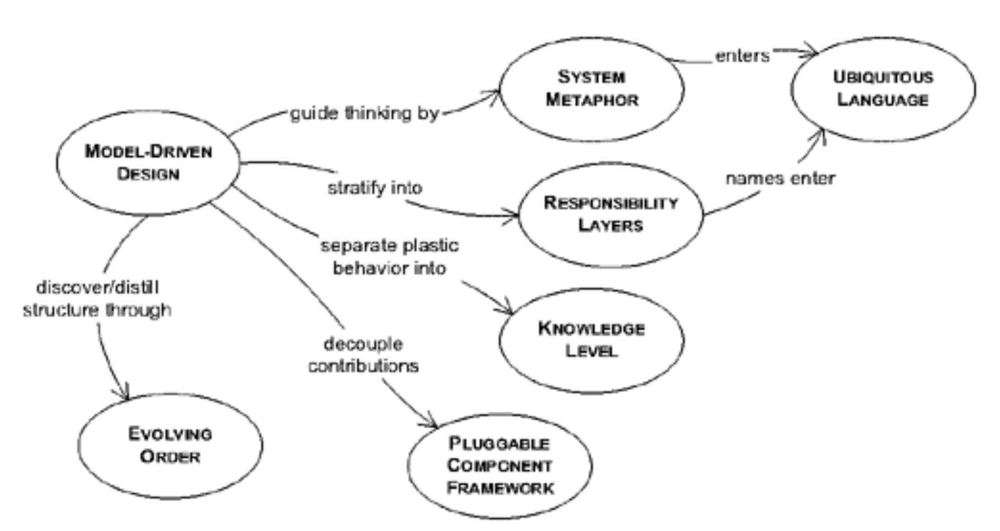

## 第 16 章 大规模结构

*数千人独立协作，共同完成了艾滋病纪念被的制作。*

#### ▶[上一节](../ch15/10.md)

一家硅谷小型设计公司受托开发卫星通信系统的仿真器。项目进展顺利。他们正在构建一种 [MODEL-DRIVEN DESIGN](../ch3/1.md) ，能够表达并模拟各种网络状态与故障场景。

但该项目的首席开发人员感到不安。问题本身就很复杂。为了厘清模型中错综复杂的关系，他们将设计分解为大小适中的、相互关联的 [MODULES](../ch5/5.md) 。现在模块数量庞大。开发者该查阅哪个包才能找到特定功能？新类该放在哪里？这些小包究竟代表什么？它们如何协同工作？而开发工作尚未完成。

开发人员之间沟通顺畅，日常工作仍能顺利推进，但项目负责人并不满足于在可理解性的边缘游走。他们希望找到某种设计组织方式，使方案在迈向更高复杂度时仍能被理解和操控。

他们进行了头脑风暴。出现了许多可能性。有人提出了替代包装方案。或许某份文档能概述系统全貌，或者建模工具中类图的新视图能引导开发者找到正确的 [MODULE](../ch5/5.md) 。但项目负责人对这些花招并不满意。

他们能够讲述一个简单的模拟故事，描述数据如何通过基础设施进行调度，其完整性与路由由多层电信技术保障。这个故事的每个细节都存在于模型中，然而故事的整体脉络却无法被看见。

<ins>该领域中某些关键概念缺失了。但这次缺失的并非对象模型中的一两个类，而是整个模型结构的缺失。</ins>

开发人员经过一两周的反复斟酌，构想逐渐成形。他们决定为设计强加一种结构。整个模拟器将被视为与通信系统各方面相关的分层结构。底层代表物理基础设施，即节点间传输比特的基本能力。其上是数据包路由层，负责协调特定数据流的导向问题。其余各层则对应问题的不同概念层面。这些分层将勾勒出系统运作的全貌。

他们着手重构代码以符合新结构。[MODULES](../ch5/5.md) 必须重新定义，避免跨层存在。某些情况下，对象职责被重构，确保每个对象明确归属于单一层级。反之，在整个过程中，概念层级的定义本身也基于实际应用经验不断精炼。层级、[MODULES](../ch5/5.md) 和对象共同演进，最终整个设计完全契合了这种分层结构的轮廓。

<ins>这些层级并非代码中的 [MODULES](../ch5/5.md) 或其他任何构件。它们是一套贯穿全局的规则体系，在整个设计中约束着任何特定 [MODULE](../ch5/5.md) 或对象的边界与关联关系，甚至延伸至与其他系统的接口处。</ins>

这种秩序的建立使设计重归清晰可辨的状态。人们大致知道该去哪里寻找特定功能。独立工作的个体所做的设计决策能保持整体一致性。复杂性的上限已被打破。

即使采用`MODULAR`拆分，大型模型仍可能过于复杂难以把握。[MODULES](../ch5/5.md) 将设计分割成可控的片段，但这些片段可能数量庞大。此外，模块化并不必然带来设计统一性。对象与对象之间、包与包之间，可能存在杂乱无章的设计决策——每项决策都自成体系却又各具特色。

[BOUNDED CONTEXT](../ch14/1.md) 强加的严格隔离能防止污染和混乱，但其本身并不能让人更容易地看到系统整体。

提炼确实有助于聚焦于 [CORE DOMAIN](1.md) ，并将其他子领域定位为辅助角色。但理解辅助元素及其与 [CORE DOMAIN](1.md) 以及彼此之间的关系，仍然不可或缺。虽然理想状态下 [CORE DOMAIN](1.md) 应当清晰易懂到无需额外指引，但我们并非总能达到这种境界。

在任何规模的项目中，团队成员都需相对独立地处理系统不同部分。若缺乏协调机制与规范约束，同一问题将出现风格迥异、解决方案各异的混乱局面，导致难以理解各部分如何衔接，更无法把握整体架构。对某部分设计的理解无法迁移至其他模块，最终导致项目中各 [MODULES](../ch5/5.md) 的专家们各自为政，无法在狭窄领域之外相互协作。[CONTINUOUS INTEGRATION](../ch14/2.md) 机制随之瓦解，[BOUNDED CONTEXT](../ch14/1.md) 也因此支离破碎。

<ins>**在一个庞大的系统中，若缺乏统领全局的指导原则，无法依据元素在贯穿整体设计的模式中所扮演的角色来解读它们，开发者便会陷入只见树木不见森林的困境。**</ins>我们需要能够理解单个部件在整体中的作用，而无需深入探究整体的细节。

<ins>*“大规模结构” 是一种语言，它能够让你以宏观的视角讨论和理解系统。*</ins> 一组高级概念或规则，或两者兼有，为整个系统建立了设计模式。这种组织原则不仅可以指导设计，还可以帮助理解。它有助于协调独立工作，因为大家对整体有共同的概念：各个部分的作用如何塑造整体。

<ins>**设计一套贯穿整个系统的规则或角色与关系模式，使人们能够理解每个部分在整体中的定位 —— 即使不详细了解该部分的具体职责。**</ins>

<ins>结构可能仅限于一个 [BOUNDED CONTEXT](../ch14/1.md) ，但通常会跨越多个，为项目中所有相关团队和子系统提供概念性组织框架。</ins>良好的结构能深入揭示模型本质，并为提炼过程提供补充。

<ins>大多数大型结构无法用 UML 表示，也无需如此。</ins>这类结构主要用于塑造和阐释模型与设计，本身并不直接呈现于模型中。它们为设计沟通提供了额外的层次。在本章示例中，你会看到许多非正式的 UML 图，我在这些图上叠加了大型结构的相关信息。

当团队规模适中且模型结构不复杂时，通过将模型分解为命名清晰的 [MODULES](../ch5/5.md) 、进行适度精简，并依靠开发者之间的非正式协作，通常足以保持模型结构的有序性。

大规模结构能拯救项目，但不合适的结构会严重阻碍开发进程。本章将探讨在此层级成功构建设计结构的模式。

#### Figure 16.1

*大规模结构的若干模式*

#### ▶[下一节](1.md)
