## 职责分层：`RESPONSIBILITY LAYERS`

#### ▶[上一节](2.md)

贯穿本书始终，各个对象都被分配了狭窄的相关职责集合。职责驱动设计同样适用于更大规模的系统。

🌼🌼🌼

<ins>**当每个独立对象都承担手工编写的职责时，既无规范可循，也无统一标准，更无法协同处理领域中的大范围事务。为使大型模型保持一致性，有必要在职责分配上施加某种结构。**</ins>

当你对某个领域有深入理解时，广泛的模式便开始显现。某些领域具有天然的分层结构。某些概念和活动在特定背景下展开，而背景中的其他元素却因不同原因以不同速度独立变化。如何利用这种天然结构，使其更清晰、更实用？这种分层特性暗示了分层设计，这是最成功的架构设计模式之一（ [Buschmann et al.1996](../references.md#buschmann-1996) ,等文献）。

层是系统的分区，其中每个分区的成员能够感知并使用 “下层” 的服务，但对 “上层” 保持不知情且独立。当绘制 [MODULES](../ch5/5.md) 的依赖关系时，它们通常被布局为一个有依赖的 [MODULE](../ch5/5.md) 出现在其依赖者的下方。通过这种方式，层有时会自动排序，使得下层的对象概念上不依赖于上层的对象。

但是这种特殊 (ad hoc) 分层，虽然可以让追踪依赖关系更容易 ——有时也符合直觉—— 却不能提供关于模型的深入理解，也无法指导建模决策。我们需要更有意图的方法。

#### Figure 16.2
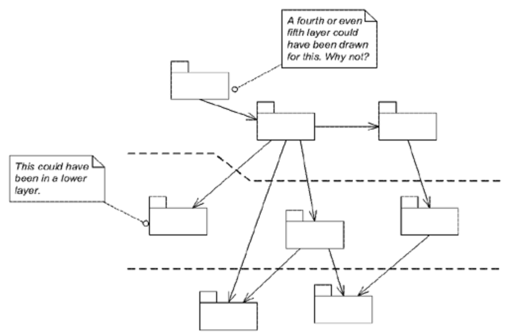
*特殊分层：这些包是关于什么的*

在具有自然分层的模型中，可围绕主要职责定义概念层，从而将分层与职责驱动设计这两大强大原则有机结合。

这些职责必须远比通常分配给单个对象的职责更为广泛，下文将通过实例说明。在设计各个 [MODULES](../ch5/5.md) 和 [AGGREGATES](../ch6/1.md) 时，需将其职责限定在这些主要职责的范畴内。这种通过命名职责进行的分组本身就能提升模块化系统的可理解性，因为 [MODULES](../ch5/5.md) 的职责将更易于解读。但将高层级职责与分层结构相结合，则为系统提供了组织原则。

---
最适合`RESPONSIBILITY LAYERS`的分层模式是被称为`RELAXED LAYERED SYSTEM`的变体（ [Buschmann et al.1996](../references.md#buschmann-1996)，第 45 页），它允许一层的组件访问任意较低的层，而不仅仅是直接下方的那一层。

---

因此：

<ins>**审视模型中的概念依赖关系，以及领域中不同部分变化的速度和来源。若在领域中识别出自然分层，将其转化为广泛的抽象职责。这些职责应清晰阐述系统的高层级目标与设计理念。重构模型，使每个领域对象、[AGGREGATE](../ch6/1.md) 和 [MODULE](../ch5/5.md) 的职责都精确归属于单一层级的责任范围。**</ins>

这段描述相当抽象，但通过几个实例便会清晰明了。本章开篇提及的卫星通信模拟器采用了分层责任设计。我曾目睹`RESPONSIBILITY LAYERS`在制造控制与财务管理等不同领域都取得了显著成效。

🌼🌼🌼

以下示例深入探讨了`RESPONSIBILITY LAYERS`，旨在让读者体会如何发现任何类型的大型系统结构，以及这种结构如何引导并约束建模与设计。

### 示例：深度解析：航运系统的分层设计

让我们看看将`RESPONSIBILITY LAYERS`应用于前几章示例中讨论的航运应用程序会产生什么影响。

当我们重新进入故事时，团队在创建 [MODEL-DRIVEN DESIGN](../ch3/1.md) 和提炼 [CORE DOMAIN](../ch15/1.md) 方面已经取得了相当大的进展。但随着设计逐渐完善，他们在协调各个部分如何组合在一起时遇到了困难。他们正在寻找一种大型结构，可以突出系统的主要主题，并让所有人保持一致的理解。

以下展示模型中具有代表性的部分。

#### Figure 16.3
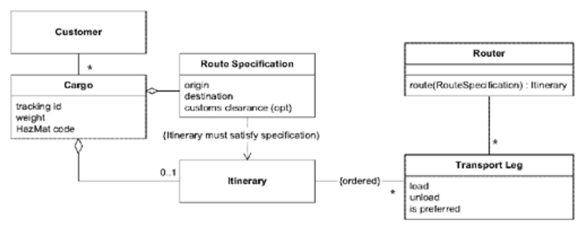
*用于货物路由的基本航运领域模型*

#### Figure 16.4
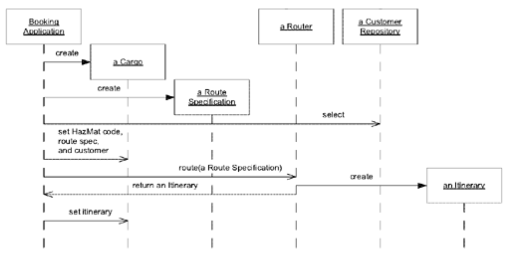
*在预订中使用模型来为路由货物*

团队成员已经在航运领域浸淫了好几个月，他们注意到其中的概念自然地呈现出分层。讨论运输时间表（船舶和火车的预定航次）而不涉及运载的货物是相当合理的。而在不提及承运运输工具的情况下讨论货物追踪则更为困难。概念上的依赖关系非常清晰。团队可以很容易地区分两个层次：“运营” 和这些运营的基础，他们称之为 “能力” 。

#### “运营” 职责

公司过去、现在及未来的各项活动均归入运营层。最核心的运营对象是`Cargo`，它承载着公司日常运营的核心业务。`Route Specification`作为`Cargo`的组成部分，明确运输要求；`Itinerary`则是具体的运输执行方案。这两类对象均属于`Cargo`的 [AGGREGATE](../ch6/1.md) 范畴，其生命周期与当前运输任务的时间框架紧密关联。

#### "能力" 职责

该层体现公司为开展运营所调用的资源。`Transit Leg`即为经典范例。船舶按计划运行并具备特定载货能力，该能力可能被充分利用也可能未被完全利用。

诚然，若专注于运营船队，`Transit Leg`应归属运营层。但该系统的用户无需关注此问题。（若公司同时开展两项业务且需协调运作，开发团队可能需采用不同分层方案，例如设置“运输运营”与“货运运营”两个独立层级。）

更棘手的决策在于如何定位`Customer`。某些业务中，客户往往具有短暂性：包裹配送期间他们值得关注，之后便基本被遗忘直至下次合作。这种特性使得客户仅成为面向个人消费者的包裹递送服务中的运营考量对象。但假设中的运输公司更注重培养长期客户关系，业务主要来自回头客。 *基于业务用户的这种诉求，* `Customer`应归属于潜在层。由此可见，*这并非技术层面的决策，* 而是为了捕捉并传达领域知识。

由于`Cargo`与`Customer`之间的关联仅支持单向遍历，`Cargo`的 [REPOSITORY](../ch6/3.md) 需要一个查询操作，用于查找特定`Customer`的所有`Cargo`。这种设计本就有充分的合理性，但在大规模结构的约束下，它已成为必要条件。

#### Figure 16.5
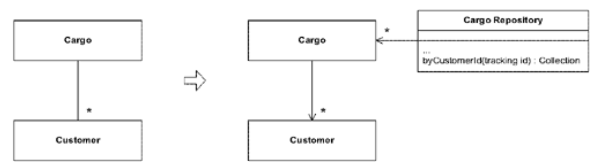
*查询取代了违反分层的双向关联。*

#### Figure 16.6
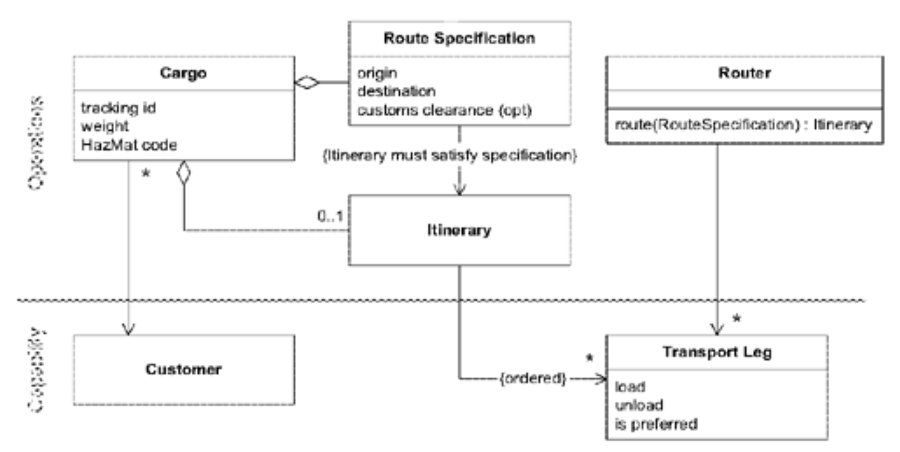
*初步分层模型*

虽然将 “运营” 与 “能力” 区分开来使情况更清晰，但秩序仍在不断演变。经过数周的实验，团队又聚焦于另一项区分。最初的两层结构大多关注事物或计划的 *现状* ，但`Router`（以及本例中未提及的许多其他元素）并不属于当前的运营现实或计划范畴。它协助决策者调整这些计划。团队由此定义出负责 “决策支持” 的新层级。

#### "决策支持” 职责

该软件层为用户提供规划与决策工具，并可实现部分决策自动化（例如当运输计划变更时自动为`Cargoes`重新规划路线）。

`Router`作为 [SERVICE](../ch5/4.md) ，协助预订代理选择最佳货物运输方案。这使`Router`完全属于 ""决策支持" 。

该模型中的所有引用均与三层结构保持一致，唯有一处例外：`Transit Leg`上的 “is preferred” 属性。该属性存在的原因在于，公司倾向于在可能时使用自有船舶，或与之签订优惠合同的特定其他公司的船舶。"is preferred" 属性用于引导`Router`优先选择这些指定运输方式，其作用机制与 “能力” 属性无关，本质上是指导决策的策略性配置。若要采用新的`RESPONSIBILITY LAYERS`架构，需对该模型进行重构。

#### Figure 16.7
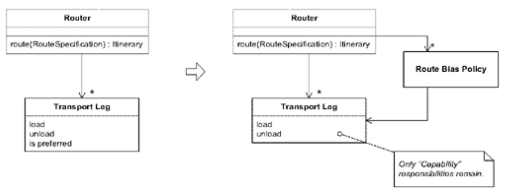
*重构模型以符合新的分层结构*

此重构使`Route Bias Policy`更明确，同时让`Transit Leg`更聚焦于运输能力这一核心概念。基于领域深度理解的大规模结构，往往能推动模型朝着澄清其含义的方向发展。

新模型现已顺畅地融入大规模结构。

#### Figure 16.8
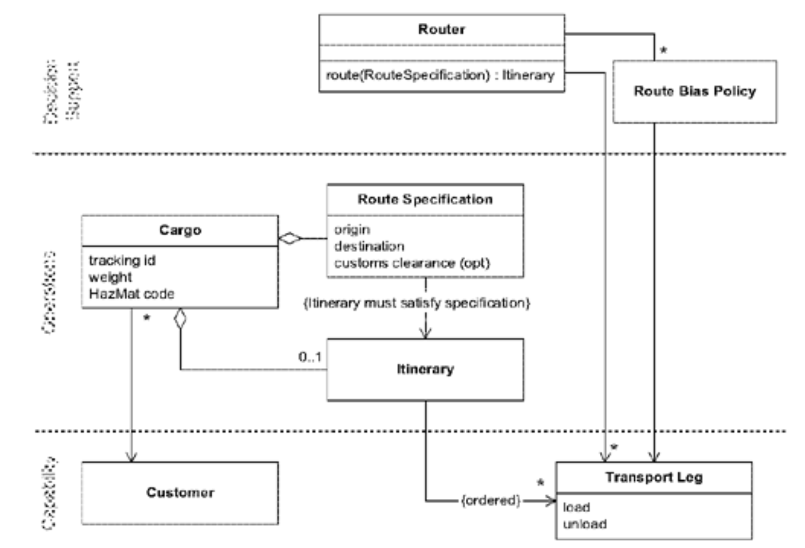
*重构后的模型*

熟悉所选分层结构的开发者能更清晰地辨别各部分的角色与依赖关系。随着复杂度提升，这种大规模结构的价值也随之增长。

需注意：虽然我用修改后的UML图示例说明，但绘图仅是传达分层概念的手段。UML本身并不包含此种标记法，此处添加的标记纯粹是为了便于读者理解。若代码是项目最终的设计文档，那么具备按层级浏览类或至少按层级生成报告的工具将大有裨益。

#### 这种结构如何影响后续设计？

一旦采用大规模结构，后续建模和设计决策都必须考虑该结构。例如，假设我们需要向这个已分层的设计中添加新功能。领域专家刚告知我们，某些类别的危险品需遵守路线限制：特定材料可能被禁止使用某些运输方式或进入某些港口。我们必须让`Router`遵守这些规定。

存在多种可行方案。在缺乏大规模结构的情况下，一种颇具吸引力的设计是将整合这些路由规则的责任赋予拥有`Route Specification`和危险品（HazMat）代码的对象 —— 即`Cargo`对象。

#### Figure 16.9
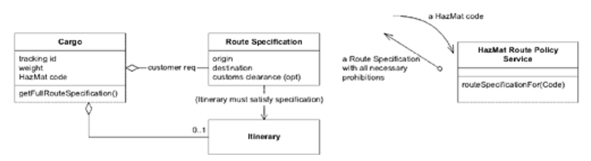
*危险货物路由的可行设计方案*

#### Figure 16.10
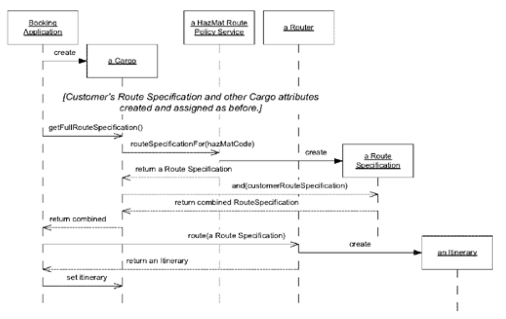

问题在于，这种设计不符合大规模结构。`HazMat Route Policy Service`本身没有问题，它完全符合决策支持层的职责范围。真正的问题在于`Cargo`（一个 "运营" 对象）对`HazMat Route Policy Service`（一个 "决策支持" 对象）的依赖关系。只要项目坚持采用分层架构，这种模型就不可取。它会让期望遵循结构规范的开发者感到困惑。

设计方案总是多种多样，我们只需另择其一：一个遵循大规模结构规则的方案。`HazMat Route Policy Service`本身没有问题，但需要转移策略使用的责任。不妨尝试让`Router`在搜索路线前承担收集相应策略的责任。这意味着需要修改`Router`接口，使其包含策略可能依赖的对象。以下是一个可行的设计方案。

#### Figure 16.11
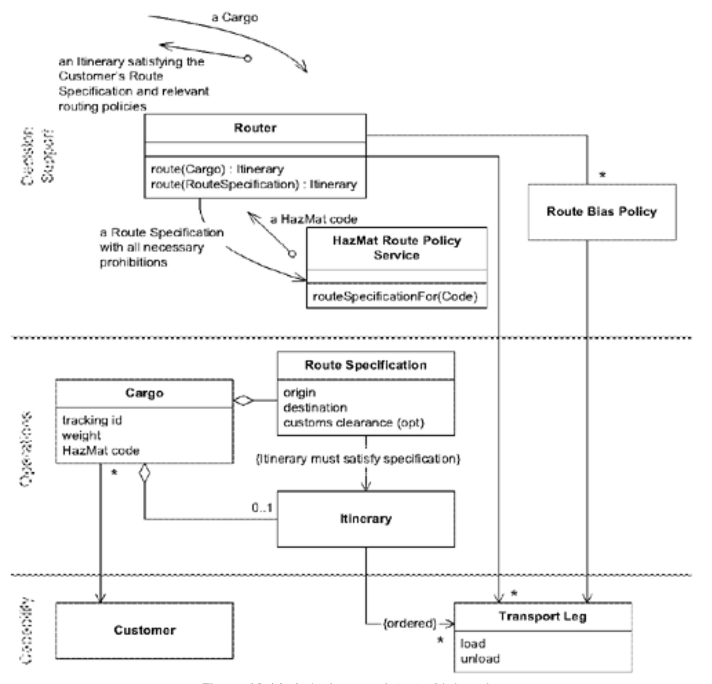
*符合分层原则的设计*

典型交互流程如下一页 [Figure 16.12](#figure-1612) 所示。

#### Figure 16.12
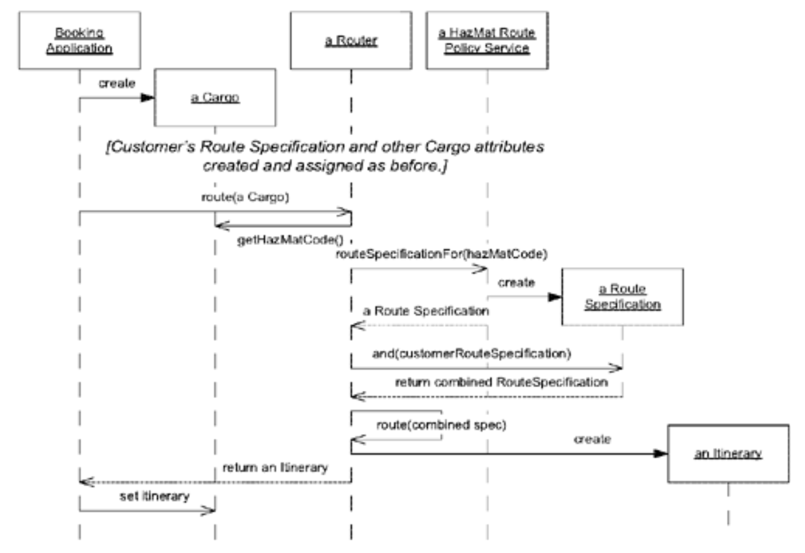

现在，这未必比其他设计更优越。它们各有优劣。但如果项目中的每个人都以一致的方式做出决策，整体设计就会清晰得多，这值得在细节设计选择上做出些许妥协。

如果结构迫使我们做出许多不妥当的设计选择，那么遵循 [EVOLVING ORDER](1.md) 的原则，就应该对其进行评估，或许需要修改甚至舍弃。

### 选择合适的层级

寻找优质的`RESPONSIBILITY LAYERS`或任何大规模架构，关键在于理解问题领域并不断尝试。若允许 [EVOLVING ORDER](1.md) ，初始起点并非决定性因素——尽管糟糕的选择确实会增加工作量。架构完全可能演变为面目全非的形态。因此，本文提出的指导原则不仅适用于从零构建时的选择，同样适用于架构演进过程中的调整决策。

随着层级结构的替换、合并、拆分和重新定义，以下是一些值得关注并予以保留的特性：

- ***叙事性。*** 层级结构应传达领域的基本现实或优先级。选择大规模结构与其说是技术决策，不如说是业务建模决策。层级结构应凸显业务的优先级。
- ***概念依赖性。*** 上层概念应在底层概念的背景下具有意义，而底层概念应能独立存在且具有意义。
- ***[CONCEPTUAL CONTOURS](../ch10/4.md)。*** 若不同层级对象具有不同的变化速率或变化来源，该层级将容纳它们之间的剪切关系。

为每个新模型定义层级时，并非总需从零开始。某些层级会出现在整个相关领域家族中。

例如，在依赖大型固定资本资产（如工厂或货轮）的企业中，物流软件通常可划分为 “潜力” 层（即示例中 “能力” 层的另一名称）和 “运营” 层。

- ***潜力。*** 我们 *能* 做什么？暂且不论计划中的行动，我们究竟能实现什么？组织资源（包括人力）及其组织方式构成了 "潜力" 层的核心。与供应商的合同同样界定了潜力边界。几乎所有商业领域都能识别这一层级，但在运输、制造等依赖巨额固定资本投资支撑运营的行业中，它尤为关键。"潜力" 同样涵盖流动资产，但若企业主要依赖流动资产驱动，则可选择强调该特性的层级（详见后文讨论）。（示例中该层级被称为 “能力” 。）
- ***操作层。*** 当前正在执行什么？我们如何将那些潜在可能性转化为现实？如同 "潜力" ，该层应反映实际状况，而非理想状态。在此层中，我们着眼于自身努力与行动：关注我们正在销售的产品，而非支撑销售的根基。"运营" 对象通常会引用甚至由 "潜力" 对象构成，但 "潜力" 对象不应反向引用 "运营" 层。

在许多（或许是大多数）此类领域的现有系统中，这两层涵盖了所有内容（尽管可能存在完全不同且更具揭示性的划分方式）。它们追踪当前状况和正在执行的操作计划，并据此发布报告或文档。但追踪并非总是足够。当项目旨在引导或协助用户，或实现决策自动化时，便需要额外承担一组职责，这些职责可组织成另一层级，位于 "运营" 层之上。

- ***决策支持。*** 应采取何种行动或制定何种政策？该层级专注于分析与决策制定，其分析基于 "潜力" 层或 "运营" 层等下层级提供的信息。"决策支持" 软件可利用历史数据，主动发掘当前及未来运营的机遇。

"决策支持" 系统在概念上依赖于其他层级（如 "运营" 层或 "潜力" 层），因为决策并非在真空中进行。许多项目采用数据仓库技术实现 "决策支持"。该层成为独立的 [BOUNDED CONTEXT](../ch14/1.md) ，与运营软件保持 [CUSTOMER/SUPPLIER](../ch14/6.md) 关系。在其他项目中，它则深度集成，如前文扩展示例所示。分层架构的内在优势之一在于：底层模块可独立于上层存在。这既便于分阶段部署，也支持在旧有运营系统基础上进行高阶功能增强。

另一类情况是执行复杂业务规则或法律要求的软件，这类软件可构成`RESPONSIBILITY LAYERS`。

- ***策略。*** 规则与目标是什么？规则和目标大多被动存在，但约束着其他层的行为。设计这些交互往往需要精妙处理。有时 "策略" 作为参数传递给底层方法，有时则应用 [STRATEGY](../ch12/1.md) 模式。"策略"与 "决策支持" 层配合使用效果最佳，该层提供实现 "策略" 目标的途径，同时受 "策略" 规则的约束。

策略层可以使用与其他层相同的语言编写，但有时会通过规则引擎实现。这并不必然意味着它们属于独立的 [BOUNDED CONTEXT](../ch14/1.md) 。事实上，通过在两者中严格采用相同的模型，可以缓解协调不同实现技术带来的困难。当规则基于与适用对象不同的模型编写时，要么导致复杂度急剧上升，要么被迫简化对象以维持可控性。

#### Figure 16.13
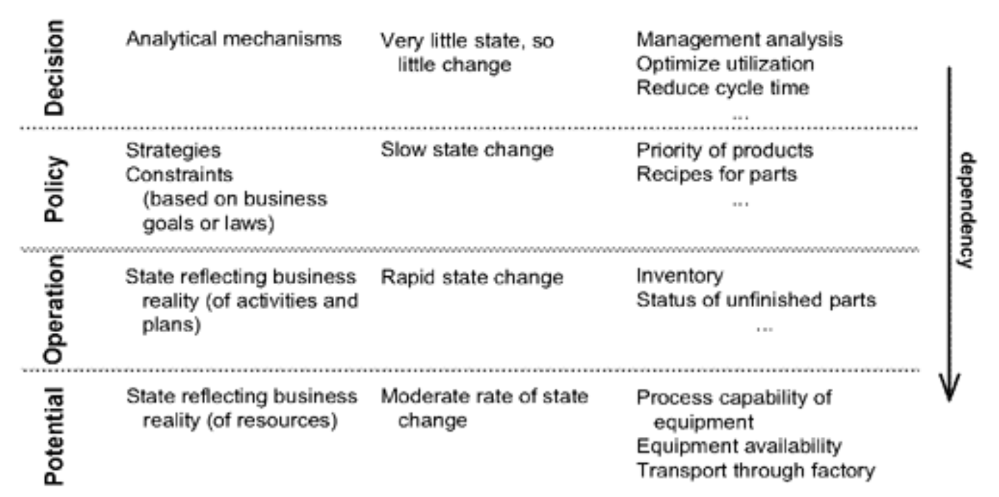
*工厂自动化系统中的概念依赖关系与剪切点*

许多企业的核心竞争力并不依赖于厂房设备。以金融服务和保险业为例，其发展潜力在很大程度上取决于现有业务运营状况。保险公司承接新风险、签发新保单的能力，根植于其现有业务的多元化布局。在这种情况下，“潜力” 层很可能与 “运营” 层融合，从而形成全新的分层架构。

在这些情境中，一个常被提及的领域是向客户作出的承诺。

- ***承诺。*** 我们承诺了什么？这一层级具有 "策略" 层的特性，即它规定了指导未来运营的目标；但同时又具有 "运营" 的特性，因为承诺是在持续的业务活动中产生并变化的。

#### Figure 16.14
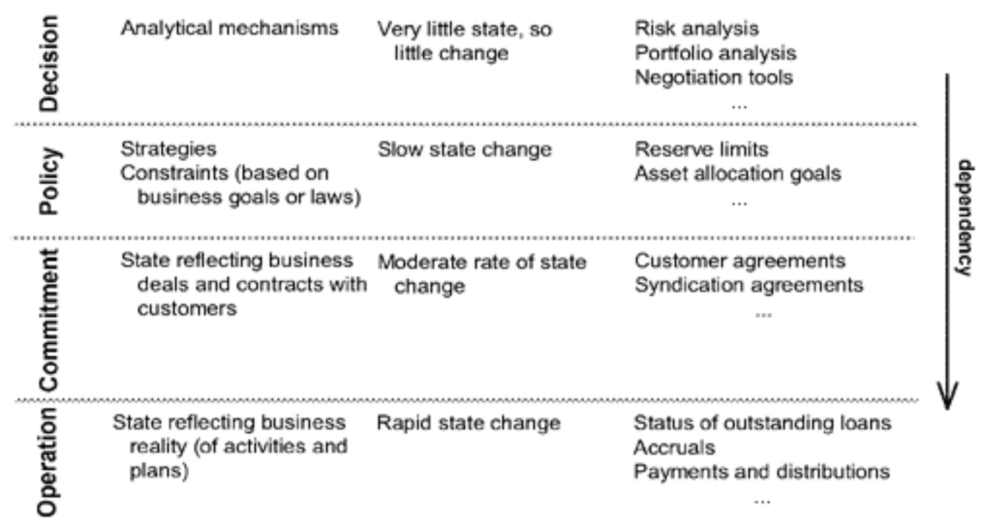
*投资银行系统中的概念依赖关系与剪切点*

潜力层与承诺层并非互斥。在两者均突出的领域，例如提供大量定制运输服务的物流公司，可能同时采用这两种层级。针对特定领域设计的其他层级也可能有所助益。尝试改变，勇于实验。但分层体系最好保持简洁，超过四层甚至五层便会变得难以驾驭。过多层级不仅难以清晰阐述核心逻辑，原本试图解决的大规模结构复杂性问题，反而会以新形态卷土重来。大规模结构必须经过严苛的提炼。

尽管这五层适用于各类企业系统，但它们未能涵盖所有领域的核心职责。在某些情况下，强行将设计套入此框架反而适得其反，但可能存在一套天然有效的`RESPONSIBILITY LAYERS`。对于与我们讨论领域完全无关的领域，这些层级可能需要完全原创。最终，你必须依靠直觉，从某个起点开始，让 [ORDER EVOLVE](1.md) 。

#### ▶[下一节](4.md)
