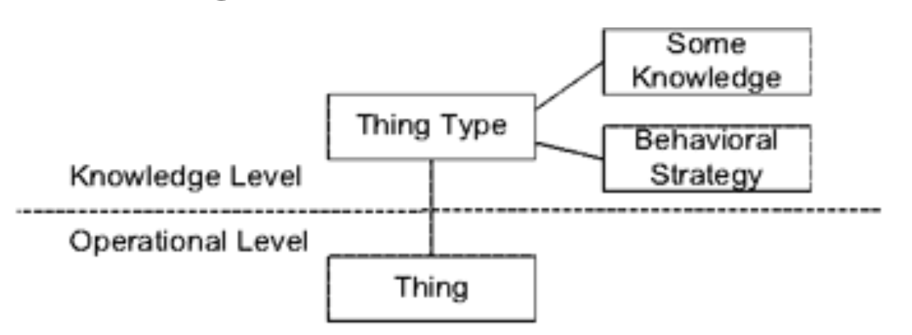
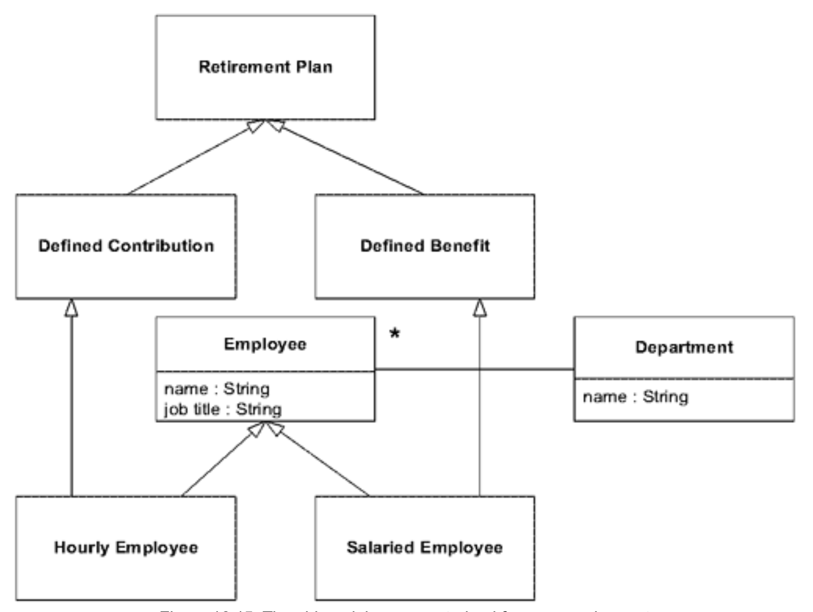
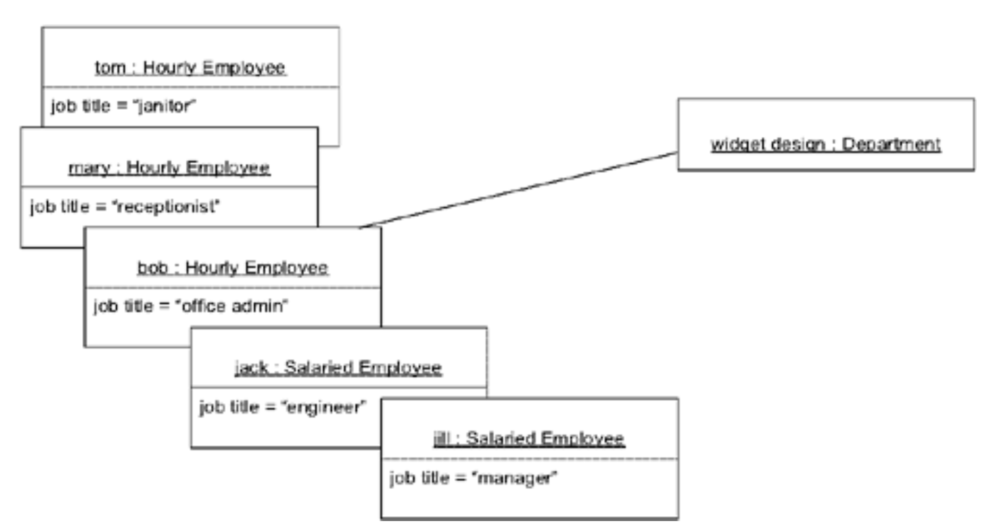
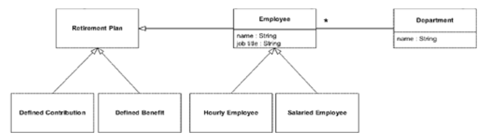
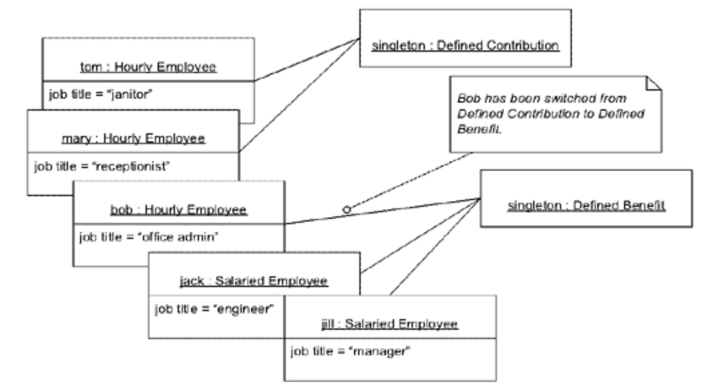
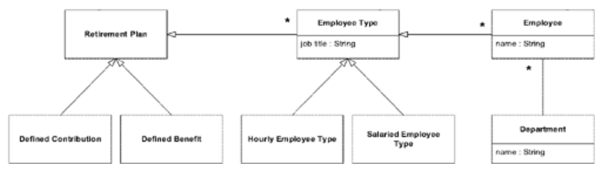
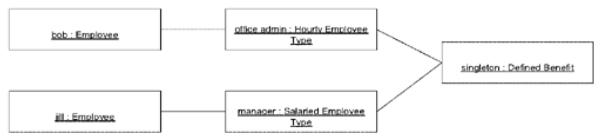
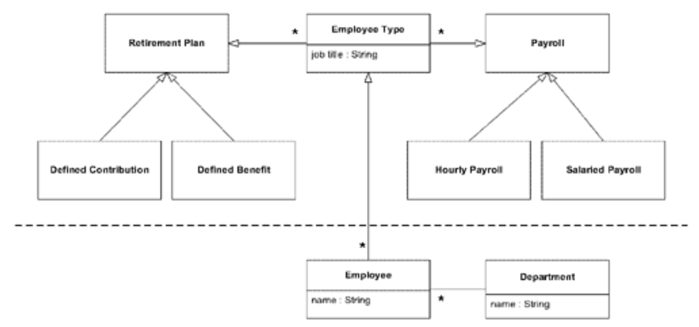
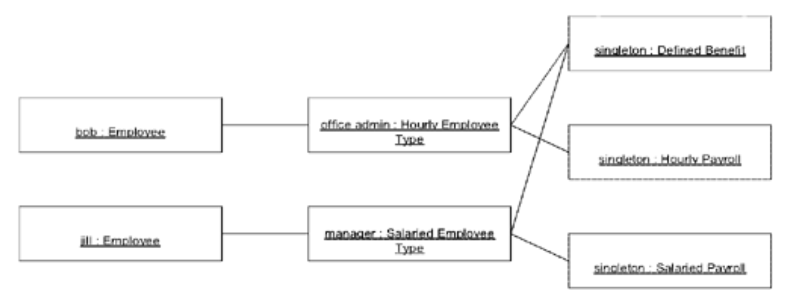

## 知识层级：`KNOWLEDGE LEVEL`

#### ▶[上一节](3.md)

*\[`KNOWLEDGE LEVEL`是\]一组对象，用于描述另一组对象应如何行为。\[Martin Fowler，"Accountability"，www.martinfowler.com \]*

`KNOWLEDGE LEVEL`用于在如下场景中理清问题：我们需要让模型的某一部分在用户手中具备灵活性，同时又受更广泛规则的约束。
它解决了软件可配置行为的需求，在这类软件中，[ENTITIES](../ch5/2.md) 之间的角色与关系必须在安装时甚至运行时就能改变。

<ins>在 *《Analysis Patterns》* （ [Fowler 1996](../references.md#fowler-1997) ，第 24–27 页）中，该模式源于对组织内部责任建模的讨论，后来被应用于会计中的过账规则。
尽管该模式出现在几个章节中，但它没有独立的章节，因为它不同于书中的大多数模式。
`KNOWLEDGE LEVEL`与其他分析模式建模一个领域不同，而是对模型本身进行结构化。</ins>

要具体理解这个问题，不妨考虑 “问责制 (accountability)” 的模型。
组织由个人和更小的组织单元构成，并定义其角色及相互关系。
不同组织对这些角色和关系的规范差异极大。
在某家公司，“部门” 可能由向 “副总裁” 汇报的 “总监” 领导。
另一家公司中，“模块” 由 “经理” 领导，该经理向 “高级经理” 汇报。
此外还有 “矩阵式” 组织结构，其中每个人因不同职责向不同经理汇报。

一款典型的应用会做出一些预设。
当这些预设与实际情况不匹配时，用户就会开始以不同于设计意图的方式使用数据输入字段。
由于用户改变了语义，应用原本具备的任何行为都会出错。
用户会想出绕过这些行为的变通方法，或是被迫关闭应用的高级功能。
他们不得不费力去理解自己的工作操作与软件运行方式之间复杂的对应关系。
他们永远无法得到良好的使用体验。

当系统必须被修改或替换时，开发人员迟早会发现，各项功能的含义并非表面看上去那样。
在不同用户群体或不同场景下，它们可能代表着截然不同的意义。
在不破坏这些叠加用法的前提下修改任何内容，都会是一项艰巨的任务。
要将数据迁移到更贴合需求的系统中，就必须理解所有这些特殊用法，并为此编写代码。

#### 示例：员工薪酬与养老金（第一部分）

某中型企业的人力资源部门采用一套简易程序计算薪酬及养老金缴款。

#### Figure 16.15

*旧模型，对新需求过度约束*

#### Figure 16.16

*采用旧模型表示的部分员工*

但如今，管理层决定让办公室行政人员加入 “固定福利 (defined benefit)” 退休计划。问题在于办公室行政人员按小时计薪，而该模型不允许混合计薪。因此该模型必须调整。

下一个模型提议相当简单：直接取消限制即可。

#### Figure 16.17

*提议的模型，当前约束不足*

#### Figure 16.18

*员工可能被关联到错误的计划。*

该模型允许每位员工关联任意一种退休计划，因此每位办公室行政人员都可以进行切换。
管理层否决了该模型，因为它无法体现公司政策。
（按照该模型，）部分行政人员可以切换，而另一些则不可以；甚至门卫也可以切换。
管理层需要一个能够强制执行政策的模型：

- *办公室行政人员是按小时计酬的雇员，享有固定福利退休计划。*

该政策表明`job title`字段现已成为一个重要的领域概念。开发人员可通过重构将该概念显式化为`Employee Type`。

#### Figure 16.19

*`Type`对象使需求得以满足。*

#### Figure 16.20

*每种`Employee Type`都分配有一个`Retirement Plan`。*

该需求可用 [UBIQUITOUS LANGUAGE](../ch2/1.md) 表述如下：

- *每种`Employee Type`都被分配某个`Retirement Plan`或某个`payroll`。*
- *`Employee`受其所属`Employee Type`的约束。*

编辑`Employee Type`对象的权限将仅限于 “超级用户”，该用户仅在公司政策变更时进行修改。人事部门的普通用户可修改`Employee`信息或将其归入不同的`Employee Type`。

该模型满足需求。开发人员隐约察觉到一两个隐含概念，但目前仅是种挥之不去的直觉。由于尚未形成可行的具体方案，他们决定暂告段落。

静态模型可能引发问题。但完全灵活的系统同样存在隐患，它允许呈现任何可能的关系，这会导致操作不便且无法强制执行组织自身的规则。

为每个组织完全定制软件并不现实，因为即便组织有能力支付定制费用，其组织结构也往往频繁变动。

因此，此类软件必须提供配置选项，以便用户根据组织当前结构进行调整。问题在于，向模型对象添加此类选项会使其变得笨重。灵活性越高，整体复杂度就越大。

<ins>**在一个 [ENTITIES](../ch5/2.md) 的角色和关系在不同情况下变化的应用中，复杂性可能会急剧增加。既非完全通用的模型，也非高度定制的模型能够满足用户的需求。对象最终可能会引用其他类型以涵盖各种情况，或者具有在不同情况下以不同方式使用的属性。具有相同数据和行为的类可能会因适应不同的组装规则而成倍增加。**</ins>

嵌套在我们模型中的是另一个 *关于* 该模型的模型。`KNOWLEDGE LEVEL`将模型的自我定义部分分离出来，并使其约束条件显性化。

<ins>`KNOWLEDGE LEVEL`是`REFLECTION`模式在领域层的应用，该模式广泛用于各类软件架构与技术基础设施，并在 [Buschmann et al. 1996](../references.md#buschmann-1996) （ 第 193～219 页）中得到详尽阐述 。</ins>`REFLECTION`通过使软件具备 “自我认知 (self-aware)” 能力，使其结构与行为的特定方面可被访问以实现适应与变更，从而满足不断变化的需求。其实现方式是将软件拆分为两个层次：承担应用运行职责的 “基础层 (base level)”，以及承载软件结构与行为知识的 “元层 (meta level)”。

值得注意的是，这种模式并未被称为知识 “层” 。尽管它看似具有分层特性，但`REFLECTION`涉及的是双向的相互依赖关系。

Java 内置了最基本的`REFLECTION`功能，通过协议形式查询类的具体方法等信息。此类机制使程序能够自我询问设计细节。CORBA 则拥有更为完善的类似`REFLECTION`协议。某些持久化技术进一步扩展了这种自我描述能力，支持数据库表与对象之间的半自动化映射。此外还有其他技术实例。该模式同样可应用于领域层。

`KNOWLEDGE LEVEL`提供了两种有用的区分。
首先，与常见的`REFLECTION`不同，它聚焦于应用领域。
其次，它不追求完全的通用性。
正如`SPECIFICATION`类比通用谓词更实用一样，针对一组对象及其关系的一套专门约束，会比通用框架更有价值。
`KNOWLEDGE LEVEL`更为简洁，并且能够传达设计者的具体意图。

----
|Fowler 术语| POSA 术语 [2](#2)|
|---|---|
|Knowledge Level| Meta Level|
|Operations Level| Base Level|

*比较`KNOWLEDGE LEVEL`与`REFLECTION`的术语*

----

为了明确起见，编程语言的反射工具并不是用来实现领域模型的`KNOWLEDGE LEVEL`。
这些元对象描述的是语言构造本身的结构和行为。
相反，`KNOWLEDGE LEVEL`必须由普通对象构建。

<ins>`KNOWLEDGE LEVEL` 提供了两个有用的区分。首先，它侧重于应用领域，与 `REFLECTION` 的常见应用形成对比。其次，它并不追求完全的普遍性。</ins>正如一个 [SPECIFICATION](../ch9/2.md#specification) 可能比一般谓词更有用一样，对一组对象及其关系的非常专门的约束集合可能比一个通用框架更有用。`KNOWLEDGE LEVEL` 更简单，并且能够传达设计者的具体意图。

因此：

<ins>**创建一组独特的对象，用于描述和约束基本模型的结构与行为。将这些关注点划分为两个 “层次 (level)”：一个非常具体，另一个则反映用户或超级用户能够自定义的规则和知识。**</ins>

<ins>和所有强大的思想一样，`REFLECTION`与`KNOWLEDGE LEVELS`也可能令人过度沉迷。
这种模式应当谨慎使用。</ins>
它可以让运营对象不必成为 “全能杂家 (jacks-of-all-trades)”，从而化解复杂性，但它引入的间接性又会带来一定的晦涩难懂。
如果`KNOWLEDGE LEVEL`变得复杂，系统行为对开发人员和用户来说都会难以理解。
负责配置的用户（或超级用户）最终将需要具备程序员的技能 —— 甚至是元级程序员的技能。
一旦他们出错，应用程序就会表现异常。

<ins>此外，数据迁移的基本问题并不会完全消失。当`KNOWLEDGE LEVEL`中的结构发生变化时，现有的操作级对象必须处理。有可能让旧的和新的共存，但无论如何，都需要仔细分析。</ins>

所有这些问题都给`KNOWLEDGE LEVEL`的设计者带来了重大负担。<ins>设计必须足够稳健，不仅能应对开发中提出的场景，还能应对用户未来可能配置软件的任何场景。审慎应用到需要定制化的关键点上，否则会扭曲设计，`KNOWLEDGE LEVELS`可以解决其他方式非常难以处理的问题。</ins>

#### 示例：员工薪酬与养老金（第二部分）：`KNOWLEDGE LEVEL`

团队成员们已归队，经过一夜休整，其中一人正逐步逼近某个棘手环节。为何某些对象被锁定，而其他对象却可自由编辑？受限对象的聚集让他联想到`KNOWLEDGE LEVEL`模式，于是决定尝试以此视角审视模型。结果发现现有模型本就具备这种视角的呈现方式。

#### Figure 16.21

*识别现有模型中隐含的`KNOWLEDGE LEVEL`*

受限编辑位于`KNOWLEDGE LEVEL`，日常编辑则在操作层级。这种划分恰到好处。所有位于分界线以上的对象都描述了类型或长期政策。`Employee Type`实际上对`Employee`施加了行为规范。

开发者正向同事分享见解时，另一位开发者突然有了新发现。当模型按`KNOWLEDGE LEVEL`清晰组织后，她终于看清了困扰自己整日的症结。两个截然不同的概念被混杂在同一个对象中。前一天的讨论中她曾隐约察觉，却始终未能明确指出：

- *每种`Employee Type`都被分配某个`Retirement Plan`或某个`payroll`。*

但那实际上并不是用 [UBIQUITOUS LANGUAGE](../ch2/1.md) 表达的声明。<ins>模型中根本没有 “工资单 (payroll)”。他们使用的是自己 *想要* 的语言，而不是他们所拥有的语言。工资单的概念在模型中是隐含的，与`Employee Type`合并在一起。</ins>在将`KNOWLEDGE LEVEL`分离出来之前，这一点并不那么明显，而那个关键短语中的各个元素几乎都出现在同一层级……只有一个例外。

基于这一见解，她再次重构了模型，使其支持这一陈述。

让用户控制对象关联规则的需求，促使团队采用了一个具有隐式`KNOWLEDGE LEVEL`的模型。

#### Figure 16.22

*`Payroll`现在是显性的，与`Employee Type`区分开。*

#### Figure 16.23

*每个`Employee Type`现在都有一个`Retirement Plan`和一个`Payroll`*

`KNOWLEDGE LEVEL`通过特定的访问限制和 “事物-事物” 类型的关系得以暗示。一旦建立，它所提供的清晰性又促成了另一个洞察，通过剥离`Payroll`，理清了两个重要的领域概念。

像其他大规模结构一样，`KNOWLEDGE LEVEL`并非绝对必要。对象在没有它的情况下依然可以正常工作，对`Employee Type`与`Payroll`的分离洞察也仍然可以被发现和使用。可能会有一天，这个结构看起来不再起作用，可以被舍弃。但就目前而言，它似乎讲述了一个关于系统的有用故事，并帮助开发者理解模型。

🌼🌼🌼

<ins>乍看之下，`KNOWLEDGE LEVEL`似乎是 [RESPONSIBILITY LAYERS](3.md) 的特殊情况，尤其类似于 “策略（policy)" 层，但实则不然。首先 (for one thing)，层级间存在双向依赖关系，而 [LAYERS](3.md) 中下层完全独立于上层。</ins>

实际上，`KNOWLEDGE LEVEL`能与大多数大型结构并存，为组织架构提供额外的维度。

#### ▶[下一节](5.md)

---
#### 2
POSA 是 *Pattern-Oriented Software Architecture* 的缩写，由 [Buschmann et al. 1996](../references.md#buschmann-1996) 所著。
