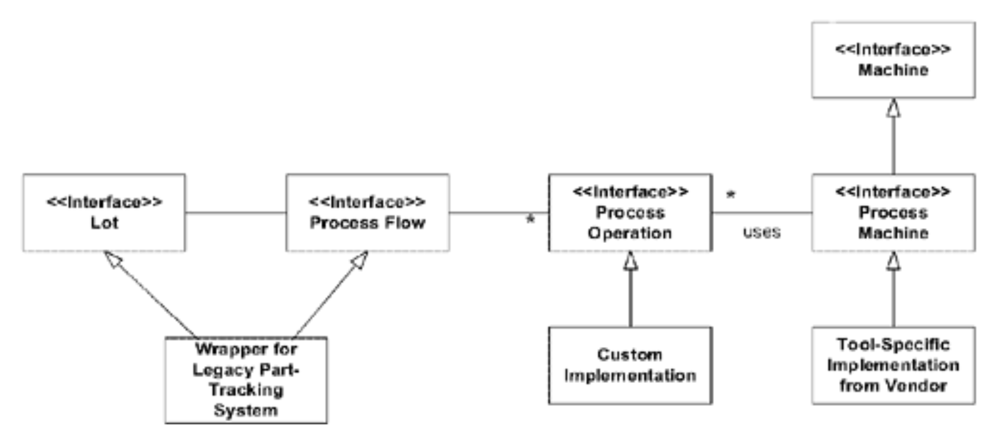
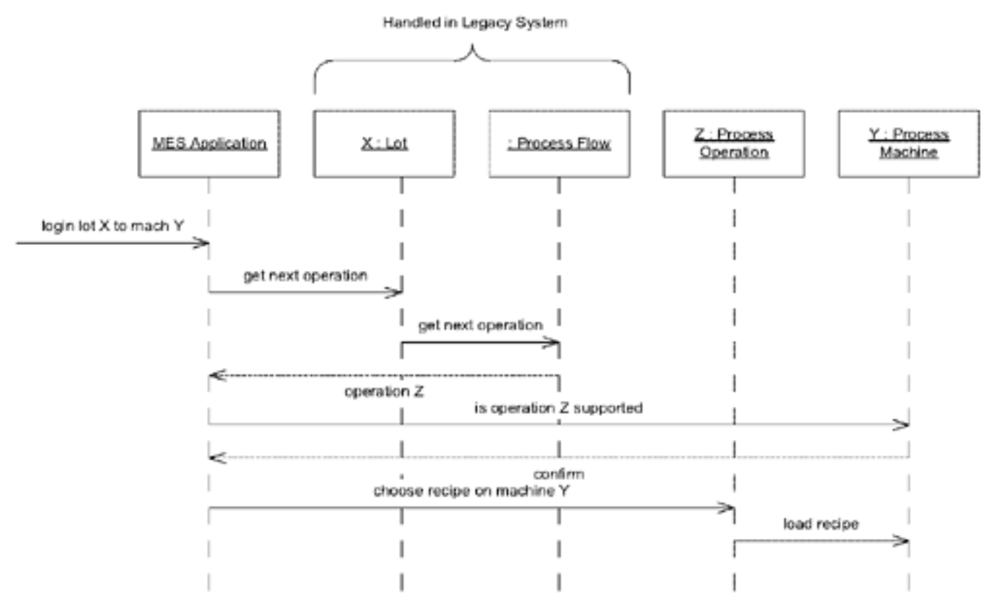

## 可插拔组件框架：`PLUGGABLE COMPONENT FRAMEWORK`

#### ▶[上一节](4.md)

机遇往往出现在深度凝练的成熟模型中。通常只有当同一领域已实现若干应用程序后，`PLUGGABLE COMPONENT FRAMEWORK`才会发挥作用。

🌼🌼🌼

<ins>**当多种应用程序需要协同工作时，尽管它们都基于相同的抽象概念，但由于各自独立设计，多个 [BOUNDED CONTEXTS](../ch14/1.md) 之间的转换会限制集成能力。对于协作不紧密的团队而言，[SHARED KERNEL](../ch14/5.md) 方案难以实现。重复开发与功能碎片化将推高开发和部署成本，同时使互操作性变得极其困难。**</ins>

某些成功的项目会将设计拆解为多个组件，每个组件负责特定类别的功能。
通常所有组件都接入中央枢纽 (hub)，该枢纽支持组件所需的任何协议，并理解如何与组件提供的接口通信。
连接组件也存在其他模式。
这些接口的设计及其连接枢纽必须协调一致，而组件内部的设计则可实现更高程度的独立性。

几种广泛使用的技术框架支持这种模式，但这是次要问题。
只有在能够解决某些基本技术问题时才能使用这些技术框架，例如分布式 (distribution) 或在不同应用程序之间共享组件。
基础模式是一种职责的概念化组织方式。它可以很容易地应用于单个 Java 程序中。

因此：

<ins>**提炼出接口与交互的 [ABSTRACT CORE](../ch15/8.md) ，构建一个框架，使这些接口的各种实现能够自由替换。同样地，允许任何应用程序使用这些组件，只要它严格通过 [ABSTRACT CORE](../ch15/8.md) 的接口进行操作即可。**</ins>

高层抽象被识别出来，并在整个系统范围内共享；
特化逻辑则在 [MODULES](../ch5/5.md) 中实现。
应用程序的核心枢纽 (central hub) 是位于 [SHARED KERNEL](../ch14/5.md) 内的 [ABSTRACT CORE](../ch15/8.md) 。
但是多个 [BOUNDED CONTEXTS](../ch14/1.md) 可以位于封装的组件接口之后，因此当许多组件来自不同来源，或者组件封装现有软件以进行集成时，这种结构尤其方便。

这并不是说组件必须拥有不同的模型。如果团队能够 [CONTINUOUSLY INTEGRATE](../ch14/2.md) ，多个组件可以在单个 [CONTEXT](../ch14/1.md) 内开发，或者它们可以定义另一个由紧密相关组件集共享的 [SHARED KERNEL](../ch14/5.md) 。所有这些策略都可以在大规模的 `PLUGGABLE COMPONENTS` 架构中轻松共存。在某些情况下，另一种选择是使用一个 [PUBLISHED LANGUAGE](../ch14/11.md) 作为核心枢纽 (hub) 的插件接口。

<ins>`PLUGGABLE COMPONENT FRAMEWORK`有一些缺点。一个缺点是这种模式很难应用。它要求接口设计非常精确，并且需要一个足够深度的模型来捕捉 [ABSTRACT CORE](../ch15/8.md) 中的必要行为。另一个主要缺点是应用程序的选择有限。如果一个应用程序需要对 [CORE DOMAIN](../ch15/1.md) 采取非常不同的方法，这种结构就会成为阻碍。开发者可以对模型进行专门化，但他们不能在不改变所有不同组件协议的情况下，更改 [ABSTRACT CORE](../ch15/8.md) 。</ins>因此，对 [CORE](../ch15/8.md)  进行持续优化、朝向更深层次洞见的重构过程，或多或少都会陷入停滞。

[Fayad and Johnson (2000)](../references.md#fayad-2000) 对多个领域中雄心勃勃的`PLUGGABLE COMPONENT FRAMEWORK`尝试进行了深入探讨，其中包括对`SEMATECH CIM`的分析。这类框架的成功案例可谓喜忧参半。最大的障碍或许在于设计实用框架所需的成熟认知。`PLUGGABLE COMPONENT FRAMEWORK`既不应作为项目中首个大规模架构，也不宜作为次选方案。最成功的案例往往是在多个专业化应用全面开发之后才得以实现。

#### 示例：SEMATECH CIM 框架

在计算机芯片生产工厂中，成批（称为 *lots* ）的硅晶圆需经过数百道加工工序，在不同设备间传递，直至微观电路的印刷与蚀刻工艺全部完成。该工厂需要一套软件系统，能够追踪每个独立 lot，记录其经历的精确加工流程，并指导人工操作员或自动化设备将其转移至下一台对应设备进行后续工序。此类软件被称为 *制造执行系统（MES）* 。

数百台来自数十家供应商的不同设备被投入使用，每个环节都采用精心定制的工艺配方。开发能处理如此复杂组合的 MES 软件既艰巨又代价高昂。为此，行业联盟 SEMATECH 开发了 CIM 框架。

CIM 框架庞大复杂且涉及诸多方面，但其中有两点在此尤为重要。首先，该框架为半导体 MES 领域的基本概念定义了抽象接口 —— 换言之，即以 [ABSTRACT CORE](../ch15/8.md) 形式呈现的 [CORE DOMAIN](../ch15/1.md) 。这些接口定义同时涵盖行为与语义。

#### Figure 16.24

*CIM 接口的高度简化子集及示例实现*

如果供应商生产了一台新机器，他们必须开发一个专门的`Process Machine`接口实现。如果他们遵循该接口，他们的机器控制组件应该能够接入任何基于 CIM 框架的应用程序。

在定义了这些接口之后，SEMATECH 定义了它们在应用程序中如何交互的规则。任何基于 CIM 框架的应用程序都必须实现一个协议，该协议承载实现这些接口某个子集的对象。如果该协议被实现，并且应用程序严格遵循这些抽象接口，那么应用程序就可以依赖这些接口所承诺的服务，而不管具体的实现方式。这些接口与使用它们的协议的组合构成了一个严格限制的大型结构。

#### Figure 16.25

*用户将 lot 放置到下一台机器中，并将移动操作记录到计算机中。*

该框架对基础设施有非常具体的要求。
它与 CORBA 紧密耦合，以提供持久化、事务处理、事件及其他技术服务。
但其真正有趣之处在于定义了`PLUGGABLE COMPONENT FRAMEWORK`，这使得开发人员能够独立开发软件，并将其无缝集成到庞大的系统中。
没有人能完全掌握这样一个系统的所有细节，但每个人都能理解其整体架构。

🌼🌼🌼

*成千上万的人如何能够独立合作，制作出由超过 40,000 个布块 (panel) 组成的被子？*

一些简单的规则为艾滋病纪念被提供了大规模的结构，而具体细节则留给个人贡献者。注意这些规则如何聚焦于整体使命（纪念死于艾滋病的人）、组件的特点以利于整体整合，以及如何处理被子的更大部分（例如折叠它）。

- **以下是制作纪念被布块 (panel) 的方法** 
  *\[摘自艾滋病纪念被项目网站 www.aidsquilt.org\]*

- 设计布块 (panel)

  请写上您要纪念的人的名字。可自由添加其他信息，如出生与逝世日期、家乡等……[请]每个布块仅纪念一位逝者……

- 选择材料

  请记住，纪念被需要反复折叠展开，因此耐用性至关重要。由于胶水会随时间老化，最好采用缝纫方式固定装饰物。中等厚度的非弹性面料（如帆布或府绸）最为理想。 

  图案可纵向或横向设计，但包边布块必须精确为 3 英尺 ×6 英尺（ 90 厘米 ×180 厘米）—— 尺寸不可增减！裁剪布料时，每边需预留 2-3 英寸（约 5-7.5 厘米）用于包边。若无法自行包边，我们将代为处理。面板无需填充棉絮，但建议添加背衬。背衬既能保持铺展在地面时的清洁，也有助于维持布料的平整度。

- 创建布块 (panel)

  在构建面板时，您可能需要运用以下技巧：

  - 拼贴绣（Appliqué）：将布料、字母和小纪念物缝到背景布上。不要依赖胶水 —— 它不能持久。
  - 绘画（Paint）：用刷子涂抹纺织品颜料或耐色染料，或使用不可褪色的墨水笔。请不要使用“膨胀”类型的颜料，它太粘。
  - 模板（Stencil）：用铅笔在布上描出你的设计，移开模板，然后用刷子涂抹纺织品颜料或不可褪色的记号笔。
  - 拼贴（Collage）：确保添加到布块的任何材料都不会撕裂布料（因此避免使用玻璃和亮片），并且避免非常笨重的物体。
  - 照片（Photos）：包含照片或字母的最佳方式是将它们复印到烫印转印纸上，熨烫到 100% 棉布上，然后将布缝到布块上。你也可以将照片放在透明塑料乙烯基中并缝到布块上（偏离中心，以避免折叠）。

#### ▶[下一节](6.md)
