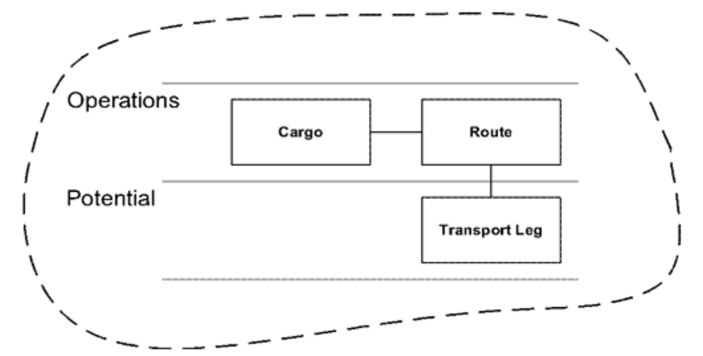
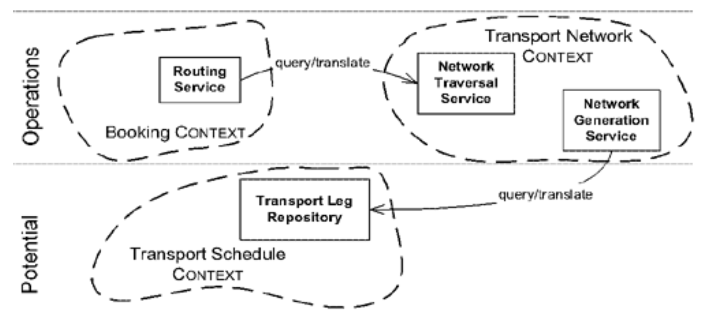
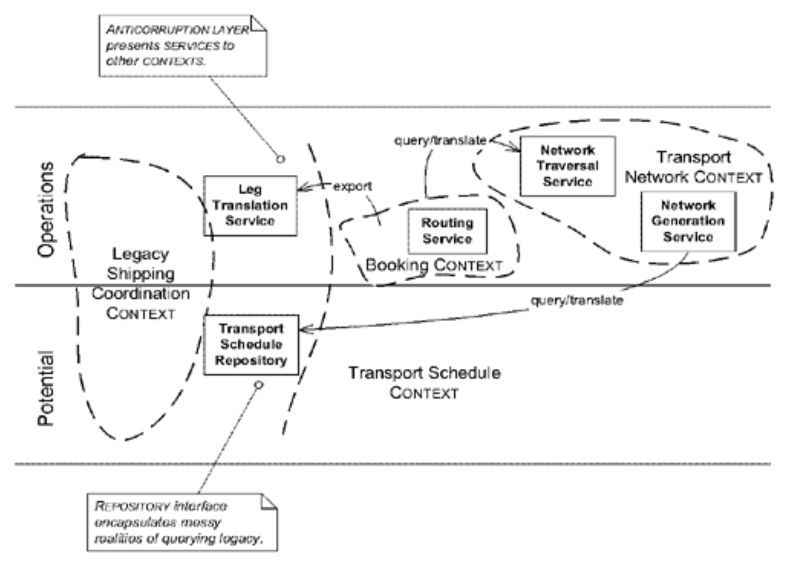
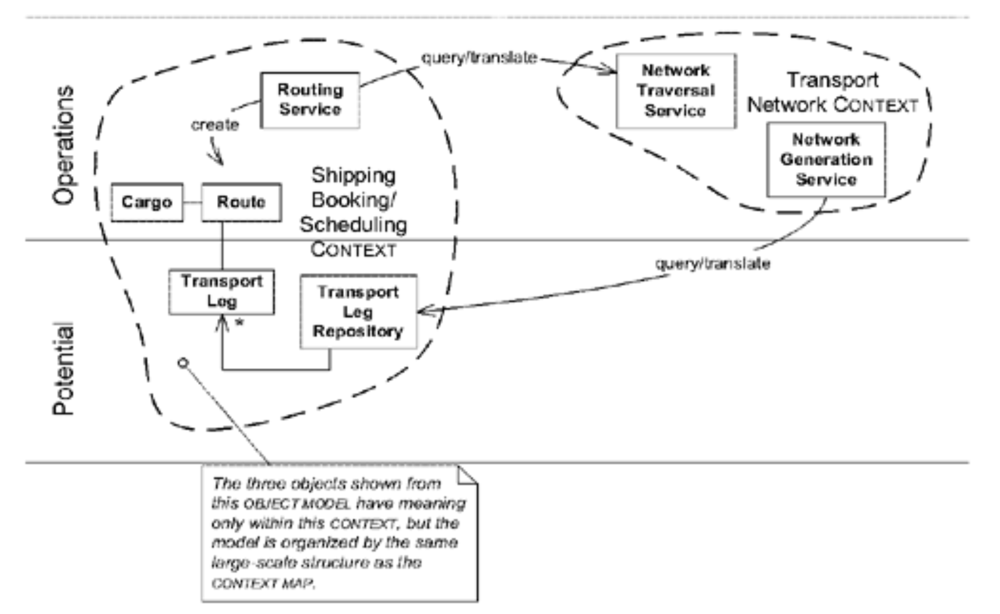

## 结合大规模结构与`BOUNDED CONTEXTS`

#### ▶[上一节](0.md)

#### Figure 17.1

战略设计的三项基本原则（背景、提炼与大规模结构）并非彼此替代的关系，而是相互补充且以多种方式相互作用。例如，大规模结构既可存在于单个 [BOUNDED CONTEXT](../ch14/1.md) 内，也可跨越多个边界上下文并组织 [CONTEXT MAP](../ch14/3.md) 。

先前关于 [RESPONSIBILITY LAYERS](../ch16/3.md) 的示例均局限于单一 [BOUNDED CONTEXT](../ch14/1.md) 。这种方式最易阐释该概念，也是该模式的常见应用场景。在如此简化的情境中，分层名称的含义仅限于该 [CONTEXT](../ch14/1.md) ，同样受限的还有存在于该 [CONTEXT](../ch14/1.md) 中的模型元素或子系统接口的命名。

#### Figure 17.2

*在单个`BOUNDED CONTEXT`内构建模型*

在极其复杂但统一的模型中，这种局部结构能有效提升单个 [BOUNDED CONTEXT](../ch14/1.md) 可维护的复杂度上限。

但在许多项目中，更大的挑战在于理解彼此独立的部件如何协同运作。它们可能被划分为独立的 [CONTEXTS](../ch14/1.md) ，但每个部件在整体集成系统中扮演什么角色？各部件之间又如何关联？此时便可借助大规模结构来组织 [CONTEXT MAP](../ch14/3.md) 。这种情况下，该结构的术语体系适用于整个项目（或至少适用于其某个边界清晰的子集）。

#### Figure 17.3

*不同`BOUNDED CONTEXTS`组件关系所形成的结构*

假设你希望采用 [RESPONSIBILITY LAYERS](../ch16/3.md) 架构，但现有遗留系统的组织结构与你期望的大规模架构不匹配。是否必须放弃 [LAYERS](../ch16/3.md) ？不必，但必须明确遗留系统在架构中的实际位置。事实上，这反而有助于界定遗留系统的特性。遗留系统提供的 [SERVICES](../ch5/4.md) 可能仅局限于少数几个 [LAYERS](../ch16/3.md) 。能够明确指出该系统契合特定用 [RESPONSIBILITY LAYERS](../ch16/3.md) ，恰恰精炼地阐明了其范围与角色。

#### Figure 17.4

*一种允许部分组件跨层的结构*

如果通过 [FACADE](../ch14/8.md#实现anticorruption-layer) 访问遗留子系统的功能，您可能能够设计  [FACADE](../ch14/8.md#实现anticorruption-layer) 提供的每个 [SERVICE](../ch5/4.md) 以适应单层。

在此示例中，运输协调 (Shipping Coordination) 应用程序的内部，作为遗留系统呈现为未分化的整体。但在具有已建立的大规模结构并跨 [CONTEXT MAP](../ch14/3.md) 的项目中，团队可以选择在其 [CONTEXT](../ch14/1.md) 内，按相同熟悉的 [LAYERS](../ch16/3.md) 对其模型进行排序。

#### Figure 17.5

*同样的结构应用在一个[CONTEXT](../ch14/1.md) 内及整个 [CONTEXT MAP](../ch14/3.md) 上*

当然，由于每个 [BOUNDED CONTEXT](../ch14/1.md) 都是独立的命名空间，可以在某个 [CONTEXT](../ch14/1.md) 内采用一种结构组织模型，在相邻的 [CONTEXT](../ch14/1.md) 中采用另一种结构，甚至用第三种结构来组织 [CONTEXT MAP](../ch14/3.md) 。然而，若过度沿此路径发展，将削弱这种大规模结构作为项目统一概念体系的价值。

#### ▶[下一节](2.md)
