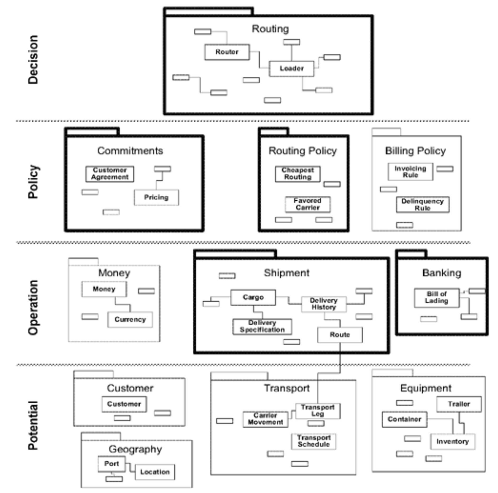

## 大规模结构与提炼的结合

#### ▶[上一节](1.md)

大规模结构与提炼概念同样相辅相成。大规模结构有助于阐释 [CORE DOMAIN](../ch15/1.md) 内部关系以及 [GENERIC SUBDOMAINS](../ch15/3.md) 之间的关联。

#### Figure 17.6

*[CORE DOMAIN](../ch15/1.md)（粗体表示）的 [MODULES](../ch5/5.md) 与 [GENERIC SUBDOMAINS](../ch15/3.md) 通过分层结构予以明确。*

与此同时， *大规模结构本身可能构成 [CORE DOMAIN](../ch15/1.md) 的重要组成部分* 。例如，区分潜力、 运营、策略和决策支持的分层，能提炼出对软件所解决业务问题至关重要的洞察。当项目被划分为多个 [BOUNDED CONTEXTS](../ch14/1.md) 时，这种洞察尤为重要，因为此时 [CORE DOMAIN](../ch15/1.md) 的模型对象在项目大部分范围内都缺乏意义。

#### ▶[下一节](3.md)
