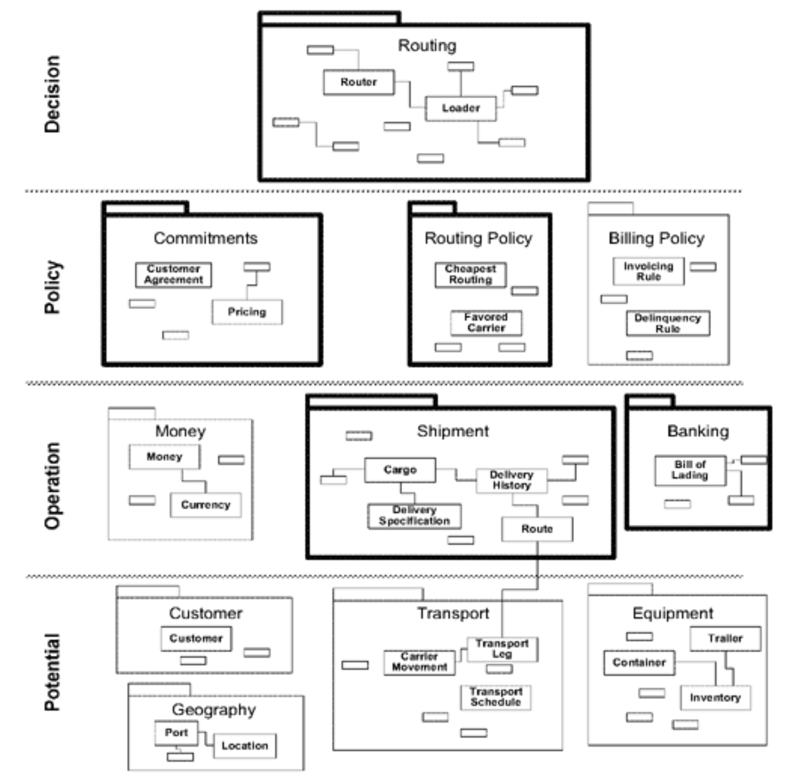

## 大规模结构与提炼

#### ▶[上一节](1.md)

大规模结构与提炼概念同样相辅相成。大规模结构有助于阐释 [CORE DOMAIN](../ch15/1.md) 内部关系以及 [GENERIC SUBDOMAINS](../ch15/3.md) 之间的关联。

#### Figure 17.6

*[CORE DOMAIN](../ch15/1.md)（粗体表示）的 [MODULES](../ch5/5.md) 与 [GENERIC SUBDOMAINS](../ch15/3.md) 通过分层得到了清晰的界定。*

与此同时， *大规模结构本身可能是 [CORE DOMAIN](../ch15/1.md) 的重要组成部分* 。
例如，区分潜力层、运营层、策略层和决策支持层，提炼出了软件所要解决业务问题的根本性洞察。
如果一个项目被拆分为多个 [BOUNDED CONTEXTS](../ch14/1.md) ，那么这种洞察就尤为有用，这样 [CORE DOMAIN](../ch15/1.md) 的模型对象就不会有过多的含义。

#### ▶[下一节](3.md)
