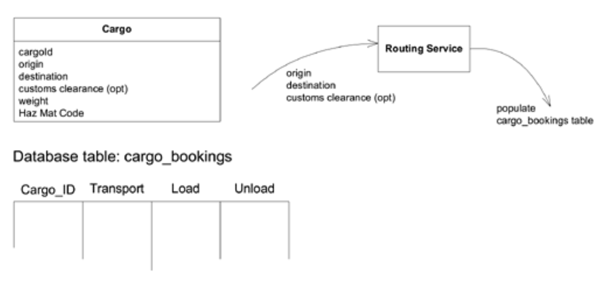
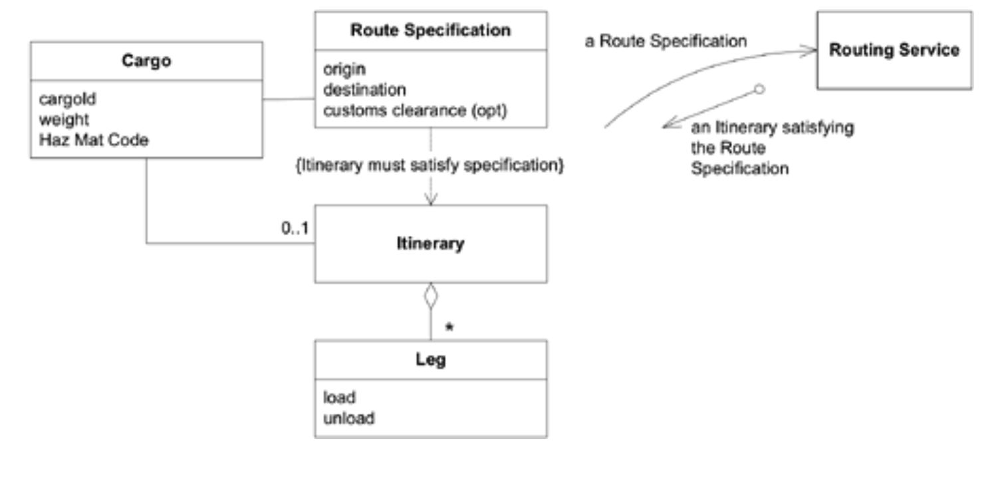

## 无处不在的语言

#### ▶[上一节](0.md)

先写一句长句， 
再将其切碎； 
混杂片段，随意排列， 
任其自然散落： 
词句的顺序 
全然无关紧要。 

Lewis Carroll，《诗人造就，而非天生》

要打造灵活且知识密集的设计，需要一支善于沟通的团队，并建立一套灵活多变的共同语言体系，同时进行充满活力的语言实验，这种情况在软件项目中却很少见。

🌼🌼🌼

领域专家对软件开发的技术术语理解有限，但他们使用自己领域的术语，可能存在各种变体。开发人员则可能用描述性、功能性的术语理解和讨论系统，这些术语缺乏专家语言所承载的深层含义。或者开发人员会创建支持其设计的抽象概念，却无法被领域专家理解。负责不同问题模块的开发人员各自形成独特的设计理念和领域描述方式。

在这道语言鸿沟的两端，领域专家含糊其辞地描述需求，开发者则在理解陌生领域的过程中模模糊糊地领会。团队中少数成员虽能实现双语沟通，却成了信息传递的瓶颈，且他们的翻译往往不够精准。

在缺乏共同语言的项目中，开发人员不得不为领域专家进行翻译。领域专家则在开发人员与其他领域专家之间进行翻译。开发人员甚至需要互相翻译。这种翻译过程模糊了模型概念，导致代码被破坏性重构。间接沟通掩盖了分歧的形成，不同团队成员对术语的理解存在差异却浑然不觉。这最终催生出无法协同工作的不可靠软件（参见 [第 14 章](../ch14/0.md) ）。翻译工作消耗的精力阻碍了知识与思想的碰撞，而这种碰撞本是获得深刻模型洞察的关键。

<ins>**当项目语言出现割裂时，项目便会面临严重问题。领域专家使用其专业术语，而技术团队成员则采用针对设计层面讨论该领域而优化的语言体系。**</ins>

<ins>**日常讨论中的术语与代码中嵌入的术语（作为软件项目最终最重要的产物）彼此割裂。即便是同一个人，在口头表达与书面表达中也会使用不同的语言，因此领域中最精辟的表述往往以转瞬即逝的形式出现，既未被代码记录，甚至未被文字捕捉。**</ins>

<ins>**翻译削弱了沟通效果，使知识提炼变得乏力。**</ins>

<ins>**然而这些方言都无法成为通用语言，因为没有一种能满足所有需求。**</ins>

所有翻译产生的间接成本，加上误解的风险，实在太高了。项目需要一种比最低公约数更强大的通用语言。<ins>通过团队的有意识努力，领域模型既能为这种通用语言提供支撑框架，又能将团队沟通与软件实现紧密衔接。这种语言可贯穿团队工作的方方面面。</ins>

该 [UBIQUITOUS LANGUAGE](../glossary.md#ubiquitous-language) 的词汇包含类名和重要操作名称。该 `LANGUAGE` 包含用于讨论模型中已明确规则的术语，并辅以模型所遵循的高级组织原则术语（如 [CONTEXT MAPS](../glossary.md#context-map) 和 [large-scale structure](../glossary.md#large-scale-structure)，详见 [第 14 章](../ch14/0.md) 和 [第 16 章](../ch16/0.md) ）。最后，该语言还融入了团队在领域模型中常用的模式名称。

模型关系构成了所有语言共有的组合规则。词语和短语的含义与模型的语义相互呼应。

<ins>基于模型的语言不仅应用于开发者间描述系统中的构件，更应涵盖任务与功能的阐释。该模型同时需为开发者与领域专家提供沟通媒介，使领域专家能就需求、开发规划及功能特性进行内部协作。语言应用越普及，理解交流便越顺畅。</ins>

至少，这是我们需要达到的目标。但最初模型可能根本不够完善，无法胜任这些角色。它可能缺乏该领域专业术语所具备的语义丰富性。然而这些术语无法直接套用，因其本身存在歧义与矛盾。模型可能还缺乏开发者在代码中构建的更微妙、更动态的特性，要么因开发者未将这些特性视为模型组成部分，要么因程序采用过程化编码风格，仅隐含地承载着领域概念。

尽管这个过程看似循环往复，但能够生成更实用模型的知识提炼过程，取决于团队对基于模型的语言的坚持。<ins>持续使用 [UBIQUITOUS LANGUAGE](../glossary.md#ubiquitous-language) 将迫使模型中的缺陷暴露无遗。团队将不断尝试，为生硬术语或组合寻找替代方案。当语言体系出现缺口时，新词汇便会融入讨论。*这些语言层面的变更将被视为领域模型的演进*，促使团队更新类图、重命名代码中的类与方法，甚至在术语含义改变时调整行为逻辑。</ins>

开发人员承诺在实施过程中使用这种语言，他们将指出不精确之处或矛盾之处，并引导领域专家共同探索可行的替代方案。

当然，领域专家在解释和提供更广泛背景时，会超出 [UBIQUITOUS LANGUAGE](../glossary.md#ubiquitous-language) 的范围进行阐述。但在模型所涵盖的范围内，他们应使用 `LANGUAGE` ，并在发现它表达生硬、不完整或错误时提出质疑。<ins>通过广泛运用基于模型的语言，并坚持直至其行文流畅，我们得以构建出由简单元素组合表达复杂思想的完整可理解模型。</ins>

因此：

<ins>**将该模型作为语言的基石。要求团队在所有内部沟通及代码中坚持使用该语言。在图表、书面材料，尤其是口头表达中均采用统一的语言体系。**</ins>

<ins>**通过尝试替代表达来消除困难，这些表达反映了替代模型。随后重构代码，重命名类、方法和模块以符合新模型。在对话中解决术语混淆问题，就像我们最终达成共识确定普通词语含义那样。**</ins>

<ins>**需认识到，[UBIQUITOUS LANGUAGE](../glossary.md#ubiquitous-language) 的变更即意味着模型的变更。**</ins>

<ins>**领域专家应反对那些难以准确传达领域理解的笨拙或不恰当术语与结构；开发人员则需警惕可能导致设计失误的模糊性或不一致性。**</ins>

借助 [UBIQUITOUS LANGUAGE](../glossary.md#ubiquitous-language)，模型不再仅仅是设计产物。它成为开发人员与领域专家协作过程中不可或缺的组成部分。这种 `LANGUAGE` 以动态形式承载知识，通过 `LANGUAGE` 展开的讨论，让图表与代码背后的意义焕发生机。

🌼🌼🌼

关于 [UBIQUITOUS LANGUAGE](../glossary.md#ubiquitous-language) 的讨论，假定当前仅存在单一模型。[第 14 章](../ch14/0.md) "维护模型完整性" 探讨了不同模型（及 `LANGUAGE` ）的共存机制，以及如何防止模型碎片化。

[UBIQUITOUS LANGUAGE](../glossary.md#ubiquitous-language) 是设计中那些不显现在代码中的要素的主要载体——它涵盖组织整个系统的 [large-scale structures](../glossary.md#large-scale-structure)（参见 [第 16 章](../ch16/0.md) ）、定义不同系统与模型间关系的 [BOUNDED CONTEXTS](../glossary.md#bounded-context)（参见 [第 14 章](../ch14/0.md) ），以及应用于模型与设计的其他模式。

### 示例： 设计货运路由器

以下两个对话存在微妙但重要的差异。在每个场景中，请注意对话者在多大程度上讨论软件对业务的意义，而非其技术实现方式。用户与开发者是否在使用相同的语言？这种语言是否足够丰富，足以承载对应用程序功能需求的讨论？

#### 场景1：领域抽象程度最低

#### Figure 2.1

**用户**：所以当我们变更清关点时，需要重新制定整个运输路线计划。

**开发者**：没错。我们会删除货运表中所有该货运 ID 的记录，然后将起运地、目的地和新的清关点传递给 **Routing Service**，由其重新填充表数据。我们需要在 **Cargo** 中添加一个布尔字段，以便知道货运表是否存在数据。

**用户**：删除行？行吧，无所谓。反正如果之前根本没有清关点，我们也得做同样操作。

**开发者**：没错，每次修改起运地、目的地或清关点（或首次添加时），系统都会检查是否存在货运数据，删除后再由 **Routing Service** 重新生成。

**用户**：当然，如果旧的清关点恰好是正确的，我们就不需要这么做。

**开发者**：哦，没问题。让 **Routing Service** 每次重新计算装卸点更简单。

**用户**：是的，但为新行程制定所有配套计划会增加我们的工作量，所以除非变更确实必要，否则我们不希望重新规划路线。

**开发者**：唉。那这样吧，当首次输入清关点时，我们得查询表单找出旧的衍生清关点，再与新清关点比对。这样就能判断是否需要重做。

**用户**：出发地或目的地就不用担心这个问题了，因为那时行程总是会变的。

**开发者**：好。我们不会。

#### 场景2：增强领域模型以支持讨论

#### Figure 2.2

**用户**：所以当我们更改清关点时，需要重新制定整个路线计划。

**开发者**：没错。当您修改 **Route Specification** 中的任何属性时，我们会删除旧 **Itinerary (行程)** ，并要求 **Routing Service** 根据新 **Route Specification** 生成新行程。

**用户**：如果之前根本没指定清关点，这次就必须同时设置。

**开发者**：没错，每次修改 **Route Specification** 时，我们都会重新生成 **Itinerary (行程)** 。首次填写清关点也属于这种情况。

**用户**：当然，如果原清关点恰好正确，我们就不该重复操作。

**开发者**：没问题，让 **Routing Service** 每次都重新生成 **Itinerary (行程)** 更省事。

**用户**：是的，但为新 **Itinerary (行程)** 制定配套方案会增加额外工作量，除非变更确实需要，否则我们不愿频繁调整路线。

**开发者**：哦。那我们得在 **Route Specification** 里添加功能。这样每次修改 **Specification** 时，系统就会检查 **Itinerary (行程)** 是否仍符合 **Specification** 规范要求。若不符合，就让 **Routing Service** 重新生成 **Itinerary (行程)** 。

**用户**：起点和终点无需担心这个问题，因为 **Itinerary (行程)** 那时本就会变更。

**开发者**：行吧，但每次都进行比对对我们来说更简单。只有当 **Route Specification** 不再满足时才会生成 **Itinerary (行程)** 。

<ins>第二个对话更准确地传达了领域专家的意图。用户在两个对话中都使用了 “itinerary (行程)” 一词，但在第二个对话中，它已成为双方能够精确、具体讨论的对象。他们明确讨论了 “route specification(路线规范)”，而非每次都通过属性与流程来描述。</ins>

这两个对话是刻意设计成高度对等的。现实中，第一个对话本会更冗长，充斥着应用功能说明和沟通误差。而第二个设计采用基于领域模型的术语体系，使得对话更为精炼。

#### ▶[下一节](2.md)
