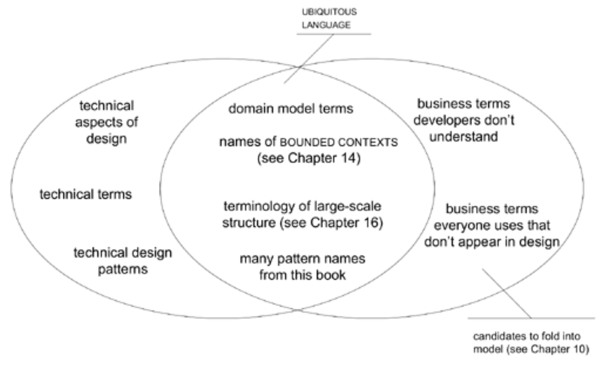

## 一个团队，一种语言

#### ▶[上一节](2.md)

技术人员常觉得有必要让业务专家远离领域模型。他们说：

- “对他们来说太抽象了。”

- “他们不懂对象。”

- “我们必须用他们的术语收集需求。”

这些不过是团队采用双重语言的借口罢了。别理会这些。

当然，设计中存在某些技术组件可能与领域专家无关，但模型的核心部分理应引起他们的关注。过于抽象？那你如何确保抽象合理？你对领域的理解是否达到他们的深度？有时具体需求需从低层级用户处收集，可能需要为其提供更具操作性的术语子集，但领域专家理应具备对自身领域进行深度思考的能力。<ins> *若资深领域专家无法理解模型，说明模型本身存在缺陷。* </ins>

在项目初期，当用户讨论系统尚未建模的未来功能时，他们尚无模型可供参考。但当他们开始与开发人员共同探索这些新想法时，摸索建立共同模型的过程便随之启动。起初或许笨拙而残缺，但终将逐步完善。随着新语言的演进，领域专家必须付出额外努力来掌握它，并为那些仍具重要价值的旧文档进行术语更新。

当领域专家在与开发人员讨论或彼此交流时使用这种语言，他们很快就会发现模型无法满足其需求或存在明显缺陷的领域。领域专家（在开发人员的协助下）还会发现模型化语言的精确性揭示了其思维中的矛盾或模糊之处。

开发人员和领域专家可通过逐步操作模型对象，在场景演练中非正式地测试模型。几乎每次讨论都是开发人员与用户专家共同探索模型的契机，双方在互动中深化理解并逐步完善概念。

领域专家在编写用例时可采用模型语言，并通过制定验收测试更直接地与模型协作。

有人反对使用模型语言收集需求的做法。毕竟，需求难道不应该独立于实现它们的设计吗？这种观点忽略了现实：所有语言都基于某种模型。词语的含义本就是难以捉摸的东西。领域模型通常源自领域专家的行话，但经过“精炼”后会获得更精确、更狭窄的定义。当然，若这些定义偏离领域公认的含义，领域专家理应提出异议。在敏捷流程中，需求会随项目推进而演化——因为几乎不可能在前期就掌握足够知识来精确定义应用程序。这种演化过程应包含用精炼的 [UBIQUITOUS LANGUAGE](1.md) 重新表述需求。

语言的多样性往往是必要的，但语言的分隔绝不应出现在领域专家与开发人员之间。（[第 12 章](../ch12/0.md) "维护模型完整性" 探讨了同一项目中模型的共存问题。）

当然，开发人员确实会使用领域专家无法理解的技术术语。开发人员拥有大量行话，用于讨论系统的技术细节。用户同样拥有专业术语，这些术语往往超出应用程序的狭窄范围，也超出开发人员的理解范围。但这些只是语言的延伸。这些方言不应包含针对同一领域却反映不同模型的替代词汇。

#### Figure 2.3

*Figure 2.3：[UBIQUITOUS LANGUAGE](1.md) 正是在各种行话的交汇处孕育而生*

<ins>借助一种 [UBIQUITOUS LANGUAGE](1.md) ，开发者之间的对话、领域专家的讨论以及代码本身的表达都基于同一种语言，这种语言源自共享的领域模型。</ins>

#### ▶[下一节](4.md)
