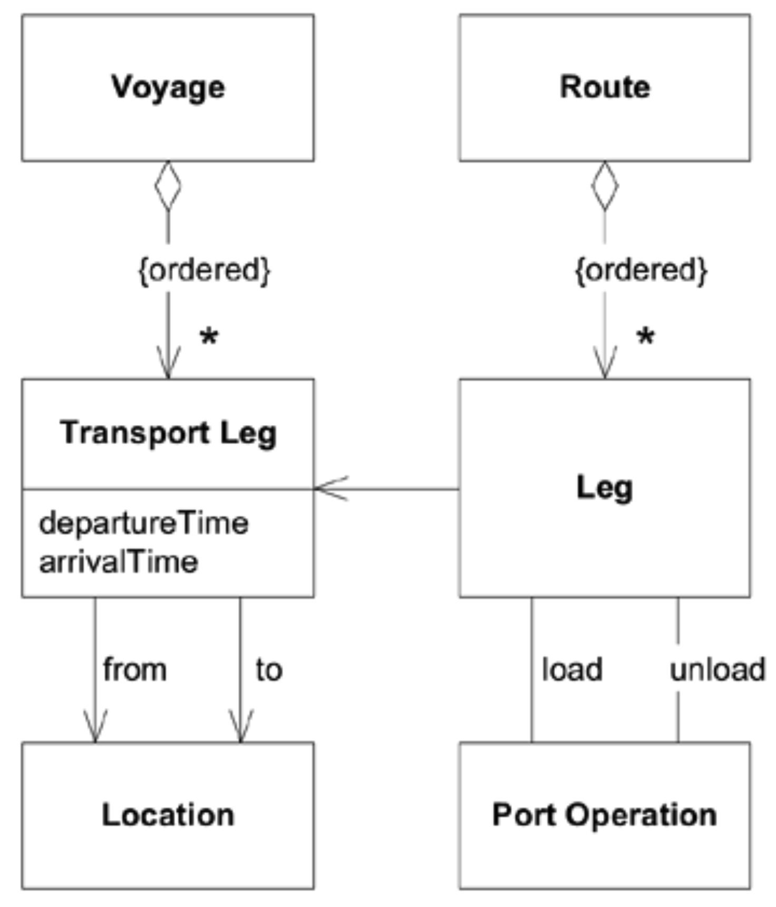
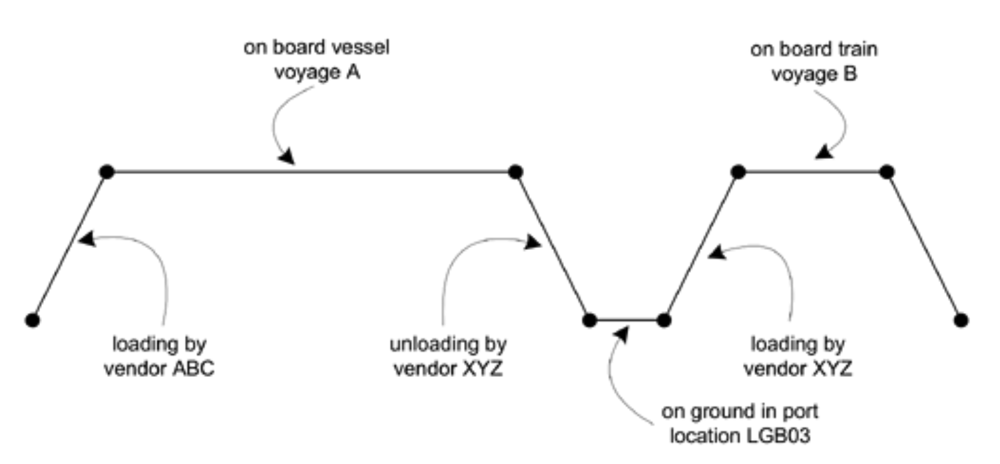

## 解释性模型

#### ▶[上一节](4.md)

<ins>本书的主旨是：实现、设计与团队沟通应基于同一模型。为这些不同目的分别采用独立模型存在风险。</ins>

<ins>模型也可作为教育辅助工具，用于传授领域知识。</ins>驱动设计的模型是领域的一种视角，但引入其他视角（仅作为教育工具使用）有助于学习，这些视角能传达领域中的通用知识。为此，人们可以使用图片或文字来传达与软件设计无关的其他类型模型。

需要其他模型的一个特别原因是范围。驱动软件开发过程的技术模型必须严格缩减到实现其功能所需的最小范围。解释性模型可以包括提供背景的领域方面，从而阐明范围较窄的模型。

解释性模型赋予了根据特定主题定制更具沟通力的表达方式的自由。领域专家使用的视觉隐喻往往能提供更清晰的阐释，既能教育开发者，又能促进专家间的协作。解释性模型还以截然不同的方式呈现领域知识，而多样化的解释方式有助于人们更有效地学习。

解释性模型无需成为对象模型，且通常最好避免如此。在这些模型中规避 UML 反而有益，可避免产生与软件设计存在对应关系的错误印象。尽管解释性模型与驱动设计的模型常有对应关系，但二者相似性极少完全吻合。为避免混淆，所有人必须明确区分二者的差异。 *（译注：上面这几段话不好理解，但看完下面的例子，就能理解其含义了）*

### 示例：航运操作与航线
假设有一个为航运公司追踪货物的应用程序。该模型详细展示了港口作业 (port operations) 与船舶航程 (vessel voyages) 如何组合成货物运输的操作计划（即 “航线 (route)” ）。但对于初学者而言，类图可能难以说明问题。

#### Figure 2.4
 
*航运航线的类图*

在这种情况下，解释性模型能帮助团队成员理解类图的实际含义。以下是另一种阐释相同概念的方式：

[Figure 2.5](#figure-25) 中的每条线分别代表港口作业（装卸货物）、地面仓储中的货物，或运输途中船上的货物。这种表示方式虽未与类图完全对应，但能强化领域中的关键概念。

#### Figure 2.5

*航运路线的解释性模型*

<ins>这种图表配合其代表模型的自然语言说明，能帮助开发人员和领域专家共同理解更严谨的软件模型图。二者结合比单独使用任一视图更易于理解。</ins>

#### ▶[下一节](../ch3/0.md)
