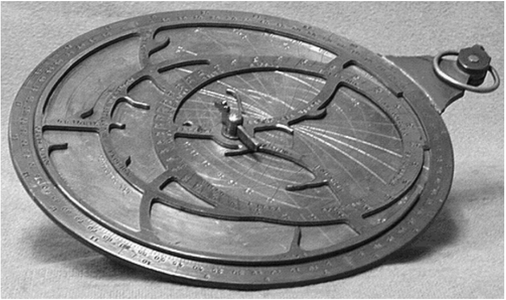

## 模型驱动设计：`MODEL-DRIVEN DESIGN`

#### ▶[上一节](0.md)

*用于计算星体位置的星盘 (astrolabe)，是星空模型的机械化实现。*

将代码与底层模型紧密关联，既赋予代码意义，也使模型具有实际价值。

---
**
中世纪天象仪 (sky computer)
**

古希腊天文学家发明了星盘 (astrolabe)，后经中世纪伊斯兰科学家完善。旋转的网状结构（称为 *rete* ）呈现了天球上恒星的位置。刻有当地球面 (spherical) 坐标系的可替换圆盘则呈现不同纬度的观测视角。通过旋转 rete 与圆盘的相对运动，可计算全年任意时段的天体位置；反之，根据恒星或太阳位置亦可推算时间。星盘正是星空对象化模型的机械化实现。

---

🌼🌼🌼

完全不建立领域模型，仅通过逐行编写代码实现功能的项目，几乎无法获得前两章所述的知识提炼与沟通优势。复杂领域将使这类项目不堪重负。

另一方面，许多复杂项目虽尝试构建领域模型，却未能保持模型与代码的紧密关联。这些模型在初期或许能作为探索工具发挥作用，但随着项目推进，逐渐脱离实际甚至产生误导。开发者倾注于模型的所有心血，并不能确保设计正确性，因为模型与代码本身是分离的。

这种联系可能以多种方式中断，但这种割裂往往是自觉的选择。许多设计方法论提倡采用 *分析模型* ，它与设计截然不同，通常由不同人员开发。之所以称为分析模型，是因为它是通过分析业务领域来组织概念的产物，完全不考虑其在软件系统中的作用。分析模型仅作为理解工具存在，混入实现层面的考量会被视为混淆视听。后续创建的设计方案可能与分析模型仅存在松散对应关系。<ins>由于分析模型创建时未考虑设计问题，因此往往难以满足实际需求。</ins>

<ins>在这种分析过程中会进行一些知识消化，但当编码开始时，这些知识大多会丢失，开发人员被迫为设计提出新的抽象概念。此时无法保证分析师获得并嵌入模型的洞见能够被保留或重新发现。此时，维持设计与松散关联模型之间的任何映射关系都已不具成本效益。</ins>

纯粹的分析模型甚至无法实现其理解领域的主要目标，因为关键发现总是在设计/实施过程中浮现。非常具体且意料之外的问题总会出现。前期建立的模型往往会深入探讨某些无关主题，却忽略了重要内容。其他主题的呈现方式也往往不符合应用需求。<ins>结果是纯分析模型在编码启动后很快被弃用，大部分工作不得不重新开展</ins>。但第二次进行时，若开发人员将分析视为独立流程，建模过程就会缺乏规范性；若管理者将分析视为独立流程，开发团队可能无法充分接触领域专家。

无论原因如何，缺乏设计理念基础的软件，充其量只是个能完成有用操作却无法解释其行为的机制。

<ins>**如果设计（或其核心部分）无法映射到领域模型，该模型便价值有限，软件的正确性也值得怀疑。与此同时，模型与设计功能之间的复杂映射难以理解，且在实践中随着设计变更几乎无法维护。分析与设计之间由此形成致命的鸿沟，导致双方活动中获得的洞见无法相互促进。**</ins>

分析必须以清晰且富有表现力的方式捕捉领域中的基本概念。设计需明确规定一套组件，这些组件能够使用项目中现有的编程工具构建，在目标部署环境中高效运行，并能正确解决应用程序所面临的问题。

[MODEL-DRIVEN DESIGN](../glossary.md#model-driven-design) 摒弃了分析模型与设计模型的二元对立，致力于构建兼具双重功能的统一模型。抛开纯技术问题不谈，设计中的每个对象都在模型中承担着特定的概念角色。这要求我们对所选模型提出更高要求，因为它必须同时满足两个截然不同的目标。

抽象领域的方法总是多种多样，解决应用问题的方案也总是层出不穷。正因如此，将模型与设计绑定才具有现实意义。这种绑定绝不能以削弱分析力度为代价，更不能因技术考量而陷入致命妥协。我们同样不能接受笨拙的设计，那些虽反映领域思想却背离软件设计原则的方案。<ins>这种方法要求模型既能胜任分析又能满足设计需求。当模型看似难以实现时，我们必须另寻新法；当模型未能忠实表达领域核心概念时，我们必须另寻新法。建模与设计过程由此形成单一迭代循环。</ins>

<ins>将领域模型与设计紧密关联的必要性，为从众多可能模型中筛选出更实用模型增添了又一标准。这需要深入思考，通常需要多次迭代和大量重构，但能却使模型真正 *契合* 业务需求。</ins>

因此：

<ins>**设计软件系统的一部分时，应以非常直白的方式反映领域模型，使映射关系一目了然。在追求模型更深入地反映领域洞察的同时，需重新审视模型并进行修改，使其在软件中实现得更为自然。要求模型同时满足这两个目的，并支持强大的 [UBIQUITOUS LANGUAGE](../ch2/1.md)。**</ins>

<ins>**从模型中提取设计所用的术语和基本职责分配。代码成为模型的表达形式，因此代码的变更可能意味着模型的变更。其影响必须相应地波及项目其余活动。**</ins>

<ins>**将实现严格绑定到模型通常需要支持建模范式的软件开发工具和语言，例如面向对象编程。**</ins>

有时不同子系统会采用不同的模型（参见 [第 14 章](../ch14/0.md) ），但系统特定部分应仅采用一种模型，且该模型需贯穿开发工作的各个环节，从代码编写到需求分析。

单一模型降低了出错概率，因为设计如今已成为经过深思熟虑的模型的直接延伸。设计乃至代码本身都具备模型的可传达性。

🌼🌼🌼

开发一个既能准确把握问题本质又能提供实用设计方案的模型，说起来容易做起来难。不能随意拿任何模型直接转化为可行方案，模型必须经过精心设计才能实现有效落地。<ins>需运用特定的设计与实现技术，使代码能精准表达模型（详见 [第二部分](../part2.md) ）。知识消化者会探索多种模型方案，并将其精炼为实用的软件组件。开发过程由此演变为模型、设计与代码的协同优化循环（详见 [第三部分](../part3.md) ）。</ins>

#### ▶[下一节](2.md)
