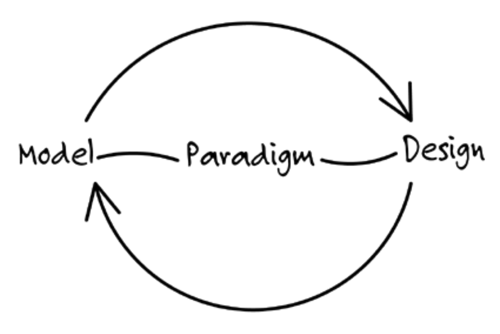
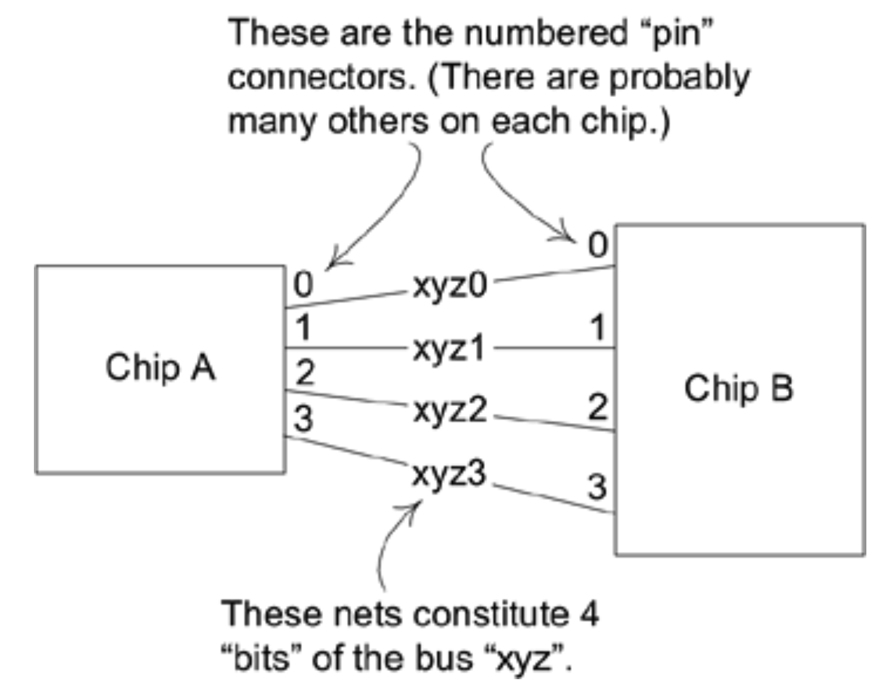
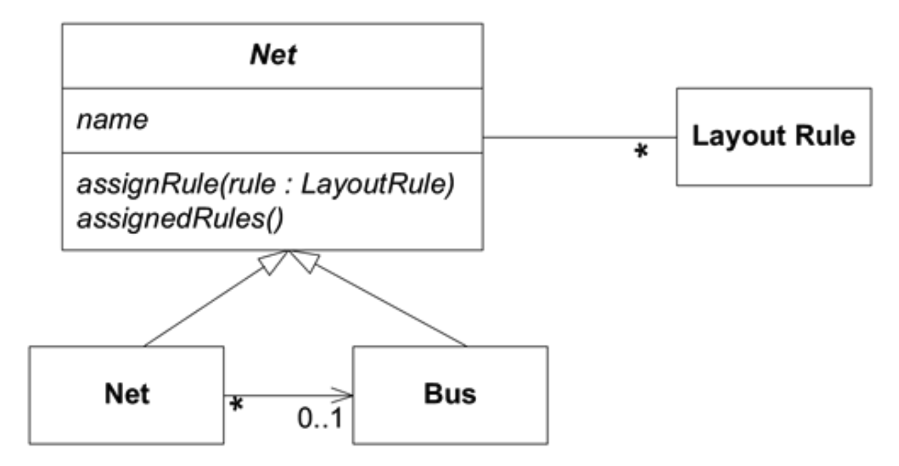

## 建模范式与工具支持

#### ▶[上一节](1.md)

要使 [MODEL-DRIVEN DESIGN](1.md) 发挥价值，模型与设计的对应关系必须严格对应，精确度需控制在人为误差范围内。
要实现模型与设计的如此紧密对应，几乎必须在建模范式内开展工作，该范式需由软件工具支持，使您能够创建与模型概念直接对应的实体。

#### Figure 3.1
</br>

<ins>面向对象编程之所以强大，是因为它基于一种建模范式 (modeling paradigm)，并为模型构造提供了具体实现。</ins>
对程序员而言，对象真实存在于内存中，它们与其他对象建立关联，被组织成类，并通过消息传递提供行为。
尽管许多开发者仅通过运用对象的技术特性来组织程序代码便能获益，<ins>但面向对象设计的真正突破在于代码能够表达模型的概念。
Java 及众多工具允许创建与概念对象模型直接对应的对象及关系。</ins>

尽管 Prolog 语言从未达到面向对象语言的普及程度，但它与 [MODEL-DRIVEN DESIGN](1.md) 天然契合。
在这种情况下，范式是逻辑 (logic)，模型是一组逻辑规则和它们所操作的事实 (facts)。

<ins>[MODEL-DRIVEN DESIGN](1.md) 在 C 等语言中的适用性有限，因为不存在与纯 *过程化* 语言相对应的建模范式。</ins>
这类语言的过程化特征体现在程序员向计算机告知一系列执行步骤。
尽管程序员可能在思考领域概念，但程序本身仅是对数据进行技术性操作的序列。
虽然结果可能有用，但程序未能捕捉到多少实质意义。
过程化语言虽常支持复杂数据类型，这些类型开始接近领域中更自然的概念化表达，但复杂类型终究只是组织化的数据，无法捕捉领域的动态特性。
<ins>结果是：用过程化语言编写的软件，其复杂功能模块的关联基于预设的执行路径，而非领域模型中的概念关联。</ins>

在我接触面向对象编程之前，就曾用 Fortran 编写程序求解数学模型，这恰恰是 Fortran 最擅长的领域。
数学函数是此类模型的核心概念组件，在 Fortran 中能得到清晰表达。
即便如此，仍无法捕捉函数之外的高阶含义。
大多数非数学领域难以在过程化语言中实现 [MODEL-DRIVEN DESIGN](1.md) ，因为这些领域无法被抽象为数学函数或程序步骤。

<ins>面向对象设计作为当前主导大多数雄心勃勃项目的范式，是本书主要采用的方法。</ins>

#### 示例：从过程化到模型驱动

如 [第 1 章](../ch1/0.md) 所述，印刷电路板（PCB）可视为连接各类元件引脚的导电网络集合（称为`nets`）。通常存在数万条`nets`。专用软件，被称作 PCB 布局工具，通过优化路径并满足人类设计师设定的海量布局约束条件，为所有`nets`找到物理排列方案，确保其互不交叉或干扰。尽管 PCB 布局工具极为精密，仍存在某些局限性。

一个问题在于，数千个`nets`各自拥有独立的布局规则。PCB 工程师认为许多`nets`属于自然分组，理应共享相同规则。例如某些`nets`构成`buses` (总线)。

#### Figure 3.2
</br>
*`buses`与`nets`的说明性示意图*

通过将`nets`组合成`bus`（每次组合 8 个、16 个或 256 个），工程师能将工作量缩减至更易管理的规模，从而提升效率并减少错误。但问题在于，布局工具并不存在`bus`这一概念。规则必须逐个分配给数万个`nets`，且每次只能处理单个`net`。

#### 一种机械的设计
绝望的工程师们通过编写脚本绕过了布局工具的这一限制，这些脚本解析布局工具的数据文件，并将规则直接插入文件中，每次对整条`bus`应用规则。

布局工具将每个电路连接存储在 *net list* 文件中，其格式大致如下：

```
Net Name    Component.Pin
--------    -------------
Xyz0        A.0, B.0
Xyz1        A.1, B.1
Xyz2        A.2, B.2
.. .
```

它将布局规则存储在类似于以下格式的文件中：

```
Net Name    Rule Type        Parameters
--------    ---------        ----------
Xyz1        min_linewidth    5
Xyz1        max_delay        15
Xyz2        min_linewidth    5
Xyz2        max_delay        15
.. .
```

工程师们精心为`nets`采用命名规范，使得按字母顺序排序的数据文件能将同一`bus`的`nets`集中存放于排序后的文件中。随后脚本可解析该文件，并根据`bus`对每个`net`进行修改。实际用于解析、操作和写入文件的代码过于冗长晦涩，不便在此示例中展示，故仅列出操作流程的步骤。

```
1. 按 net 名称对 net list 文件进行排序。
2. 读取文件中的每一行，寻找第一个以 bus 名称模式 (name pattern) 开头的行。
3. 对于每行匹配名称的行，解析该行以获取 net 名称。
4. 将 net 名称与规则文本追加到规则文件中。
5. 从步骤 3 开始重复操作，直至行左侧不再匹配 bus 名称。
```

因此，像这样的`bus`规则输入：

```
Bus Name    Rule Type   Parameters
--------    ---------   ----------
Xyz         max_vias    3
```

将导致向文件中添加如下`net`规则：

```
Net Name    Rule Type   Parameters
--------    ---------   ----------
...
Xyz0        max_vias    3
Xyz1        max_vias    3
Xyz2        max_vias    3
...
```

我猜想最初编写此类脚本的人仅有如此简单的诉求，若仅此需求，这类脚本确实很有意义。但实际中现已存在数十个脚本。当然，它们可通过重构共享排序和字符串匹配功能，若语言支持函数调用来封装细节，这些脚本便能像上述总结步骤那样清晰易读。然而它们终究只是文件操作。面对不同文件格式（且存在多种格式），即便分组`buses`并应用规则的核心逻辑相同，仍需从头开始编写。若想实现更丰富的功能或交互性，每寸进展都需付出代价。

脚本编写者试图通过引入`bus`概念来补充工具的领域模型。他们的实现方案通过排序和字符串匹配来推断`bus`的存在，但并未明确处理该概念。

#### 模型驱动的设计
前文已阐述领域专家用于思考问题的概念框架。现在我们需要将这些概念，明确组织成可作为软件基础的模型。

#### Figure 3.3
</br>
*一张面向高效分配布局规则的类图*

当这些对象以面向对象语言实现时，核心功能便变得相当简单。

`assignRule()`方法可在`Abstract Net`中实现。`Net`类的`assignedRules()`方法需同时处理自己的规则与`Bus`的规则。
```java
abstract class AbstractNet {
    private Set rules;

    void assignRule(LayoutRule rule) {
        rules.add(rule);
    }

    Set assignedRules() {
        return rules;
    }
}
 
class Net extends AbstractNet {
    private Bus bus;

    Set assignedRules() {
        Set result = new HashSet();
        result.addAll(super.assignedRules());
        result.addAll(bus.assignedRules());
        return result;
    }
} 
```

当然，还需要大量辅助代码，但这已涵盖脚本的基本功能。

该应用程序需要导入/导出逻辑，我们将把这些逻辑封装到一些简单的服务中。

| Service | Responsibility |
|--------|----------------|
|Net List import| 读取 Net List 文件，为每个条目创建 Net 实例 |
|Net Rule export| 给定一组 Nets 集合，将所有关联的规则写入规则文件|

我们还需要几个工具：

| Class  | Responsibility |
|--------|----------------|
|Net Repository | 按名称访问 Net |
|Inferred Bus Factory | 给定一组 Nets 集合，根据命名规范推断总线（Bus）并创建实例 |
|Bus Repository| 按名称访问总线（Bus）|

现在，启动应用程序只需使用导入的数据初始化存储库 (repositories) ：

```java
Collection nets = NetListImportService.read(aFile);
NetRepository.addAll(nets);
Collection buses = InferredBusFactory.groupIntoBuses(nets);
BusRepository.addAll(buses);
```

每个服务和存储库 (repositories) 均可进行单元测试。
更重要的是，核心领域逻辑也能被测试。以下是针对最核心行为的单元测试（使用 JUnit 测试框架）：

```java
public void testBusRuleAssignment() {
    Net a0 = new Net("a0");
    Net a1 = new Net("a1");
    Bus a = new Bus("a"); //Bus is not conceptually dependent
    a.addNet(a0);         //on name-based recognition, and so
    a.addNet(a1);         //its tests should not be either.

    NetRule minWidth4 = NetRule.create(MIN_WIDTH, 4);
    a.assignRule(minWidth4);

    assertTrue(a0.assignedRules().contains(minWidth4));
    assertEquals(minWidth4, a0.getRule(MIN_WIDTH));
    assertEquals(minWidth4, a1.getRule(MIN_WIDTH));
}
```

交互式用户界面可呈现`buses`列表，允许用户为每条`bus`分配规则，或为向后兼容，从规则文件中读取规则。
façade 使两种方式都能轻松访问。其实现方式呼应了测试：

```java
public void assignBusRule(String busName, String ruleType, double parameter){
   Bus bus = BusRepository.getByName(busName);
   bus.assignRule(NetRule.create(ruleType, parameter));
}
```

完成：

```java
NetRuleExport.write(aFileName, NetRepository.allNets());
```

（该服务向每个`Net`请求`assignedRules()`，然后将它们完全展开后写入。）

当然，如果只有一个操作（如示例所示），基于脚本的方法可能同样实用。但在实际中，操作数量可能达到 20 个或更多。[MODEL-DRIVEN DESIGN](1.md) 能轻松扩展，并可包含规则组合约束及其他增强功能。

第二种设计同样支持测试。其组件具有明确定义的接口，可进行单元测试。测试脚本的唯一方法是执行端到端的输入文件/输出文件对比。

请注意，此类设计并非一步完成。需要经过多次重构迭代和知识消化，才能将领域中的重要概念提炼成简洁而精辟的模型。

#### ▶[下一节](3.md)
