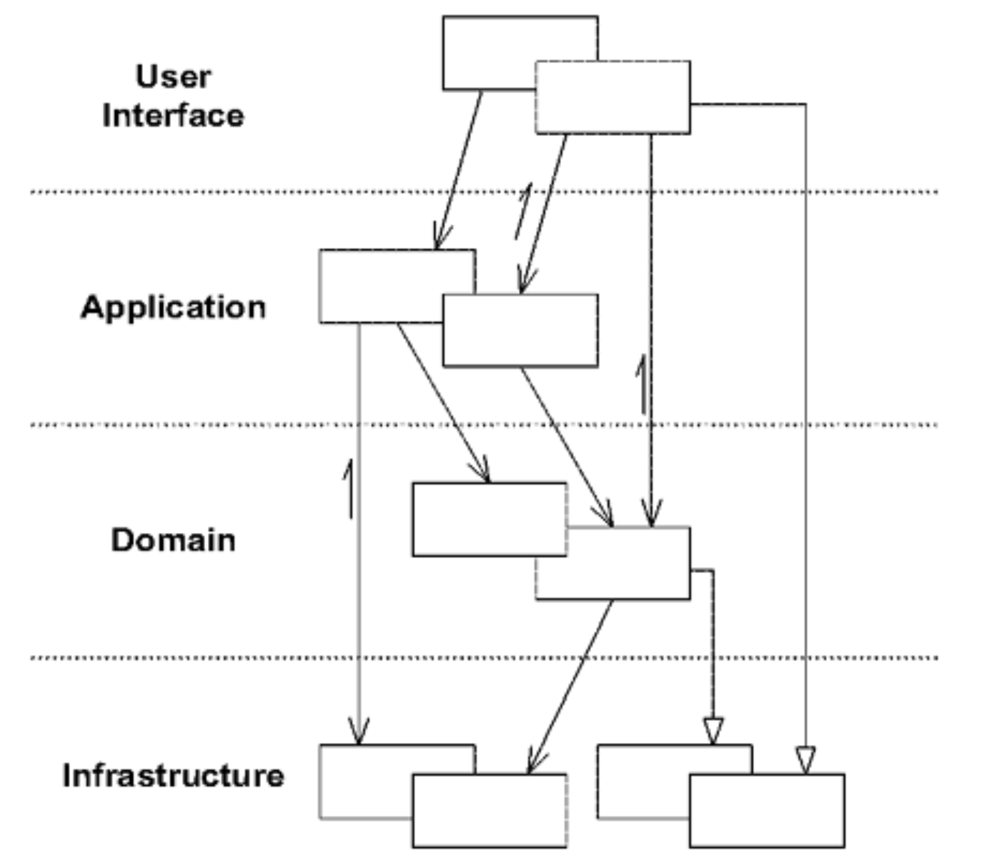

## 分层架构：`LAYERED ARCHITECTURE`

#### ▶[上一节](0.md)

 

要使航运应用程序支持用户从城市列表中选择货物目的地的简单操作，必须包含以下程序代码：(1) 在屏幕上绘制控件；(2) 查询数据库获取所有可用城市；(3) 解析用户输入并进行验证；(4) 将选定城市与货物关联；(5) 将变更提交至数据库。上述所有代码均属于同一程序，但其中仅有极小部分与运输业务本身相关。

软件程序通过设计和编码来执行多种任务。它们接收用户输入、执行业务逻辑、访问数据库、进行网络通信、向用户展示信息等等。因此，每个程序功能涉及的代码量可能相当可观。

<ins>**在面向对象的程序中，用户界面、数据库及其他辅助代码常被直接写入业务对象。额外的业务逻辑则嵌入到用户界面控件的行为和数据库脚本中。这种情况的出现，是因为在短期内这是让程序运行的最便捷方式。**</ins>

<ins>**当领域相关代码分散在如此庞大的其他代码中时，其可视性与可理解性将急剧下降。对用户界面的表面修改可能实际改变业务逻辑。修改一条业务规则可能需要对用户界面代码、数据库代码或其他程序元素进行细致入微的追踪。实现一致的、模型驱动的对象变得难以实现。自动化测试变得笨拙。由于每项活动都涉及众多技术和逻辑，程序必须保持极简结构，否则将难以理解。**</ins>

创建能够处理极其复杂任务的程序需要关注点的分离，从而能够独立专注于设计的不同部分。与此同时，尽管存在分离，系统内部的复杂交互仍需得以维持。

软件系统的划分方式多种多样，但通过实践经验与行业惯例，业界已逐渐形成 [LAYERED ARCHITECTURES](../glossary.md#layered-architecture) 的共识，特别是少数几层较为标准的划分。分层的比喻被广泛运用，对大多数开发者而言已显得直观易懂。<ins>文献中存在大量关于分层的优质讨论，有时以模式形式呈现（如 [Buschmann et al. 1996](../references.md#buschmann-1996) 著作 第 31-51 页）。其核心原则在于：某一层的任何元素仅依赖于同层其他元素或 “下层” 元素。向上通信必须通过某种间接机制实现，我将在稍后稍作探讨。</ins>

分层的价值在于每个层都专注于计算机程序的特定方面。这种专业化使每个方面的设计更具凝聚力，也让这些设计更易于理解。当然，关键在于选择能隔离最重要凝聚性设计要素的分层方式。经验与惯例再次促成了某种趋同。尽管存在诸多变体，但大多数成功的架构都采用了这四个概念层的某种组合形式：

| 层级 | 描述 |
|------|------|
|用户界面 (或表示层)|负责向用户展示信息并解释用户的命令。外部参与者有时可能是另一台计算机系统，而非人类用户。|
|应用层|定义软件应执行的任务，并指导表达性领域对象解决问题。该层负责的任务对业务具有实际意义，或对与其他系统的应用层交互必不可少。  该层保持轻量化设计。它不包含业务规则或知识，仅负责协调任务并向下层领域对象协作体委派工作。它不持有反映业务状态的状态，但可持有反映用户或程序任务进度的状态。|
|领域层 (或模型层)|负责呈现业务概念、业务状况信息及业务规则。此处控制并使用反映业务状况的状态，尽管其存储的技术细节已委托给基础设施层。*该层是业务软件的核心。*|
|基础设施层|提供通用技术能力以支持上层功能：为应用程序提供消息发送服务，为领域模型提供持久化支持，为用户界面绘制控件等。基础设施层还可通过架构框架支持四层之间的交互模式。|

某些项目并未严格区分用户界面层与应用层。另一些项目则包含多层基础设施。但关键是 *领域层* 的分离，才使 [MODEL-DRIVEN DESIGN](../ch3/1.md) 成为可能。

因此：

<ins>**将复杂程序划分为多个层级。在每个层级内构建具有内聚性且仅依赖下层的设计。遵循标准架构模式，实现与上层的松耦合。将所有与领域模型相关的代码集中于单一层级，并将其与用户界面、应用程序及基础架构代码隔离。领域对象摆脱了自我展示、自我存储、管理应用任务等职责束缚，得以专注于表达领域模型。这使得模型能够不断演进，最终具备足够的丰富度与清晰度，从而捕捉核心业务知识并付诸实践。**</ins>

将领域层与基础设施层及用户界面层分离，能使各层的设计更为简洁。独立的层级更易于维护，因为它们往往以不同的速度演进并响应不同的需求。这种分离还利于分布式系统的部署，通过将不同层灵活部署在不同的服务器或客户端上，可最大限度地减少通信开销并提升性能（ [Fowler 1997](../references.md#fowler-1997)）。

#### 示例：将网上银行功能分层

某应用程序提供多种银行账户管理功能。其中一项功能是资金转账：用户输入或选择两个账号及金额后，即可发起转账操作。

为使本例更易理解，我已省略主要技术特性，尤其是安全机制。领域设计也进行了过度简化（实际复杂性只会增加分层架构的必要性）。此外，此处暗示的基础设施刻意设计得简单明了以利说明 —— 并非推荐方案。剩余功能的职责划分将如 [Figure 4.1](#figure-41) 所示进行分层。

#### Figure 4.1

*对象执行与其层级相符的职责，并与同层级对象具有更强的耦合性*
*（译注：序列图中第一步为`transferTo(a123,a456,$100)`，但图中只有`a123`和`a234`对象）*

请注意，负责基础业务规则的是领域层 *而非应用层* —— 在此案例中，该规则为 “每笔贷方记录都对应一笔借方记录”。

该应用程序对转账请求的来源也不作任何假设。程序可能包含一个用户界面，其中设有账户号码和金额的输入字段以及命令按钮。但该用户界面可被 XML 格式的请求所替代，而不会影响应用层或任何底层。这种解耦之所以重要，并非因为项目常需用请求替换用户界面，而是因为清晰的职责分离能使各层设计易于理解和维护。

事实上， [Figure 4.1](#figure-41) 本身就轻微地揭示了未隔离领域的问题。由于必须包含从请求到事务控制的所有内容，领域层不得不被简化，以确保整体交互足够简单易懂。若我们专注于设计独立的领域层，页面和思维中便会腾出空间来构建更贴合领域规则的模型，或许包含账簿、借贷对象或货币交易对象等元素。

### 关联各层

迄今为止，讨论主要集中在分层与这种划分如何改善程序各部分的设计，尤其是领域层。但显然，各层之间必须保持连接。<ins>如何在保持分层优势的前提下实现连接，正是诸多设计模式背后的动因。</ins>

层级设计旨在实现松耦合，设计依赖仅单向存在。
上层可通过调用下层的公共接口、持有引用（至少是临时持有）以及常规交互方式，直接使用或操作下层元素。
<ins>但当下层对象需要向上层通信（不仅限于回答直接的查询）时，则需借助架构模式如回调 (callbacks) 或`OBSERVERS`（[Gamma et al. 1995](../references.md#gamma-1995)）建立层间关联。</ins>

将用户界面与应用层及领域层相连接的模式之始祖当属`MODEL-VIEW-CONTROLLER`（MVC）。该模式最早诞生于 1970 年代的 Smalltalk 世界，并启发了此后众多用户界面架构的设计。[Fowler 2003](../references.md#fowler-2003) 对此模式及其若干实用变体进行了深入探讨。[Larman 1998](../references.md#larman-1998) 在`MODEL-VIEW SEPARATION PATTERN`中深入探讨了这些要点，其提出的`APPLICATION COORDINATOR`正是连接应用层的一种解决方案。

<ins>连接用户界面与应用程序还有其他方式</ins>。
就我们的目的而言，只要能保持领域层的隔离性，允许领域对象的设计无需同时考虑可能与其交互的用户界面，所有方法都可行。

<ins>基础设施层通常不会主动在领域层发起操作</ins>。
作为位于领域层 “下方” 的层级，它不应具备所服务领域的具体知识。
事实上，此类技术能力通常以 [SERVICES](../ch5/4.md) 形式提供。
例如，当应用程序需要发送电子邮件时，可将消息发送接口置于基础设施层，应用层组件只需请求消息传输即可。
这种解耦设计赋予了额外的灵活性。
消息发送接口可连接电子邮件发送器、传真发送器或其他可用工具。
但核心价值在于简化应用层，使其专注于核心职责：明确 *何时* 发送消息，而没有 *如何做* 的负担。

<ins>应用层和领域层调用基础设施层提供的 [SERVICES](../ch5/4.md) </ins>。
当 [SERVICE](../ch5/4.md) 的范围被恰当地选定且其接口被精心设计时，调用方就能保持松散耦合，并免于被 [SERVICE](../ch5/4.md) 接口封装的复杂行为所困扰。

但并非所有基础设施都以可从上层调用的 [SERVICES](../ch5/4.md) 形式存在。某些技术组件旨在直接支撑其他层的基础功能（例如为所有领域对象提供抽象基类），并为它们之间的关联提供机制（例如 MVC 等模式的实现）。此类 “架构框架 (architectural framework)” 对程序其他部分的设计具有更深远的影响。

### 架构框架

当基础设施以通过接口调用的 [SERVICES](../ch5/4.md) 形式提供时，分层机制及其松耦合特性便显而易见。
但某些技术问题需要更侵入性的基础设施形式。
整合多种基础设施需求的框架往往要求其他层以特定方式实现，例如作为框架类的子类，或采用结构化方法签名。
（子类层级高于父类看似违背直觉，但需考量哪个类更深入理解另一个类。）
<ins>优秀的架构框架既能解决复杂技术问题，又能让领域开发者专注于模型表达。
但框架也可能成为阻碍：要么因过度假设限制领域设计选择，要么因实现过于臃肿导致开发效率低下</ins>。

通常需要某种形式的架构框架（尽管有时团队选择的框架并不尽如人意）。
<ins>应用框架时，团队需聚焦核心目标：构建能体现领域模型并运用该模型解决关键问题的实现方案</ins>。
团队必须探索如何将框架服务于此目标，即使这意味着舍弃部分框架功能。
例如早期 J2EE 应用常将所有领域对象实现为 “entity bean”，这种做法既拖累性能又阻碍开发进度。
当前最佳实践是：仅用 J2EE 框架处理大粒度对象，而将大部分业务逻辑交由通用 Java 对象实现。
<ins>通过有选择地应用框架解决特定难题，而非追求万能解决方案，可规避诸多框架弊端。
审慎采用最具价值的框架特性，能降低实现与框架的耦合度，为后续设计决策保留更大灵活性。
更重要的是，鉴于当前多数框架使用复杂度极高，这种极简主义有助于保持业务对象的可读性与表达力</ins>。

架构框架及其他工具将持续演进。新型框架将逐步实现应用程序技术层面的自动化或预制化。若实施得当，应用程序开发者将能将更多精力投入核心业务问题的建模工作，从而显著提升生产效率与质量。但在此发展进程中，我们必须警惕对技术解决方案的过度热衷，复杂的框架同样可能束缚应用程序开发者的创造力。

#### ▶[下一节](2.md)
