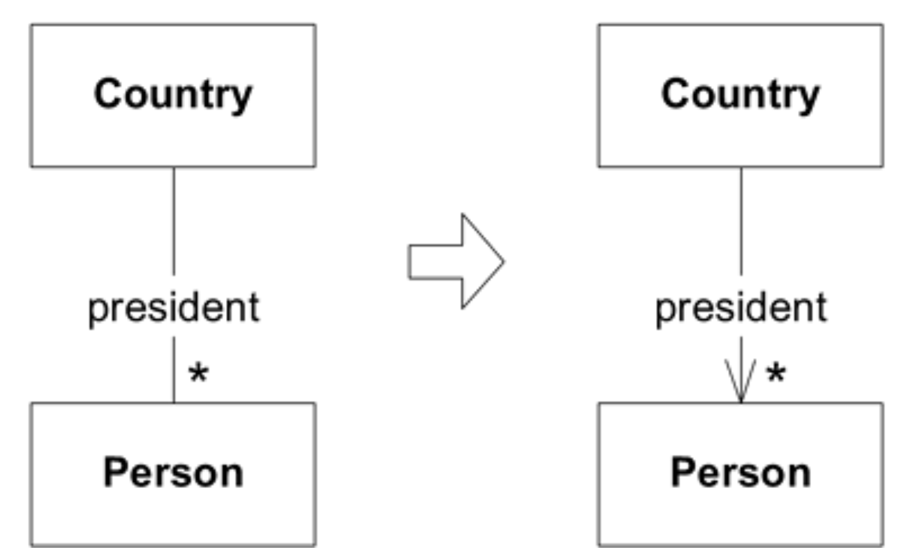
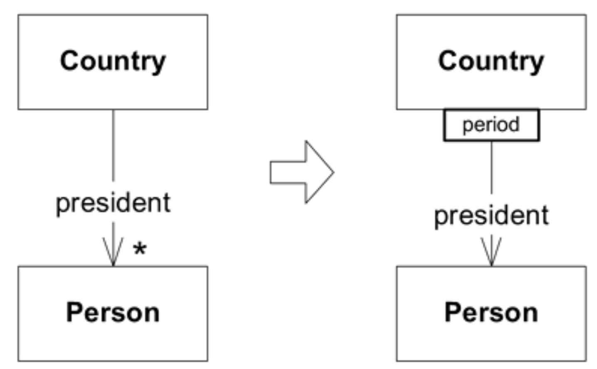
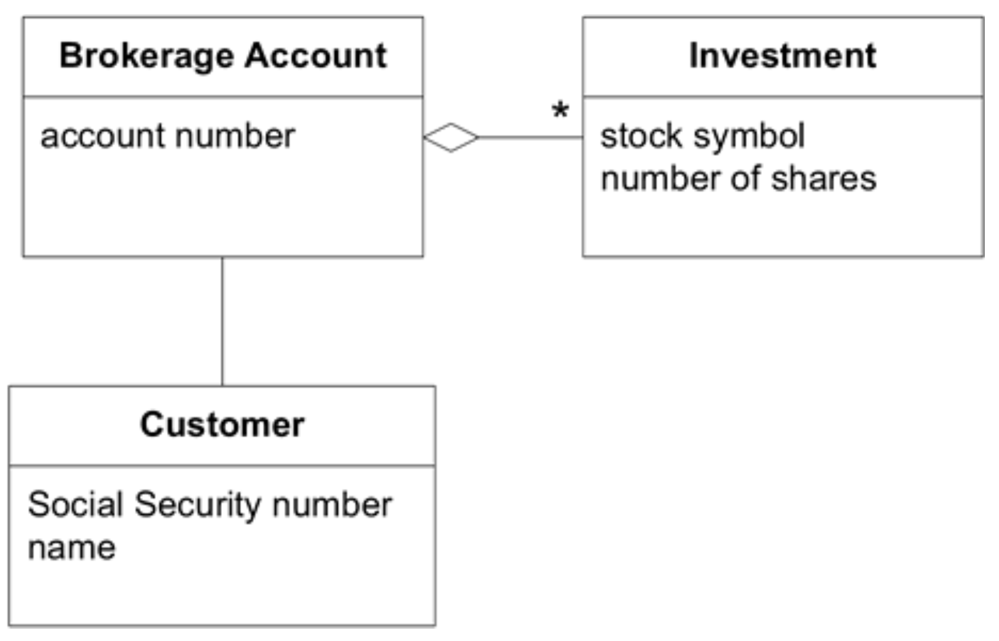
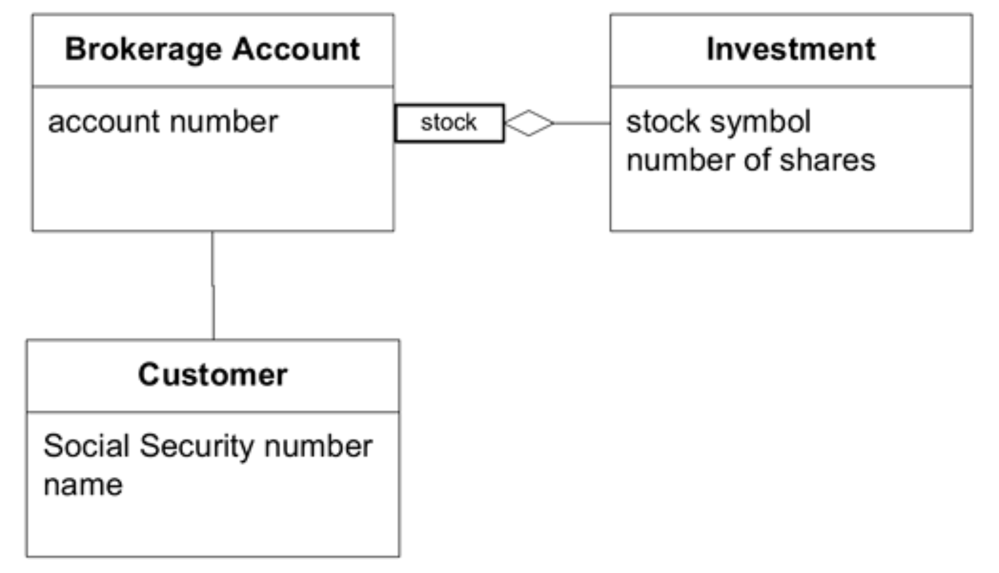

## 关联关系

#### ▶[上一节](0.md)

处理对象之间的关联关系，建模与实现之间的交互尤为棘手。

*模型中每条可遍历的关联关系，在软件中都存在具有相同属性的机制。*

一个展示客户与销售代表关联关系的模型对应两层含义：一方面，它抽象了开发者认为真实人物间具有关联性的关系；另一方面，它对应于两个Java对象间的对象指针，或是数据库查询的封装实现，或是类似的具体实现方案。

例如，一对多关联可通过实例变量中的集合来实现。但设计未必如此直接：可能不存在集合，而是通过访问器方法查询数据库以查找相应记录，并据此实例化对象。这两种设计都体现了相同的模型。设计必须指定特定的遍历机制，其行为需与模型中的关联保持一致。

现实生活中存在大量多对多关联，其中许多天然具有双向性。在我们头脑风暴和探索领域时，模型早期版本往往也呈现这种特征。但这些通用关联会增加实现和维护的复杂性，且几乎无法传达关系本质。

至少有三种方法可使关联更易于处理：
1. 强制规定遍历方向
2. 添加限定符，实质上减少多重性
3. 消除非必要关联

尽可能限制关系至关重要。双向关联意味着两个对象必须共同存在才能被理解。当应用需求无需双向遍历时，减少遍历方向可降低相互依赖性并简化设计。理解领域模型可能揭示出自然的方向性偏好。

美国历任总统众多，其他国家亦然。这是一种双向的一对多关系。然而我们很少会从 “George Washington” 这个名字开始，反问 “他是哪个国家的总统？” 从实用角度出发，我们可以将这种关系简化为单向关联，即从国家到总统的可遍历路径。这种精炼不仅体现了对领域认知的洞察，更实现了更实用的设计。<ins>它揭示了关联中单向关系远比双向关系更具意义与价值，使 “Person” 类得以独立于远不如其基础的 “总统” 概念之外。</ins>

#### Figure 5.1

*Figure 5.1：某些遍历方向反映了领域中的自然偏好*

更深层次的理解往往会形成一种 “限定性” 关系。深入考察总统关系时，我们意识到（除内战时期外）国家同时仅存在一位总统。此限定条件将多重性降为一对一，并将重要规则显式嵌入模型。1790 年美国总统是谁？George Washington 。

#### Figure 5.2

*Figure 5.2：受约束的关联能传递更多知识，且是更实用的设计方案*

限制多对多关联的遍历方向，实质上将其实现简化为一对多关联，这是一种更方便的设计。

<ins>始终以反映领域偏好的方式约束关联关系，不仅能使关联更具表达力且更易实现，更能凸显剩余双向关联的意义。当关系双向性属于领域的语义特征，或为应用功能所必需时，保留双向遍历路径恰恰传达了这种特性。</ins>

当然，最彻底的简化方式是完全消除关联，只要该关联对当前任务或模型对象的基本含义并非不可或缺。

### 示例： 经纪账户中的关联关系

#### Figure 5.3


在此模型中，`Brokerage Account` 的一种 Java 实现方式为：
```java
public class BrokerageAccount {
     String accountNumber;
     Customer customer;
     Set investments;
   // Constructors, etc. omitted
   public Customer getCustomer() {
     return customer;
   }
   public Set getInvestments() {
     return investments;
   }
}
```
但如果需要从关系数据库中获取数据，另一种同样符合该模型的实现方式如下：
```SQL
Table: BROKERAGE_ACCOUNT
ACCOUNT_NUMBER CUSTOMER_SS_NUMBER
```
---
```SQL
Table: CUSTOMER
SS_NUMBER NAME
```
---
## TODO 验证一下：INVESTMENT 表中没有 BROKERAGE_ACCOUNT 字段
```SQL
Table: INVESTMENT
ACCOUNT_NUMBER STOCK_SYMBOL AMOUNT
```
---
```java
public class BrokerageAccount {
   String accountNumber;
   String customerSocialSecurityNumber;
   // Omit constructors, etc.
   public Customer getCustomer() {
     String sqlQuery =
       "SELECT * FROM CUSTOMER WHERE" +
       "SS_NUMBER='"+customerSocialSecurityNumber+"'";
     return QueryService.findSingleCustomerFor(sqlQuery);
   }
   public Set getInvestments() {
     String sqlQuery =
       "SELECT * FROM INVESTMENT WHERE" +
       "BROKERAGE_ACCOUNT='"+accountNumber+"'";
     return QueryService.findInvestmentsFor(sqlQuery);
   }
}
```
（注：`QueryService` 作为从数据库获取行数据并创建对象的工具类，在示例说明中较为简洁，但未必适用于实际项目的设计。）

让我们通过限定 `Brokerage Account` 与 `Investment` 之间的关联属性来优化模型，减少其多重性。这意味着每只股票只能对应一项投资。

#### Figure 5.4


这并非适用于所有业务场景（例如当需要追踪批次时），但无论具体规则如何，一旦发现关联约束，都应将其纳入模型和实现中。这些约束能使模型更精确，并让实现更易于维护。

Java 实现可改为：
```java
public class BrokerageAccount {
  String accountNumber;
  Customer customer;
  Map investments;

  // Omitting constructors, etc.

  public Customer getCustomer() {
     return customer;
  }

  public Investment getInvestment(String stockSymbol) {
     return (Investment)investments.get(stockSymbol);
  }
}
```
基于 SQL 的实现方式如下：
```java
public class BrokerageAccount {
   String accountNumber;
   String customerSocialSecurityNumber;

   //Omitting constructors, etc.
   public Customer getCustomer() {
     String sqlQuery = "SELECT * FROM CUSTOMER WHERE SS_NUMBER='"
       + customerSocialSecurityNumber + "'";
     return QueryService.findSingleCustomerFor(sqlQuery);
   }

   public Investment getInvestment(String stockSymbol) {
     String sqlQuery = "SELECT * FROM INVESTMENT "
       + "WHERE BROKERAGE_ACCOUNT='" + accountNumber + "'"
       + "AND STOCK_SYMBOL='" + stockSymbol +"'";
     return QueryService.findInvestmentFor(sqlQuery);
  }
}
```

精心提炼并约束模型的关联关系，将使您在实现 [MODEL-DRIVEN DESIGN](../glossary.md#model-driven-design) 方面取得长足进展。现在让我们转向对象本身。某些区分不仅能澄清模型，还能使实现更具实用性……

#### ▶[下一节](2.md)
