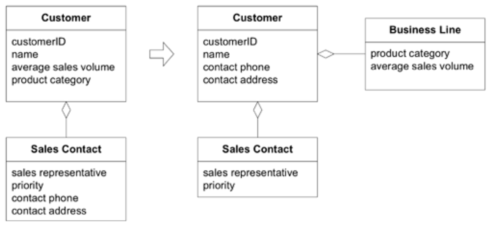

## 实体（又称引用对象）：`ENTITIES`

#### ▶[上一节](1.md)

 

许多对象的本质并非由其属性定义，而是由一条连续性 (continuity) 与标识 (identity) 的纽带所界定。

🌼🌼🌼

一位房东起诉我，声称其房产遭受重大损毁。传票描述的公寓里墙壁布满孔洞，地毯沾满污渍，水槽里盛着散发腐蚀性烟雾的有毒液体，导致厨房墙纸剥落。法庭文件明确指认我作为租客应承担损害赔偿责任，不仅列明姓名，还标注了我当时的居住地址。这令我困惑不已，因为我从未踏足过那个破败不堪的地方。

片刻之后，我意识到这一定是认错人了。我打电话给原告说明情况，但她并不相信我。前租客躲着她已有数月之久。我怎么能证明自己不是那个让她损失惨重的人呢？电话簿里只有我一个 Eric Evans 。

电话簿最终成了我的救星。由于我已在同一公寓居住两年，我问她是否还保留着去年的电话簿。她找到后确认我的登记信息未变（就在同名者的登记信息旁边），这才意识到我并非她要起诉的对象，当即道歉并承诺撤销诉讼。

计算机可没这么机灵。软件系统里的标识误认，往往会导致数据损坏和程序错误。

这里存在特殊的技术挑战，稍后我会详细讨论，但首先让我们审视根本问题：许多事物是由其标识而非任何属性所定义的。在我们的典型认知中，一个人（继续用非技术性例子说明）拥有从出生延续至死亡甚至更久的标识。这个人的身体特征会发生变化，最终消逝。姓名可能变更，财务关系亦会消长。人的所有属性皆可改变，唯独标识恒久不变。我是否仍是五岁时的那个我？这类形而上学问题对构建有效的领域模型至关重要。换言之：应用程序的用户是否在乎我是否仍是五岁时的那个我？

在追踪逾期账款的软件系统中，那个不起眼的 “客户” 对象可能有着更丰富的一面。它因及时付款而累积良好状态，或因拖欠款项被移交催收机构。当销售团队将客户数据导入其联络管理软件时，它甚至可能在另一个系统中过着双重生活。无论如何，它终将被无情地压扁存入数据库表。当该来源的新业务枯竭时，客户对象便会被封存至档案库，沦为昔日荣光的幽灵。

每种客户表单都是基于不同编程语言和技术实现的独立版本。但当电话订单接入时，关键在于确认：这是拖欠账款的客户吗？这是销售代表杰克持续跟进数周的客户吗？还是完全陌生的新客户？

概念性标识必须在对象的多种实现、其存储形式以及现实世界参与者（如电话呼叫者）之间保持一致。属性可能存在不匹配。销售代表可能已在联系人软件中录入地址更新，该信息正被同步至待处理账户。两个客户联系人可能拥有相同姓名。在分布式软件中，多个用户可能从不同来源输入数据，导致更新事务在系统中传播，并在不同数据库中异步进行协调。

对象建模往往使我们聚焦于对象的属性，但 [ENTITY](../glossary.md#entity) 的核心概念是贯穿生命周期、甚至跨越多种形态的抽象连续性线索 (abstract continuity threading) 。

<ins>**某些对象的主要定义并非基于其属性。它们代表着一条贯穿时间、往往横跨不同表现形式的标识线索。有时这类对象必须与另一个对象匹配，即使属性存在差异；而另一个对象必须与其他对象区分开来，即使它们可能具有相同的属性。标识错误可能导致数据损坏。**</ins>

<ins>主要由其标识定义的对象称为 [ENTITY](../glossary.md#entity) [1](#1)。
[ENTITIES](../glossary.md#entity) 具有特殊的建模与设计考量。
它们的生命周期可能彻底改变其形态与内容，但必须保持连续性主线。
其标识必须明确定义，以便有效追踪。
其类定义、职责、属性和关联应围绕其本质展开，而非其携带的特定属性。</ins>
即使对于那些变化不那么剧烈或生命周期不那么复杂的 [ENTITIES](../glossary.md#entity) ，将其归入语义范畴也能构建更清晰的模型和更稳健的实现方案。

当然，软件系统中的大多数 [ENTITIES](../glossary.md#entity) 并非通常意义上的人或实体。<ins>所谓 [ENTITY](../glossary.md#entity) ，是指在生命周期中具有连续性，并且具有独立于属性的区分，这些区分对应用程序的用户来说是重要的。它可以是个人、城市、汽车、彩票，或是银行交易。</ins>

另一方面，模型中的对象并非全是 [ENTITIES](../glossary.md#entity) 。这种混淆源于面向对象语言将 “identity” 操作内置于每个对象（例如 Java 中的 “==” 运算符）。这些操作通过比较内存位置或其他机制判断两个引用是否指向同一对象。从这个意义上说，每个对象实例都具有标识。在某些领域（例如创建 Java 运行时环境或构建本地缓存远程对象的技术框架），每个对象实例确实可能构成 [ENTITY](../glossary.md#entity) 。但在其他应用领域，这种标识机制几乎毫无意义。标识是 [ENTITIES](../glossary.md#entity) 的微妙而关键属性，绝不能交由语言的自动特性来处理。

考虑银行应用中的交易。同一天对同一账户进行的两笔相同金额存款仍是独立交易，因此它们具有标识特征，属于 [ENTITIES](../glossary.md#entity) 。另一方面，这两笔交易的金额属性很可能是某个货币对象的实例。这些数值不具备标识特征，因为区分它们毫无意义。事实上，两个对象可以具有相同的标识，但不必具有相同的属性，甚至不必属于同一类。当银行客户核对银行对账单与支票登记簿的交易记录时，其核心任务正是匹配具有相同标识的交易，即使这些交易由不同人员在不同日期记录（银行清算日期晚于支票日期）。支票号码的存在目的，正是为此提供唯一标识符，无论问题由计算机程序处理还是人工操作。存款与现金提取因缺乏标识号码而更具挑战性，但核心原则相同：每笔交易都是一个 [ENTITY](../glossary.md#entity) ，至少以两种形式呈现。

标识在特定软件系统之外具有重要意义的情况很常见，例如银行交易和公寓租户的情况。但有时标识仅在系统内部具有重要性，例如计算机进程的标识。

因此：

<ins>**当对象通过其标识而非属性来区分时，应将其作为模型中定义的核心要素。保持类定义简洁，聚焦于生命周期连续性与标识。定义一种区分每个对象的方法，使其不受对象形态或历史影响。需警惕要求通过属性匹配对象的需求。应定义能为每个对象生成唯一结果的操作，可通过附加保证唯一的标识符实现。该标识方式既可来自外部，也可由系统自主生成，但必须与模型中的标识区分机制相匹配。模型必须明确定义同一事物的 *含义* 。**</ins>

<ins>标识并非事物与生俱来的属性；它是一种因实用性而附加的意义。
事实上，同一现实世界中的事物在领域模型中可能被表示为 [ENTITY](../glossary.md#entity) ，也可能不被表示为 [ENTITY](../glossary.md#entity) 。</ins>

体育场座位预订应用程序可能将座位和观众视为 [ENTITIES](../glossary.md#entity) 。在指定座位制下，每张票上都标有座位号，此时座位即为 [ENTITY](../glossary.md#entity) 。其标识符是座位号，该编号在体育场内具有唯一性。座位可能具有诸多其他属性，例如位置、视野是否受阻以及价格等，但仅有座位号（或唯一行号与位置）能用于识别和区分不同座位。

另一方面，若活动采用 “自由入座” 模式，即持票人可随意选择空位就座，则无需区分具体座位。仅总座位数具有意义。尽管实体座椅上仍刻有座位编号，但软件无需追踪这些编号。事实上，若模型将特定座位编号与门票关联，反而会产生错误，因为自由入座活动不存在此类约束。在此情境下，座位并非 [ENTITIES](../glossary.md#entity) ，故无需标识符。

🌼🌼🌼

### 建模`ENTITIES`

在建模对象时，人们自然会考虑其属性，思考其行为也至关重要。<ins>但 [ENTITIES](../glossary.md#entity) 最基本的职责是建立连续性，使行为清晰可预测。如果保持精简，它们的效果最好。与其聚焦属性甚至行为，不如将 [ENTITY](../glossary.md#entity) 对象的定义精简至最本质特征，尤其是用于标识或常见查找匹配的特征。仅添加概念必需的行为及其所需的属性。超出此范围的行为与属性，应移交至与核心 [ENTITY](../glossary.md#entity) 关联的其他对象，部分将转化为 [ENTITIES](../glossary.md#entity) ，部分则成为本章后续将介绍的 [VALUE OBJECTS](3.md) 模式。除标识外， [ENTITIES](../glossary.md#entity) 通常通过协调其所拥有对象的操作来履行职责。</ins>

`customerID`是 [Figure 5.5](#figure-55) 中`Customer` [ENTITY](../glossary.md#entity) 的唯一标识符，但电话号码和地址常用于查找或匹配`Customer`。姓名虽不直接 *定义* 一个人的标识，却常作为标识识别手段的一部分。在此示例中，电话和地址属性被移入`Customer`，但在实际项目中，该选择取决于领域中客户的典型匹配或区分方式。例如，若`Customer`拥有多个用于不同用途的联系电话，则电话号码不应与标识关联，而应保留在`Sales Contact`中。

#### Figure 5.5

*与标识相关的属性应保留在 [ENTITY](../glossary.md#entity) 中*

### 设计标识操作

每个 [ENTITY](../glossary.md#entity) 必须具备与其他对象建立标识的操作方式 —— 即使面对具有相同描述属性的对象，也能实现可区分性。无论系统如何定义，即使是分布式系统，即使对象已被归档，都必须确保标识属性在系统内部具有唯一性。

如前所述，面向对象语言通过比较对象在内存中的位置来判断两个引用是否指向同一对象，这种 “标识 (identity)” 操作过于脆弱，无法满足我们的需求。在大多数对象持久化存储技术中，每次从数据库检索对象时都会创建新实例，导致初始标识丢失。每次对象在网络传输时，目标端都会创建新实例，导致标识再次丢失。当系统中存在同一对象的多重版本时（例如分布式数据库中传播更新时），该问题将更为严重。

<ins>即使借助能简化这些技术问题的框架，根本问题依然存在：如何确定两个对象代表同一个概念 [ENTITY](../glossary.md#entity) ？标识的定义源于模型本身。定义标识需要对领域有深刻理解。</ins>

<ins>有时某些数据属性或属性组合可在系统内被保证或简单约束为唯一。这种方法为 [ENTITY](../glossary.md#entity) 提供了唯一键</ins>。例如，日报可通过报刊名称、城市及出版日期进行标识。（但需警惕增刊和更名情况！）

<ins>当对象属性无法构成真正的唯一键时，另一种常见解决方案是在每个实例中附加一个在类内唯一的标识符（如数字或字符串）</ins>。一旦该 ID 标识符创建并作为  [ENTITY](../glossary.md#entity) 的属性存储，它就被指定为不可变。即使开发系统无法直接强制执行此规则，该标识符也绝不能改变。例如，当对象被扁平化存储至数据库并重建时，ID 属性必须得以保留。技术框架有时能辅助实现这一过程，但若缺乏框架支持，则完全依赖工程纪律来保障。

通常，ID 由系统自动生成。生成算法必须保证在系统内部唯一性，这在并发处理和分布式系统中可能构成挑战。生成此类 ID 可能需要超出本书范围的技术手段。此处的目标在于指出何时需要考虑这些因素，使开发者意识到存在待解决的问题，并懂得如何将关注点聚焦于关键领域。关键在于认识到标识问题取决于模型的特定方面。通常，识别手段同样需要对领域进行深入研究。

<ins>当 ID 由系统自动生成时，用户可能永远无需知晓其具体值</ins>。这类 ID 仅在内部场景中发挥作用，例如在联系人管理应用中，用户可通过姓名检索记录。此时程序需要以简单明确的方式区分两名姓名完全相同的联系人，而内部唯一的 ID 正是实现这一功能的关键。系统检索到两个不同条目后，将向用户展示两个独立联系人，但可能不会显示 ID。用户可通过公司名称、所在地点等信息进行区分。

<ins>最后，有些情况下生成的 ID 对用户具有重要意义</ins>。当我通过包裹递送服务寄送包裹时，会获得由运输公司软件生成的追踪号码，借此可识别并追踪包裹状态。预订机票或酒店时，系统会提供作为交易唯一标识符的确认号码。

在某些情况下，ID 的唯一性必须超越计算机系统的边界。例如，当两家拥有独立计算机系统的医院交换病历时，理想情况下每个系统都应使用相同的患者 ID，但若各自生成符号则难以实现。此类系统通常采用其他机构（通常是政府部门）颁发的标识符。在美国，医院常采用社会保障号码作为个人标识符。但此类方法并非万无一失：并非所有人都有社会保障号码（儿童和非美国居民尤其如此），且许多人出于隐私考虑反对使用该号码。

在非正式场合（例如视频租赁），电话号码被用作标识符。但电话可以共享，号码可能变更，旧号码甚至会被分配给其他人。

基于上述原因，系统通常采用专属标识符（如常旅客号码），并结合电话号码、社会保障号码等其他属性进行匹配与验证。无论如何，当应用程序需要外部标识符时，系统用户需负责提供唯一标识符，而系统必须为其配备充分的工具以处理可能出现的异常情况。

鉴于所有这些技术问题，<ins>人们很容易忽视其背后的根本概念问题：两个对象被视为同一事物意味着什么？给每个对象打上 ID 标记，或编写比较两个实例的操作都轻而易举，但若这些 ID 或操作未能对应领域中有意义的区分，只会让问题更加混乱。这正是标识分配操作往往需要人工干预的原因</ins>。例如支票簿对账软件虽能提供匹配建议，但最终判定仍需用户亲自完成。

#### ▶[下一节](3.md)

---
#### 1
[ENTITY](../glossary.md#entity) 与 Java 中的 “entity bean” 并非同一概念。Entity bean 本质上是为实现 [ENTITIES](../glossary.md#entity) ，但实际应用中并未完全达到预期效果。大多数 [ENTITIES](../glossary.md#entity) 最终以普通对象的形式实现。无论采用何种实现方式， [ENTITIES](../glossary.md#entity) 都是领域模型中至关重要的核心区分要素。
