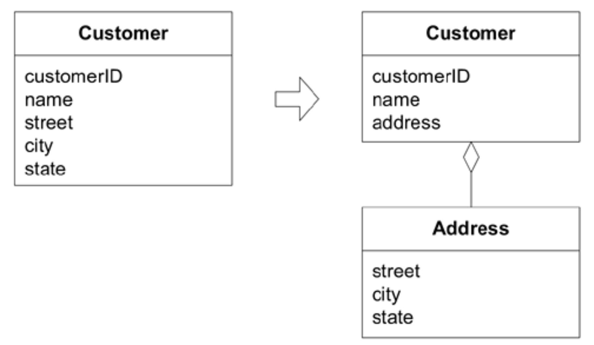

## 值对象：`VALUE OBJECTS`

#### ▶[上一节](2.md)

许多对象没有概念上的标识。这些对象描述了事物的某些特征。

🌼🌼🌼

当孩子在画画时，他会关注所选马克笔的颜色，也可能在意笔尖的锋利度。但若出现两支颜色形状相同的马克笔，他大概不会在意使用哪一支。若一支马克笔丢失，被新包装里同色的笔替换，他也能毫不在意地继续创作。

若询问冰箱上各种画作的作者，孩子能迅速区分出自己和姐姐的作品。他和姐姐拥有明确的标识，他们完成的画作也是如此。但试想若要追踪每幅画中哪些线条出自哪支画笔，情况将变得多么复杂。绘画便不再是孩童的游戏了。

由于模型中最显眼的对象通常是 [ENTITIES](2.md) ，且追踪每个 [ENTITY](2.md) 的标识至关重要，因此为所有领域对象分配标识是自然之选。事实上，某些框架会为每个对象分配唯一 ID。

系统必须承担所有追踪工作，导致许多潜在的性能优化方案被排除。定义有意义的标识并制定万无一失的跨分布式系统或数据库存储的对象追踪方案，需要投入大量分析工作。<ins>同样重要的是，采用人为标识会造成误导，它混淆模型，强迫所有对象套用同一模式。</ins>

<ins>**追踪 [ENTITIES](2.md) 的标识至关重要，但将标识附加到其他对象上会损害系统性能、增加分析工作量，并因使所有对象看起来相同而混淆模型。**</ins>

<ins>**软件设计是一场与复杂性的持久战。我们必须做出区分，确保特殊处理仅在必要时应用。**</ins>

<ins>**然而，若我们将这类对象仅视为标识的缺失，那么我们的工具箱或词汇库便未获得多少增益。事实上，这些对象具有自身特性，并对模型具有独特意义。 *它们正是描述事物的对象* 。**</ins>

表示领域中描述性特征且不具备概念标识的对象称为 [VALUE OBJECT](../glossary.md#value-object) 。[VALUE OBJECTS](../glossary.md#value-object) 被实例化以表示我们关心的设计元素，仅关注它们是 *什么* ，而不关心它们是 *谁* 或 *属于哪一个* 。

---
**
“地址” 是 [VALUE OBJECT](../glossary.md#value-object) 吗？谁在问？
**

在邮购公司的软件中，地址用于确认信用卡信息和包裹寄送。但若室友也向同一公司下单，则无需识别他们身处同一地点。地址是 [VALUE OBJECT](../glossary.md#value-object)。

在用于邮政服务的软件中，为规划投递路线，国家可被划分为区域、城市、邮政区和街区等层级结构，最终细化至具体地址。这些地址对象的邮政编码将继承自层级结构中的上级对象，若邮政部门决定重新划分邮政区，该区域内的所有地址将随之调整。在此，地址被视为 [ENTITY](2.md) 。

在电力公司的软件系统中，地址对应于公司线路和服务的终点。若合租室友各自申请电力服务，公司需要识别这一情况。地址属于 [ENTITY](2.md) 。另一种建模方式是将公用事业服务关联到 “住宅”，一个具有地址属性的 [ENTITY](2.md) 。此时地址则成为 [VALUE OBJECT](../glossary.md#value-object) 。

---

颜色是现代开发系统基础库中提供的 [VALUE OBJECTS](../glossary.md#value-object) 示例之一，字符串和数字亦然。（你不会在意具体是哪一个 “4” 或哪个 “Q” 。）这些基础示例看似简单，但 [VALUE OBJECTS](../glossary.md#value-object) 本身未必简单。例如，色彩混合程序可能采用丰富的模型，其中增强型颜色对象可组合生成新色。这些颜色对象可能通过复杂算法协同运作，最终推导出新的 [VALUE OBJECT](../glossary.md#value-object) 。

<ins>[VALUE OBJECT](../glossary.md#value-object) 可以是由其他对象组成的集合体</ins>。在房屋设计软件中，每种窗户样式都可创建独立对象。这种 “窗户样式” 可与高度、宽度等属性，以及规范这些属性变更组合的规则，共同整合为 “窗户” 对象。这些窗户是构成复杂 [VALUE OBJECTS](../glossary.md#value-object) 的 [VALUE OBJECTS](../glossary.md#value-object) ，进而可被整合到更大的设计元素中，例如 “墙体” 对象。

<ins> [VALUE OBJECTS](../glossary.md#value-object) 甚至可以引用是 [ENTITIES](2.md) </ins>。例如，当我向在线地图服务查询从旧金山到洛杉矶的观光驾驶路线时，它可能会生成一个路线对象，通过太平洋海岸公路连接洛杉矶与旧金山。该路线对象属于值对象范畴，尽管其引用的三个对象（两个城市和一条公路）均为 [ENTITIES](2.md) 。

<ins> [VALUE OBJECTS](../glossary.md#value-object) 常作为参数传递在对象间的消息中</ins>。它们通常具有短暂性，为某项操作创建后即被丢弃。 [VALUE OBJECTS](../glossary.md#value-object) 被用作 [ENTITIES](2.md) （及其他 [VALUES](../glossary.md#value-object) ）的属性。例如，人可被建模为具有标识的 [ENTITY](2.md) ，但该人的姓名则属于 [VALUE](../glossary.md#value-object) 。

<ins>**当你只关注模型元素的属性时，将其归类为 [VALUE OBJECT](../glossary.md#value-object) 值对象。让它表达其所承载属性的含义，并赋予相关功能。将 [VALUE OBJECT](../glossary.md#value-object) 视为不可变的。不要赋予它任何标识，要避免为维护 [ENTITIES](2.md) 所需的设计复杂性。**</ins>

<ins>构成 [VALUE OBJECT](../glossary.md#value-object) 的属性应形成一个概念整体</ins>。[2](#2) 例如，街道、城市和邮政编码不应作为`Person`对象的独立属性存在。它们属于单一完整的地址组成部分，这使得`Person`对象更简洁，形成了更内聚的 [VALUE OBJECT](../glossary.md#value-object) 。

#### Figure 5.6

*Figure 5.6：[VALUE OBJECT](../glossary.md#value-object) 可提供 [ENTITY](2.md) 的相关信息。它在概念上应保持整体性*

🌼🌼🌼

### 设计 [VALUE OBJECTS](../glossary.md#value-object)

我们并不关心某个值对象的具体实例。这种约束的缺失赋予了我们设计自由，可用于简化设计或优化性能。这涉及对复制、共享和不可变性的选择。

若两人姓名相同，这并不意味着他们是同一个人，或可相互替代。但表示该姓名的对象却可互换，因为仅关注姓名的拼写。`Name`对象可从第一个`Person`对象 *复制* 到第二个。

事实上，这两个`Person`对象可能并不需要各自专属的姓名实例。同一个`Name`对象可以被两个`Person`对象共享（每个对象都指向同一个姓名实例），其行为和标识都不会改变。也就是说，只要其中一个人的姓名未被修改，两者的行为都是正确的。但一旦其中一个人的姓名被修改，另一个人的姓名也会随之改变！<ins>为防范此类情况，要安全共享对象，该对象必须 *不可变* ：除非完全替换，否则无法修改。</ins>

<ins>当对象将其属性作为参数或返回值传递给另一个对象时，同样的问题也会出现。</ins>在脱离所有者控制期间，游离对象可能遭遇任何变故。其 [VALUE](../glossary.md#value-object) 可能被修改，以违反所有者不变式的方式，从而损坏所有者数据。<ins>要避免此问题，可通过使传递对象不可变或传递副本两种方式实现。</ins>

<ins>创建额外的性能调优选项至关重要，因为 [VALUE OBJECTS](../glossary.md#value-object) 往往数量庞大。</ins>房屋设计软件的案例便印证了这一点。若将每个电源插座视为独立的 [VALUE OBJECT](../glossary.md#value-object) ，单栋房屋方案中可能存在上百个此类对象。但若将所有插座视为可互换组件，则只需共享一个插座实例并进行百次引用（此即`FLYWEIGHT`模式 [Gamma et al. 1995](../references.md#gamma-1995) 的典型应用）。<ins>在大型系统中，此类效应可成千上万倍放大，而这种优化措施能决定系统是保持可用性，还是因数百万冗余对象而陷入龟速运行。这仅仅是 [ENTITIES](2.md) 无法使用的优化技巧之一。</ins>

复制与共享的经济性取决于具体实施环境。虽然复制可能因海量对象而堵塞系统，共享却会拖慢分布式系统的运行速度。当副本在两台机器间传递时，仅需发送一条消息，且副本在接收端独立存在。但若共享单一实例，则仅传递引用，每次交互都需向对象发送回执消息。

<ins>共享应仅限于以下情况：</ins>
- <ins>数据库空间或对象数量至关重要时</ins>
- <ins>通信开销较低时（如集中式服务器环境）</ins>
- <ins>共享对象严格不可变时</ins>

某些语言和环境允许声明属性或对象的不可变性，而另一些则不支持。此类特性有助于传达设计决策，但并非必需。当前多数工具和编程语言无法在实现中明确声明模型中的诸多区分。例如，你无法声明 [ENTITIES](2.md) 后就自动强制执行标识操作。但概念区分缺乏直接的语言支持，并不意味着该区分毫无价值。这仅意味着需要更强的纪律性来维护那些仅隐含于实现中的规则。可通过命名规范、选择性文档记录及充分讨论来强化这种纪律性。

只要 [VALUE OBJECT](../glossary.md#value-object) 不可变，变更管理就很简单 —— 除了完全替换外不存在任何变更。不可变对象可以自由共享，正如电源插座的例子所示。若垃圾回收机制可靠，删除操作仅需解除所有对象引用即可。当设计中明确标记 [VALUE OBJECT](../glossary.md#value-object) 为不可变时，开发者便能基于纯技术考量自由决策复制与共享等操作，无需担忧应用程序依赖特定对象实例。

---
**
特殊情况：何时允许可变性
**

不可变性极大简化了实现过程，使共享和引用传递变得安全。它也符合值的本质含义。若属性值发生变化，应使用不同的 [VALUE OBJECT](../glossary.md#value-object) 而非修改现有对象。即便如此，<ins>某些场景下出于性能考量仍需允许 [VALUE OBJECT](../glossary.md#value-object) 可变。以下因素将支持采用可变实现：</ins>

- <ins>当 [VALUE](../glossary.md#value-object) 频繁变更时</ins>
- <ins>当对象创建或删除成本较高时</ins>
- <ins>当替换（而非修改）会破坏集群（如前例所述）时</ins>
- <ins>当 [VALUES](../glossary.md#value-object) 共享较少，或为提升集群效果或其他技术原因放弃共享时</ins>

<ins>重申要点：若 [VALUE](../glossary.md#value-object) 实现为可变类型，则 *必须避免* 共享。无论是否存在共享需求，设计 [VALUE OBJECTS](../glossary.md#value-object) 时都应尽可能采用不可变模式。</ins>

---

定义 [VALUE OBJECTS](../glossary.md#value-object) 并将其标记为不可变，<ins>遵循的是一个通用原则：避免在模型中设置不必要的约束，可让开发者专注于纯粹的技术性能调优</ins>。明确界定核心约束条件，则使开发者能在调整设计时避免改变关键行为。此类设计调整通常与特定项目所采用的技术紧密相关。

### 示例

#### 使用 [VALUE OBJECTS](../glossary.md#value-object) 调优数据库

在最底层，数据库必须将数据存储在磁盘的物理位置上，而物理部件的移动和数据读取都需要耗费时间。先进的数据库会尝试将这些物理地址进行聚类，以便通过单次物理操作即可从磁盘中获取相关数据。

若某个对象被多个其他对象引用，其中部分对象不会位于附近（同一页面），这将需要额外的物理操作才能获取数据。通过创建副本而非共享同一实例的引用，作为多个 [ENTITIES](2.md) 属性的 [VALUE OBJECT](../glossary.md#value-object) 可存储在每个使用它的实体所在的同一页面上。这种存储相同数据多个副本的技术称为反规范化 (denormalization)，通常在访问时间比存储空间或维护简便性更关键时使用。

在关系数据库中，您可能希望将特定 [VALUE](../glossary.md#value-object) 直接存储在所属 [ENTITY](2.md) 的表中，而非创建关联指向独立表。在分布式系统中，若在另一服务器上持有 [VALUE OBJECT](../glossary.md#value-object) 的引用，可能会导致消息响应迟缓；此时应将整个对象的副本传递至目标服务器。由于处理的是 [VALUE OBJECTS](../glossary.md#value-object) ，我们可自由创建这些副本。

#### 设计涉及 [VALUE OBJECTS](../glossary.md#value-object) 的关联

<ins>早期关于关联的大部分讨论同样适用于明 [ENTITIES](2.md) 和 [VALUE OBJECTS](../glossary.md#value-object) 。模型中的关联越少越简单越好。</ins>

<ins>然而，尽管 [ENTITIES](2.md) 之间的双向关联可能难以维护，但两个 [VALUE OBJECTS](../glossary.md#value-object) 之间的双向关联根本毫无意义。</ins>没有标识，就无法说一个对象指回指向它的相同 [VALUE OBJECT](../glossary.md#value-object) 是有意义的。最多只能说它指向与指向它的对象相等的对象，但你必须在某个地方强制执行这个不变量。虽然理论上可通过设置双向指针实现，但实际应用中几乎找不到此类设计的合理场景。<ins>请彻底消除 [VALUE OBJECTS](../glossary.md#value-object) 间的双向关联。</ins>若最终模型仍需此类关联，请重新审视将该对象定义为 [VALUE OBJECT](../glossary.md#value-object) 的初始决策，或许它具备尚未被明确识别的标识。

[ENTITIES](2.md) 和 [VALUE OBJECTS](../glossary.md#value-object) 是传统对象模型的主要元素，但务实的设计师们开始使用另一种元素，[SERVICES](4.md) 。……

#### ▶[下一节](4.md)

---
#### 2
`WHOLE VALUE`模式，作者：Ward Cunningham
