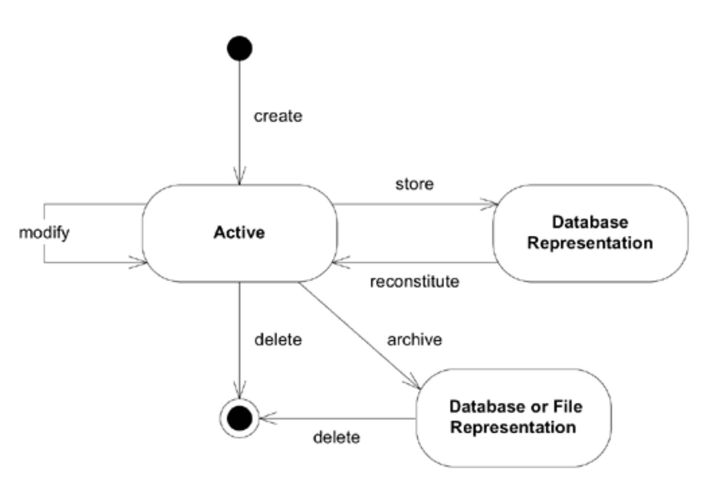

## 第 6 章 领域对象的生命周期

#### ▶[上一节](../ch5/6.md)

每个对象都有其生命周期。对象诞生后，可能经历多种状态，最终通过归档或删除而消亡。当然，其中许多是简单的瞬时对象，通过构造函数轻松创建，用于某些计算，随后便被垃圾回收器回收。这类对象无需复杂化处理。但另一些对象具有更长的生命周期，且并非始终驻留在活动内存中。它们与其他对象存在复杂的相互依赖关系，其状态变化需遵循不变量约束。管理此类对象所面临的挑战，极易使 [MODEL-DRIVEN DESIGN](../ch3/1.md) 的尝试脱轨。

#### Figure 6.1

*Figure 6.1：领域对象的生命周期*

挑战主要分为两类：

1. 在整个生命周期中保持完整性
2. 防止模型因生命周期管理的复杂性而陷入混乱

本章将通过三种模式解决这些问题。首先，`AGGREGATES`模式通过明确定义所有权和边界来强化模型本身，避免对象形成混乱纠缠的网络。该模式对在生命周期所有阶段保持完整性至关重要。

接下来，焦点转向生命周期的起点，利用`FACTORIES`模式创建并重组复杂对象与`AGGREGATES`，同时保持其内部结构的封装。最后，`REPOSITORIES`模式处理生命周期的中段与末段，在封装庞大基础设施的同时，提供查找和检索持久对象的手段。

尽管`AGGREGATES`和`FACTORIES`本身并非源自领域，它们在领域设计中却扮演着重要角色。这些构造通过为模型对象提供可访问的操作接口，完善了 [MODEL-DRIVEN DESIGN](../ch3/1.md) 。

通过建模`AGGREGATES`并在设计中引入`FACTORIES`模式与`REPOSITORIES`模式，我们得以在模型对象整个生命周期内，以系统化且具有实际意义的单元进行操作。`AGGREGATES`划定了生命周期各阶段必须维持不变量的作用域范围。`FACTORIES`模式与`REPOSITORIES`模式则作用于`AGGREGATES`之上，封装了特定生命周期转换过程中的复杂性。

#### ▶[下一节](1.md)
