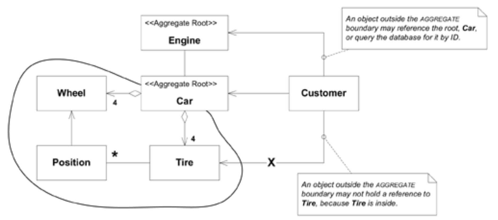
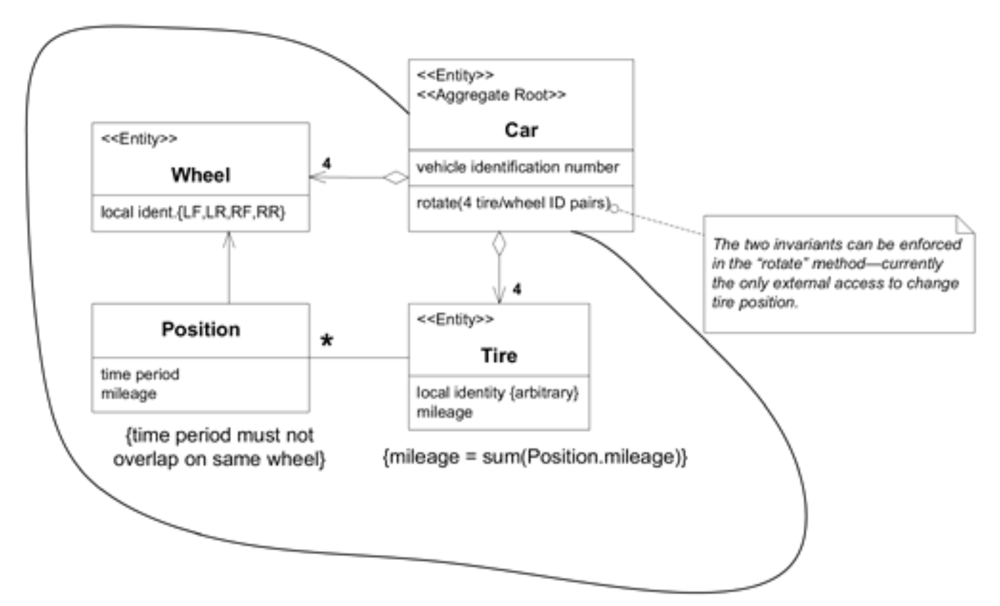
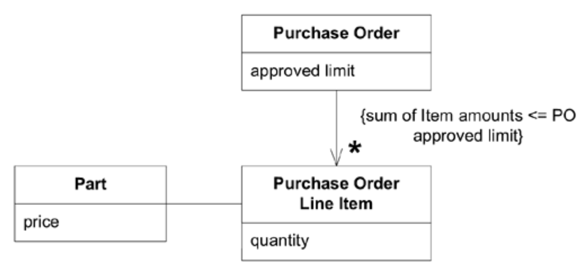
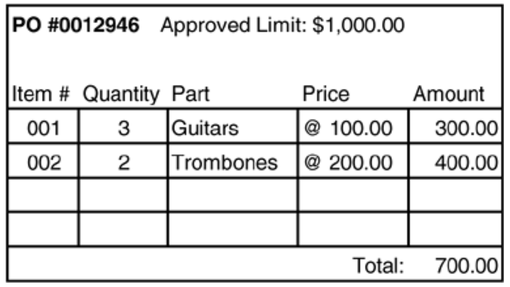
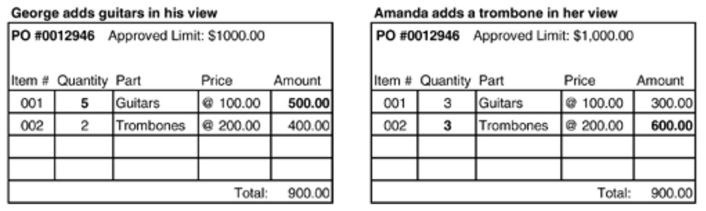
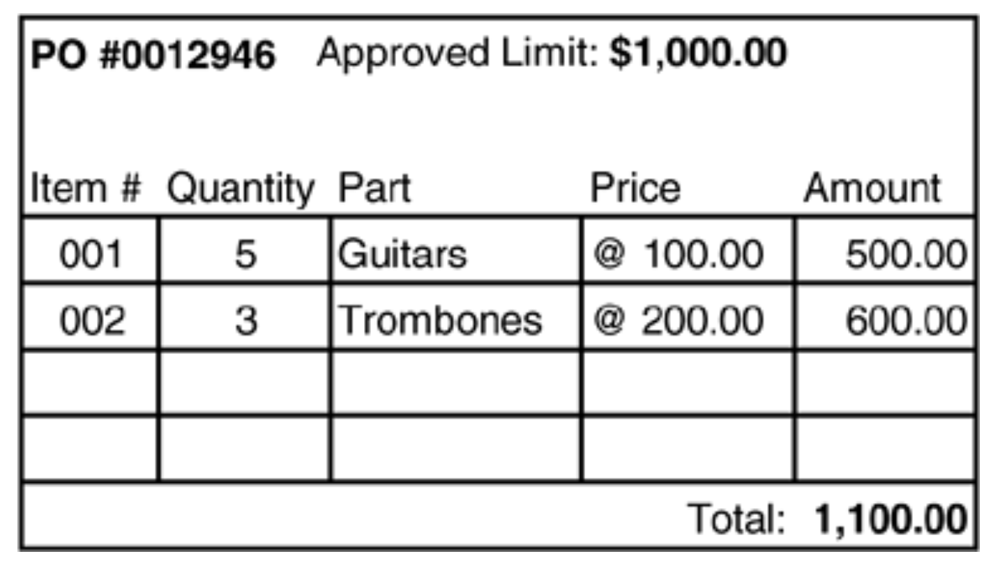
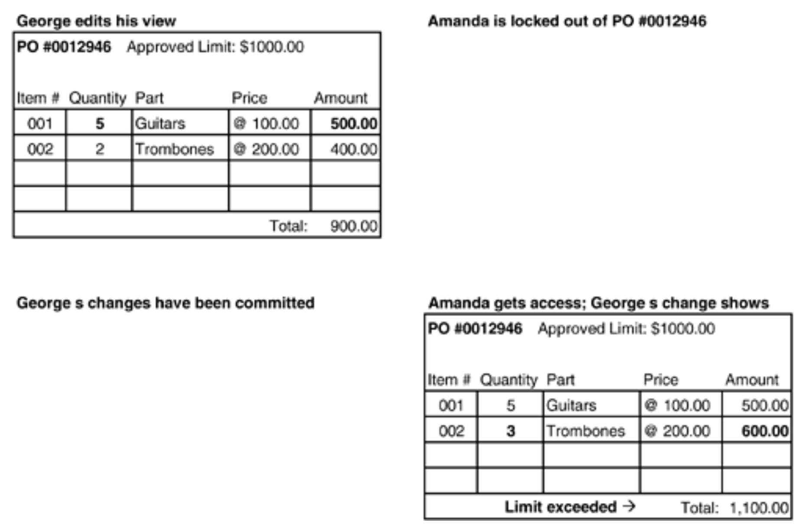
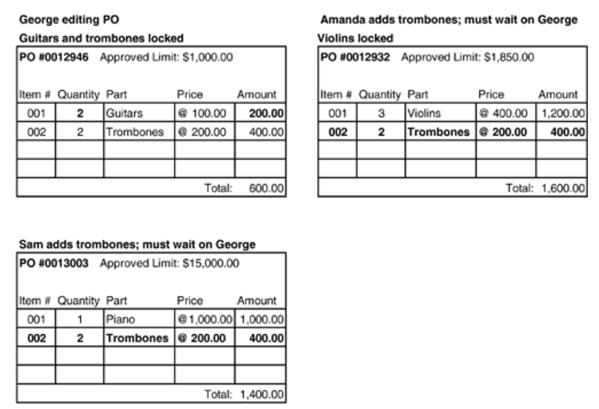
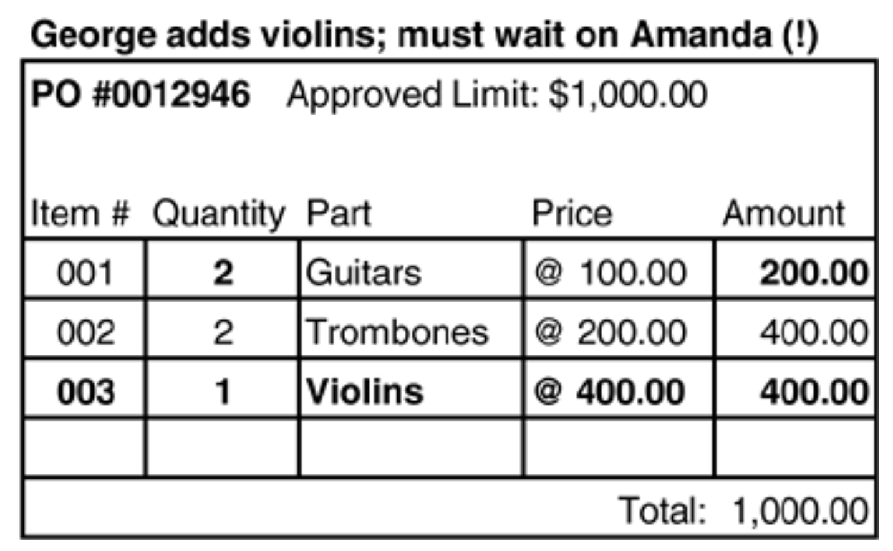
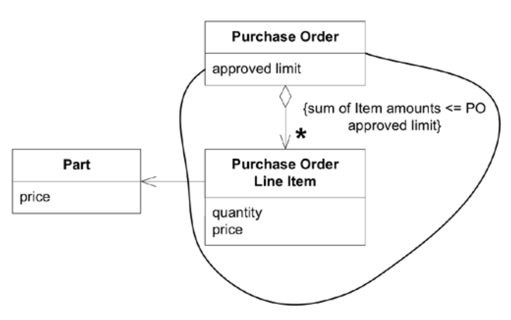

## 聚合体：`AGGREGATE`

#### ▶[上一节](0.md)

关联的极简设计有助于简化遍历并一定程度上限制关系爆炸，但大多数业务领域相互交织的程度如此之深，我们最终仍需通过对象引用追溯漫长而深邃的路径。<ins>某种程度上，这种纠缠恰恰映射了现实世界的本质，现实世界很少为我们划定清晰的边界。这在软件设计中便成了问题。</ins>

假设你要从数据库中删除一个`Person`对象。随着该人物被删除的，还有姓名、出生日期和职位描述。但地址怎么办？同一地址可能还存在其他人员。若删除地址，这些Person对象将指向已删除的对象。若保留地址，数据库中就会积累垃圾地址。自动垃圾回收虽能清除垃圾地址，但这种技术修复方案，即使数据库系统支持，却忽略了基本建模问题。

即使仅考虑单个事务，典型对象模型中的关系网络也无法明确界定变更的潜在影响范围。为防范潜在依赖关系而刷新系统中所有对象的做法并不现实。

在多个客户端并发访问相同对象的系统中，这个问题尤为突出。当大量用户同时查询和更新系统中的不同对象时，我们必须防止相互依赖的对象被同时修改。若范围界定不当，将导致严重后果。

<ins>**在具有复杂关联的模型中，很难保证对象变更的一致性。需要维护的不变量应适用于紧密关联的对象组，而不仅限于独立对象。然而，过分谨慎的锁定机制会导致多用户之间产生无谓的干扰，使系统无法正常使用。**</ins>

<ins>换言之，我们如何确定由多个对象构成的对象的边界？</ins>在任何具有持久化数据存储的系统中，必须为修改数据的事务设定作用域，并确保数据一致性（即保持其不变量）。数据库支持多种锁定机制，测试也可编程实现。但这些临时解决方案会分散对模型的关注，最终仍会陷入临时拼凑的困境。

事实上，要为这类问题找到平衡的解决方案，需要对领域有更深入的理解，这次还需延伸至某些类实例间变更频率等因素。我们需要构建一种模型：在高竞争点处保持宽松，而在严格不变量处保持严格。

<ins>尽管这个问题表现为数据库事务中的技术难题，其根源却在于模型本身 —— 在于模型缺乏明确的边界。基于模型提出的解决方案将使模型更易理解，使设计更易传达</ins>。随着模型的修订，它将引导我们对实现方案进行相应调整。

为在模型中定义所有权关系，已开发出若干方案。以下简明而严谨的系统，正是从这些概念中提炼而成，包含一套用于实现修改对象及其所有者的事务的规则。[1](#1)

首先，我们需要一种抽象概念来封装模型内的引用。[AGGREGATE](../glossary.md#aggregate) 是一组关联对象的集合，我们将其视为数据变更的单元。每个 [AGGREGATE](../glossary.md#aggregate) 都包含根节点和边界。边界定义了 [AGGREGATE](../glossary.md#aggregate) 内部的范围，而根节点则是 [AGGREGATE](../glossary.md#aggregate) 中包含的单个特定 [ENTITY](../ch5/2.md)。根是 [AGGREGATE](../glossary.md#aggregate) 中唯一允许外部对象持有引用的成员，尽管边界内的对象之间可以相互持有引用。除根外的其他 [ENTITIES](../ch5/2.md) 具有本地标识，但该标识仅需在了 [AGGREGATE](../glossary.md#aggregate) 内部可区分，因为任何外部对象都无法在根 [ENTITY](../ch5/2.md) 的上下文之外看到它。

汽车模型可能用于汽车修理店的软件系统。汽车作为具有全局身份的 [ENTITY](../ch5/2.md) ：我们需要将其与世界上所有其他车辆区分开来，即使是极其相似的车辆。为此可使用车辆识别码，每辆新车都分配的唯一标识符。我们可能需要追踪轮胎在四个车轮位置的轮换历史。我们可能需要掌握每条轮胎的里程数和胎面磨损情况。为区分轮胎身份，轮胎本身也需成为可识别的 [ENTITIES](../ch5/2.md) 。但除非处于特定车辆的上下文环境中，否则我们极少关注轮胎本身的身份。若更换轮胎并将旧胎送往回收厂，软件要么彻底停止追踪，要么让它们沦为轮胎堆中的无名成员。无人会关注它们的轮换历史。更关键的是，即便轮胎安装在车辆上，用户也不会通过查询系统定位特定轮胎再追溯其所属车辆，而是先查询车辆信息，再获取轮胎的临时引用。因此，汽车是 [AGGREGATE](../glossary.md#aggregate) 的根 [ENTITY](../ch5/2.md) ，其边界同时包含轮胎。另一方面，发动机缸体刻有独立序列号，有时会脱离汽车单独追踪。在某些应用场景中，发动机可能成为自身 [AGGREGATE](../glossary.md#aggregate) 的根节点。

#### Figure 6.2

*Figure 6.2：局部身份与全局身份以及及对象引用*

不变量 (invariants) 是数据变更时必须维持的一致性规则，涉及 [AGGREGATE](../glossary.md#aggregate) 内成员之间的关系。跨越多个`AGGREGATES`的规则无需时刻保持最新状态。通过事件处理、批处理或其他更新机制，其他依赖关系可在指定时间内解决。但 [AGGREGATE](../glossary.md#aggregate) 内部应用的不变量 (invariants) 将在每次事务 (transaction) 完成时强制执行。

#### Figure 6.3

*Figure 6.3：聚合不变量*

<ins>现在，要将这个概念性的 [AGGREGATE](../glossary.md#aggregate) 转化为具体实现，我们需要一套适用于所有事务的规则：</ins>

- <ins>根 [ENTITY](../ch5/2.md) 具有全局身份，并最终负责检查不变量。</ins>
- <ins>根 [ENTITIES](../ch5/2.md) 具有全局身份。边界内的 [ENTITIES](../ch5/2.md) 具有局部身份，仅在 [AGGREGATE](../glossary.md#aggregate) 内部唯一。</ins>
- <ins>除根 [ENTITY](../ch5/2.md) 外，[AGGREGATE](../glossary.md#aggregate) 界外的任何对象都不能持有内部对象的引用。根 [ENTITY](../ch5/2.md) 可将内部 [ENTITY](../ch5/2.md) 的引用传递给其他对象，但这些对象只能临时使用该引用，且不得保留该引用。根可将 [VALUE OBJECT](../ch5/3.md) 的副本传递给其他对象，其后续状态无关紧要，因该副本仅为 [VALUE](../ch5/3.md) ，不再与 [AGGREGATE](../glossary.md#aggregate) 存在关联。</ins>
- <ins>基于前述规则的推论：仅 [AGGREGATE](../glossary.md#aggregate) 根可通过数据库查询直接获取。其余对象必须通过关联遍历方式定位。</ins>
- <ins>[AGGREGATE](../glossary.md#aggregate) 内的对象可持有对其他 [AGGREGATE](../glossary.md#aggregate) 根节点的引用。</ins>
- <ins>删除操作必须一次性移除 [AGGREGATE](../glossary.md#aggregate) 边界内的所有内容。（借助垃圾回收机制，这很容易实现。由于除根节点外不存在外部引用，删除根节点后其余内容将被回收。）</ins>
- <ins>当 [AGGREGATE](../glossary.md#aggregate) 边界内任何对象的变更被提交时，整个 [AGGREGATE](../glossary.md#aggregate) 的所有不变量都必须得到满足。</ins>

<ins>**将 [ENTITIES](../ch5/2.md) 和 [VALUE OBJECTS](../ch5/3.md) 聚合为`AGGREGATES`，并在每个 [AGGREGATE](../glossary.md#aggregate) 周围定义边界。选择一个 [ENTITY](../ch5/2.md) 作为每个 [AGGREGATE](../glossary.md#aggregate) 的根节点，并通过该根节点控制对边界内所有对象的访问。允许外部对象仅持有对根节点的引用。对内部成员的临时引用仅可在单次操作内传递使用。由于根节点掌控访问权限，内部结构的变更不会对其造成突袭。此种架构使 [AGGREGATE](../glossary.md#aggregate) 中所有对象及 [AGGREGATE](../glossary.md#aggregate) 整体在任何状态变更时，均能切实执行所有不变量约束。**</ins>

拥有一个技术框架来声明`AGGREGATES`，并自动执行锁定方案等操作，将极具价值。若缺乏此类辅助，团队必须具备自律性，在`AGGREGATES`定义上达成共识，并始终如一地遵循这些定义进行编码。

### 示例：采购订单完整性

考虑简化的采购订单系统中可能出现的复杂情况。

#### Figure 6.4

*Figure 6.4：采购订单系统模型*

该图展示了采购订单（PO）的常规视图，将其分解为行条目，并遵循一条不变规则：行条目总和不得超过整个采购订单的限额。现有实现存在三个相互关联的问题。

1. <ins>**不变量强制机制**</ins>。当新增行条目时，PO 会检查总金额，若某项导致超限则标记订单无效。但正如后续所示，这种保护机制并不充分。
2. <ins>**变更管理**</ins>。当 PO 被删除或归档时，其明细条目也会被移除，但模型未提供关于何时停止追踪关联关系的指导。此外，不同时间点更改零件价格的影响也存在混淆。
3. <ins>**数据库共享**</ins>。多用户操作导致数据库出现争用问题。

多个用户将同时输入和更新各种 PO，我们必须防止他们干扰彼此的工作。首先采用一种非常简单的策略：当用户开始编辑某个对象时，该对象将被锁定直至用户提交事务。因此，当乔治编辑行条目 001 时，阿曼达无法访问该条目。她可以编辑其他 PO 中的任意行条目（包括乔治当前处理的 PO 中的其他条目）。

#### Figure 6.5

*Figure 6.5：数据库中存储的 PO 初始状态*

将从数据库中读取对象，并在每个用户的内存空间中实例化。用户可在其中查看和编辑这些对象。仅在编辑开始时才会请求数据库锁定。因此，只要乔治和阿曼达避免操作对方的条目，他们就能并行工作。一切顺利……直到两人开始同时处理同一 PO 中的不同明细条目。

#### Figure 6.6

*Figure 6.6：不同事务中的并发编辑*

对用户和软件而言，此时一切看似正常，因为它们忽略了事务期间数据库其他部分的变更，且被锁定的行条目未涉及对方所做的修改。

#### Figure 6.7

*Figure 6.7：生成的 PO 违反了审批限制（打破不变量）*

当两位用户都保存了修改后，数据库中存储的 PO 违反了领域模型的 invariant。一条重要的业务规则已被打破，而且无人察觉。

显然，仅锁定单个行条目并非充分的保护措施。若改为每次锁定整个 PO，此问题本可避免。

#### Figure 6.8

*Figure 6.8：锁定整个采购订单可确保不变量生效*

程序将禁止保存此事务，直至阿曼达解决问题，例如提高限额或移除某把吉他。该机制能有效预防问题，若工作主要分散在多个 PO 中，这可能是理想方案。但若多人常需同时处理大型 PO 的不同行条目，此类锁定机制将变得繁琐。

即使假设存在许多小型 PO，仍存在其他方式会破坏该断言。考虑`Part`这一概念：若有人在阿曼达添加订单时更改了长号 (trombone) 的价格，这难道不会同样破坏不变量 (invariant) 吗？

让我们尝试在锁定整个 PO 之外，额外锁定部件 (part)。当乔治、阿曼达和山姆分别处理 *不同* PO 时，会发生以下情况：

#### Figure 6.9

*Figure 6.9：过度谨慎的锁定正在干扰人们的工作*

不便之处日益加剧，因为对仪器（即`parts`）的争夺异常激烈。随后：

#### Figure 6.10

*Figure 6.10：死锁*

这三者将陷入长时间的等待。

此时我们可以结合以下业务知识来改进模型：
1. `Parts`被用于多个 PO（高争用）。
2. `Parts`变更频率低于 PO 变更频率。
3. `Part`价格变更未必会自动更新至现有 PO，这取决于价格变更时间与 PO 状态的相对关系。

当涉及已交付的归档 PO 时，第三点尤为明显。此类订单理应显示订单执行时的价格，而非当前价格。

#### Figure 6.11

*Figure 6.11：价格被复制到明细行。现在可以强制执行 [AGGREGATE](../glossary.md#aggregate) 不变性。*

符合此模型的实现将保证 PO 及其条目之间的不变式，而部件价格的变更无需立即影响引用该部件的条目。更广泛的一致性规则可通过其他方式处理。例如，系统可每日向用户展示价格过时的条目队列，供其逐项更新或豁免。但这并非必须时刻强制执行的不变式。通过弱化条目与部件的依赖关系，既可避免争，又能更贴近业务实际。同时，强化 PO 与其行条目的关联性，则确保了关键业务规则的遵循。

[AGGREGATE](../glossary.md#aggregate) 加强了符合商业实践的 PO 及其条目所有权机制。PO 与条目的创建和删除自然绑定，而部件的创建与删除则相互独立。 *（译注：所有权，生命周期，和 Rust 简直太像了。似乎不需要框架，Rust  也能支持 `AGGREGATE`）*

🌼🌼🌼

`AGGREGATES`划定了生命周期各阶段必须维持不变量的作用域。后续模式，`FACTORIES`模式与`REPOSITORIES`模式，均作用于`AGGREGATES`，从而封装了特定生命周期转换过程中的复杂性。……

#### ▶[下一节](2.md)

---
#### 1
David Siegel  于 1990 年代在项目中设计并应用了该系统，但未曾公开发表。

