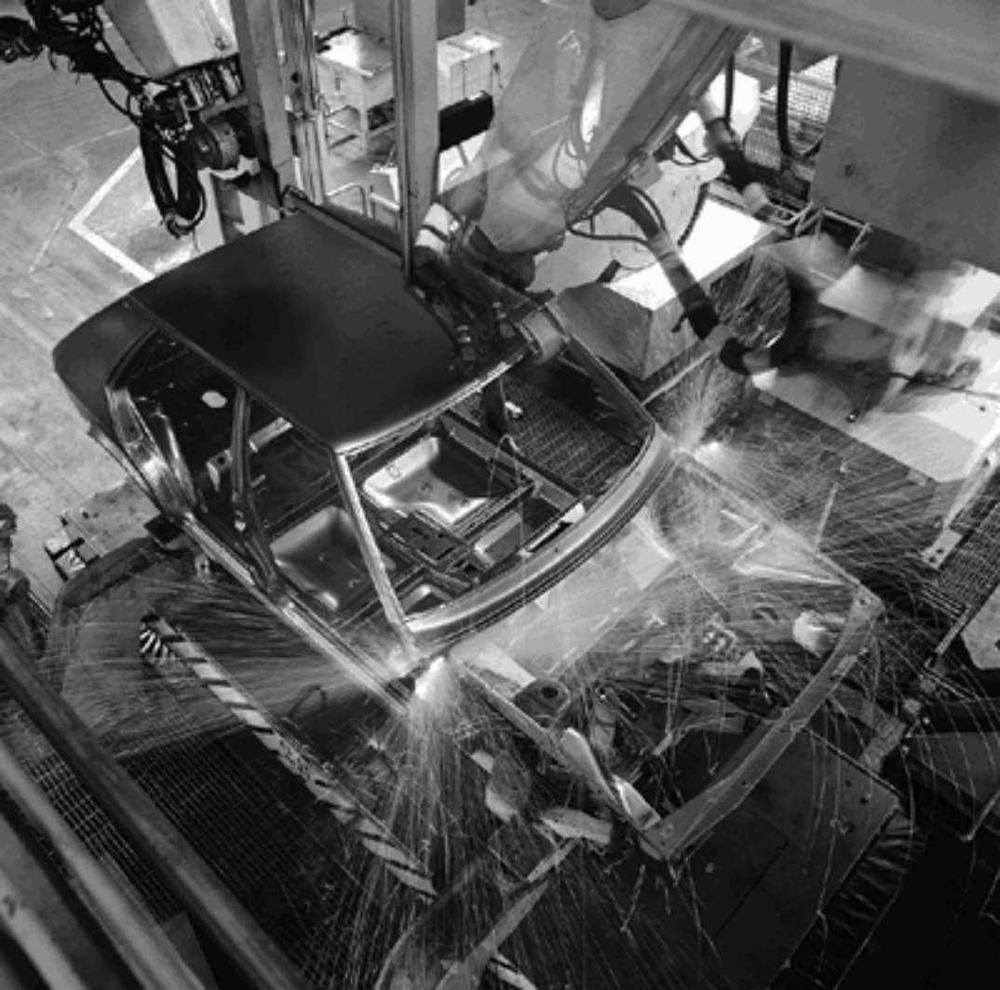
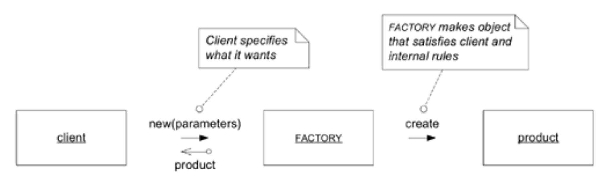
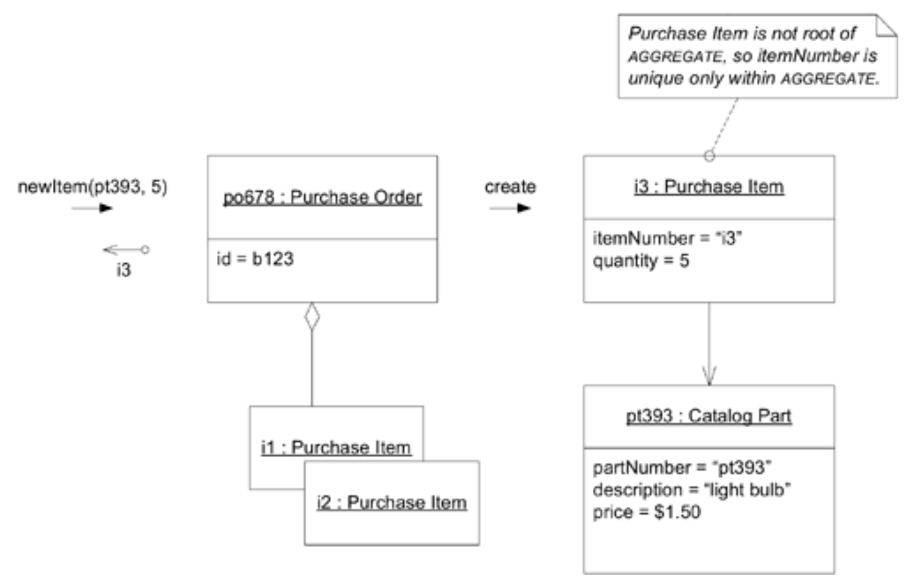
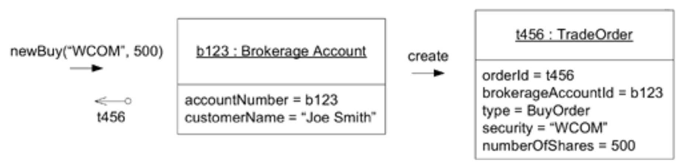
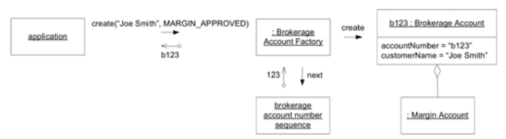
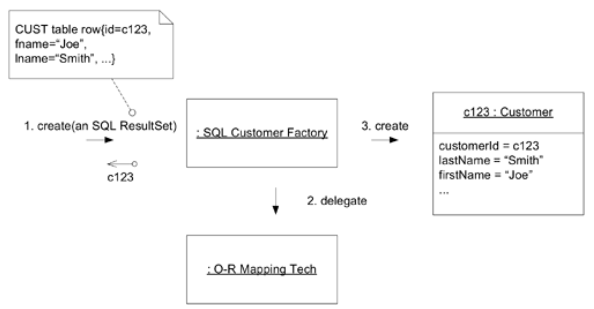
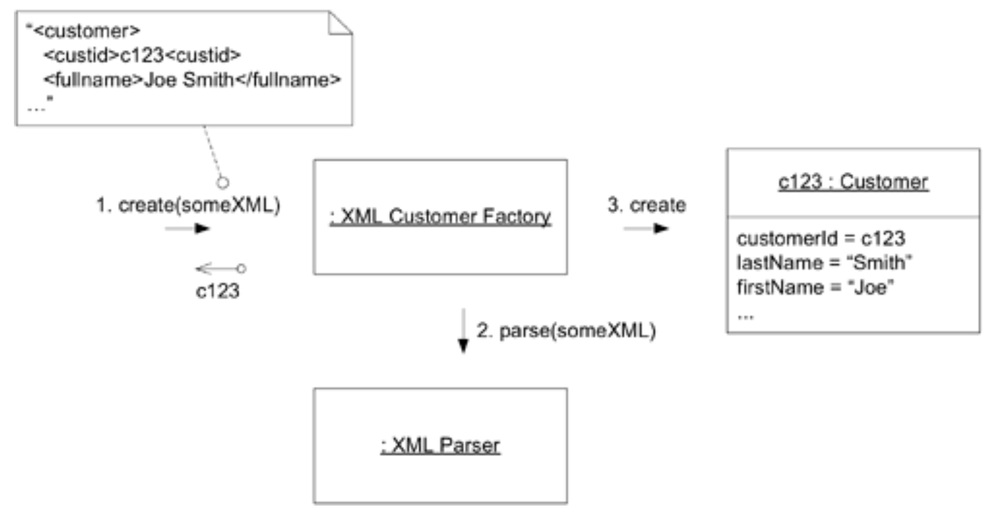

## 工厂

#### ▶[上一节](1.md)

当对象或整个 [AGGREGATE](../glossary.md#aggregate) 的创建变得复杂，或者暴露了过多内部结构时，`FACTORIES`提供了封装。

🌼🌼🌼

对象的大部分力量源于其内部结构的复杂配置及其关联性。一个对象应该被提炼到只保留与其意义相关或支持其交互角色的部分。在其生命周期的中期，这样的责任已经足够。问题出现在给一个复杂对象过多职责，使其必须负责自身的创建。

汽车发动机是精密的机械装置，数十个部件协同运作以完成其核心使命：驱动曲轴转动。试想设计一个能主动抓取活塞组并将其装入气缸的缸体，或是能自行定位并旋入插座的火花塞，但如此复杂的装置，其可靠性与效率恐怕难以匹敌常规引擎。因此我们接受由其他主体完成组装，可能是人类技师，也可能是工业机器人。无论是机器人还是人类，其复杂程度都远超所组装的引擎。零件组装工作与转轴运转功能本就毫无关联。装配者仅在汽车制造过程中发挥作用 —— 驾驶时你无需机器人或技师相伴。正因汽车绝不会在组装与行驶中同时进行，将这两项功能整合于同一机制毫无价值。同样地，组装复杂复合物体的工作，最好与该物体完成后需承担的任务相互分离。

但将责任转移给另一个相关方，应用程序中的客户端对象，会导致更严重的问题。客户端知道需要完成什么任务，并依赖领域对象执行必要的计算。如果要求客户端自行组装所需的领域对象，它就必须了解对象的内部结构。为确保领域对象内部关系的所有不变量成立，客户端必须掌握部分对象规则。即便调用构造函数也会使客户端与其构建对象的具体类产生耦合。此时领域对象的任何实现变更都将引发客户端修改，从而增加重构难度。

客户端承担对象创建职责会导致不必要的复杂性，模糊其职责边界。这破坏了领域对象与正在创建的`AGGREGATES`的封装性。更糟糕的是，若该客户端属于应用层，则职责已完全溢出领域层。这种将应用与具体实现紧密耦合的做法，剥夺了领域层抽象带来的多数优势，并使后续变更成本持续攀升。

<ins>**对象的创建本身可能是一项重大操作，但复杂的组装操作并不属于被创建对象的职责范围。将这些职责混为一谈会导致设计臃肿且难以理解。让客户端直接控制构造过程会模糊客户端的设计，破坏组装对象或 [AGGREGATE](../glossary.md#aggregate) 的封装性，并使客户端过度耦合于被创建对象的实现细节。**</ins>

复杂对象的创建属于领域层的职责，但该任务不应由表达模型的对象承担。某些情况下，对象的创建与组合对应着领域中的重要里程碑，例如 “开设银行账户”。然而对象创建与组合通常在领域中不具实质意义，它们仅是实现层面的必要操作。为解决此问题，我们需在领域设计中引入非`ENTITIES`、非`VALUE OBJECTS`、非`SERVICES`的构造。这与前章理念有所不同，<ins>需明确强调：我们添加的设计元素虽不对应模型中的任何内容，但它们依然属于领域层的职责范畴。</ins>

每种面向对象语言都提供了创建对象的机制（例如 Java 和 C++ 中的构造函数，Smalltalk 中的实例创建类方法），但我们需要更抽象的构造机制，使其与其他对象解耦。负责创建其他对象的程序元素被称为 [FACTORY](../glossary.md#factory) 。

#### Figure 6.12

*Figure 6.12：与 [FACTORY](../glossary.md#factory) 的基本交互*

正如对象的接口应封装其实现，从而允许客户端在不知晓工作原理的情况下使用对象的行为， [FACTORY](../glossary.md#factory) 同样封装了创建复杂对象或 [AGGREGATE](../glossary.md#aggregate) 所需的知识。它提供了一个反映客户端目标的接口，并呈现被创建对象的抽象视图。

因此：

<ins>**将创建复杂对象和`AGGREGATES`的责任转移至独立对象，该对象本身可能在领域模型中不承担任何职责，但仍是领域设计的一部分。提供接口封装所有复杂组装，使客户端无需引用被实例化对象的具体类。将整个`AGGREGATES`作为整体创建，强制执行其不变性。**</ins>

🌼🌼🌼

设计`FACTORIES`模式的方法多种多样。[Gamma et al. 1995](../references.md#gamma-1995) 一书中系统阐述了若干专用创建模式 —— `FACTORY METHOD`、`ABSTRACT FACTORY`和`BUILDER`。该书主要探讨了应对最复杂对象构造问题的模式。本文重点不在深入探讨`FACTORIES`的设计细节，而是阐明`FACTORIES`作为领域设计重要组件的地位。合理运用`FACTORIES`模式有助于确保 [MODEL-DRIVEN DESIGN](../glossary.md#model-driven-design) 始终保持正轨。

任何优质 [FACTORY](../glossary.md#factory) 都需满足两大基本要求：

1. 每个创建方法都是原子操作，并强制执行所创建对象或 [AGGREGATE](../glossary.md#aggregate) 的所有不变量。[FACTORY](../glossary.md#factory) 只能创建处于一致状态的对象。对于 [ENTITY](../glossary.md#entity) 而言，这意味着创建整个 [AGGREGATE](../glossary.md#aggregate) 时所有不变量均已满足，但可能仍有可选元素待添加。对于不可变 [VALUE OBJECT](../glossary.md#value-object) ，则意味着所有属性均已初始化为正确的最终状态。若接口允许请求无法正确创建的对象，则应抛出异常或调用其他机制，确保不可能返回不当值。
2. [FACTORY](../glossary.md#factory) 应抽象为所需类型，而非具体创建的类。[Gamma et al. 1995](../references.md#gamma-1995) 提出的复杂 [FACTORY](../glossary.md#factory) 模式对此有所裨益。

### 选择`FACTORIES`及其位置

通常而言，创建工厂是为了构建需要隐藏细节的对象，并将 [FACTORY](../glossary.md#factory) 放置在需要控制的位置。这些决策通常围绕`AGGREGATES`展开。

例如，若需向现有 [AGGREGATE](../glossary.md#aggregate) 内部添加元素，可在 [AGGREGATE](../glossary.md#aggregate) 根节点创建`FACTORY METHOD`。这既能向外部客户端隐藏 [AGGREGATE](../glossary.md#aggregate) 内部的实现细节，又能让根节点承担元素添加过程中的 [AGGREGATE](../glossary.md#aggregate) 完整性保障责任，如下一页 [Figure 6.13](#figure-613) 所示。

#### Figure 6.13

*Figure 6.13：`FACTORY METHOD`封装 [AGGREGATE](../glossary.md#aggregate) 的扩展*

另一个例子是在某个对象上放置`FACTORY METHOD`，该对象虽不拥有创建后的产物，却与生成该对象密切相关。当某个对象的数据（及可能的规则）在创建过程中占据主导地位时，此设计可避免从生成器中提取信息用于其他地方创建对象。它同时传达了生成器与产物之间的特殊关系。

在 [Figure 6.14](#figure-614) 中，`Trade Order`并不属于与`Brokerage Account`相同的 [AGGREGATE](../glossary.md#aggregate) ，因为，首先它将与交易执行应用程序交互，而`Brokerage Account`只会妨碍这一过程。即便如此，让`Brokerage Account`控制`Trade Orders`的创建似乎是自然的选择。`Brokerage Account`包含将嵌入`Trade Order`的信息（首先是其自身标识），并包含管理允许交易类型的规则。隐藏`Trade Order`交易订单的实现也可能带来益处，例如可将其重构为分层结构，分别创建`Buy Order`和`Sell Order`的子类。[FACTORY](../glossary.md#factory) 模式能避免客户端与具体类产生耦合。

#### Figure 6.14

*Figure 6.14：`FACTORY METHOD`生成不属于同一 [AGGREGATE](../glossary.md#aggregate) 的 [ENTITY](../glossary.md#entity)*

[FACTORY](../glossary.md#factory) 模式与其产品之间存在紧密耦合关系，因此 [FACTORY](../glossary.md#factory) 应仅与产品具有天然紧密关联的对象绑定。当需要隐藏具体实现细节或复杂构造过程，却找不到天然宿主时，就必须创建专用的 [FACTORY](../glossary.md#factory) 对象或 [SERVICE](../glossary.md#service) 对象。独立 [FACTORY](../glossary.md#factory) 通常生成完整的 [AGGREGATE](../glossary.md#aggregate)，分发根节点引用，并确保产品 [AGGREGATE](../glossary.md#aggregate) 的不变性得到强制执行。若 [AGGREGATE](../glossary.md#aggregate) 内部对象需要 [FACTORY](../glossary.md#factory)，且 [AGGREGATE](../glossary.md#aggregate) 根节点不适合作为其归属，则应创建独立 [FACTORY](../glossary.md#factory)。但需遵守 [AGGREGATE](../glossary.md#aggregate) 内部访问限制规则，确保 [AGGREGATE](../glossary.md#aggregate) 外部对产品的引用均为临时引用。

#### Figure 6.15

*Figure 6.15：独立 [FACTORY](../glossary.md#factory) 构建 [AGGREGATE](../glossary.md#aggregate)*

### 当构造函数就是你所需的一切

我见过太多代码，其中所有实例都是通过直接调用类构造函数创建的，或者说直接调用该编程语言最底层的实例创建机制。`FACTORIES`模式的引入具有巨大优势，却普遍被低估。然而在某些情况下，构造函数的直接性使其成为最佳选择。对于不使用多态性的简单对象，`FACTORIES`模式反而可能造成冗余。

在以下情形中，采用纯粹的公共构造函数更具优势：

- 该类即类型本身。它不属于任何有意义的继承层次结构，也不会通过实现接口进行多态使用。
- 客户端关注具体实现，这可能是选择`STRATEGY`的一种方式。
- 对象的所有属性均对客户端可见，因此客户端可见的构造函数内部不会嵌套对象创建逻辑。
- 构造过程不复杂。
- 公有构造函数必须遵循 [FACTORY](../glossary.md#factory) 模式规则：必须是满足被创建对象所有不变量的原子操作。

避免在其他类的构造函数中调用构造函数。构造函数应当极其简单。复杂的组装操作，尤其是`AGGREGATES`，需要`FACTORIES`模式。选择使用小型`FACTORY METHOD`的门槛并不高。

Java 类库提供了有趣的示例。所有集合都实现了接口，从而将客户端与具体实现解耦。然而它们都是通过直接调用构造函数创建的。若采用 [FACTORY](../glossary.md#factory) 模式，本可将集合层次结构封装其中。[FACTORY](../glossary.md#factory) 的方法允许客户端根据需求提出功能要求，由 [FACTORY](../glossary.md#factory) 选择合适的类进行实例化。这样创建集合的代码将更具表达力，且新增集合类时无需破坏现有 Java 程序。

但具体构造函数也有其优势。首先，实现方式的选择对许多应用程序而言可能影响性能，因此应用程序可能需要控制权。（即便如此，真正聪明的 [FACTORY](../glossary.md#factory) 模式也能兼顾这些因素。）况且集合类数量有限，选择起来并不复杂。

抽象集合类型因其使用模式，即便缺乏 [FACTORY](../glossary.md#factory) 方法仍具有一定价值。集合通常在某处创建，却在另一处使用。这意味着最终使用集合的客户端 —— 即添加、移除和检索其内容的客户端 —— 仍可与接口通信，从而与实现解耦。集合类的选择通常由集合的所有者对象或其 [FACTORY](../glossary.md#factory) 负责。

### 设计接口

设计 [FACTORY](../glossary.md#factory) 的方法（无论是独立 [FACTORY](../glossary.md#factory) 还是`FACTORY METHOD`）签名时，请牢记以下两点：

- *每项操作必须具有原子性。* 在与 [FACTORY](../glossary.md#factory) 的单次交互中，必须传递创建完整产品所需的所有参数。同时需明确创建失败时的处理机制，当某些不变条件未满足时，可选择抛出异常或直接返回空值。为保持一致性，建议采用统一的`FACTORIES`失败处理编码规范。
- *[FACTORY](../glossary.md#factory) 模式将与其参数紧密耦合。* 若在输入参数选择上不够谨慎，便可能形成错综复杂的依赖关系。耦合程度取决于参数的处理方式：若参数仅作为最终产品的一部分被直接接入，则形成适度的依赖；若需从参数中提取部分内容用于构造，则耦合度将显著增强。

<ins>最安全的参数来自较低的设计层级。</ins>即使在同一层级内，也存在自然分层结构，基础对象通常被更高层对象所调用。（此类分层机制将在 [第 10 章](../ch10/0.md) "灵活设计" 和 [第 16 章](../ch16/0.md) "大规模结构" 中分别展开讨论。）

<ins>另一个优秀的参数选择是模型中与产品密切相关的对象，这样就不会引入新的依赖关系。</ins>在之前的`Purchase Order Item`示例中，`FACTORY METHOD`将`Catalog Part`作为参数，这是`Item`的基本关联。这在`Purchase Order`类与`Part`之间建立了直接依赖关系。但这三个对象构成了紧密的概念组。`Purchase Order`的 [AGGREGATE](../glossary.md#aggregate) 本就已引用`Part`。因此将控制权交给 [AGGREGATE](../glossary.md#aggregate) 根节点并封装 [AGGREGATE](../glossary.md#aggregate) 的内部结构，实为一种合理的权衡方案。

<ins>使用参数的抽象类型，而非其具体类。</ins>[FACTORY](../glossary.md#factory) 模式与产品的具体类存在耦合关系；它无需同时与具体参数产生耦合。

### 不变逻辑该放在哪里？

[FACTORY](../glossary.md#factory) 负责确保其所创建的对象或 [AGGREGATE](../glossary.md#aggregate) 满足所有不变量；然而，在移除对象外部规则时，你应当三思而后行。[FACTORY](../glossary.md#factory) 可将不变量检查委托给产品，这通常是最佳方案。

但`FACTORIES`模式与其产品存在特殊关系。它们早已洞悉产品的内部结构，其存在意义完全在于实现该产品。在某些情况下，将不变量逻辑置于 [FACTORY](../glossary.md#factory) 模式中并减少产品内部冗余具有优势。这种做法在 [AGGREGATE](../glossary.md#aggregate) 规则（涉及多个对象）中尤为可取，而在附着于其他领域对象的`FACTORY METHOD`中则显得 *格外不妥* 。

尽管原则上不变量应在每次操作结束时生效，但对象允许的转换往往永远无法触发它们。可能存在适用于 [ENTITY](../glossary.md#entity) 标识属性赋值的规则，但该标识在创建后即不可变。`VALUE OBJECTS`则完全不可变。<ins>对象无需携带在其活动生命周期内永远不会被应用的逻辑。在这种情况下，将不变量置于 [FACTORY](../glossary.md#factory) 是更合理的逻辑选择，从而使产品结构更简洁。</ins>

### `ENTITY FACTORIES`与`VALUE OBJECT FACTORIES`

`ENTITY FACTORIES`与`VALUE OBJECT FACTORIES`存在两点差异。<ins>`VALUE OBJECTS`具有不可变性，其产品即为最终完整形态。因此 [FACTORY](../glossary.md#factory) 操作必须支持对产品的完整描述。`ENTITY FACTORIES`则倾向于仅接收构成有效 [AGGREGATE](../glossary.md#aggregate) 所需的核心属性，若非不变性要求，细节可后续补充。</ins>

<ins>[ENTITY](../glossary.md#entity) 身份的分配涉及特殊问题 —— 这与 [VALUE OBJECT](../glossary.md#value-object) 无关。</ins>如 [第 5 章](../ch5/0.md) 所述，标识符可由程序自动分配，也可由外部（通常是用户）提供。若需通过电话号码追踪客户身份，则该号码必须作为参数传递给 [FACTORY](../glossary.md#factory) 。当程序分配标识符时， [FACTORY](../glossary.md#factory) 是控制该过程的理想位置。尽管唯一追踪 ID 的实际生成通常由数据库 “sequence” 或其他基础设施机制完成，但 [FACTORY](../glossary.md#factory) 清楚需要请求什么以及将其放置何处。

### 存储对象的重建

至此，[FACTORY](../glossary.md#factory) 模式已在对象生命周期的最初阶段发挥了作用。多数对象最终会被存储于数据库或通过网络传输，而当前很少有数据库技术能保留内容的对象特性。大多数传输方式会将对象扁平化为更受限的呈现形式。因此，检索过程需要通过复杂的重组操作，将各部分重新组合为可运行的对象。

用于重建的 [FACTORY](../glossary.md#factory) 与用于创建的的 [FACTORY](../glossary.md#factory) 极为相似，主要存在两点差异：

1. *用于重建的`ENTITY FACTORY`不会分配新的跟踪 ID。* 此举将导致对象与先前实例的连续性中断。因此，在 [FACTORY](../glossary.md#factory) 重建存储对象时，标识属性必须作为输入参数的一部分。
2. *[FACTORY](../glossary.md#factory) 在重建对象时会以不同方式处理不变量违背的情况。* 创建新对象时，若不变量未满足，[FACTORY](../glossary.md#factory) 应直接拒绝操作；但在重建过程中则需更灵活的应对策略。若对象已在系统某处存在（如数据库中），则该事实不可忽视；但规则违背同样不容忽视。必须制定修复此类不一致性的策略，这使得对象重建比创建新对象更具挑战性。

[Figure 6.16](#figure-616) 和 [Figure 6.17](#figure-617) 展示了两种重建方式。在数据库重建场景中，对象映射技术可提供部分或全部相关服务，这相当便捷。当从其他媒介重建对象时若存在暴露的复杂性，[FACTORY](../glossary.md#factory) 模式是理想选择。

#### Figure 6.16

*Figure 6.16：从关系数据库检索后 [ENTITY](../glossary.md#entity) 的重建过程*

#### Figure 6.17

*Figure 6.17：以 XML 格式传输的 [ENTITY](../glossary.md#entity) 的重建过程*

总而言之，必须明确实例创建的入口点，并明确定义其作用域。这些入口点可以是简单的构造函数，但通常需要更抽象或更复杂的实例创建机制。这种需求促使设计中引入新构造：`FACTORIES`模式。`FACTORIES`模式通常不表达模型中的任何部分，但作为领域设计的一部分，它们有助于保持模型表达对象的精确性。

[FACTORY](../glossary.md#factory) 模式封装了创建与重组的生命周期转换。另一种暴露技术复杂性的转换是存储的进出转换，这种复杂性可能淹没领域设计。该转换由另一个领域设计构造，[REPOSITORY](../glossary.md#repository) 负责。

#### ▶[下一节](3.md)
