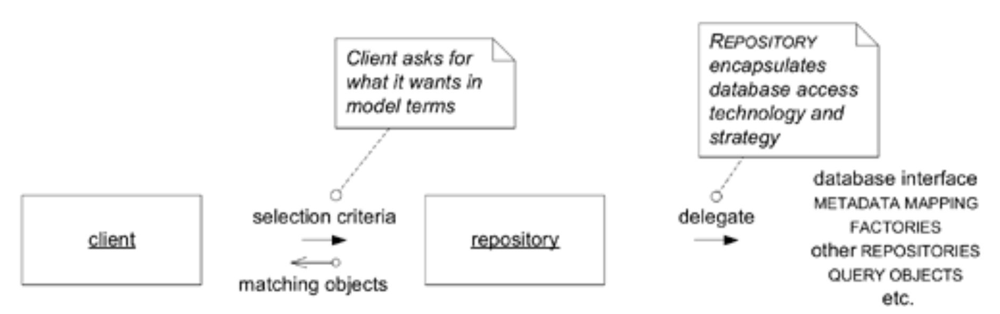
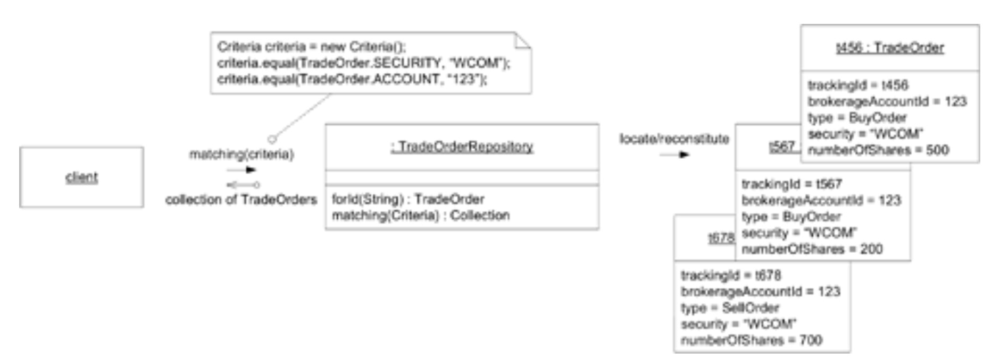
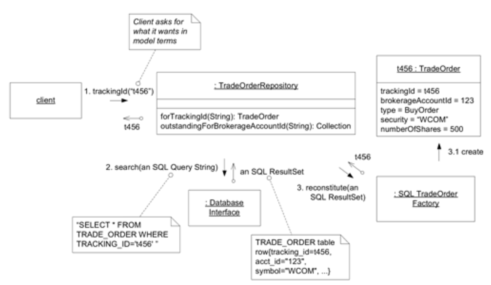
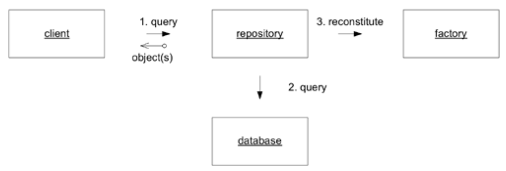
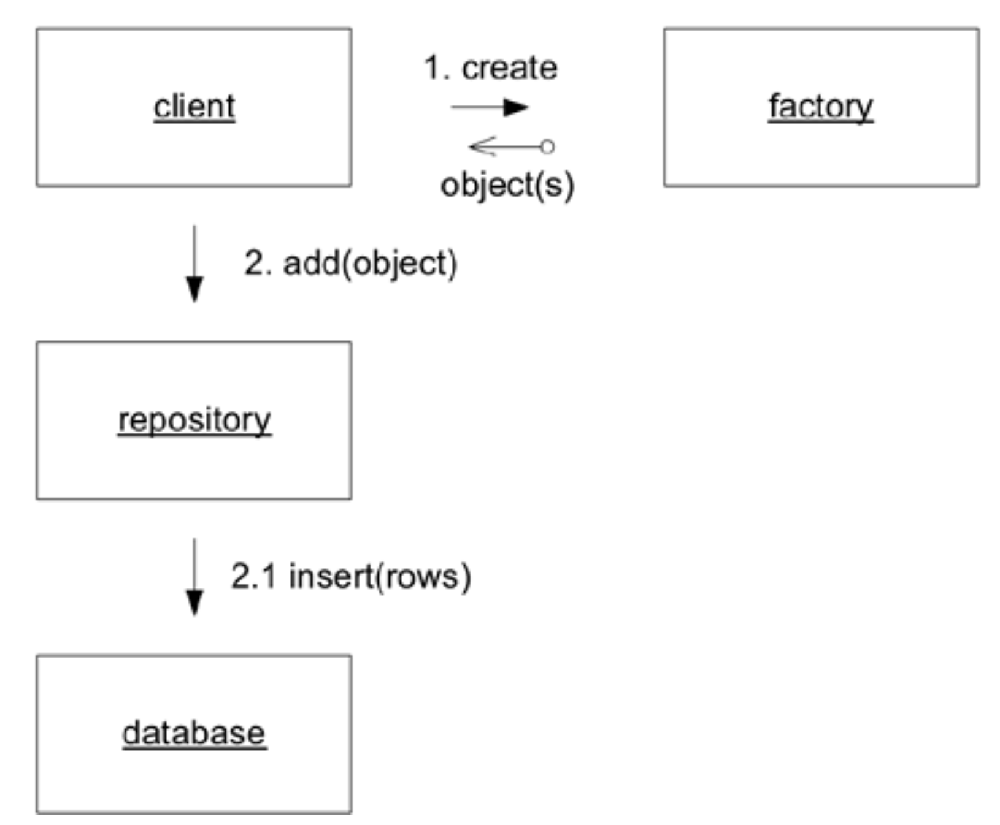

## 存储库：`REPOSITORIES`

#### ▶[上一节](2.md)

*（译注：这张图片和本文内容一点儿都不搭！）*

关联机制使我们能够根据对象与其他对象的关系来定位目标对象。但若要遍历处于生命周期中段的 [ENTITY](../ch5/2.md) 或 [VALUE](../ch5/3.md) ，我们必须设定一个起始点。

🌼🌼🌼

要对某个对象进行任何操作，你必须持有对其的引用。如何获取该引用？一种方式是创建对象，因为创建操作会返回对新对象的引用。另一种方式是遍历关联关系。你从已知的对象出发，向其请求关联对象。任何面向对象的程序都会频繁执行此类操作，这些关联赋予了对象模型强大的表达能力。但关键在于：你必须先获取那个初始对象。

我曾参与过一个项目，团队在热衷于 [MODEL-DRIVEN DESIGN](../ch3/1.md) 的过程中，试图通过创建或遍历操作完成所有对象访问！他们的对象存储在对象数据库中，并认为现有的概念关系能提供所有必要的关联。他们只需充分分析这些关系，就能使整个领域模型保持凝聚性。这种自我设限最终催生了我们前几章竭力规避的无尽纠缠，正是通过谨慎实现 [ENTITIES](../ch5/2.md) 模式并应用`AGGREGATES`模式才能避免的困境。团队成员并未坚持这种策略多久，却始终未能以其他连贯方案替代。他们拼凑出临时解决方案，抱负也日渐消沉。

很少有人会想到这种方法，更不用说被它吸引，因为他们将大部分对象存储在关系数据库中。这种存储技术使得采用第三种获取引用方式变得自然：执行查询以根据对象属性在数据库中查找对象，或者查找对象的组成部分，然后重新构造它。

数据库检索具有全局访问性，可直接定位任意对象。所有对象无需相互关联，这使我们能够保持对象网络的可管理性。采用遍历方式还是依赖搜索机制，成为设计决策的关键，这需要权衡搜索功能的解耦性与关联关系的凝聚力。`Customer`对象是否应存储所有`Order`集合？抑或通过`Customer` ID 字段在数据库中检索`Order`？搜索与关联的合理组合，方能成就清晰可解的设计。

遗憾的是，开发者通常无暇深究此类设计细节，因为他们正深陷于实现对象存储、调用与最终清除存储等机制的汪洋之中。

从技术角度看，检索存储对象实际上是创建操作的子集，因为数据库中的数据被用于组装新对象。事实上，通常需要编写的代码让人难以忽视这一现实。但从概念上讲，这属于 [ENTITY](../ch5/2.md) 生命周期的 *中间* 阶段。客户对象并非因被存储于数据库并被检索出来就代表新客户。为保持这种区分，我将基于存储数据创建实例的过程称为 *重建 (reconstitution)* 。

领域驱动设计的目标是通过聚焦领域模型而非技术本身来构建更优质的软件。当开发者编写 SQL 查询语句、将其传递至基础设施层的查询服务、获取表行结果集、提取必要信息并传递给构造函数或 [FACTORY](../glossary.md#factory) 时，模型焦点早已消失。此时开发者自然倾向于将对象视为查询数据的容器，整个设计逐渐转向数据处理模式。技术细节虽有差异，但核心问题始终存在：客户端处理的是技术实现而非模型概念。`METADATA MAPPING LAYERS`（ [Fowler 2003](../references.md#fowler-2003) ）等基础设施虽能简化查询结果向对象的转换，但开发者仍需关注技术机制而非领域逻辑。更糟的是，当客户端代码直接操作数据库时，开发者往往绕过`AGGREGATES`等模型特性，甚至放弃对象封装，直接提取并操作所需数据。越来越多的领域规则被嵌入查询代码或直接丢失。对象数据库虽消除了转换问题，但检索机制通常仍具机械性，开发者依然倾向于随意抓取所需对象。 *（译注：问题描述的真准确！和我看到的问题完全一样！）*

<ins>**客户端需要一种获取现有领域对象引用的实用手段。若底层架构使此操作变得简单，客户端开发者可能会添加更多可遍历关联，从而混淆模型结构。另一方面，他们可能通过查询从数据库提取所需精确数据，或直接获取特定对象，而非从 [AGGREGATE](../glossary.md#aggregate) 根节点逐层导航。领域逻辑逐渐转移至查询语句和客户端代码中，[ENTITIES](../ch5/2.md) 与 [VALUE OBJECTS](../ch5/3.md) 沦为单纯的数据容器。应用大多数数据库访问基础设施的技术复杂性极快淹没了客户端代码，迫使开发者简化领域层，最终导致模型变得无关紧要。**</ins>

基于前文讨论的设计原则，我们可适当缩小对象访问问题的范围，前提是找到一种能保持模型焦点足够清晰以运用这些原则的访问方式。首先，我们无需关注临时对象。这类对象（通常是 [VALUE OBJECTS](../ch5/3.md) ）生命周期短暂，仅在创建它们的客户端操作中使用后即被丢弃。对于更适合通过遍历查找的持久对象，我们也无需查询访问。例如，可直接向`Person`对象请求个人地址。最重要的是，任何 [AGGREGATE](../glossary.md#aggregate) *内部对象均禁止直接访问， 只能通过从根节点开始的遍历操作* 。

持久化是 [VALUE OBJECTS](../ch5/3.md) 通常通过遍历某个 [ENTITY](../ch5/2.md) 来定位，该 [ENTITY](../ch5/2.md) 作为封装它们的 [AGGREGATE](../glossary.md#aggregate) 的根节点。实际上，对 [VALUE](../ch5/3.md) 进行全局搜索访问往往毫无意义，因为通过属性查找 [VALUE](../ch5/3.md) 等同于创建具有相同属性的新实例。不过存在例外情况。例如在线规划旅行时，我常会保存若干备选行程，稍后再选定其中一个进行预订。这些行程属于 [VALUES](../ch5/3.md) （若两个行程包含相同航班，我并不在意具体对应关系），但它们已被关联至我的用户名并完整检索出来。另一种情况是 “枚举” ，当类型具有严格限定且预先确定的值域时。不过，相较于现 [ENTITIES](../ch5/2.md) ，[VALUE OBJECTS](../ch5/3.md) 的全局访问场景要少得多。若发现需要在数据库中检索预存的 [VALUE](../ch5/3.md) ，不妨考虑是否存在未被识别的 [ENTITY](../ch5/2.md) ，这些对象的身份可能被误判为 [VALUE](../ch5/3.md) 。

从上述讨论可知，大多数对象不应通过全局搜索访问。设计上若能明确标识可被全局访问的对象则更佳。

现在可更精确地重述该问题：

<ins>**持久化对象的子集必须能通过基于对象属性的搜索实现全局访问。此类访问适用于`AGGREGATES`根节点，因其不适合通过遍历方式访问。这类对象通常是实体 [ENTITIES](../ch5/2.md) ，有时是具有复杂内部结构的 [VALUE OBJECTS](../ch5/3.md) ，有时则是枚举 [VALUES](../ch5/3.md) 。向其他对象开放访问权限会模糊关键区分。自由数据库查询实际上会破坏领域对象和`AGGREGATES`的封装性。暴露技术基础设施与数据库访问机制将增加客户端复杂性，并模糊 [MODEL-DRIVEN DESIGN](../ch3/1.md) 的本质。**</ins>

应对数据库访问的技术挑战存在多种技术手段。例如将 SQL 封装为`QUERY OBJECTS`，或通过`METADATA MAPPING LAYERS`实现对象与表之间的转换（ [Fowler 2003](../references.md#fowler-2003) ）。`FACTORIES`模式可协助重建存储对象（详见本章后文）。这些及其他诸多技术手段有助于控制复杂性。

但即便如此，请注意我们所失去的。我们不再思考领域模型中的概念。我们的代码不再传递业务逻辑，而是操纵数据检索的技术细节。[REPOSITORY](../glossary.md#repository) 模式正是为封装这些解决方案而设计的简单概念框架，它能让我们重新聚焦于模型本身。

[REPOSITORY](../glossary.md#repository) 将特定类型的所有对象作为概念集合（通常为模拟实现）进行表示。它类似于集合，但具备更复杂的查询能力。当添加或移除相应类型的对象时，[REPOSITORY](../glossary.md#repository) 背后的机制会将其插入或从数据库中删除。该定义整合了一系列紧密相关的职责，用于在`AGGREGATES`的整个生命周期中提供对其根节点的访问权限。

客户端通过查询方法向 [REPOSITORY](../glossary.md#repository) 请求对象，这些方法根据客户端指定的条件（通常是某些属性的值）来选择对象。[REPOSITORY](../glossary.md#repository) 存储库通过封装数据库查询机制和元数据映射功能，检索客户请求的对象。`REPOSITORIES`可实现多种查询方式，根据客户要求的任意条件筛选对象。它们还能返回汇总信息，例如满足特定条件的实例数量统计，甚至能计算汇总结果，比如所有匹配对象中某个数值属性的总和。

#### Figure 6.18

*Figure 6.18：[REPOSITORY](../glossary.md#repository) 为客户端执行搜索*

[REPOSITORY](../glossary.md#repository) 为客户端卸下了沉重负担，客户端现在只需通过简单直观的接口，以模型为单位提出需求。支撑这一切需要复杂的技术基础设施，但接口本身简洁明了，且在概念上与领域模型紧密关联。

因此：

<ins>**对于需要全局访问的每种对象类型，创建一个能够提供该类型所有对象内存集合假象的对象。通过公认的全局接口设置访问权限。提供添加和移除对象的方法，这些方法将封装数据存储中实际的数据插入或移除操作。提供基于特定条件筛选对象的方法，返回完全实例化的对象或满足条件属性的对象集合，从而封装实际存储与查询技术。仅为真正需要直接访问的 [AGGREGATE](../glossary.md#aggregate) 根提供`REPOSITORIES`。使客户端专注于模型层，将所有对象存储与访问操作委托给`REPOSITORIES`。**</ins>

🌼🌼🌼

`REPOSITORIES`具有诸多优势，包括以下几点：
- 为客户端提供获取持久化对象并管理其生命周期的简化模型
- 将应用程序与领域设计从持久化技术、多种数据库策略甚至多数据源中解耦
- 传达关于对象访问的设计决策
- 支持轻松替换为测试用的虚拟实现（通常采用内存集合）

### 查询 [REPOSITORY](../glossary.md#repository)

所有存储库都提供方法，允许客户端请求符合某些条件的对象，但设计此接口的方式有多种选择。

最易构建的 [REPOSITORY](../glossary.md#repository) 采用硬编码查询，带有特定参数。这些查询形式多样：通过标识符检索 [ENTITIES](../ch5/2.md) （几乎所有`REPOSITORIES`都支持）；根据特定属性值或复杂参数组合请求对象集合；基于数值范围（如日期区间）筛选对象；甚至执行某些属于 [REPOSITORY](../glossary.md#repository) 基本职责的计算操作（尤其依托底层数据库支持的运算功能）。

尽管大多数查询返回的是对象或对象集合，但返回某些类型的汇总计算也符合该概念，例如对象计数，或是模型旨在统计的数值属性之和。

#### Figure 6.19

*Figure 6.19：简单 [REPOSITORY](../glossary.md#repository) 中的硬编码查询*

硬编码查询可在任何基础设施上构建且无需大量投入，因为它们实现的正是某些客户端本就需要完成的功能。

在涉及大量查询的项目中，可构建一个 [REPOSITORY](../glossary.md#repository) 框架以实现更灵活的查询。这需要熟悉相关技术的团队支持，并依赖于完善的辅助基础设施。

通过框架实现`REPOSITORIES`泛化的一个特别恰当的方法是采用基于`SPECIFICATION`的查询。`SPECIFICATION`允许客户端描述（即指定）其需求，而无需关注获取方式。在此过程中，会生成一个能够实际执行选择操作的对象。本模式将在 [第 9 章](../ch9/0.md) 中深入探讨。

#### Figure 6.20

*Figure 6.20：在复杂 [REPOSITORY](../glossary.md#repository) 中对搜索条件进行灵活的声明式 `SPECIFICATION`*

基于`SPECIFICATION`的查询方式既优雅又灵活。根据现有基础设施的不同，它可能是一个简洁的框架，也可能难如登天。Rob Mee 与 Edward Hieatt 在 [Fowler 2003](../references.md#fowler-2003) 中深入探讨了设计此类`REPOSITORIES`涉及的技术问题。

即使采用支持灵活查询的 [REPOSITORY](../glossary.md#repository) 设计，也应允许添加专门的硬编码查询。这些查询可能是封装常用查询的便捷方法，或是不直接返回对象本身的查询，例如对选定对象进行数学运算的摘要。不支持此类特殊情况的框架往往会扭曲领域设计，或被开发人员绕过。

### 客户端代码忽略存储库实现；开发者则不然

持久化技术的封装使客户端得以极简化，与 [REPOSITORY](../glossary.md#repository) 的具体实现完全解耦。但正如封装机制常有的情况，开发者必须理解底层运作机制。当`REPOSITORIES`以不同方式使用或运作时，其性能影响可能极为显著。

Kyle Brown 曾向我讲述过这样一件事：他被召去处理一个基于 WebSphere 的制造应用程序，该系统正准备投入生产环境。然而运行数小时后，系统竟莫名耗尽内存。Kyle 浏览代码后找到了原因：系统在某个环节需要汇总工厂内所有物品的信息。开发人员使用名为 “所有对象” 的查询实现该功能，该查询会实例化每个对象，再从中提取所需数据。这段代码导致整个数据库瞬间被加载到内存中！由于测试数据量小，问题在测试阶段并未显现。

这显然是个禁忌，但更微妙的疏忽同样可能引发严重问题。开发者需要理解封装行为的使用影响，这并不意味着必须精通具体实现细节。设计良好的组件可以被特征化描述（这正是 [第 10 章](../ch10/0.md) "灵活设计" 的核心要点之一）。

正如 [第 5 章](../ch5/0.md) 所述，底层技术可能限制您的建模选择。例如，关系型数据库会对深层组合对象结构设置实际限制。同样地，在使用存储库与实现其查询之间，必须建立双向反馈机制，使开发人员能够及时获取反馈。

## 实现存储库 [REPOSITORY](../glossary.md#repository) 

具体实现方式将因持久化技术和现有基础设施而存在显著差异。理想状态是向客户端隐藏所有内部机制（尽管不会向客户端开发者隐藏），从而确保无论数据存储于对象数据库、关系型数据库还是内存中，客户端代码均保持一致。[REPOSITORY](../glossary.md#repository) 将委托给相应的基础设施服务来完成任务。封装存储、检索和查询机制是 [REPOSITORY](../glossary.md#repository) 实现最基本的功能。

#### Figure 6.21

*Figure 6.21：[REPOSITORY](../glossary.md#repository) 封装底层数据存储*

[REPOSITORY](../glossary.md#repository) 概念适用于多种场景。其实现方式如此多样，我只能列举若干需注意的事项。

- *抽象类型。* [REPOSITORY](../glossary.md#repository) “包含” 特定类型的所有实例，但这并不意味着每个类都需要单独的 [REPOSITORY](../glossary.md#repository) 。该类型可以是层次结构的抽象超类（例如，`TradeOrder`可能是`BuyOrder`或`SellOrder`）。该类型可以是接口，其实现者甚至没有层次关系。或者它可以是具体的实现类。请注意，您很可能面临数据库技术缺乏此类多态性所带来的限制。
- *利用与客户端解耦的优势。* 相较于客户端直接调用机制的情况，您在修改 [REPOSITORY](../glossary.md#repository) 实现时拥有更大自由度。可借此优化性能：通过调整查询技术、在内存中缓存对象，或随时自由切换持久化策略。通过提供易于操作的内存模拟策略，可简化客户端代码与领域对象的测试流程。
- *将事务控制权交给客户端。* 尽管 [REPOSITORY](../glossary.md#repository) 会向数据库插入和删除数据，但通常不会提交任何操作。例如，在保存后提交事务虽颇具诱惑力，但客户端理应具备正确启动并提交工作单元的上下文环境。若 [REPOSITORY](../glossary.md#repository) 保持中立，事务管理将更为简洁。

通常团队会在基础设施层添加一个框架来支持`REPOSITORIES`的实现。除了与底层基础设施组件协作外，[REPOSITORY](../glossary.md#repository) 的基类可能还会实现一些基本查询功能，尤其是在实现灵活查询时。遗憾的是，在 Java 这类类型系统中，此方案会强制将返回对象类型化为`Object`，导致客户端必须将其强制转换为 [REPOSITORY](../glossary.md#repository) 的实际类型。当然，在 Java 中返回集合的查询本就需要进行此类转换。

有关实施`REPOSITORIES`及其部分支持技术模式，如查询对象`QUERY OBJECT`，的补充指导，可参见 [Fowler 2003](../references.md#fowler-2003) 。

### 在现有框架内工作

在实现类似 [REPOSITORY](../glossary.md#repository) 的组件前，你需要仔细考量所采用的基础架构，尤其是任何架构框架。你可能会发现框架本身就提供了可轻松创建 [REPOSITORY](../glossary.md#repository) 的服务，也可能发现框架全程与你作对。你可能会发现，架构框架已定义了获取持久化对象的等效模式。也可能发现它定义的模式与 [REPOSITORY](../glossary.md#repository) 模式截然不同。

例如，您的项目可能采用 J2EE 架构。在框架与 [MODEL-DRIVEN DESIGN](../ch3/1.md) 模式之间寻找概念上的契合点（同时需注意 `entity bean` 与 [ENTITY](../ch5/2.md) 并非同一概念），您可能选择使用`entity bean` 来对应 [AGGREGATE](../glossary.md#aggregate) 根。在 J2EE 架构框架中，负责提供这些对象访问的构造是`EJB Home`。试图将`EJB Home`包装成 [REPOSITORY](../glossary.md#repository) 的方式可能会引发其他问题。

总的来说，不要与框架对抗。当框架与领域驱动设计理念相悖时，应寻求保留领域驱动设计核心原则，同时舍弃具体实现细节。在领域驱动设计概念与框架概念之间寻找契合点。这假设你别无选择只能使用该框架。许多 J2EE 项目根本不使用`entity bean`。若你有选择权，请选用与自身设计风格相契合的框架或框架组件。

### 与工厂的关系

[FACTORY](../glossary.md#factory) 负责对象生命周期的初始阶段；[REPOSITORY](../glossary.md#repository) 则协助管理中间阶段与终结阶段。当对象驻留于内存中或存储于对象数据库时，这一过程较为直接。但通常至少存在部分对象存储于关系型数据库、文件或其他非面向对象系统中。此类情况下，检索到的数据必须重新构造为对象形式。

由于在此情境下，[REPOSITORY](../glossary.md#repository) 是基于数据创建对象的，许多人认为 [REPOSITORY](../glossary.md#repository) 本质上是 [FACTORY](../glossary.md#factory) —— 从技术角度看确实如此。但更有效的方法是将模型置于核心位置。如前所述，存储对象的重建并非创建新的概念对象。在这种领域驱动的设计视角下，`FACTORIES`模式与`REPOSITORIES`模式具有明确的职责分工。[FACTORY](../glossary.md#factory) 负责生成新对象；[REPOSITORY](../glossary.md#repository) 则用于检索旧对象。[REPOSITORY](../glossary.md#repository) 的客户端应获得对象存在于内存中的错觉。对象可能需要被重建（是的，可能创建新实例），但它仍是同一概念对象，仍处于其生命周期之中。

这两种观点可通过让 [REPOSITORY](../glossary.md#repository) 将对象创建委托给 [FACTORY](../glossary.md#factory) 来协调，该 [FACTORY](../glossary.md#factory) （理论上，尽管实践中很少见）也可用于从零创建对象。

#### Figure 6.22

*Figure 6.22：[REPOSITORY](../glossary.md#repository) 使用 [FACTORY](../glossary.md#factory) 来重建预先存在的对象。*

这种清晰的职责分离还通过卸载`FACTORIES`的所有持久化责任来发挥作用。[FACTORY](../glossary.md#factory) 的任务是根据数据实例化可能复杂的对象。若产出为新对象，客户端将知晓此情况并可将其添加至 [REPOSITORY](../glossary.md#repository) ，后者将封装该对象在数据库中的存储操作。

#### Figure 6.23

*Figure 6.23：客户端使用 [REPOSITORY](../glossary.md#repository) 存储新对象。*

另一种促使人们将 [FACTORY](../glossary.md#factory) 工厂模式与 [REPOSITORY](../glossary.md#repository) 仓库模式结合的情况，是出于对 “查找或创建” 功能的需求，客户端可描述所需对象，若不存在则返回新创建的对象。这种功能应避免使用，其便利性至多微乎其微。当 [ENTITIES](../ch5/2.md) 与 [VALUE OBJECTS](../ch5/3.md) 得到明确区分后，许多看似有用的场景便不复存在。需要 [VALUE OBJECT](../ch5/3.md) 的客户端可直接向 [FACTORY](../glossary.md#factory) 请求新建对象。通常领域中新建对象与现有对象的区别至关重要，而透明地混用两者的框架反而会混淆实际情况。

#### ▶[下一节](4.md)
