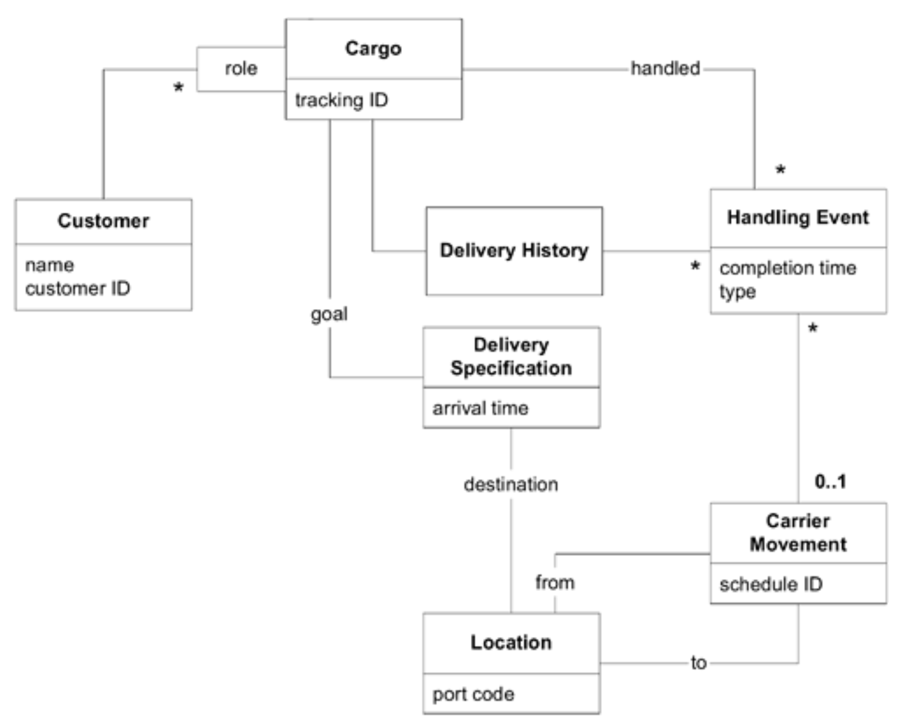

## 货运系统介绍

#### ▶[上一节](0.md)

我们正在为一家货运公司开发新软件。初期需求包含三项基本功能：

1. 追踪客户货物的关键处理环节
2. 提前预订货物运输
3. 当货物处理至特定节点时自动向客户发送发票

在实际项目中，要达到这种模型的清晰度需要花费时间并经过多次迭代。本书 [第三部分](../part3.md) 将深入探讨发现过程。但在此我们先从一个具备必要概念且形式合理的模型开始，重点聚焦于优化细节以支持设计工作。

#### Figure 7.1

*Figure 7.1：货运领域模型类图*

* 该模型系统化了领域知识，为团队提供了统一语言。我们可据此表述：
  - “多个`Customer`参与`Cargo`运输，各自承担不同 *role*。”
  - “`Cargo`交付 *goal* 已明确规定。”
  - “满足`Specification`要求的一系列`Carrier Movements`将实现交付 *goal*。”

模型中的每个对象都具有明确的含义：

`Handling Event`是对`Cargo`执行的离散操作，例如装船或通关。该类可能细分为不同事件的层次结构，如装货、卸货或收货人提货。

`Delivery Specification`定义了交付目标，至少包含目的地和到达日期，但也可更为复杂。该类遵循`SPECIFICATION`模式（参见 [第 9 章](../ch9/0.md) ）。

此职责本可由`Cargo`对象承担，但`Delivery Specification`的抽象化至少带来三大优势：

1. 若没有`Delivery Specification`，`Cargo`对象将需要承担所有用于指定交付目标的属性与关联的具体含义。这会使货物对象变得臃肿，难以理解或修改。
2. 这种抽象化处理使得在解释整体模型时能够轻松且安全地忽略细节。例如，`Delivery Specification`中可能封装了其他条件 (criteria)，但此级别的图示无需展示这些细节。该图向读者传达的是：存在一套`SPECIFICATION`，其具体细节无需深究（实际上这些细节日后也可能轻易变更）。
3. 该模型更具表达力。添加`Delivery Specification`明确表明：`Cargo`的具体运输方式尚未确定，但必须达成`Delivery Specification`中设定的目标。

*role* 用于区分`Customers`在运输过程中承担的不同职责。例如某客户担任 “托运人”，某客户担任 “收货人”，某客户担任 “付款人” 等等。由于特定`Cargo`仅能由一位`Customer`承担特定角色，这种关联关系便成为有条件的 “多对一” 而非 “多对多”。*role* 可简单实现为字符串类型，若需其他行为则可设计为类。

`Carrier Movements`指特定`Carrier`（如卡车或船舶）从某一`Location`到另一`Location`的单次运输。`Cargoes`可由`Carriers`装载，在一次或多次`Carrier Movements`中实现地点间的转移。

`Delivery History`反映`Cargo`实际经历的状态，而`Delivery Specification`则描述预期目标。`Delivery History`对象可通过分析最近的装卸操作及对应`Carrier Movement`的目的地，计算出`Cargo`的当前`Location`。成功的交付将以满足`Delivery Specification`目标的`Delivery History`为终结。

要实现上述需求所需的所有概念均已包含在此模型中，前提是存在适当的机制来持久化对象、查找相关对象等。此类实现问题虽未在模型中处理，但必须纳入设计范畴。

为构建稳固的实现方案，该模型仍需进一步明确和完善。

请记住，通常在迭代开发过程中，模型优化、设计与实现应同步推进。但本章为阐释清晰，我们从相对成熟的模型起步，后续调整将严格基于将该模型与实际实现对接的需求，并运用构建块模式进行改造。

通常，随着模型不断优化以更好地支持设计，它也应同步完善以反映对领域的新认知。但本章为阐释清晰起见，所有变更将严格基于与实际实现对接的需求，并采用构建块模式进行实施。

#### ▶[下一节](2.md)
