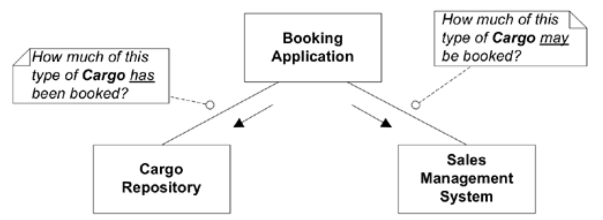
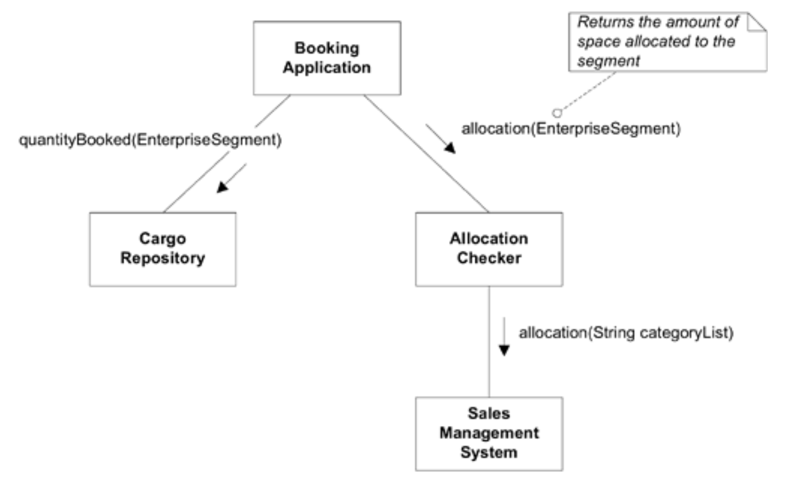
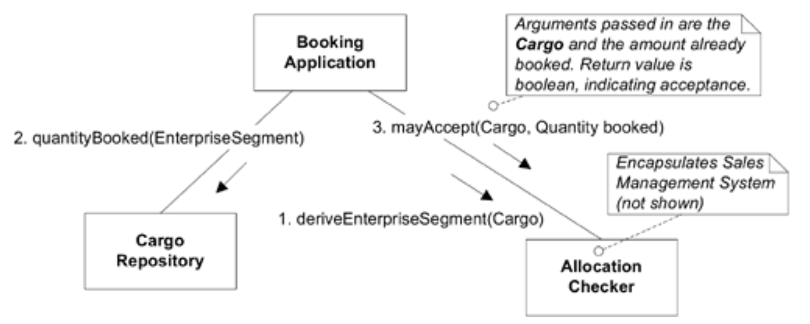

## 推出新功能：分配检查

#### ▶[上一节](10.md)

至此，我们一直基于初始需求和模型开展工作。现在，首批主要新功能即将加入。

这家虚拟航运公司的销售部门使用其他软件来管理客户关系、销售预测等事务。其中一项功能通过收益管理机制，支持企业根据货物类型、起运地与目的地，或任何可作为类别名称输入的自定义因素，分配各类货物的承运目标。这些构成各类货物的销售目标，既确保利润较高的业务不会被低利润货物挤占，同时避免出现承运不足（未能充分利用运力）或过度超额承运（频繁拒载货物导致客户关系恶化）的情况。

现在他们希望将此功能与预订系统集成。当收到预订时，需要根据这些分配情况进行核对，以确定是否应接受该预订。

所需信息存储于两个位置，`Booking Application`必须查询这两个位置，才能决定接受或拒绝所请求的预订。信息流的总体示意图大致如下所示。

#### Figure 7.9

*Figure 7.9：我们的`Booking Application`必须使用来自`Sales Management System`和我们自身领域`REPOSITORIES`的信息。*

### 连接两个系统

<ins>`Sales Management System`并非基于我们当前采用的模型构建。若`Booking Application`直接与其交互，我们的应用将不得不适应对方系统的设计，这将使保持清晰的 [MODEL-DRIVEN DESIGN](../glossary.md#model-driven-design) 变得困难，并混淆 [UBIQUITOUS LANGUAGE](../ch2/1.md) </ins>。因此，我们应创建一个专门类，负责在我们的模型与`Sales Management System`语言之间进行转换。该类并非通用转换机制，仅暴露本应用所需的功能，并将其重新抽象为领域模型术语。此类将作为`ANTICORRUPTION LAYER`（详见 [第 14 章](../ch14/0.md) ）发挥作用。

这是`Sales Management System`的一个接口，因此我们可能会首先考虑将其命名为`Sales Management Interface`。<ins>但这样做会错失一个机会，即通过语言重新定义问题，使其更符合我们的需求。</ins>相反，我们应该为需要从其他系统获取的每个分配功能定义一个 [SERVICE](../glossary.md#service) 。我们将使用一个类来实现这些`SERVICES`，其名称应反映其在系统中的职责：`Allocation Checker`。

若需其他集成（例如使用`Sales Management System`客户数据库替代我们自身的`Customer` [REPOSITORY](../glossary.md#repository) ），可创建另一个转换器，承担该职责的`SERVICES`。此时仍可设置`Sales Management System Interface`这类底层类，来处理与外部程序的通信机制，但该类不负责数据转换。此外，该接口将隐藏在`Allocation Checker`后面，因此不会出现在领域设计中。

### 增强模型：业务分段

既然我们已概述了两个系统的交互方式，那么我们将提供何种接口来回答 “此类`Cargo`可预订多少？” 的问题。棘手之处在于定义`Cargo`的 “类型”，因为我们的领域模型尚未对`Cargoes`进行分类。在`Sales Management System`中，`Cargo`类型仅是一组分类关键词，我们本可直接采用该列表作为类型标准，将字符串集合作为参数传递。<ins>但这将错失另一次机会：重新抽象另一系统的领域模型。我们需要丰富领域模型，使其承载货物分类的知识。应与领域专家共同探讨，确立新的概念。</ins>

有时（如 [第 11 章](../ch11/0.md) 将讨论的），[analysis pattern](../glossary.md#analysis-pattern) 能为建模方案提供思路。《分析模式》（ [Fowler 1996](../references.md#fowler-1997) ）一书描述了处理此类问题的模式：`ENTERPRISE SEGMENT`。`ENTERPRISE SEGMENT`是一组维度，用于定义业务的分解方式。这些维度既可包含航运业务中已提及的所有维度，也可包含时间维度，如当月累计。在分配模型中应用该概念能增强模型表达力并简化接口。领域模型中将新增名为`Enterprise Segment`的类，作为额外的 [VALUE OBJECT](../glossary.md#value-object) 设计，该对象需为每批`Cargo`派生创建。

#### Figure 7.10

*Figure 7.10：`Allocation Checker`作为`ANTICORRUPTION LAYER`，在领域模型层面为`Sales Management System`提供了一个选择性接口。*

`Allocation Checker`将实现`Enterprise Segments`与外部系统类别名称之间的转换。`Cargo Repository`还必须提供基于`Enterprise Segment`的查询功能。在两种情况下，均可通过与`Enterprise Segment`对象协作来执行操作，既不破坏`Segment`的封装性，也不会增加自身实现的复杂度。（需注意`Cargo Repository`返回的是计数查询结果，而非实例集合。）

该设计仍存在若干问题：
1. 我们让`Booking Application`承担了执行业务规则的职责：“当`Enterprise Segment`的分配空间大于已预订货物总量与新`Cargo`量之和时，接受该`Cargo`”。业务规则的执行属于领域职责，不应在应用层完成。
2. `Booking Application`如何推导`Enterprise Segment`尚不明确。

这两项职责似乎都属于`Allocation Checker`。修改其接口可以将这两项`SERVICES`分离，使交互关系清晰明确。

#### Figure 7.11

*Figure 7.11：领域职责从`Booking Application`转移至`Allocation Checker`*

此次集成带来的唯一实质性限制在于：`Sales Management System`不得使用`Allocation Checker`无法转换为`Enterprise Segment`的维度。（若不采用`ENTERPRISE SEGMENT`，该限制将迫使销售系统仅使用可用于查询`Cargo Repository`的维度。） 此方案虽可行，但销售系统会渗透到领域其他部分。本设计中，`Cargo Repository`只需处理`Enterprise Segment`，销售系统的变更影响仅波及`Allocation Checker`，该组件最初就被设计为`FACADE`。）

### 性能调优

尽管`Allocation Checker`的接口是唯一涉及领域设计其他部分的组件，但其内部实现仍可能为解决性能问题提供机会，如果出现性能问题的话。例如，若`Sales Management System`运行在另一台服务器上，可能位于不同地点，通信开销可能相当可观，且每次分配检查都需要进行两次消息交换。第二条消息无可替代，它必须调用`Sales Management System`来回答核心问题：是否应接收特定货物。但首条消息，用于推导货物的`Enterprise Segment`，所依据的数据和行为，相较于分配决策本身而言相对静态。一种设计方案是缓存这些信息，使其能迁移至`Allocation Checker`所在的服务器，从而将消息传递开销减半。这种灵活性需付出代价：设计复杂度增加，且必须确保数据副本保持同步更新。但在分布式系统中，当性能成为关键考量时，灵活部署便成为重要的设计目标。

#### ▶[下一节](12.md)
