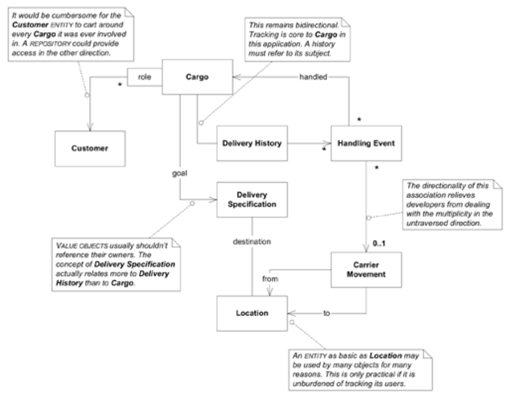

## 设计航运领域的关联关系

#### ▶[上一节](3.md)

原始图中的关联关系均未指定遍历方向，但双向关联在设计中存在问题。<ins>此外，遍历方向往往能捕捉领域洞见，从而深化模型本身。</ins>

若`Customer`与每件运输的`Cargo`建立直接引用，对长期多次合作的`Customers`而言将造成负担。
此外，`Customer`概念并非仅限于`Cargo`。
在大型系统中，`Customer`可能与众多对象扮演不同角色。
最好避免将其与具体职责綁死。
若需按`Customer`查找`Cargoes`，可通过数据库查询实现。
本章后续章节将回到此议题，在 [REPOSITORIES](../ch6/3.md) 部分进行探讨。

如果我们的应用程序需要追踪船舶库存，那么从`Carrier Movement`到`Handling Event`的遍历就至关重要。
但我们的业务只需追踪`Cargo`。
因此仅允许从`Handling Event`到`Carrier Movement`的关联遍历，这样就抓住了对业务的理解。
这种设计还将实现简化为简单的对象引用，因为多向关联的方向性已被禁止。

其余决策的依据详见下一页的 [Figure 7.2](#figure-72) 。

#### Figure 7.2

*已限制某些关联关系的遍历方向*

我们的模型中存在一个循环引用：`Cargo`知道其`Delivery History`，该历史包含一系列`Handling Events`，而这些事件又指向`Cargo`本身。
<ins>循环引用在许多领域都客观存在，有时在设计中也是必要的，但维护起来颇为棘手。
通过避免在两个必须保持同步的地方持有相同的信息，实现选择可以提供帮助</ins>。
当前方案可在初始原型中采用简单但脆弱的 Java 实现：让`Delivery History`持有包含`Handling Events`的`List`对象。
但后续很可能需要弃用集合，转而采用以`Cargo`为键的数据库查询。
该讨论将在选择 [REPOSITORIES](../ch6/3.md) 时再次展开。
若查询历史记录的频率较低，此方案能提升性能、简化维护并降低添加`Handling Events`的开销；
若查询频率极高，则应继续维护直接指针。
这些设计权衡在实现简易性与性能之间寻求平衡。模型结构保持不变，仍包含循环结构与双向关联。

#### ▶[下一节](5.md)
