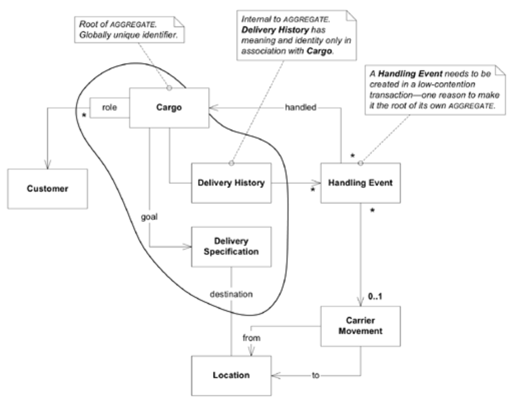

## `AGGREGATE` 边界

#### ▶[上一节](4.md)

`Customer`、`Location`和`Carrier Movement`各自具有独立标识，且被多个`Cargoes`共享，因此必须成为各自 [AGGREGATES](../ch6/1.md) 的根节点，这些 [AGGREGATES](../ch6/1.md) 包含其属性，并可能包含其他位于本讨论细节层级之下的对象。`Cargo`同样是显而易见的 [AGGREGATE](../ch6/1.md) 根节点，但边界划分需审慎考量。

`Cargo` [AGGREGATE](../ch6/1.md) 能够涵盖所有因特定`Cargo`而存在的关联信息，包括`Delivery History`、`Delivery Specification`及`Handling Events`。这恰好适用于`Delivery History`。没有人会直接查询`Delivery History`而不需要`Cargo`本身。由于无需直接全局访问，且其标识本质上只是从`Cargo`派生而来，`Delivery History`自然适合置于`Cargo`的边界内，无需成为根实体。`Delivery Specification`属于 [VALUE OBJECT](../ch5/3.md) ，因此将其纳入`Cargo` [AGGREGATE](../ch6/1.md) 不会产生复杂性。

`Handling Event`则是另一回事。此前我们曾探讨过两种可能的数据库查询方式来检索这些事件：其一，为寻找某次`Delivery History`的`Handling Events`作为集合的替代方案，该查询将在`Cargo` [AGGREGATE](../ch6/1.md) 内进行；<ins>其二，用于查找特定`Carrier Movement`的所有装载与准备操作。在第二种情况下，`Cargo` *处理* 活动似乎具有独立于`Cargo`本身的意义。因此，`Handling Event`应成为其自身 [AGGREGATE](../ch6/1.md) 的根节点。</ins>

#### Figure 7.3

*施加在模型上的 [AGGREGATE](../ch6/1.md) 边界。（注：位于绘制边界外的 [ENTITY](../ch5/2.md) 默认作为其自身 [AGGREGATE](../ch6/1.md) 的根节点。）*

#### ▶[下一节](6.md)
