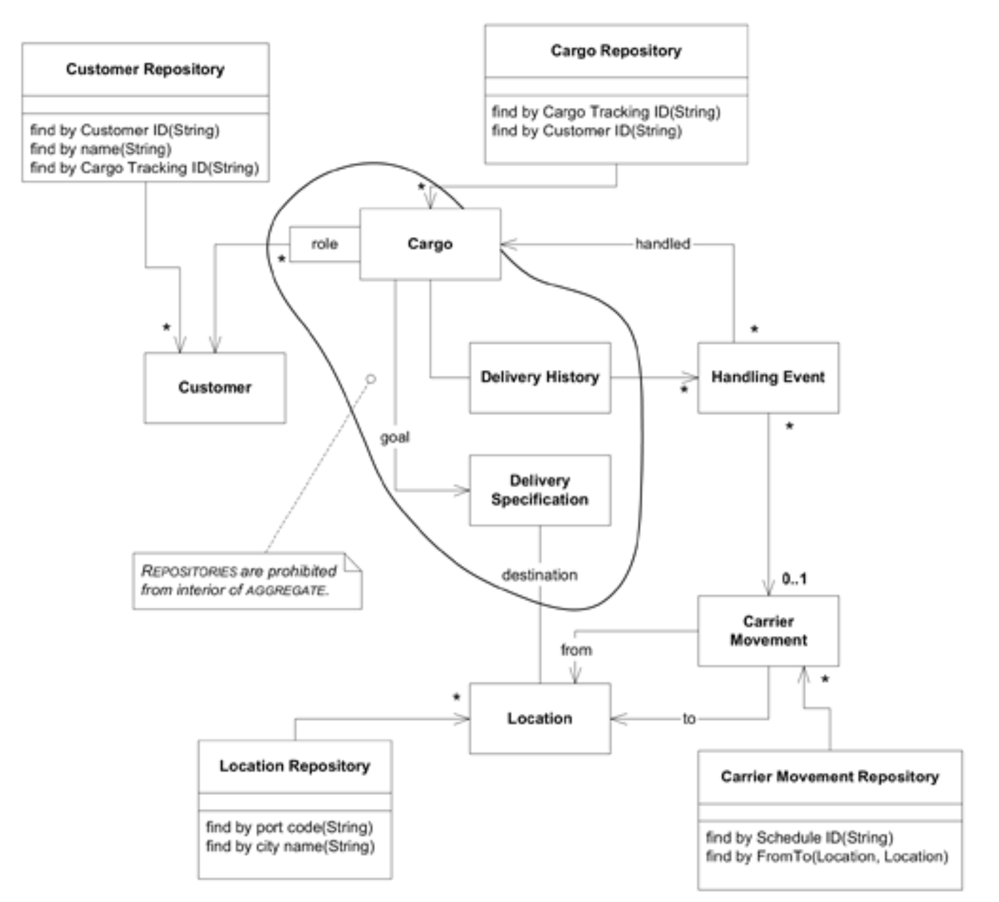

## 选择`REPOSITORIES`

#### ▶[上一节](5.md)

设计中有五个`ENTITIES`作为`AGGREGATES`的根节点，因此我们可以将考虑范围限定于这些实体，因为其他对象均不允许拥有`REPOSITORIES`。

要确定哪些候选项应实际拥有 [REPOSITORY](../glossary.md#repository) ，我们必须回归应用程序需求。用户通过`Booking Application`完成预订时，需要选择承担不同角色（托运人、收货人等）的`Customer(s)`。因此我们需要`Customer Repository`。同时，我们还需找到一个`Location`作为`Cargo`的目的地，故创建`Location Repository`。

`Activity Logging Application`需要允许用户查询`Cargo`货物被装载的`Carrier Movement`信息，因此我们需要`Carrier Movement Repository`。该用户还需告知系统已装载的`Cargo`信息，故需要`Cargo Repository`。

#### Figure 7.4

*Figure 7.4：`REPOSITORIES`提供对选定 [AGGREGATE](../glossary.md#aggregate) 根节点的访问。*

目前还没有`Handling Event Repository`，因为我们决定在首次迭代中将`Delivery History `关联实现为集合，且应用程序无需查询加载至`Carrier Movement`的具体内容。上述任一情况均可能发生变化；若出现变化，则需添加 [REPOSITORY](../glossary.md#repository) 。

#### ▶[下一节](7.md)
