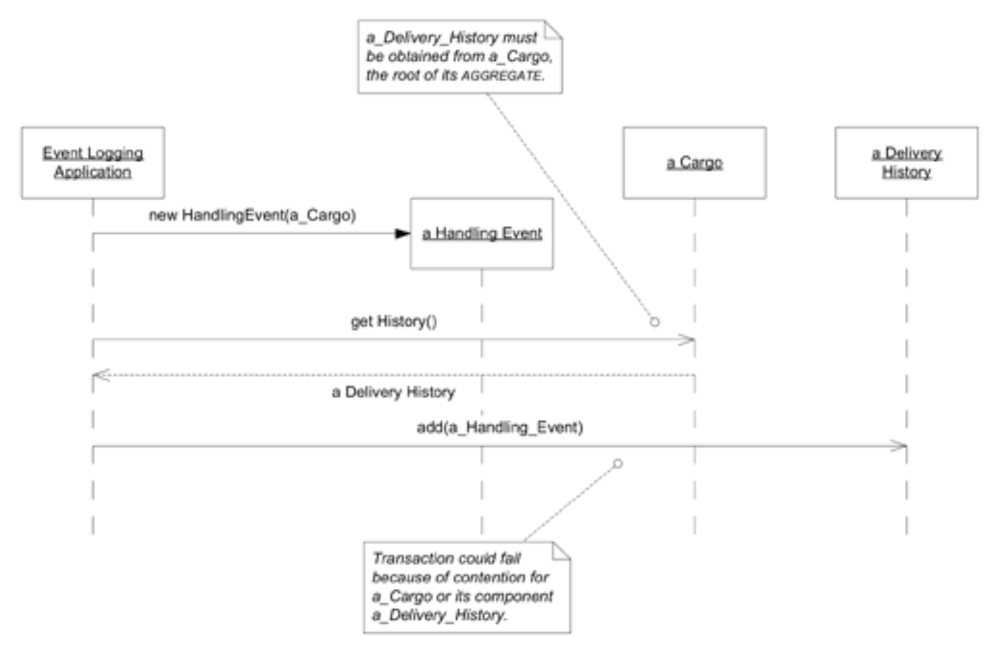

## 对象创建

#### ▶[上一节](7.md)

### `Cargo`的 [FACTORIES](2.md) 与构造函数

即便我们拥有精巧的`Cargo FACTORY`，或像 “重复业务” 场景那样使用其他`Cargo`作为 [FACTORY](../ch6/2.md) ，仍需保留基本构造函数。我们期望构造函数生成的对象能满足其不变性要求，至少在 [ENTITY](../ch5/2.md) 的情况下，其身份标识必须完整无损。

基于这些决策，我们可以在`Cargo`上创建如下 [FACTORY](../ch6/2.md) 方法：
```java
public Cargo copyPrototype(String newTrackingID)
```
或者，我们也可以在独立 [FACTORY](../ch6/2.md) 上实现如下方法：
```java
public Cargo newCargo(Cargo prototype, String newTrackingID)
```
独立 [FACTORY](../ch6/2.md) 还能封装为新`Cargo`获取新 ID（自动生成）的过程，此时只需一个参数：
```java
public Cargo newCargo(Cargo prototype)
```
这些 [FACTORIES](2.md) 返回的结果都将相同：一个`Delivery History`为空的`Cargo`，以及一个空的`Delivery Specification`。

`Cargo`与`Delivery History`之间的双向关联意味着，若不指向对应的另一方，则`Cargo`或`Delivery History`均不完整，因此必须同时创建。请注意`Cargo`是包含`Delivery History`的 [AGGREGATE](../ch6/1.md) 根节点。因此，我们可以允许`Cargo`的构造函数或 [FACTORY](../ch6/2.md) 创建`Delivery History`。`Delivery History`的构造函数将接受`Cargo`作为参数。结果将类似于以下形式：
```java
public Cargo(String id) {
     trackingID = id;
     deliveryHistory = new DeliveryHistory(this);
     customerRoles = new HashMap();
 }
```
结果是一个带有全新`Delivery History`的新`Cargo`，该`Delivery History`指向`Cargo`。`Delivery History`构造函数仅由其 [AGGREGATE](../ch6/1.md) 根（即`Cargo`）专属调用，从而实现了`Cargo`组合的封装。

### 添加处理事件

每次货物在现实世界中被处理时，用户都会通过`Incident Logging Application`输入一个`Handling Event`。

每个类都必须具备基本构造函数。由于`Handling Event`是一个 [ENTITY](../ch5/2.md) ，所有定义其身份的属性都必须传递给构造函数。如前所述，`Handling Event`通过其`Cargo`的 ID、完成时间和事件类型的组合实现唯一标识。`Handling Event`的唯一其他属性是与`Carrier Movement`的关联关系，某些类型的`Handling Event`甚至不具备此关联。创建有效的`Handling Event`的基本构造函数如下：
```java
public HandlingEvent(Cargo c, String eventType, Date timeStamp) {
     handled = c;
     type = eventType;
     completionTime = timeStamp;
 }
```
[ENTITY](../ch5/2.md) 的非标识属性通常可在后续添加。在此情况下，`Handling Event`的所有属性都将在初始事务中设定且永不更改（除非需要修正数据录入错误），因此为每种事件类型在`Handling Event`中添加一个简单的`FACTORY METHOD`（接受所有必要参数）会更便捷，并能增强客户端代码的表达力。例如，“loading event” 确实涉及`Carrier Movement`：
```java
public static HandlingEvent newLoading(Cargo c, CarrierMovement loadedOnto, Date timeStamp) {
    HandlingEvent result = new HandlingEvent(c, LOADING_EVENT, timeStamp);

    result.setCarrierMovement(loadedOnto);
    return result;
}
```
模型中的`Handling Event`是一种抽象概念，可能封装多种专门化的`Handling Event`类，涵盖装、卸、封装、存储等各类操作，以及与`Carriers`无关的其他活动。这些事件类可能实现为多个子类，或具有复杂的初始化逻辑 —— 甚至两者兼具。通过为每种类型在基类（`Handling Event`）中添加`FACTORY METHODS`，实例创建过程得以抽象化，从而使客户端无需了解具体实现细节。[FACTORY](../ch6/2.md) 负责确定应实例化的具体类及其初始化方式。

遗憾的是，事情并非如此简单。从`Cargo`到`Delivery History`再到`History Event`，最后又回到`Cargo`的引用循环，使得实例创建变得复杂。`Delivery History`包含与其`Cargo`相关的`Handling Event`集合，而新对象必须作为事务的一部分添加到该集合中。若未创建此反向引用，对象之间将出现不一致。

#### Figure 7.5

*添加`Handling Event`需要将其插入`Delivery History`。*

后向指针的创建可封装在。[FACTORY](../ch6/2.md) 模式中（并保留在所属的领域层），但现在我们将探讨一种替代设计方案，该方案能彻底消除这种笨拙的交互。

#### ▶[下一节](9.md)
