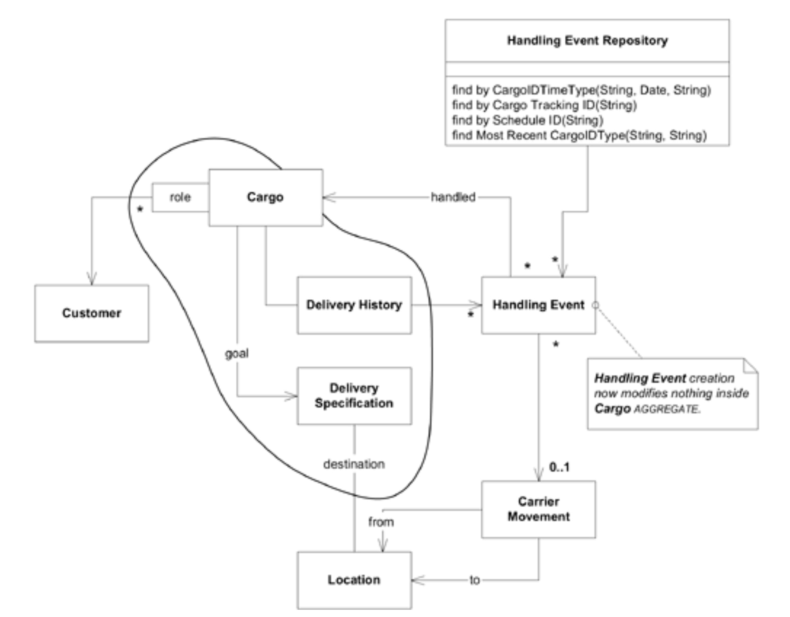

## 暂停重构：货运 [AGGREGATE](../glossary.md#aggregate) 的替代设计方案

#### ▶[上一节](8.md)

建模与设计并非一蹴而就的过程。若不通过频繁重构来运用新见解优化模型与设计，整个进程终将陷入停滞。

当前设计虽能正常运作且准确反映模型，但已显现若干不便之处。设计之初看似无关紧要的问题正逐渐显露弊端。让我们回到其中一个设计方案，借助后见之明，为自己铺好设计之路。

在添加`Handling Event`时需要更新`Delivery History`，这会使`Cargo` [AGGREGATE](../glossary.md#aggregate) 卷入事务。若其他用户同时修改`Cargo`，`Handling Event`事务可能失败或延迟。录入`Handling Event`属于需快速简便的操作活动，因此关键应用需求是实现 *无冲突* 录入`Handling Events`。这促使我们考虑采用不同设计方案。

将`Delivery History`中`Handling Events`的集合替换为查询，可实现`Handling Events`的添加而不引发其自身 [AGGREGATE](../glossary.md#aggregate) 之外的完整性问题。此变更将使相关事务得以无干扰地完成。当`Handling Events`插入量大而查询量相对较少时，该设计更具效率。实际上，若底层采用关系型数据库技术，系统很可能已在底层使用查询来模拟集合。采用查询替代集合还能降低维护`Cargo`与`Handling Event`间循环引用一致性的难度。

为承担查询责任，我们将新增一个`Handling Events` [REPOSITORY](../glossary.md#repository) 。`Handling Event Repository`将支持查询特定`Cargo`的相关`Events`。此外，该 [REPOSITORY](../glossary.md#repository) 还能提供针对特定问题进行高效响应的优化查询。例如，若频繁访问路径是查询`Delivery History`以获取最近的装卸记录，用于推断`Cargo`的当前状态，则可设计专门查询返回相关`Handling Event`。若需查询特定`Carrier Movement`中装载的所有`Cargo`，同样能轻松实现。

#### Figure 7.6

*Figure 7.6：将`Delivery History`中`Handling Events`的集合实现为查询，可使得`Handling Events`的插入操作简单，同时也不会与`Cargo` [AGGREGATE](../glossary.md#aggregate) 产生竞争。*

这使得`Delivery History`不保留持久化状态。此时实际无需保留它。当需要解答特定问题时，可随时推导出`Delivery History`。之所以能推导该对象，是因为尽管 [ENTITY](../glossary.md#entity) 将被反复重建，但与同一`Cargo`对象的关联关系维持了不同实例间的连续性。

循环引用不再难以创建和维护。`Cargo Factory`将被简化，不再为新实例附加空的`Delivery History`。数据库空间可略微减少，持久化对象的实际数量可能大幅降低，这在某些对象数据库中属于有限资源。若常见使用模式是用户在`Cargo`抵达前很少查询其状态，则可完全避免大量不必要的工作。

另一方面，若采用对象数据库，遍历关联关系或显式集合的速度可能远快于 [REPOSITORY](../glossary.md#repository) 查询。当访问模式涉及频繁调取完整历史记录，而非偶尔查询最后位置时，性能权衡可能更倾向于显式集合。需注意新增功能（ “本次`Carrier Movement`包含哪些内容？” ）尚未被需求方提出，甚至可能永远不会被采用，因此我们不愿为此选项付出过高代价。

这类替代方案和设计权衡无处不在，仅在这个简化的系统中我就能列举大量例子。但关键在于，这些都是同一模型内的自由度。通过将`VALUES`、`ENTITIES`及其`AGGREGATES`进行建模，我们已有效降低了此类设计变更的影响。例如在此案例中，所有变更都被封装在`Cargo`的 [AGGREGATE](../glossary.md#aggregate) 边界内。虽然需要新增`Handling Event Repository`，但无需重构`Handling Event`本身（尽管具体实现可能涉及调整，这取决于 [REPOSITORY](../glossary.md#repository) 框架的细节）。

#### ▶[下一节](10.md)
