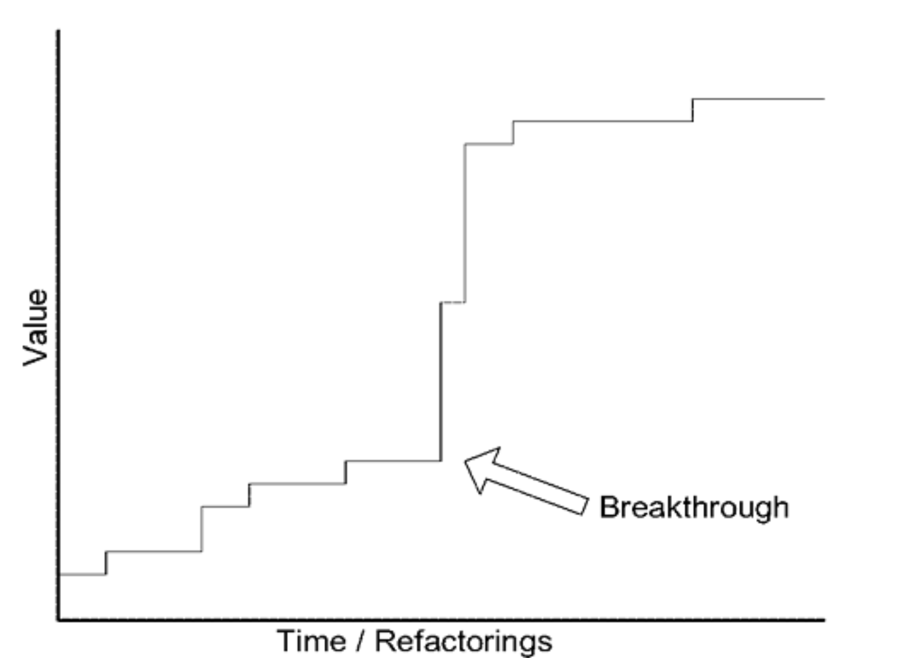

## 第 8 章 突破

#### ▶[上一节](../part3.md)

重构的回报并非线性增长。通常情况下，微小的投入能带来边际收益，这些细微改进会逐渐累积。它们对抗着熵的增长，是抵御僵化遗留系统的最前线防线。但某些至关重要的洞见往往突如其来，在项目中引发震动。

团队以稳扎稳打的步伐吸收知识，将其转化为模型。深度模型可通过一系列微小的重构逐步形成，每次只处理一个对象：此处调整关联关系，彼处转移职责。

然而，持续重构往往为更不拘一格的变革铺平道路。每次对代码和模型的精炼，都让开发者看得更清晰。这种清晰度孕育着洞见迸发的可能。变革的浪潮催生出更契合用户现实需求与优先级的模型。当复杂性消散之际，模型的灵活性与解释力却骤然提升。

这种突破并非某种技巧，而是一场事件。挑战在于识别正在发生的事情，并决定如何应对。为传达这种体验的感受，我将讲述几年前参与的一个真实项目故事，以及我们如何最终获得一个极具价值的深度模型。

#### ▶[下一节](1.md)
