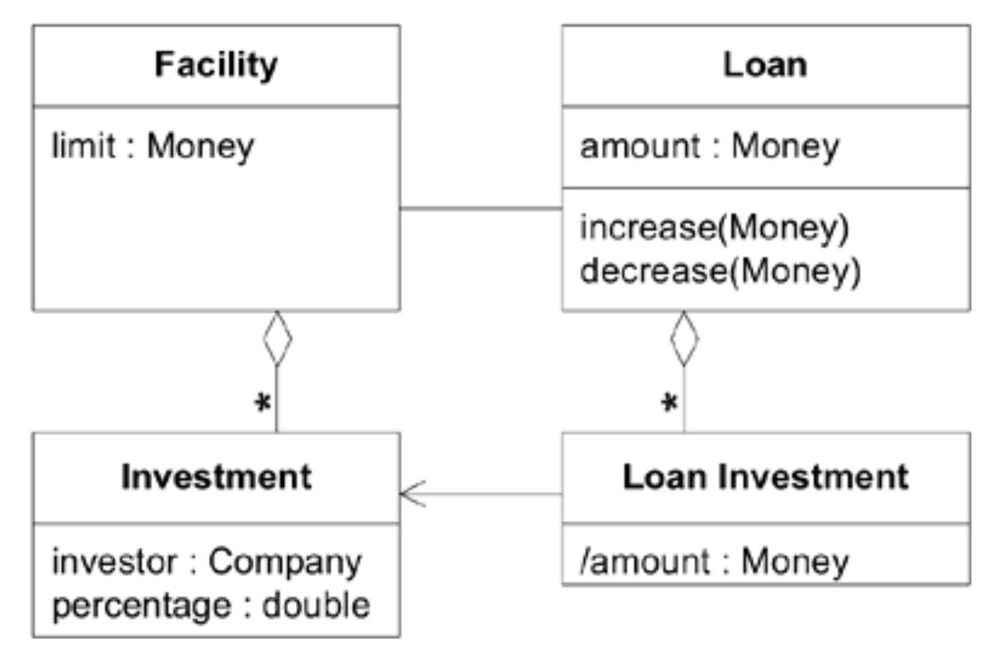
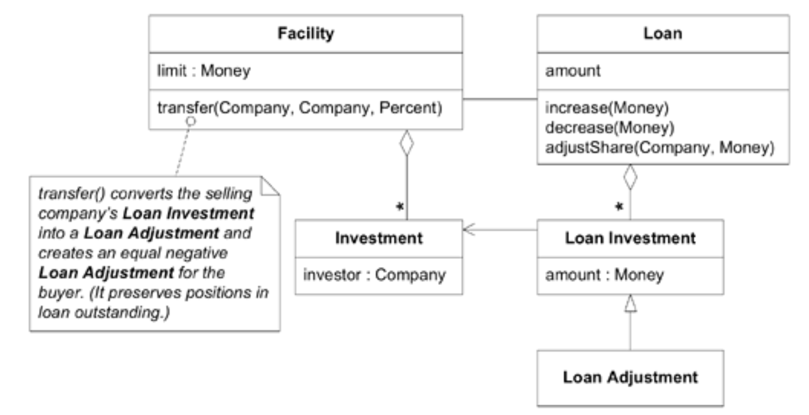
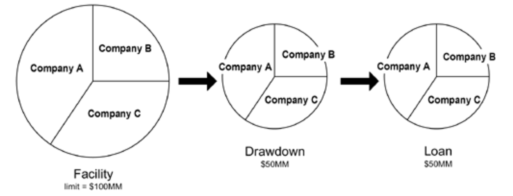
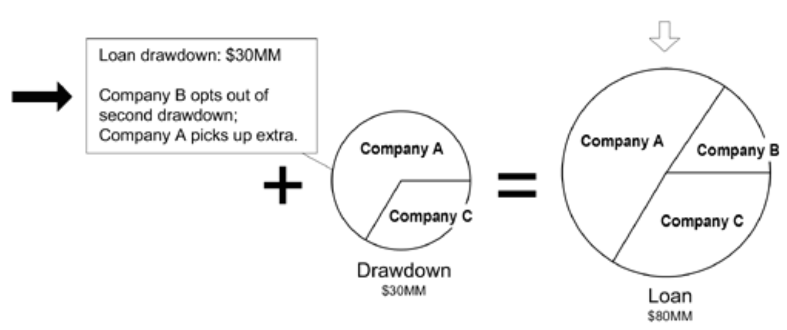
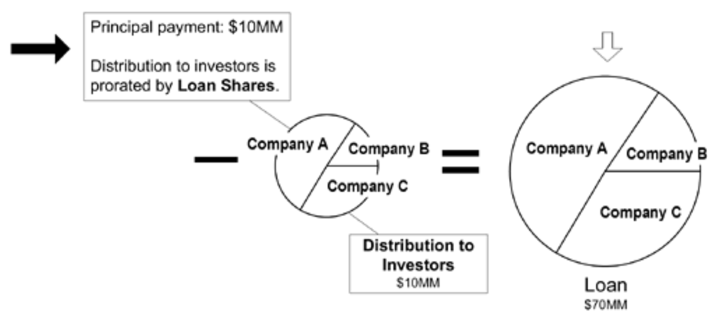
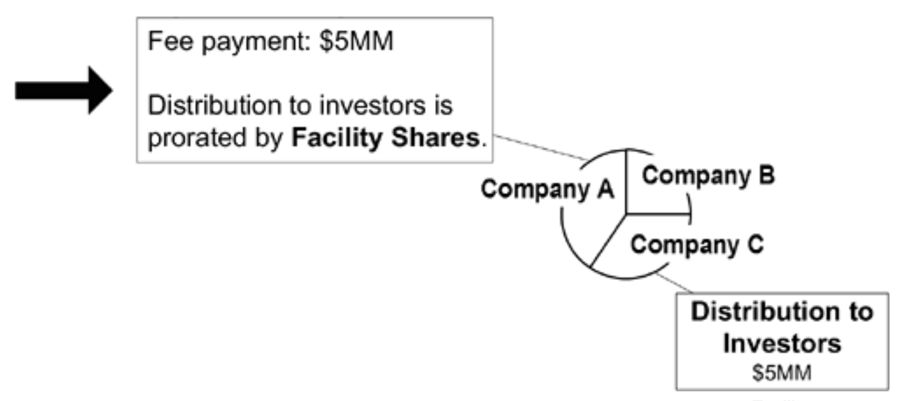
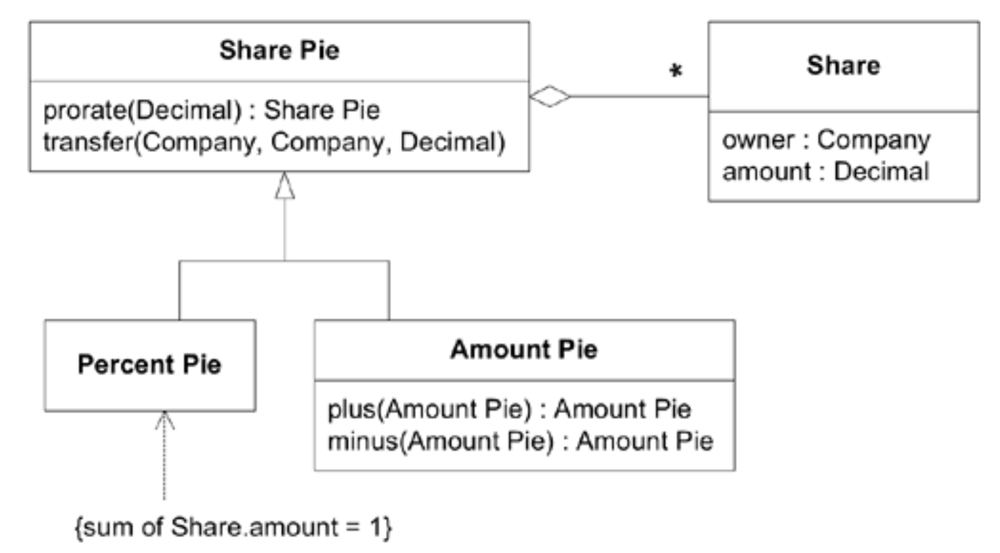

## 突破的故事

#### ▶[上一节](0.md)

在纽约漫长的冬季里，我们经过反复重构，最终构建出一个模型，它不仅捕捉了领域中的关键知识，更设计出真正能为应用程序提供实效的架构。当时我们正在开发某投资银行大型联合贷款管理系统的核心组件。

当英特尔计划建造一座造价十亿美元的工厂时，所需贷款规模远超任何单一贷款机构的承贷能力，因此贷款方会组建 *银团 (syndicate)* ，通过整合资源来支持该 *信贷额度 (facility)*（详见侧边栏）。通常由投资银行担任银团牵头行，负责协调交易及其他服务。我们的项目任务是开发一套软件系统，用于追踪并支持整个银团贷款流程。

### 一个不错的模型，然而……

我们当时心情相当不错。四个月前，我们还深陷困境，面对的是完全无法使用的遗留代码库，而如今我们已将其改造为一个凝聚的 [MODEL-DRIVEN DESIGN](../glossary.md#model-driven-design) 。

如 [Figure 8.1](#figure-81) 所示的模型使常见场景变得极其简单。`Loan Investment`作为派生对象，代表特定投资者对`Loan`的出资额，该金额与其在`Facility`中的份额成正比。

#### Figure 8.1

*Figure 8.1：假设贷款人份额固定的模型*

---

何谓 “Facility” ？

此处 “信贷额度” 并非指建筑物。如同多数项目，领域专家的专业术语融入了我们的词汇体系，成为 [UBIQUITOUS LANGUAGE](../ch2/1.md) 的一部分。在商业银行业务领域，*信贷额度指银行对企业作出的贷款承诺。* 您的信用卡即为一种信贷额度，允许您按需在预设限额内以约定利率借款。刷卡消费即产生未偿贷款，每次新增消费都将从您的信贷额度中 *扣除* ，从而增加贷款余额。最终您需偿还贷款本金，同时可能需支付年费。这笔费用是持有信用卡（即信贷额度）的特权费，与贷款本身无关。

---

但有些令人不安的迹象不断出现。我们屡屡遭遇意外要求，使设计变得复杂。一个典型例子是逐渐认识到：在`Facility`中，各成员持有的份额仅是参与特定贷款提款的 *指导性指标* 。当借款人申请资金时，银团牵头行会召集所有成员按各自份额拨付资金。

当资金需求出现时，投资者通常会按比例出资，但他们往往会与财团其他成员协商，从而减少（或增加）投资额。为此，我们在模型中增加了`Loan Adjustments`。

#### Figure 8.2

*Figure 8.2：逐渐调整模型以解决问题。`Loan Adjustments`追踪出资方偏离在`Facility`中最初同意的份额的情况。*

此类改进使我们得以在各类交易规则日益明晰的过程中保持同步。然而复杂性持续攀升，我们似乎未能迅速收敛至真正可靠的功能。

更令人不安的是那些微妙的四舍五入不一致问题，即便采用日益复杂的算法也始终无法消除。诚然，在价值一亿美元的交易中，多出的几美分无人会在意，但银行家们绝不会信任无法精确核算这些零头款项的软件。我们开始怀疑，这些难题或许正是基础设计缺陷的征兆。

### 突破

突然间，我们在一周内恍然大悟问题所在。我们的模型将`Facility`与`Loan`份额以一种 *不符合业务* 的方式捆绑在一起。这一发现引发了广泛的连锁反应。在业务专家们频频点头、热情协助 —— 我敢说他们还暗自纳闷我们为何迟迟未醒悟 —— 的配合下，我们在一块白板上勾勒出新模型。尽管细节尚未敲定，但新模型的核心特征已然明晰：`Loan`份额与`Facility`份额可独立变动。凭借这一洞见，我们通过新模型的可视化演示推演了无数场景，其呈现效果大致如下：

#### Figure 8.3

*Figure 8.3：基于`Facility`份额分配的提款*

该图显示借款人选择从`Facility`承诺的 1 亿美元中提取 5000 万美元初始资金。三家贷款机构按融资额度份额精确比例出资，最终形成 5000 万美元`Loan`在各贷款机构间分配。

随后，如 [Figure 8.4](../img/fig8.4.png) 所示，借款人额外提取 3000 万美元，使其未偿还`Loan`总额达到 8000 万美元，仍低于该`Facility` 1 亿美元的限额。此次，B 公司选择不参与，让 A 公司获得额外份额。提款份额反映了这些投资选择。当提款金额计入`Loan`总额后，`Loan`份额将不再与`Facility`份额成比例。这种情况很常见。

#### Figure 8.4

*Figure 8.4：贷款方 B 选择退出第二次提款*

#### Figure 8.5

*Figure 8.5：基本金偿付始终按未偿`Loan`份额比例分配*

借款人偿还`Loan`时，资金将按`Loan`份额而非`Facility`比例分配给各贷款人。同样，利息支付也将按`Loan`份额比例分配。

#### Figure 8.6

*Figure 8.6：费用支付始终按`Facility`份额比例分配。*

另一方面，当借款人支付费用以获得使用该`Facility`的权利时，这笔资金将按`Facility`份额进行分配，无论实际放贷方是谁。费用支付不会改变`Loan`。甚至存在这样的情形：放贷方将费用份额与利息份额分开交易，以此类推。

### 更深层的模型

我们获得了两项深刻洞见。首先意识到我们的`Investment`与`Loan Investment` 不过是某个普遍而根本的概念的两种特殊形态：份额。 融资份额、贷款份额、 *支付分配* 份额。份额，份额无处不在。任何可分割价值的份额。

几日风波过后，我根据与专家讨论时使用的术语以及我们共同探索的场景，勾勒出一个份额模型。

#### Figure 8.7

*Figure 8.7：份额抽象模型*

我还为此设计了一个配套的新贷款模型。

#### Figure 8.8

*Figure 8.8：基于`Share Pie`的`Loan`贷款模型*

`Facility`或`Loan`贷款的份额不再需要专门的对象来表示。它们都被分解为更直观的`Share Pie`。这种泛化使得 “份额运算” 得以引入，极大简化了任何交易中份额的计算，并使这些计算更具表达力、更简洁且易于组合。

但最重要的是，问题得以解决是因为新模型消除了不恰当的约束。它使`Loan`份额能够脱离`Facility`份额的比例限制，同时保留了对总额、费用分配等方面的有效约束。`Loan`份额的`Share Pie`可直接调整，因此不再需要`Loan Adjustment`，大量特殊情况逻辑也随之消除。

`Loan Investment`贷款投资功能已消失，此时我们才意识到 “load investment” 并非银行术语。事实上，业务专家曾多次表示他们无法理解该功能。他们依赖我们的软件知识，认为该功能对技术设计有价值。实际上，我们是在对业务领域理解不充分的情况下创建了这个功能。

突然间，基于这种全新的领域视角，我们得以相对轻松地梳理所有曾遇到的场景，其简便程度远超以往。 *而我们的模型图对业务专家来说也变得清晰明了，他们曾多次表示这些图表 “过于技术化”。* 即便只是在白板上草绘，我们也能看出那些顽固的四舍五入问题将被彻底根除，从而得以废弃部分复杂的四舍五入代码。

我们的新模型运行良好。真的，真的很好。

*可我们全都感到不舒服 (sick)！*

### 一个令人清醒的决定

你或许会合理地认为，此时此刻我们理应欣喜若狂。但事实并非如此。我们面临着严峻的截止期限；项目进度早已严重滞后。恐惧成为我们最强烈的情绪。

重构的真谛在于始终循序渐进，确保系统持续运行。但要将代码重构为新模型，需修改大量辅助代码，且过程中几乎找不到稳定的中间停靠点。我们能发现若干可改进之处，但无一能真正推动新概念落地。虽然能规划出一系列微调步骤，但实施过程中应用程序的部分功能必将失效。更何况当时这类项目尚未普及自动化测试。我们完全没有测试保障，不可预见的崩溃在所难免。

这需要付出努力。我们已经因数月的拼命推进而精疲力竭。

此时，我们与项目经理举行了一次我永生难忘的会议。我们的经理是个聪慧果敢的人。他提出了一连串问题：

- Q1：采用新设计后，需要多长时间才能恢复当前功能？
- A1：大约三周。
- Q2：不采用新设计能否解决问题？
- A2：可能可以，但无法保证。
- Q3：如果现在不做改动，能否推进下个版本的开发？
- A3：若不实施变更，进展将十分缓慢。待现有系统部署完成后，变更难度将大幅增加。
- Q4：*我们* 是否认为这是正确决策？
- A4：我们清楚政治局势动荡，必要时会采取应对措施。团队确实疲惫不堪。但确实，这是更简洁的方案，更契合业务需求。从长远看，风险更低。

他批准了我们的行动，并表示会承担所有压力。我始终对他做出这个决定所需的勇气和信任怀有极大的敬佩。

我们拼了命干了三周终于搞定。虽然工程量巨大，但进展出乎意料地顺利。

### 回报

那些令人费解的意外需求变更终于停止了。虽然四舍五入的逻辑从未真正简单过，但它已趋于稳定且合乎逻辑。我们交付了第一版，通往第二版的道路也变得清晰。我的精神崩溃得以侥幸避免。

随着第二版的发展，这个`Share Pie`逐渐成为整个应用程序的核心主题。技术人员和业务专家用它来讨论系统架构。 *市场人员用它向潜在客户阐释功能特性。* 这些潜在客户和现有客户都能立刻理解并运用它来探讨功能细节。它真正成为了 [UBIQUITOUS LANGUAGE](../ch2/1.md) 的一部分，因为它精准揭示了银团贷款业务的本质。

#### ▶[下一节](2.md)
