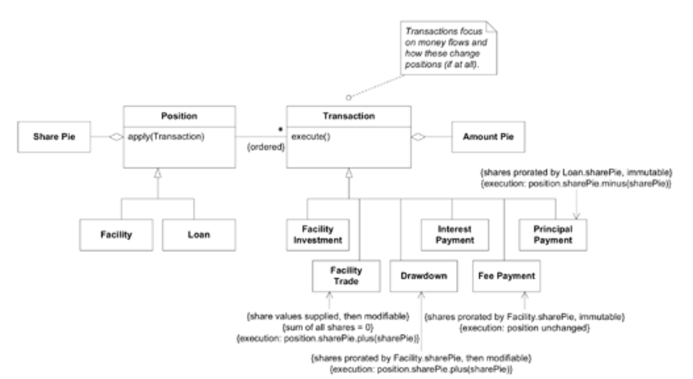

## 尾声：新见解的层层涌现

#### ▶[上一节](3.md)

这个突破让我们脱离困境，但故事并未就此终结。更深层的模型意外地为丰富应用功能、优化设计清晰度开辟了全新路径。

在`Share Pie`版本软件发布仅数周后，我们便注意到模型中另一个影响设计的缺陷。一个关键 [ENTITY](../ch5/2.md) 缺失，导致其他对象不得不承担额外职责。具体而言，贷款提款、费用支付等重要规则均被塞进`Facility`和`Loan`对象的各类方法中。这些设计问题在`Share Pie`突破前几乎难以察觉，如今视野清晰后却变得显而易见。我们注意到讨论中频频出现模型中根本不存在的术语 —— 例如 “交易”（指金融交易）—— 这才意识到这些复杂方法背后暗含着未明确定义的概念。

遵循与先前类似的流程（所幸这次时间压力小得多），我们获得了新一轮洞见并构建出更深入的模型。新模型将那些隐含概念显性化为各类`Transactions`，同时简化了`Positions`（一个包含融`Facility`和`Loan`的抽象概念）。由此我们得以轻松定义各类交易及其规则、协商流程和审批程序，所有内容均以相对自明的代码呈现。

#### Figure 8.9

*Figure 8.9：数周后出现的另一项模型突破。`Transactions`约束得以精确且简洁地表达。*

正如深度模型实现真正突破后的常见情形，新设计的清晰简洁性，结合基于新型 [UBIQUITOUS LANGUAGE](../ch2/1.md)，增强的沟通能力，最终促成了又一次建模领域的重大突破。

在多数项目开始因已建成部分的庞大复杂性而陷入停滞的阶段，我们的发展步伐却在加速前进。

#### ▶[下一节](../ch9/0.md)
