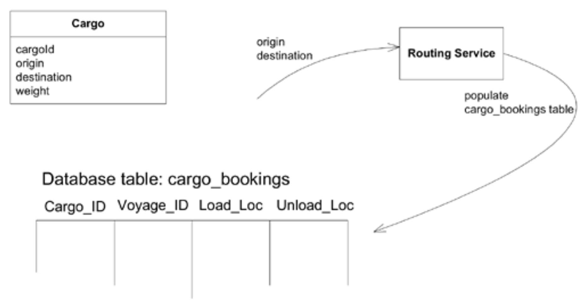
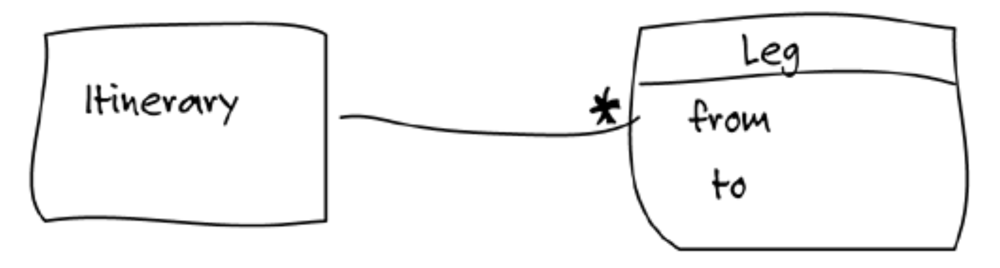
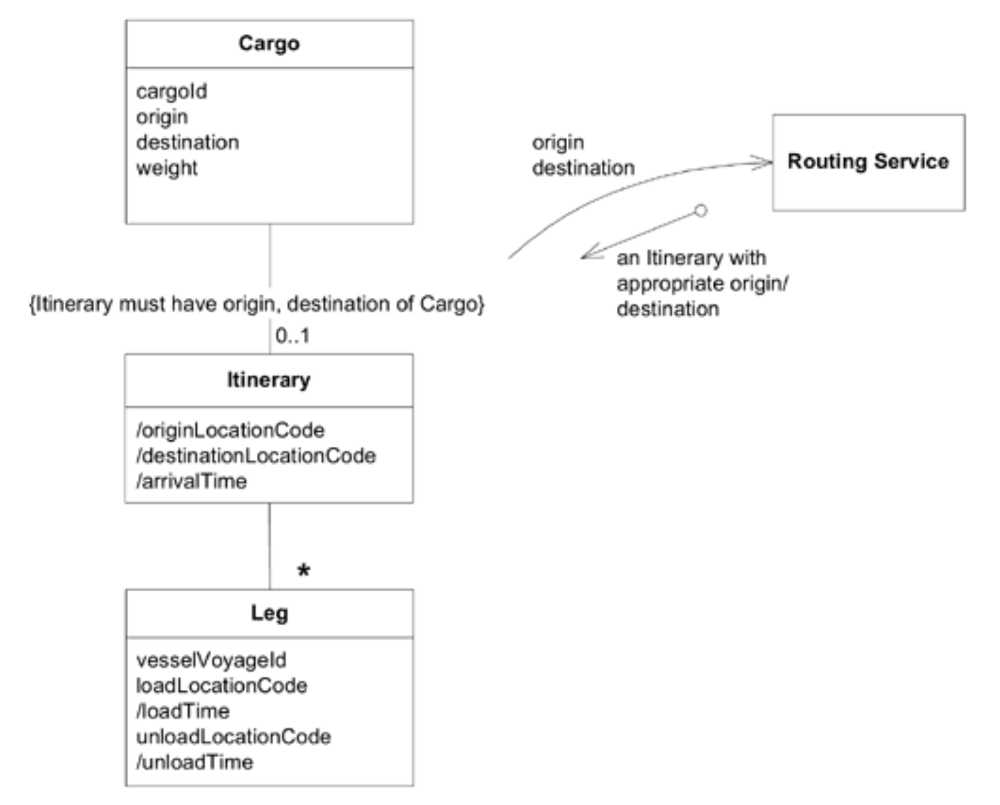
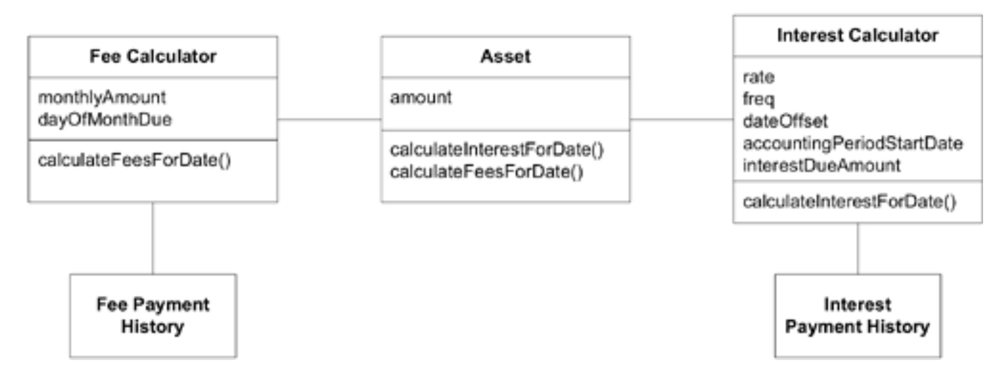
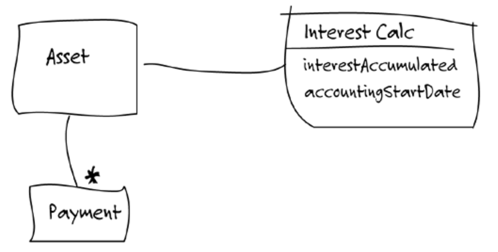
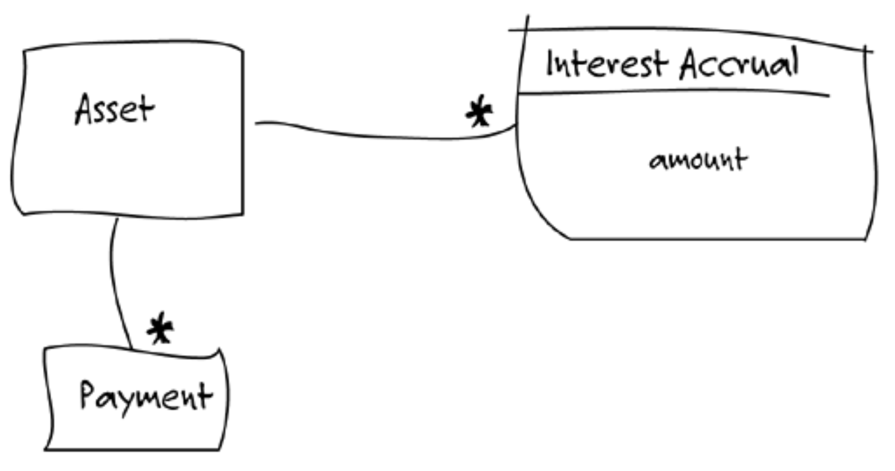
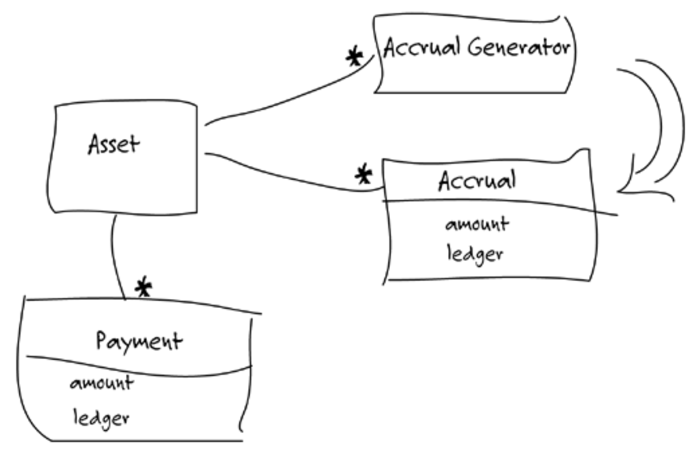
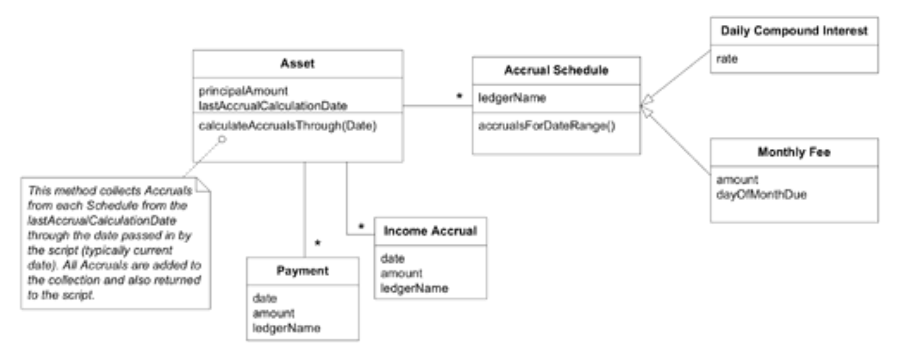
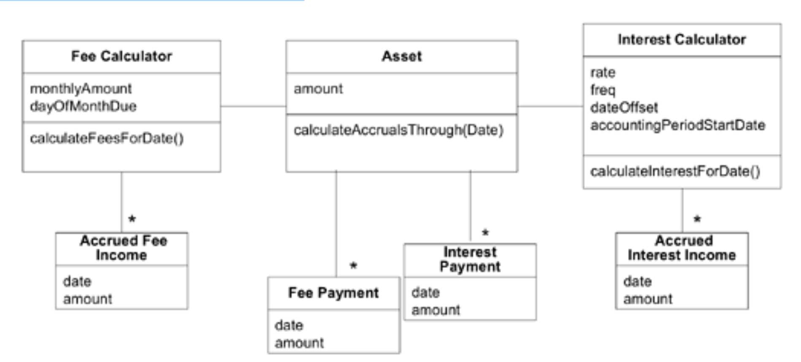

## 挖掘概念

#### ▶[上一节](0.md)

开发者必须敏锐捕捉那些揭示隐含概念的蛛丝马迹，有时还需主动发掘这些概念。大多数发现源于倾听团队的语言、审视设计中的不协调之处、探究专家陈述中的矛盾之处、挖掘领域文献，以及进行大量实验。

### 倾听语言

你或许经历过这样的情形：用户总在报告中讨论某个事物。该事物由各类对象的属性汇总而成，甚至可能直接来自数据库查询。应用程序的另一部分也会组合相同的数据集，用于展示、报告或衍生内容。但你从未意识到需要创建对象。很可能，你从未真正理解用户所用术语的含义，也未曾察觉其重要性。

突然间，你脑中灵光乍现。那份报告中的事物名称，竟对应着一个重要的领域概念。你兴奋地向专家们阐述新发现，他们或许松了口气，终于有人懂了。也可能他们打着哈欠，因为这个概念对他们而言早已是理所当然。无论哪种情况，你开始在白板上绘制模型图，填补了以往那些模糊概念的空白。用户们纠正着新模型连接细节的具体问题，但你能感受到讨论质量的转变。你与用户间的理解更精准了，通过模型交互演示解决具体场景也变得更自然。领域模型的语言变得更强大。你重构代码以体现新模型，发现设计变得更简洁了。

<ins> **倾听领域专家使用的语言。是否有某些术语能简洁地阐述复杂概念？他们是否在纠正你的措辞（或许委婉地）？当你使用特定短语时，他们困惑的表情是否消失了？这些都是可能对模型有益的概念线索。** </ins>

这并非传统的 “名词即对象” 概念。听到新词时，你需要追踪线索，通过对话与知识整合，最终提炼出清晰实用的概念。<ins>当用户或领域专家使用设计中完全未涉及的术语时，这便是警示信号。若开发人员与领域专家同时使用设计中缺失的术语，则警示力度倍增。</ins>

或许更应将其视为机遇。[UBIQUITOUS LANGUAGE](../glossary.md#ubiquitous-language) 由遍布于言语、文档、模型图乃至代码中的词汇构成。若某术语缺失于设计之中，将其纳入正是完善模型与设计的契机。

### 示例：在航运模型中发现缺失的概念

团队已经开发了一个可以预订货物的可用应用程序。他们开始构建一个 “运营支持” 应用程序，以帮助管理在起点和目的地以及船只之间的转运过程中装卸货物的工作订单。

该预订应用采用路由引擎为货物规划运输路线。航程的每个航段均存储于数据库表的一行中，其中包含：计划承运货物的船舶航次 ID（特定船舶的特定航次）、装货地点及卸货地点。

#### Figure 9.1

让我们偷听一段开发人员与运输专家的对话（内容大幅删减）：

- 开发人员：我想确保 “cargo bookings” 表包含运营应用程序所需的所有数据。
- 专家：他们需要`Cargo`的完整行程信息。当前该表包含哪些数据？
- 开发人员：每段航段的货物 ID、船舶航次、装货港和卸货港。
- 专家：日期怎么办？运营部门需要根据预计时间签订装卸作业合同。
- 开发人员：这个可以从船舶航次计划中推导出来。表格数据已经规范化处理。
- 专家：是的，需要日期是正常的。运营人员会利用这类行程单来规划后续的装卸作业。
- 开发者：嗯……好的，他们肯定能获取日期信息。运营管理应用程序将能提供完整的装卸流程，包含每次装卸作业的具体日期。我想这就是你所说的 “行程单” 吧。
- 专家：很好。行程单是他们最需要的东西。其实你知道吗，预订应用有个菜单项可以打印行程单或邮件发送给客户。你能不能用这个功能？
- 开发人员：那只是个报表功能，我认为操作应用程序不能基于这个实现。
- \[开发者先是陷入沉思，随即兴奋起来。\]
- 开发人员：所以，这份行程单实际上是预订与运营之间的纽带。
- 专家：是的，同时也涉及部分客户关系管理。
- 开发者：\[在白板上画图\] 那么您认为大致是这样的结构吗？

#### Figure 9.2

- 专家：是的，这基本正确。对于每个航段，您需要查看船舶航次、装卸地点及时间。
- 开发者：所以一旦创建了`Leg`对象，它就能从船舶航次计划中推导出时间节点。我们可以将`Itinerary`对象作为与运营应用程序对接的核心接口，并重写航程报告使其使用该接口，这样就能将领域逻辑重新归位到领域层。
- 专家：虽然没完全理解细节，但你说得对，`Itinerary`的两个主要用途确实是用于预订报告和运营应用程序。
- 开发者：嘿！我们可以让`Routing Service`接口返回行程对象，而不是把数据存进数据库表里。这样路由引擎就无需了解我们的表结构了。
- 专家：啥？
- 开发者：我的意思是，我会让路由引擎直接返回`Itinerary`。这样当预订应用保存其他预订信息时，行程单就能同步存入数据库了。
- 专家：你是说现在不是这样操作？！

随后，该开发人员前往与参与路线规划流程的其他开发人员进行讨论。他们详细探讨了模型变更及其对设计的影响，并在必要时咨询了运输专家。最终他们绘制出了 [Figure 9.3](#figure-93) 所示的示意图。

#### Figure 9.3

接下来，开发人员对代码进行了重构以适应新模型。他们分两到三次快速完成重构，整个过程在一周内完成，唯独简化预订应用中的行程报告这一项，则留待下周初处理。

开发者一直仔细倾听着航运专家的意见，注意到 “行程” 这个概念对他有多么重要。诚然，所有数据都已收集完毕，行程报告中也隐含着相关行为模式，但将`Itinerary`作为模型的一部分明确呈现，却开辟了新的可能性。

将`Itinerary`对象显式化重构的优势：
1. 更清晰地定义`Routing Service`的接口
2. 实现`Routing Service`与预订数据库表的解耦
3. 明确预订应用与运营支持应用之间的关系（`Itinerary`对象的共享机制）
4. 减少重复工作，因为`Itinerary`会同时为预订报告和运营支持应用程序推导装卸时间
5. 将领域逻辑从预订报告中移除，置于独立的领域层中
6. 扩展 [UBIQUITOUS LANGUAGE](../glossary.md#ubiquitous-language) ，使开发人员与领域专家之间、开发人员彼此之间能够更精确地讨论模型与设计

### 审视不协调之处

你需要的概念未必总在表面浮现，也未必会出现在对话或文档中。有时你需要挖掘和创造。<ins>挖掘的重点在于设计中最不协调的部分。流程执行着难以解释的复杂操作之处，每个新增需求都似乎在增添复杂性的地方。</ins>

有时甚至难以察觉某个概念缺失。你可能让对象承担所有工作，却发现某些职责安排得别扭。或者，即便意识到存在缺失，理想的解决方案也可能难以捉摸。

现在你必须主动让领域专家参与搜索过程。如果运气好，他们或许乐于尝试各种想法并实验模型。若运气不佳，你和开发团队就得自己构思方案，将领域专家作为验证者，观察其面部表情变化，留意他们是否感到不适或产生共鸣。

### 示例：艰难赚取利息

下一个故事发生在一家假想的金融公司，该公司投资于商业贷款及其他生息资产。一款追踪这些投资及其收益的应用程序正通过逐项功能的增量开发逐步完善。每晚，其中一个组件会作为批处理脚本运行，计算当日所有利息和费用，然后将其准确记录在公司的会计软件中。

#### Figure 9.4

*Figure 9.4：一个笨拙的模型*

夜间批处理脚本遍历每个`Asset`，要求每个资产根据当日日期`calculateInterestForDate()`。脚本获取返回值（收益金额），并将该金额与特定账簿 (ledger) 名称传递给会计程序公共接口的 [SERVICE](../glossary.md#service) 。该软件将金额记入指定账簿。脚本通过类似流程从每个`Asset`获取当日手续费，并将其记入另一账簿。

一位开发者一直在苦苦应对日益复杂的利息计算问题。她开始怀疑是否存在更适合该任务的模型。这位开发者邀请她最信赖的领域专家协助深入探究问题根源。

- 开发者：我们的`Interest Calculator`快失控了。
- 专家：这是个复杂的模块。我们还积压着更多待处理的特殊场景。
- 开发者：我知道。我们可以通过替换不同的`Interest Calculator`来添加新利息类型。但当前最棘手的是那些未按时支付利息的特殊情况。
- 专家：这些根本不算特殊情况。用户还款时间本就存在很大弹性空间。
- 开发者：当初我们将`Interest Calculator`从`Asset`中分离出来时，效果显著。或许我们需要进一步拆分它。
- 专家：好的。
- 开发者：我在想，你或许有办法处理这个利息计算问题。
- 专家：你指的是？
- 开发者：比如说，我们正在追踪会计期间内应计但未支付的利息。你们有对应的术语吗？
- 专家：我们其实不这么操作。利息收入和付款是完全独立的分录。
- 开发者：所以你们不需要这个数值？
- 专家：偶尔可能会参考，但这并非我们的业务处理方式。
- 开发者：好的，既然付款和利息是分开的，那我们或许应该按这种方式建模。这样设计如何？\[在白板上绘制示意图\]
- 专家：这似乎说得通。但你只是把功能从一个地方移到了另一个地方。
- 开发者：不过现在利息计算器只记录应收利息，付款模块则单独保存该数值。虽然简化程度有限，但这样是否更符合贵公司的业务流程？
- 专家：啊，明白了。那能否也实现利息历史记录功能？就像付款记录那样。
- 开发者：可以，这已被列为新功能需求。但其实当初在原始设计中就能实现。

#### Figure 9.5

- 专家：这似乎说得通。但你只是把功能从一个地方移到了另一个地方。
- 开发者：不过现在`Interest Calculator`只记录应收利息，`Payment`则单独保存该数值。虽然简化程度有限，但这样是否更符合贵公司的业务流程？
- 专家：啊，明白了。那能否也实现利息历史记录功能？就像`Payment History`那样。
- 开发者：可以，这已被列为新功能需求。但其实当初在原始设计中就能实现。
- 专家：哦。我看到利息和`Payment History`这样分开显示时，以为你是把利息拆分开来，以便像`Payment History`那样进行整理。你了解权责发生制会计吗？
- 开发人员：请解释一下。
- 专家：每日或按计划要求，我们会将利息计提项记入账簿。付款项则采用不同方式入账。你这里汇总的方式不太妥当。
- 开发者：您的意思是，如果我们维护一份 “计提项 (accruals)” 清单，这些项可以按需汇总或...进行 “入账 (posted)” 操作？
- 专家：可能在应计日登记，但确实可以随时汇总。手续费同样如此，当然登记在不同的账簿上。
- 开发者：其实如果只计算单日或单期利息，操作会更简单。然后我们可以统一保存所有数据。这样如何？

#### Figure 9.6

- 专家：当然。看起来不错。我不太明白为什么这样对你更容易。但基本上，任何资产的价值都取决于它能积累多少利息、手续费等等。
- 开发者：你说手续费也是同样的原理？它们……怎么说来着……会记入不同的账本？

#### Figure 9.7

- 开发者：通过这个模型，我们将利息计算，或者更确切地说，是在`Interest Calculator`中的应计计算逻辑，从跟踪逻辑中分离出来了。而且我直到现在才注意到`Fee Calculator`中有多少重复的内容。此外，现在可以轻松添加不同类型的费用。
- 专家：是的，以前计算是正确的，但现在我可以看到一切了。

由于`Calculator`类并未与设计中的其他部分直接耦合，这次重构相当轻松。开发人员仅用数小时便重写了单元测试以适配新语言，并在次日深夜完成了新设计的部署。最终她实现了这样的成果。

#### Figure 9.8

*Figure 9.8：重构后的更深层模型*

在重构后的应用程序中，夜间批处理脚本要求每个`Asset`执行`calculateAccrualsThroughDate()`。该操作返回一个`Accruals`集合，其中每个`Accrual`的金额都会被记入指定的分类账。

新模型具有多重优势。此次变更

1. 在 [UBIQUITOUS LANGUAGE](../glossary.md#ubiquitous-language) 中引入 “应计 (accrual)” 这一术语
2. 将应计与支付分离
3. 将领域知识（如应记入哪个账簿）从脚本移至领域层
4. 将费用与利息整合为符合业务需求的形式，消除代码中的重复逻辑
5. 为新增费用与利息的变体提供简明路径，作为`Accrual Schedules`

这次，开发者不得不深入挖掘所需的新概念。她察觉到利息计算中的不协调之处，并下定决心寻求更深层的解答。

她很幸运拥有一位聪明且积极的银行业专家作为伙伴。若遇到更被动的专家资源，她本会遭遇更多挫折，更依赖其他开发者作为头脑风暴伙伴。虽然进展会更缓慢，但仍有可能实现目标。

### 思辨矛盾

不同领域的专家基于各自经验与需求，对事物持有相异见解。即便同一人提供的信息，经细致分析后也可能存在逻辑矛盾。这类烦人的矛盾，我们在深入挖掘项目需求时屡见不鲜，恰是通向更深层模型的关键线索。其中部分矛盾源于术语差异或认知偏差，但当两位专家的事实陈述看似相互矛盾时，便留下了值得深究的残余。

天文学家伽利略曾提出一个悖论。感官证据明确表明地球是静止的：人们并未被吹落或掉在后面。然而哥白尼却提出有力论据，证明地球正以相当快的速度绕太阳运行。调和这两种观点或许能揭示自然运作的深刻奥秘。

伽利略设计了一个思想实验：若骑手从奔跑的马背上抛下一颗球，它会落在哪里？显然，球会随马匹一同移动，最终落在马蹄下的地面上，就如同马匹静止不动时的情形。由此他推导出惯性参考系概念的雏形，既化解了悖论，又为运动物理学建立了更为实用的模型。

好的。我们的矛盾通常并不那么引人入胜，其深层含义也未必深刻。即便如此，这种思维模式往往能帮助我们穿透问题表象，获得更深层的洞察。

试图调和所有矛盾既不现实，甚至未必可取。（ [第 14 章](../ch14/0.md) 将探讨如何决策及管理结果。）<ins>然而即便矛盾存在，思考两个陈述如何同时适用于同一外部现实的过程本身，往往能带来启示。</ins>

### 阅读书籍

在寻找模型概念时，切勿忽视显而易见的事物。在许多领域，你都能找到阐释基础概念和传统智慧的书籍。你仍需与领域专家合作，提炼出与自身问题相关的内容，并将其转化为适合面向对象软件的形式。但你或许能从一个连贯且经过深思熟虑的视角开始。

### 示例：利用书籍赚取利息

让我们设想一个不同的场景，用于前例中讨论的投资追踪应用程序。故事依然始于开发者意识到设计正变得难以驾驭，尤其是利息计算器模块。但这次领域专家的主要职责在其他领域，对协助软件开发项目兴趣寥寥。开发者无法邀请专家进行头脑风暴，以探寻她怀疑潜藏在表象之下的缺失概念。

她转而去了书店。稍作浏览后，她找到一本喜欢的会计入门书，便翻阅起来。她发现书中构建了一个概念清晰的完整体系。其中一段内容尤其激发了她的思考：

---
`Accrual Basis Accounting`。该方法在收入产生时即予以确认，即使尚未收款。所有费用亦在发生时列示，无论是否已支付或仅开具待付账单。任何应付债务（包括税款）均将作为费用列示。
—— *Finance and Accounting: How to Keep Your Books and Manage Your Finances Without an MBA, a CPA or a Ph.D.* ，Suzanne Caplan（Adams Media，2000）

---

开发者不再需要重新发明会计系统。经过与另一位开发者的头脑风暴，她最终设计出一个模型。

#### Figure 9.9

*Figure 9.9：基于书本知识的更深层模型*

她未能洞察到`Asset`是收入来源，因此`Calculator`功能依然存在。账簿知识仍被封存在应用层，而非本应归属的领域层。但她确实将支付问题与收入确认分离——这正是最棘手的环节，并成功将 “应计” 概念引入模型及 [UBIQUITOUS LANGUAGE](../glossary.md#ubiquitous-language) 体系。后续迭代中可进一步优化完善。

当她终于有机会与领域专家交谈时，对方显得相当惊讶。这是程序员首次对他所从事的工作表现出丝毫兴趣。由于职责分工的缘故，这位专家从未像前情所述那样与她坐下来共同审视模型。然而，正因这位开发者的专业知识使她能提出更精准的问题，此后专家开始认真倾听她的见解，并特别注重及时解答她的疑问。

当然，这并非非此即彼的选择。即便获得了领域专家的大力支持，查阅文献以掌握该领域的理论基础仍大有裨益。多数企业的模型尚未达到会计或金融领域的精细化程度，但在许多行业中，已有思想者对企业常见实践进行了系统梳理与抽象提炼。

开发者还有另一种选择，即阅读其他具备该领域开发经验的软件专业人士撰写的文献。例如 *Analysis Patterns: Reusable Object Models* （ [Fowler 1997](..//references.md#fowler-1997) ）第六章的内容，本会引导她走向截然不同的方向，并非必然优于或逊于原有路径。此类阅读虽无法提供现成的解决方案， 它能为她的自主探索提供多个新起点，同时承载着先行者的经验结晶。这将使她免于重复造轮子的苦功。[ 第 11 章](../ch11/0.md) “分析模式的应用” 将深入探讨这一选择路径。

### 尝试，再尝试

我给出的例子并没有传达出其中涉及的反复试验的程度。我可能会在对话中跟随半打线索，才找到一个看起来足够清晰和有用以供在模型中尝试的。随着额外的经验和知识的积累，更好的想法会出现，我最终至少会更换一次那个模型。模型设计师不能对自己的想法过于执着。

所有这些方向的转变并非徒劳无功。每次调整都为模型注入更深层的洞察，每次重构都让设计更具弹性，更易于后续修改，随时准备在需要弯曲的地方灵活调整。

无论如何，真的没有选择。实验是了解什么有效、什么无效的方式。试图避免设计中的失误会导致结果质量下降，因为它是基于较少的经验。而且，这往往比一系列快速实验花费更多时间。

#### ▶[下一节](2.md)
