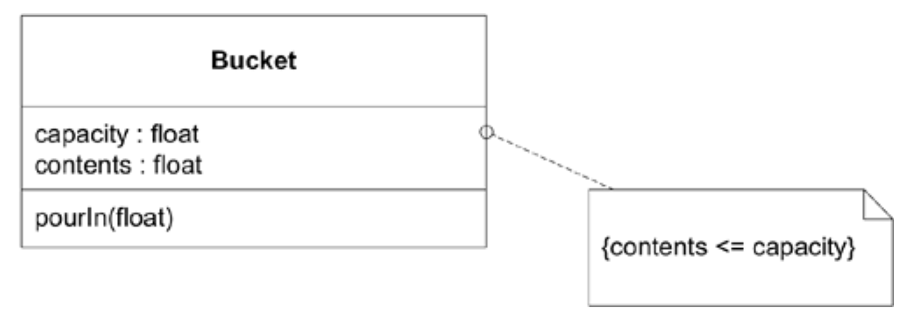
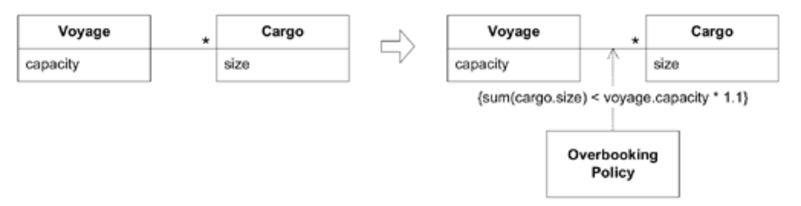
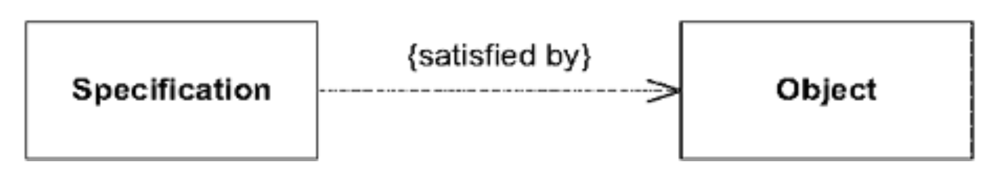
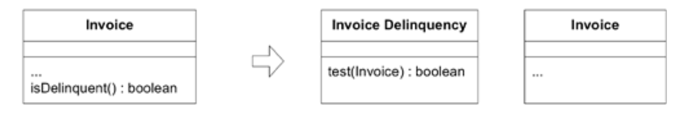
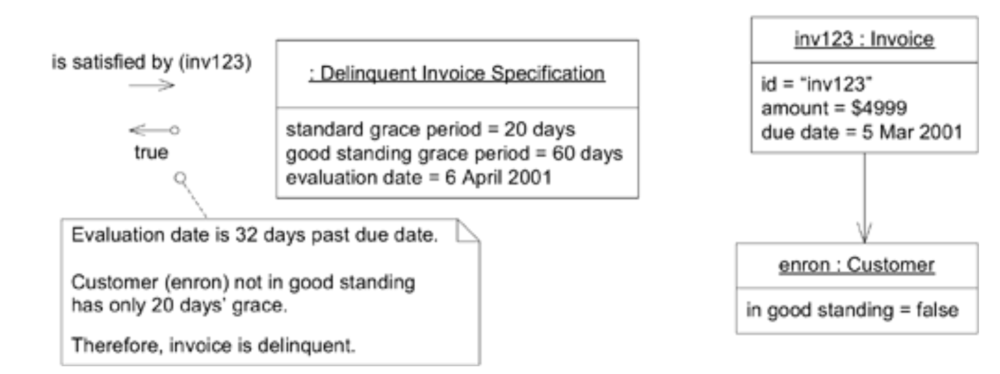
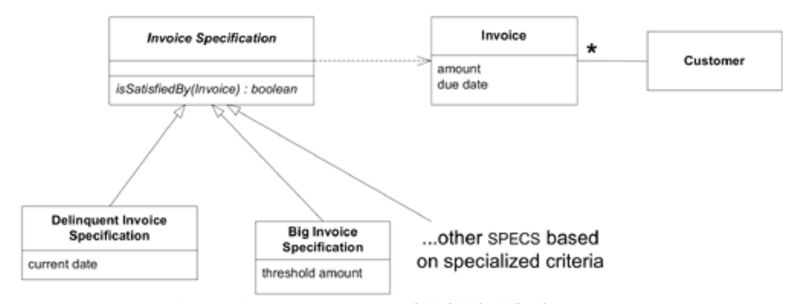
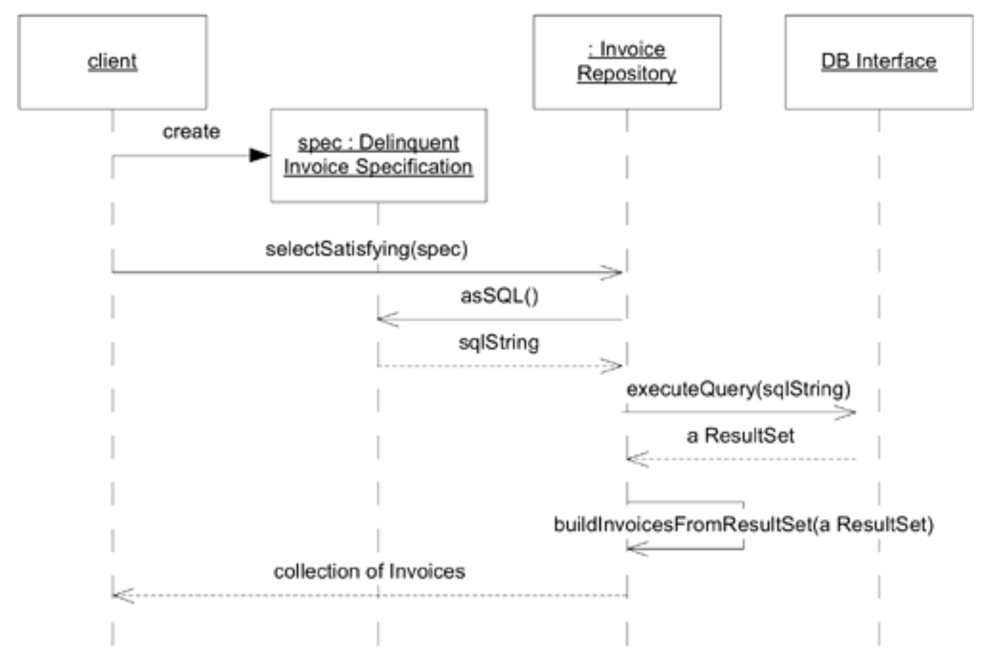

## 如何建模不那么显而易见的概念类型

#### ▶[上一节](1.md)

面向对象范式引导我们寻找并创造特定类型的概念。事物，即使是诸如 “应计 (accruals)” 这般抽象的概念，构成了大多数对象模型的核心，而这些事物所执行的操作则构成另一部分。这些正是入门级面向对象设计书籍所提到的 “名词与动词”。但模型中同样可以明确呈现其他重要概念类别。

在开始接触对象时，有三个类别对我而言并不明显。随着对每个类别的理解加深，我的设计也变得愈发精炼。

### 显式约束

约束构成了模型概念中特别重要的类别。它们往往隐含地出现，而将其显式表达出来能极大提升设计质量。

有时约束条件会在对象或方法中找到天然的归宿。一个`Bucket`对象必须保证其不变量：其容纳的元素数量不得超过其容量。

#### Figure 9.10


像这样的简单不变量可以通过在每个可能改变内容的操作中使用条件逻辑来强制实现。
```java
class Bucket {
  private float capacity;
  private float contents;

  public void pourIn(float addedVolume) {
    if (contents + addedVolume > capacity) {
      contents = capacity;
    } else {
      contents = contents + addedVolume;
    }
  }
}
```
这种逻辑如此简单，规则显而易见。但你很容易想象，在更复杂的类中，这个约束条件可能会被忽略。让我们将其提取为一个独立的方法，并赋予一个清晰明确地表达约束意义的名称。
```java
class Bucket {
  private float capacity;
  private float contents;

  public void pourIn(float addedVolume) {
    float volumePresent = contents + addedVolume;
    contents = constrainedToCapacity(volumePresent);
  }

  private float constrainedToCapacity(float volumePlacedIn) {
    if (volumePlacedIn > capacity) return capacity;
      return volumePlacedIn;
  }
}
```
这两种代码版本都实现了约束，但第二种与模型之间的关联更为明确（这正是 [MODEL-DRIVEN DESIGN](../ch3/1.md) 的基本要求）。这条极其简单的规则在原始形式下尚可理解，但当需要执行的规则变得复杂时，它们就会像任何隐含概念那样，开始淹没其所适用的对象或操作。将约束拆解为独立方法后，我们得以赋予其揭示意图的名称，使约束在设计中显性化。此刻它已成为可供讨论的名词实体。此方法还为约束预留了扩展空间——若规则更复杂，其方法体长度极易超过调用方（此处为`pourIn()`方法）。如此既能保持调用方的简洁专注，又允许约束在必要时提升复杂度。

这种独立的方法为约束提供了成长空间，但许多情况下约束根本无法舒适地容纳于单一方法中。即便方法保持简洁，它也可能调用对象核心职责所不需要的信息。这条规则或许在现有对象中根本找不到合适的归宿。

以下是一些表明约束正在扭曲其宿主对象设计的警示信号：
1. 评估约束需要不符合对象定义的数据。
2. 相关规则出现在多个对象中，迫使非同源对象之间进行重复或继承。
3. 大量设计与需求讨论围绕约束展开，但在实现过程中，这些约束却被隐藏在过程化代码中。

当约束模糊了对象的基本职责，或当约束在领域中显著存在却未在模型中突出体现时，可将其提取为显式对象，甚至建模为一组对象及其关联关系。（关于此主题的深入，半正式探讨，可参阅 *The Object Constraint Language: Precise Modeling with UML* [Warmer and Kleppe 1999](../references.md#warmer-1999) ）

### 示例：审查：超额预订政策

在 [第 1 章](../ch1/0.md) 中，我们探讨了航运业的常见做法：预订量比运输能力超出 10%。（经验表明，这种超额预订能弥补最后一刻的取消，确保船舶几乎满载启航。）

在图表和代码中，通过添加一个代表该约束的新类，明确了`Voyage`与`Cargo`之间关联的约束。

#### Figure 9.11

*Figure 9.11：为显性策略而重构的模型*

要查看完整示例中的代码及推导过程，请参见第 17 页。*TODO linke to where?*

### 流程作为领域对象

首先明确一点：我们 *不* 希望将过程 (procedures) 作为模型的核心要素。对象的本质在于封装过程 (procedures)，使我们能够专注于其目标或意图。

此处所指的是领域中存在的流程 (processes)，这些流程必须在模型中得到体现。当这类流程出现时，往往会导致对象设计显得笨拙。

本章第一个示例描述了一个负责货物路由的航运系统。这种路由流程具有业务意义。[SERVICE](../glossary.md#service) 正是将此类流程显式表达的一种方式，同时仍能封装极其复杂的算法。

当存在多种执行流程的方式时，另一种方法是将算法本身或其关键部分独立封装为对象。流程的选择便转化为这些对象之间的选择，每个对象代表一种不同的`STRATEGY`。（ [第 12 章](../ch12/0.md) 将深入探讨领域中`STRATEGIES`的使用。）

区分哪些流程应当显式化、哪些流程应当隐藏的关键很简单：这是领域专家会讨论的内容，还是仅仅属于计算机程序的机制组成部分？

<ins>约束与流程是模型概念中的两大范畴，在面向对象语言编程时往往不易被察觉，但一旦将其视为模型元素加以考量，便能显著优化设计方案。</ins>

<ins>某些有用的概念类别范围更为狭窄。本章将以一个更为具体却相当常见的概念收尾。`SPECIFICATION`提供了一种简洁的表达方式，能够将特定类型的规则从条件逻辑中抽离出来，使其在模型中明确呈现。</ins>

我与 Martin Fowler 合作开发了 `SPECIFICATION`（ [Evans and Fowler 1997](..//references.md#fowler-1997) ）。这个概念看似简单，但在应用和实现上却非常微妙，因此本节包含了大量细节。在 [第 10 章](../ch10/0.md) 中会有更多讨论，届时该模式将得到扩展。在阅读接下来的模式初步解释后，你可能会想先浏览 [应用和实现`SPECIFICATIONS`](#应用和实现specifications) 一节，直到你真正尝试应用该模式时再仔细阅读。

### `SPECIFICATION`



在各类应用中，布尔测试方法往往是微小规则的组成部分。只要它们足够简单，我们便能通过测试方法处理，例如`anIterator.hasNext()`或`anInvoice.isOverdue()`。在`Invoice`类中，`isOverdue()`中的代码本质上是评估规则的算法。例如：
```java
public boolean isOverdue() {
  Date currentDate = new Date();
  return currentDate.after(dueDate);
}
```
但并非所有规则都如此简单。在同一个`Invoice`类中，另一条规则`anInvoice.isDelinquent()`可能首先需要检测该`Invoice`是否逾期，但这仅仅是开始。关于宽限期的政策可能取决于客户账户的状态。部分逾期 (delinquent) 发票需发送二次催缴通知，另一些则应移交催收机构。客户付款记录、不同产品线的内部政策……当海量规则评估代码涌现时，`Invoice`作为付款请求的本质将迅速被淹没。该类还将衍生出各种依赖关系，牵扯到那些根本不支持其基本含义的领域类和子系统。

此时，为挽救`Invoice`类，开发者常会将规则评估代码重构到应用层（本例中为账单催收应用）。如今规则已完全脱离领域层，留下一个无法体现业务模型内在规则的僵化数据对象。这些规则本应驻留在领域层，却无法融入被评估的对象（此处即`Invoice`）。更糟的是，评估方法因充斥条件语句而臃肿不堪，导致规则难以理解。

采用逻辑编程范式的开发者会以不同方式处理这种情况。此类规则将被表达为 *谓词*。谓词是评估结果为 “true” 或 “false” 的函数，可通过 “AND” 和 “OR” 等运算符组合以表达更复杂的规则。借助谓词，我们能显式声明规则并将其应用于`Invoice`。可惜我们并非身处逻辑范式之中。

目睹此景，人们尝试以对象形式实现逻辑规则。其中有些尝试极为精妙，有些则显稚嫩；有些雄心勃勃，有些则务实稳健；有些最终价值非凡，有些则被弃如敝屣，沦为失败的实验。少数尝试最终导致项目脱轨。有一点很明确：尽管这个想法极具吸引力，但在对象中完全实现逻辑仍是一项艰巨的任务。（毕竟，逻辑编程本身就是一种完整的建模与设计范式。）

<ins>**业务规则往往难以归属于任何显而易见的 [ENTITIES](../ch5/2.md) 或`VALUE OBJECTS`，其多样性与组合方式更可能淹没领域对象的基本含义。但将规则移出领域层则更为糟糕，因为此时领域代码将不再表达模型本身。**</ins>

<ins>**逻辑编程提供了称为“谓词”的独立可组合规则对象概念，但通过对象完整实现该概念较为繁琐。该概念过于通用，其传达的意图不如更专业的设计明确。**</ins>

幸运的是，我们无需完全实现逻辑编程就能获得显著效益。大多数规则都属于少数特殊情况。我们可以借鉴谓词 (predicates) 的概念，创建专门用于评估布尔值的对象。那些失控的测试方法将自然地扩展为独立对象——它们本质上是微型真值测试，可被提取为独立的 [VALUE OBJECT](../glossary.md#value-object) 。这种新对象能评估其他对象，判断谓词对该对象是否成立。

#### Figure 9.12


换言之，新对象是一种 *规范 (specification)* 。`SPECIFICATION` 对另一个对象的状态施加约束，该对象可能存在也可能不存在。它有多种用途，但最能体现其基本概念的是：`SPECIFICATION` 可用于检测任何对象是否满足指定条件。

因此：

<ins> **为特殊用途创建显式的谓词式`VALUE OBJECTS`。`SPECIFICATION`是一种谓词，用于判定对象是否满足某些条件。** </ins>

许多`SPECIFICATIONS`都是简单的专用测试，如逾期发票示例所示。当规则复杂时，该概念可扩展为允许组合简单规格说明，如同谓词通过逻辑运算符组合一样。（此技术将在下一章讨论。）基本模式保持不变，并为从简单模型向复杂模型演进提供了路径。

逾期发票的情况可通过`SPECIFICATION`进行建模，该规范定义了逾期的含义，并能评估任何`Invoice`实例以作出判定。

#### Figure 9.13

*Figure 9.13：作为`SPECIFICATION`提取出的更复杂的违约规则*

`SPECIFICATION` 将规则保留在领域层。由于规则本身是完整的对象，这种设计能更明确地反映模型结构。[FACTORY](../glossary.md#factory) 可利用其他来源的信息（如客户账户或企业策略数据库）配置`SPECIFICATION`。若直接在`Invoice`中访问这些来源，将导致对象间产生与付款请求（`Invoice`的基本职责）无关的耦合。在此场景中，`Delinquent Invoice Specification`需创建后用于评估若干`发票`，随后即被废弃，因此直接内置了特定评估日期 —— 这实现了巧妙的简化。`SPECIFICATION`可通过简单直接的方式获取执行任务所需的信息。

🌼🌼🌼

`SPECIFICATION`的基本概念非常简单，有助于我们思考领域建模问题。但 [MODEL-DRIVEN DESIGN](../ch3/1.md) 需要有效的实现方案来体现该概念。要实现这一点，需要更深入地探讨模式的应用方式。领域模式不仅是 UML 图中的精妙构想，更是保持 [MODEL-DRIVEN DESIGN](../ch3/1.md) 理念的编程问题解决方案。

当你恰当地应用模式时，便能汲取关于如何处理某类领域建模问题的完整思想体系，并受益于多年积累的有效实现经验。后续关于`SPECIFICATION`的讨论包含大量细节：涵盖多种特性选项与实现方法。模式并非食谱，它让你立足经验基础开发解决方案，并为你提供描述实践的统一语言。

初读时不妨快速浏览关键概念。日后遇到实际情况时，便可重返此处，借鉴详细讨论中提炼的经验。随后你就能着手解决自己的问题。

### 应用和实现`SPECIFICATIONS`

`SPECIFICATION` 的核心价值在于它能统一看似截然不同的应用功能。我们可能需要为以下三种目的之一指定对象的状态：

1. 验证对象是否满足特定需求或具备使用条件
2. 从集合中筛选对象（如查询逾期发票的情形）
3. 创建符合需求的全新对象

这三种用途 —— 验证、选择和按需构建 —— 在概念层面是相同的。若没有`SPECIFICATION`这类模式，同一规则可能以不同形式出现，甚至呈现矛盾形态，导致概念统一性丧失。应用`SPECIFICATION`模式则能确保使用一致的模型，即使具体实现可能存在差异。

#### 验证

规范的最简单用途是验证，这种用途最直接地体现了规范的概念。

#### Figure 9.14

*Figure 9.14：应用`SPECIFICATION`进行验证的模型*

```java
class DelinquentInvoiceSpecification extends InvoiceSpecification {
  private Date currentDate;
  // An instance is used and discarded on a single date
  public DelinquentInvoiceSpecification(Date currentDate) {
    this.currentDate = currentDate;
  }

  public boolean isSatisfiedBy(Invoice candidate) {
    int gracePeriod = candidate.customer().getPaymentGracePeriod();
    Date firmDeadline = DateUtility.addDaysToDate(candidate.dueDate(), gracePeriod);

    return currentDate.after(firmDeadline);
  }
}
```
现在假设我们需要在销售人员查询存在逾期账单的客户时显示红色警示标记。只需在客户端类中编写如下方法即可：
```java
public boolean accountIsDelinquent(Customer customer) {
  Date today = new Date();
  Specification delinquentSpec = new DelinquentInvoiceSpecification(today);
  Iterator it = customer.getInvoices().iterator();

  while (it.hasNext()) {
    Invoice candidate = (Invoice) it.next();
    if (delinquentSpec.isSatisfiedBy(candidate)) return true;
  }
  return false;
}
```
#### 选择（或查询）

验证是对单个对象进行测试，以确认其是否满足某些条件，通常是为了让客户端能够根据验证结果采取行动。另一种常见需求是根据某些条件从对象集合中选择子集。此处同样可以应用`SPECIFICATION`的概念，但具体实现方式有所不同。

假设存在一个应用需求：列出所有有逾期`Invoices`的客户。理论上，我们先前定义的`Delinquent Invoice Specification`仍可适用，但实际实现可能需要调整。为证明概念一致性，首先假设`Invoices`数量较少，可能已全部加载至内存。此时，为验证目的开发的直接实现依然有效。`Invoice Repository`可提供通用方法，根据`SPECIFICATION`筛选`Invoices`：
```java
public Set selectSatisfying(InvoiceSpecification spec) {
  Set results = new HashSet();
  Iterator it = invoices.iterator();

  while (it.hasNext()) {
    Invoice candidate = (Invoice) it.next();
    if (spec.isSatisfiedBy(candidate)) results.add(candidate);
  }

  return results;
}
```
因此，客户只需通过一条代码语句即可获取所有逾期`Invoices`的集合：
```java
Set delinquentInvoices = invoiceRepository.selectSatisfying(
  new DelinquentInvoiceSpecification(currentDate));
```
该代码行确立了操作背后的概念。当然，发票对象很可能并不存在于内存中——它们可能多达数千个。在典型的商业系统中，数据通常存储于关系型数据库中。正如前几章所指出的，当模型与其他技术产生交集时，其核心关注点往往会逐渐模糊。

关系型数据库具备强大的搜索能力。如何利用这种能力高效解决问题，同时保持`SPECIFICATION`的模型结构？[MODEL-DRIVEN DESIGN](../ch3/1.md) 要求模型与实现保持同步，但允许自由选择任何能忠实体现模型含义的实现方案。值得庆幸的是，SQL 是编写`SPECIFICATION`的天然选择。以下是一个简单示例，其中查询语句为：

以下是一个简单示例，其中查询与验证规则封装在同一类中。在`Invoice Specification`类中添加了一个方法，并在其子类`Delinquent Invoice Specification`中实现：
```java
public String asSQL() {
  return
    "SELECT * FROM INVOICE, CUSTOMER" +
    " WHERE INVOICE.CUST_ID = CUSTOMER.ID" +
    " AND INVOICE.DUE_DATE + CUSTOMER.GRACE_PERIOD" +
    " < " + SQLUtility.dateAsSQL(currentDate);
}
```
`SPECIFICATIONS` 与 `REPOSITORIES` 完美融合，后者作为构建模块机制，既能为领域对象提供查询访问功能，又能封装数据库接口（参见 [Figure 9.15](#figure-915) ）。

#### Figure 9.15

*Figure 9.15：[REPOSITORY](../glossary.md#repository) 与`SPECIFICATION`之间的交互*

该设计存在若干问题。最关键的是，表结构的细节已泄露至`DOMAIN LAYER`；这些细节本应隔离在映射层中，该层负责将领域对象与关系表关联。在此隐式复制信息可能损害`Invoice`和`Customer`对象的可修改性与可维护性，因为现在对它们的映射进行任何更改都必须在多个位置进行追踪。但本例旨在简明演示如何将规则集中管理。某些对象关系映射框架支持通过模型对象及属性表达此类查询，并在基础设施层生成实际 SQL 语句。如此便能兼得鱼与熊掌。

当基础设施无法提供帮助时，我们可通过在`Invoice Repository`中添加专用查询方法，将 SQL 从表达性领域对象中重构出来。为避免将规则嵌入 [REPOSITORY](../glossary.md#repository) ，我们必须采用更通用的查询表达方式，这种方式不直接捕获规则，但可通过组合或置于上下文中来实现规则（本例中通过双重分派实现）。
```java
public class InvoiceRepository {

  public Set selectWhereGracePeriodPast(Date aDate){
    //This is not a rule, just a specialized query
    String sql = whereGracePeriodPast_SQL(aDate);
    ResultSet queryResultSet =
      SQLDatabaseInterface.instance().executeQuery(sql);

    return buildInvoicesFromResultSet(queryResultSet);
  }

  public String whereGracePeriodPast_SQL(Date aDate) {
    return
      "SELECT * FROM INVOICE, CUSTOMER" +
      " WHERE INVOICE.CUST_ID = CUSTOMER.ID" +
      " AND INVOICE.DUE_DATE + CUSTOMER.GRACE_PERIOD" +
      " < " + SQLUtility.dateAsSQL(aDate);
  }

  public Set selectSatisfying(InvoiceSpecification spec) {
    return spec.satisfyingElementsFrom(this);
  }
}
```
`Invoice Specification` 中的 `asSql()` 方法被替换为 `satisfyingElementsFrom(InvoiceRepository)`，该方法在 `Delinquent Invoice Specification` 中实现如下：
```java
public class DelinquentInvoiceSpecification {
  // Basic DelinquentInvoiceSpecification code here

  public Set satisfyingElementsFrom(InvoiceRepository repository) {
    //Delinquency rule is defined as:
    // "grace period past as of current date"
    return repository.selectWhereGracePeriodPast(currentDate);
  }
}
```
这将 SQL 代码存放在 [REPOSITORY](../glossary.md#repository) 中，而`SPECIFICATION`则控制应使用何种查询。规则并未被整齐地收录在`SPECIFICATION`中，但其中包含了构成违约行为（即超过宽限期）的核心声明。

该 [REPOSITORY](../glossary.md#repository) 现在包含一个高度专用的查询，很可能仅在此场景下使用。这种做法虽可接受，但根据逾期`Invoices`与拖欠`Invoices`的相对数量，采用中间方案保留 [REPOSITORY](../glossary.md#repository) 方法的通用性，既能保持良好性能，又能使`SPECIFICATION`更具自解释性。
```java
public class InvoiceRepository {

  public Set selectWhereDueDateIsBefore(Date aDate) {
    String sql = whereDueDateIsBefore_SQL(aDate);
    ResultSet queryResultSet =
    SQLDatabaseInterface.instance().executeQuery(sql);
    return buildInvoicesFromResultSet(queryResultSet);
  }

  public String whereDueDateIsBefore_SQL(Date aDate) {
    return
      "SELECT * FROM INVOICE" +
      " WHERE INVOICE.DUE_DATE" +
      " < " + SQLUtility.dateAsSQL(aDate);
  }

  public Set selectSatisfying(InvoiceSpecification spec) {
    return spec.satisfyingElementsFrom(this);
  }
}

public class DelinquentInvoiceSpecification {
  //Basic DelinquentInvoiceSpecification code here

  public Set satisfyingElementsFrom(InvoiceRepository repository) {
    Collection pastDueInvoices =
    repository.selectWhereDueDateIsBefore(currentDate);

    Set delinquentInvoices = new HashSet();
    Iterator it = pastDueInvoices.iterator();
    while (it.hasNext()) {
      Invoice anInvoice = (Invoice) it.next();
      if (this.isSatisfiedBy(anInvoice))
        delinquentInvoices.add(anInvoice);
    }
    return delinquentInvoices;
  }
}
```
这段代码会导致性能下降，因为我们提取了更多`Invoices`对象，随后还需在内存中从中进行选择。这种性能代价是否值得换取更优的职责划分，完全取决于具体情境。实现`SPECIFICATIONS`与`REPOSITORIES`之间的交互存在多种方案，既能充分利用开发平台优势，又能保持基本职责的完整性。

有时，为提升性能或更常见地加强安全性，查询可能以存储过程的形式在服务器端实现。此时，`SPECIFICATION` 仅能包含存储过程允许的参数。尽管如此，这些不同实现方式在模型层面并无差异。除模型明确限制的情况外，实现方式的选择完全自由。代价在于查询的编写与维护变得更为繁琐。

关于将`SPECIFICATIONS`与数据库结合所面临的挑战，本讨论仅是略窥一二，我亦无意涵盖所有可能涉及的考量因素。此处仅旨在展示此类设计中必须做出的选择类型。Mee 与 Hieatt 在 [Fowler 2003](../references.md#fowler-2003) 中探讨了基于`SPECIFICATIONS`设计`REPOSITORIES`时涉及的若干技术问题。

#### 按订单制造（生成）

当五角大楼需要新型战斗机时，官员们会制定技术规格书。该规格书可能要求战机达到 2 马赫速度、航程 1800 英里、成本不超过 5000 万美元等。但无论多么详尽，技术规格书本身并非飞机设计方案，更遑论成品飞机。航空航天工程公司将依据规格书提出一种或多种设计方案。竞争对手可能提交不同设计，这些方案理论上都应满足原始规格要求。

许多计算机程序会生成内容，而这些内容必须被明确指定。当你在文字处理文档中插入图片时，文本会自动围绕图片排列。你已指定了图片的位置，或许还指定了文本的环绕样式。随后，文字处理器会根据你的指定要求，精确计算出页面上文字的具体排版方式。

虽然乍看之下可能不明显，但这与应用于验证和选择的`SPECIFICATION`概念本质相同。我们正在为尚未存在的对象指定筛选条件。
但具体实现方式将截然不同。此处的`SPECIFICATION`既非查询操作中对现有对象的筛选器，也非验证操作中对现有对象的检测机制。此时系统将创建全新对象或对象集合，或重新配置现有对象以满足`SPECIFICATION`的要求。

在不使用 `SPECIFICATION` 的情况下，可以编写一个生成器，它包含创建所需对象的过程或一系列指令。该代码隐式地定义了生成器的行为。

相反，通过描述性`SPECIFICATION`定义的生成器接口，则能显式约束生成器的产出。这种方法具有多重优势。

- 生成器的实现与其接口解耦。`SPECIFICATION`声明了输出要求，但未定义达成该结果的方式。
- 接口明确传达其规则，因此开发者无需理解生成器所有运作细节，即可知晓其预期行为。而要预测过程式定义生成器的行为，唯一途径是运行测试用例或理解每行代码。
- 该接口更具灵活性，或可通过增强实现更高灵活性，因为请求的声明权掌握在客户端手中，而生成器仅需严格遵循`SPECIFICATION`的字面要求即可。
- 最后但同样重要的是，这种接口更易于测试，因为模型中包含一种显式定义生成器输入的方式， *该方式同时也是对输出的验证* 。也就是说，传递给生成器接口以约束创建过程的同一份`SPECIFICATION`，也可在其验证角色中（若实现支持）用于确认创建的对象是否正确。（此为 [第 10 章](../ch10/0.md) 所述 [ASSERTION](../glossary.md#assertion) 的示例）

*按订单制造* 既可以指从零开始创建对象，也可以指对现有对象进行配置以满足`SPEC`要求。

### 示例：化学品仓库装卸工

某仓库内存放着堆叠的大型容器，类似于货运车厢，其中储存着各类化学品。部分化学品性质惰性，几乎可存放于任何场所；部分化学品具有挥发性，必须存放于特殊通风容器中；部分化学品具有爆炸性，必须存放于特殊装甲容器中。此外，关于容器内允许的化学品组合也存在相关规定。

目标是编写软件，以高效且安全的方式将化学品装入容器。

#### Figure 9.16

*Figure 9.16：仓库存储模型*

我们可以先编写一个将化学品放入容器的程序，但不妨从验证问题入手。这将迫使我们明确规则，并为最终实现提供测试途径。

每种化学品都将拥有一个容器`SPECIFICATION`：

|化学品|容器规格|
|------|--------|
|TNT|防爆容器|
|沙子| |
|生物样本|不得与爆炸物共用容器|
|氨|通风容器|

现在，如果我们将这些写成`Container Specifications`，我们应该能够获取一组打包容器的配置，并测试其是否满足这些约束条件。

|集装箱特性 |内容物 |是否满足规格要求？|
|---|---|---|
|防爆|20磅TNT|✓ |
| |500磅沙子|✓ |
| |50磅生物样本 |✓|
| |氨水 |✗|

*（译注：TODO 生物样本能放入防爆容器吗？）*

需要在`Container Specification`中实现`isSatisfied()`方法，用于检查所需的`ContainerFeatures`。例如，爆炸性化学品所附的`SPEC`将查找 “防爆 (armored)” 特性：
```java
public class ContainerSpecification {
  private ContainerFeature requiredFeature;
  public ContainerSpecification(ContainerFeature required) {
    requiredFeature = required;
  }

  boolean isSatisfiedBy(Container aContainer){
    return aContainer.getFeatures().contains(requiredFeature);
  }
}
```
以下是设置爆炸性化学品的示例客户端代码：
```java
tnt.setContainerSpecification(
  new ContainerSpecification(ARMORED));
```
`Container`对象上的方法`isSafelyPacked()`将确认该`Container`是否具备其所含`Chemicals`指定的所有特性：
```java
boolean isSafelyPacked(){
  Iterator it = contents.iterator();
  while (it.hasNext()) {
    Drum drum = (Drum) it.next();
    if (!drum.containerSpecification().isSatisfiedBy(this))
      return false;
  }
  return true;
}
```
此时，我们可以编写一个监控应用程序，该程序将获取库存数据库并报告任何不安全的情况。
```java
Iterator it = containers.iterator();
while (it.hasNext()) {
  Container container = (Container) it.next();
  if (!container.isSafelyPacked())
    unsafeContainers.add(container);
}
```
这不是我们受托开发的软件。告知业务人员这个机会固然不错，但我们的任务是设计一个打包器 (packer)。我们手头的是打包器的测试方案。
对领域的理解和基于`SPECIFICATION`的模型，我们得以定义清晰简洁的 [SERVICE](../glossary.md#service) 接口：该接口将接收`Drums`集合与`Containers`集合，并按规则完成打包。
```java
public interface WarehousePacker {
  public void pack(Collection containersToFill,
    Collection drumsToPack) throws NoAnswerFoundException;
    /* ASSERTION: At end of pack(), the ContainerSpecification
    of each Drum shall be satisfied by its Container.
    If no complete solution can be found, an exception shall
    be thrown. */
}
```
现在，设计一个优化约束求解器以履行`Packer`服务职责的任务，已与应用程序其余部分解耦，这些机制不会干扰表达模型的设计部分。（参见[第 10 章](../ch10/0.md) “声明式设计风格” 及 [第 15 章](../ch15/0.md) `COHESIVE MECHANISM`。） 然而，
管理打包规的则尚未从领域对象中抽离。

### 示例：仓库打包器的工作原型

编写优化逻辑以使仓库打包软件正常运行的是一项艰巨任务。一支由开发人员和业务专家组成的小型团队已分拆出来着手处理，但他们甚至尚未开始编码。与此同时，另一支小团队正在开发应用程序，该程序将允许用户从数据库提取库存数据，将其输入`Packer`并解读结果。他们正试图为预期的`Packer`进行设计。然而他们目前只能制作界面原型并编写部分数据库集成代码，无法向用户展示具备实际功能的界面以获取有效反馈。出于同样原因，`Packer`团队也工作在真空中。

基于仓库打包器示例中创建的领域对象和 [SERVICE](../glossary.md#service) 接口，应用团队意识到他们能够构建一个极其简单的`Packer`实现方案。该方案能有效推动开发进程，实现工作并行推进，并闭合反馈循环，唯有在端到端系统正常运行时，该循环才能发挥完全效力。
```java
public class Container {
  private double capacity;
  private Set contents; //Drums

  public boolean hasSpaceFor(Drum aDrum) {
    return remainingSpace() >= aDrum.getSize();
  }

  public double remainingSpace() {
    double totalContentSize = 0.0;
    Iterator it = contents.iterator();
    while (it.hasNext()) {
      Drum aDrum = (Drum) it.next();
      totalContentSize = totalContentSize + aDrum.getSize();
    }

    return capacity – totalContentSize;
  }

  public boolean canAccommodate(Drum aDrum) {
    return hasSpaceFor(aDrum) &&
      aDrum.getContainerSpecification().isSatisfiedBy(this);
  }
}

public class PrototypePacker implements WarehousePacker {
  public void pack(Collection containers, Collection drums)
          throws NoAnswerFoundException {
    /* This method fulfills the ASSERTION as written. However,
    when an exception is thrown, Containers' contents may
    have changed. Rollback must be handled at a higher
    level. */

    Iterator it = drums.iterator();
    while (it.hasNext()) {
      Drum drum = (Drum) it.next();
      Container container =
        findContainerFor(containers, drum);
      container.add(drum);
    }
  }

  public Container findContainerFor(
        Collection containers, Drum drum)
        throws NoAnswerFoundException {

    Iterator it = containers.iterator();
    while (it.hasNext()) {
      Container container = (Container) it.next();
      if (container.canAccommodate(drum))
      return container;
    }
    throw new NoAnswerFoundException();
  }
}
```
诚然，这段代码存在诸多不足。它可能先将沙子装入专用容器，随后在装填危险化学品前就耗尽空间。它显然未能实现收益最大化。但许多优化问题本就无法完美解决。此实现方案确实遵循了迄今为止所制定的规则。

---
<center>通过可运行原型消除开发瓶颈</center>

某团队必须等待另一团队提供可运行代码才能推进工作。两个团队都需等待完整集成才能测试组件或获取用户反馈。这种拥堵往往可通过关键组件的`MODEL-DRIVEN`原型缓解，即使该原型尚未满足全部需求。当实现与接口解耦后，任何可运行的实现都能为项目工作提供并行推进的灵活性。时机成熟时，原型可被更高效的实现方案替代。在此期间，系统其他部分在开发过程中始终拥有可交互的对象。

---

拥有这个原型后，应用程序开发人员能够全速推进工作，包括与外部系统的所有集成。`Packer`开发团队也能通过领域专家与原型的交互获得反馈，从而完善他们的想法，帮助厘清需求和优先级。`Packer`团队决定接管原型并进行调整，以验证各种想法。

他们还通过采用最新设计保持接口的更新，迫使应用程序及部分领域对象进行重构，从而在早期解决集成问题。

一旦复杂的 `Packer` 准备就绪，集成就非常容易，因为它是根据一个清晰定义的接口编写的 —— 这个接口以及 `ASSERTIONS` 正是应用程序在与原型交互时所使用的。

优化算法的专家花了几个月才把它做对。他们从用户与原型互动中获得的反馈中受益。同时，系统的所有其他部分在开发过程中都有东西可以进行互动。

这里我们看到一个 “可能实现的最简单方案” 的实例，它之所以成为可能，正是得益于更复杂的模型。仅用几十行易懂的代码，我们就能实现一个极其复杂组件的可运行原型。相比之下，采用不那么`MODEL-DRIVEN`方法不仅更难理解，升级难度也更大（因为`Packer`与设计其他部分的耦合度更高），而且在此案例中，原型开发周期很可能更长。

#### ▶[下一节](../ch10/0.md)
