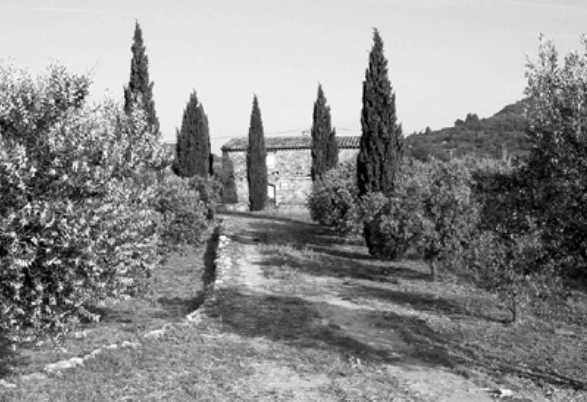

## 尾声

#### ▶[上一节](0.md)

尽管参与前沿项目、尝试新奇理念与工具令人心满意足，但若软件未能获得实际应用，于我而言终究是种空虚的体验。事实上，成功的真正试金石在于软件经年累月的服务成效。这些年来，我得以追踪部分旧项目的后续发展。

我将在此探讨其中五个项目，它们都曾认真尝试领域驱动设计——尽管并非系统性地实施，当然也未冠以此名。所有项目都交付了软件成果：部分成功贯彻并产出了模型驱动设计，但其中一个偏离了轨道。某些应用持续发展演变多年，而另一些则停滞不前，还有一个过早夭折。

[第 1 章](../ch1/0.md) 所述的 PCB 设计软件在该领域的测试用户中反响热烈。遗憾的是，启动该项目的初创公司在市场推广方面彻底失败，最终宣告破产。如今仅有少数 PCB 工程师仍在使用该软件，他们保留着 beta 版程序中获取的旧拷贝。如同所有被遗弃的软件，它将持续运行，直到其集成程序中的某个环节发生致命变更。

[第 9 章](../ch9/0.md) 所述的贷款软件在实现突破性进展后，沿着相似的轨迹蓬勃发展并持续演进三年。此时该项目被剥离为独立公司。重组风波中，自项目启动便担任负责人的项目经理遭撤换，部分核心开发人员随之离职。新团队的设计理念略有不同，对面向对象建模的投入不如前任彻底。但他们保留了具备复杂行为的独立领域层，并继续重视开发团队中的领域知识。分拆七年后，该软件仍在持续新增功能。它已成为该领域的领先应用，服务于日益增多的客户机构，同时也是公司最大的收入来源。

*新种的橄榄林*

在领域驱动的方法更广泛应用之前，许多项目中有趣的软件都会在一个短暂、高效的时间段内完成开发。最终，项目会转变为一些更传统的形式，可能无法充分利用，更不用说增强，早先提炼出的深度模型的力量。我当然希望能有更多，但实际上，那些成功是能够在多年间持续为用户带来价值的成果。

在某个项目中，我与另一位开发者合作编写了一款客户用于生产核心产品的实用工具。该工具的功能相当复杂，且以错综复杂的方式相互结合。我享受这个项目的工作，我们设计出一个灵活的架构，核心采用 [ABSTRACT CORE](../ch15/8.md) 模式。当软件移交时，所有最初参与开发的成员都结束了参与。由于过渡如此突然，我原本预计支撑组合元素的设计特性可能会令人困惑，最终会被更典型的案例逻辑所取代。但最初并未发生这种情况。移交时，软件包包含了完整的测试套件和提炼文档。新团队成员以此文档为指引展开探索，随着深入研究，他们对设计所蕴含的可能性充满热情。一年后听到他们的反馈时，我才意识到 [UBIQUITOUS LANGUAGE](../ch2/1.md) 已在另一团队中生根发芽，持续演进至今。

*七年之后*

又过了一年，我听到了另一种说法。团队遭遇了新需求，开发人员发现原有设计根本无法满足这些需求。他们被迫对设计进行了彻底改造，几乎面目全非。当我追问细节时，才明白我们原有模型的某些特性确实会让这些问题难以解决。正是这样的困境时刻，往往能催生更深层次的模型突破，尤其当开发者像这次一样，已在领域内积累了深厚的知识与经验。事实上，他们当时涌现出大量新见解，最终正是基于这些洞察重构了模型与设计。

他们谨慎而委婉地向我讲述这个故事，想必是料到我会因他们舍弃我大量设计而失望。我对自己的设计并不那么感性。设计的成功未必取决于其静止不变。当人们依赖的系统变得晦涩难懂，它便会永世成为不可触碰的陈旧遗产。深层模型能提供清晰视野，催生新见解；而灵活设计则利于持续变革。他们提出的模型更具深度，更契合用户的实际需求。他们的设计解决了真实问题。软件的本质就是不断变化，这个程序在拥有它的团队手中持续进化。

本书中散落的航运案例大致基于某大型国际集装箱航运公司的项目。项目初期，领导层虽致力于采用领域驱动方法，却始终未能建立起能充分支撑该方法的开发文化。多个设计能力与对象经验差异悬殊的团队着手开发模块，仅依靠团队负责人之间的非正式协作以及以客户为中心的架构团队进行松散协调。我们确实构建了相当深入的 [CORE DOMAIN](../ch15/1.md) 模型，并形成了可行的 [UBIQUITOUS LANGUAGE](../ch2/1.md) 。

但公司文化强烈抵制迭代开发，导致我们等待了过长时间才推出可用的内部版本。因此问题在后期才暴露，此时修复风险更高且成本更大。在某个节点，我们发现模型特定部分导致了数据库性能问题。[MODEL-DRIVEN DESIGN](../ch3/1.md) 的自然环节本应是将实现问题反馈至模型修改，但当时普遍认为项目已推进至无法改变基础模型的阶段。于是开发团队转而通过代码优化提升效率，却削弱了代码与模型的关联性。初版发布时，技术基础设施的扩展性缺陷更令管理层惊慌失措。虽引入专家修复了基础设施问题，项目得以重回正轨，但实现层与领域建模之间的闭环始终未能建立。

少数团队交付了功能复杂、模型表达力强的优质软件。另一些团队交付的软件则僵化刻板，将模型简化为数据结构，尽管其中仍残留着 [UBIQUITOUS LANGUAGE](../ch2/1.md) 的痕迹。或许 [CONTEXT MAP](../ch14/3.md) 本可成为最佳解决方案，因为各团队产出之间的关联性杂乱无章。然而，正是 [UBIQUITOUS LANGUAGE](../ch2/1.md) 中承载的 [CORE](1.md) 模型，最终帮助团队将系统整合为一体。

尽管范围有所缩减，该项目仍替换了多个遗留系统。整个系统由一套共享概念维系，但多数设计缺乏灵活性。多年后，它本身已基本固化为遗留系统，却仍全天候服务于全球业务。尽管更成功的团队影响力逐渐扩大，但即便在最富有的公司，时间终究会耗尽。该项目文化始终未能真正吸收 [MODEL-DRIVEN DESIGN](../ch3/1.md) 理念。如今的新开发工作在不同平台上进行，仅间接受到我们工作的影响 —— 因为新开发者们正 [CONFORM](../ch14/7.md) 着他们的遗留系统。

在某些领域，航运公司最初设定的雄心勃勃的目标已被质疑。似乎更明智的做法是开发我们有能力交付的小型应用程序，坚持最低设计标准来完成简单任务。这种保守策略自有其价值，能实现范围明确、响应迅速的项目。但集成化的模型驱动系统所承诺的价值，是这些拼凑方案无法企及的。第三种选择是领域驱动设计。它依托深度模型与灵活架构，使功能丰富的大型系统得以逐步扩展。

最后要介绍的是 Evant 公司，这家开发库存管理软件的企业中，我担任次要支持角色，为其原本就强大的设计文化贡献力量。虽然有人将该项目誉为极限编程的典范，但鲜少有人提及它其实是深度领域驱动的实践。我们不断提炼出更深层的模型，并将其转化为愈发灵活的设计方案。这个项目蓬勃发展直至 2001 年互联网泡沫破灭。随后因资金枯竭，公司规模萎缩，软件开发基本停滞，似乎已临近终点。但 2002 年夏天，全球十大零售商之一向 Evant 伸出了橄榄枝。这位潜在客户青睐其产品，但要求进行设计改造以支持庞大的库存规划业务扩展。这成为 Evant 的最后机会。

尽管团队规模缩减至四名开发者，他们仍拥有宝贵资产：成员技术精湛且深谙领域知识，其中一人更精通扩展性问题。团队秉持高效的开发文化，代码库采用灵活设计便于变更。那年夏天，这四位开发者以英雄般的努力，使系统最终具备了处理数十亿规划元素和数百名用户的能力。凭借这些实力，Evant 成功赢得巨头客户，不久后更被另一家公司收购，后者意图利用其软件及应对新需求的成熟能力。

领域驱动设计文化（以及极限编程文化）在转型中得以延续并焕发新生。如今，该模型与设计持续演进，两年后的丰富度与灵活性远超我当初贡献之时。更值得注意的是，Evant 团队成员并未被收购公司同化，反而正激励着公司现有项目团队追随其脚步。这个故事尚未落幕。

没有任何项目会运用本书中的所有技术。即便如此，<ins>任何致力于领域驱动设计的项目都将展现出若干特征。其核心特征在于优先理解目标领域，并将这种理解融入软件开发。其他一切工作都由此前提展开。团队成员会自觉关注项目中的语言使用，并不断精进其表达。他们对领域模型的质量永不满足，因为对领域的认知永无止境。他们视持续精炼为机遇，将不合身的模型视为风险。他们重视设计能力，因为要开发出清晰反映领域模型且具备生产级质量的软件绝非易事。纵使屡屡受挫，他们仍坚守原则，在跌倒后重新站起，继续前行。</ins>

#### ▶[下一节](2.md)
