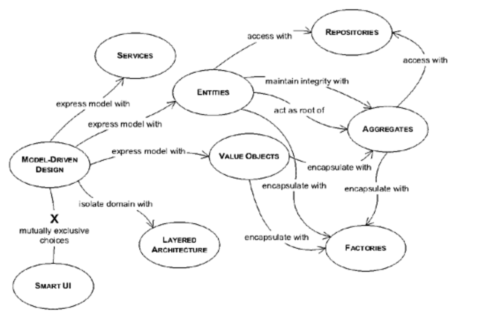

## 第二部分：模型驱动设计的基石

#### ▶[上一节](ch3/4.md)

为使软件实现保持精炼且与模型保持同步，即便面对混乱的现实，必须运用建模与设计的最佳实践。本书既非面向对象设计的入门指南，亦未提出颠覆性的设计原理。领域驱动设计改变了某些传统理念的侧重点。

某些决策能使模型与实现相互契合，彼此强化彼此的有效性。这种契合需要关注各个元素的细节。在微观层面精心打磨，能为开发者提供一个稳固的平台，使其能够在此基础上应用 [第三部分](part3.md) 和 [第四部分](part4.md) 的建模方法。

本书的设计风格主要遵循 [Wirfs-Brock 等人 1990](references.md#wirfs-brock-1990) 提出的 “责任驱动设计 (responsibility-driven design)” 原则，该原则在 [Wirfs-Brock 2003](references.md#wirfs-brock-2003) 著作中得到更新。同时本书（尤其在 [第三部分](part3.md) ）大量借鉴了 [Meyer 1988](references.md#meyer-1988) 阐述的 “契约式设计 (design by contract)” 理念。该设计理念与其他广为接受的面向对象设计最佳实践具有一致性，这些实践在 [Larman 1998](references.md#larman-1998) 等著作中均有阐述。

当项目遭遇大小障碍时，开发者可能会陷入看似无法遵循这些原则的困境。为使领域驱动设计过程具备韧性，开发者需要理解这些公认基础 *如何* 支撑 [MODEL-DRIVEN DESIGN](glossary.md#model-driven-design) ，从而在不偏离轨道的前提下做出妥协。

以下三章的内容以 “模式语言” 的形式组织（参见 [附录 A](appendix.md) ），将展示细微的模型差异与设计决策如何影响领域驱动设计过程。

下一页顶部的图表是一张 *导航图* 。它展示了本节将呈现的模式及其相互关联的几种方式。

共享这些标准模式能使设计井然有序，并让团队成员更容易理解彼此的工作。使用标准模式还能丰富 [UBIQUITOUS LANGUAGE](glossary.md#ubiquitous-language) 体系，所有团队成员均可借助该体系讨论模型与设计决策。

构建优秀的领域模型是一门艺术。但模型各组成部分的实际设计与实现却可遵循相对系统化的方法。将领域设计从软件系统中其他大量关注点中分离出来，能极大厘清设计与模型的关联性。依据特定区分标准定义模型元素可使其含义更清晰。遵循经验证的模式设计单个元素，有助于产出可实际实现的模型。

[MODEL-DRIVEN DESIGN](glossary.md#model-driven-design) 语言的导航图

唯有在打好基础的前提下，精心构建的模型才能有效化解复杂性，从而形成团队能够自信组合的精细化元素。

#### ▶[下一节](4.md)
