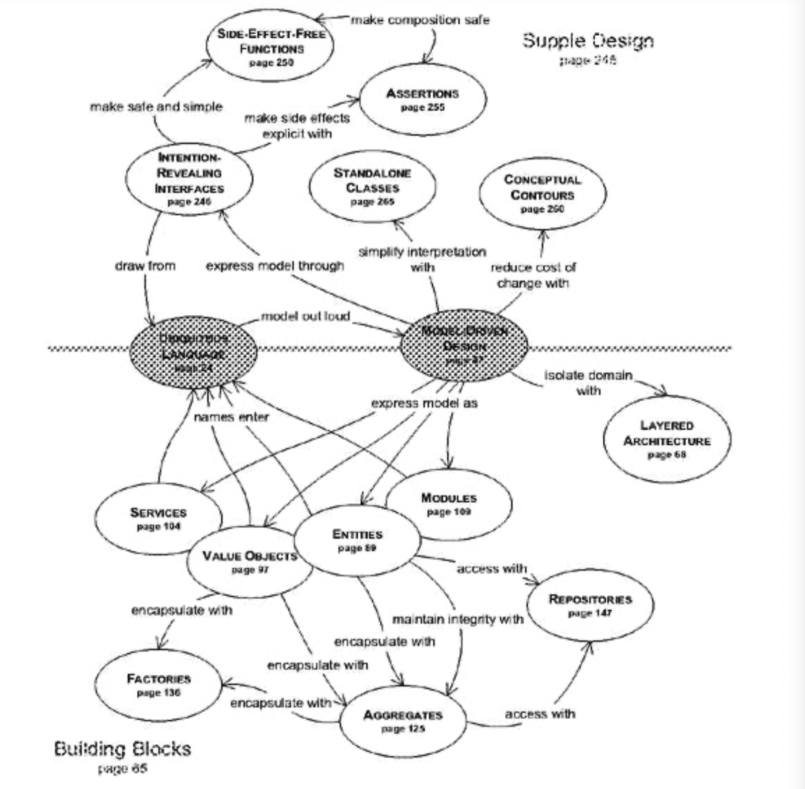
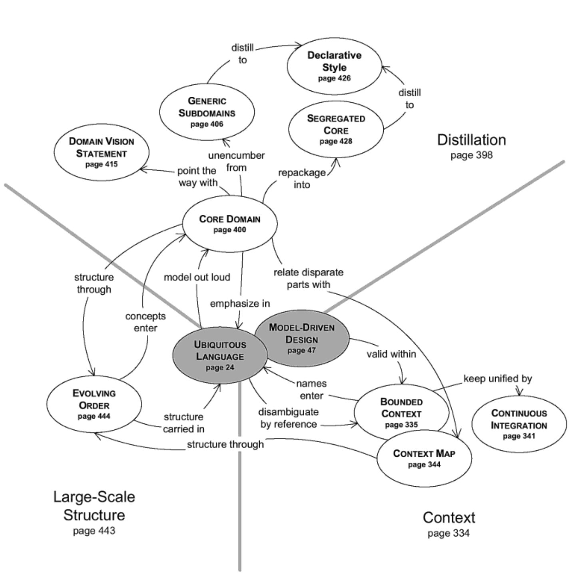

## 领域驱动团队

#### ▶[上一节](5.md)

<ins>尽管理解领域驱动设计的个人开发者能获得宝贵的设计技巧与视角，但真正的收益在于团队协作应用领域驱动设计方法，并将领域模型置于项目讨论的核心。通过这种方式，团队成员将共享一种丰富沟通且与软件紧密关联的语言。他们将产出与模型同步的清晰实现，为应用开发提供杠杆作用。团队将共享各设计模块的关联图谱，系统性聚焦于对组织最具特色与价值的功能特性。</ins>

领域驱动设计虽是艰巨的技术挑战，却能带来丰厚回报，当多数软件项目开始僵化为遗留系统时，它恰恰能开辟全新机遇。

#### ▶[下一节](../acknowledgments.md)
