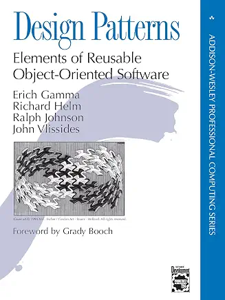

## 设计模式：可复用面向对象软件的基础

 
Erich Gamma, Richard Helm, Ralph Johnson, John Vlissides · 1995

## 目录

- [前言](./preface.md)
- [序言](./foreword.md)
- [读者指南](./guide.md)
- [第 1 章 引言](ch1/0.md)
  - [1.1 什么是设计模式？](ch1/1.md)
  - [1.2 Smalltalk MVC 中的设计模式](ch1/2.md)
  - [1.3 描述设计模式](ch1/3.md)
  - [1.4 设计模式目录](ch1/4.md)
  - [1.5 组织目录](ch1/5.md)
  - [1.6 设计模式如何解决设计问题](ch1/6.md)
  - [1.7 如何选择设计模式](ch1/7.md)
  - [1.8 如何使用设计模式](ch1/8.md)
- [设计模式目录](partII.md)
  - [第 3 章 创建型模式](ch3/0.md)
    - [3.1 Abstract Factory](ch3/1.md)
    - [3.2 Builder](ch3/2.md)
    - [3.3 Factory Method](ch3/3.md)
    - [3.4 Prototype](ch3/4.md)
    - [3.5 Singleton](ch3/5.md)
    - [3.6 创建型模式讨论](ch3/6.md)
