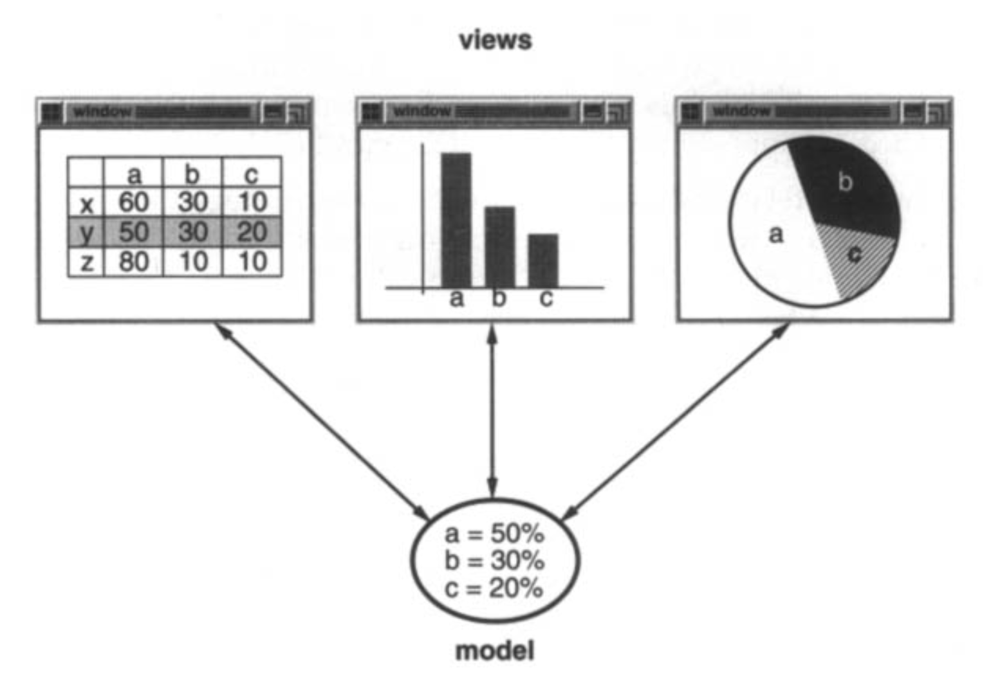

# 1.2 Smalltalk MVC 中的设计模式

Model/View/Controller（MVC）类三元组 [KP88](../biblio.md#kp88) 用于在 Smalltalk-80 中构建用户界面。
审视 MVC 内部的设计模式，应该有助于你理解我们所说的 “模式” 一词是什么意思。

MVC 由三种对象组成。
Model 是应用对象，View 是它的屏幕呈现，而 Controller 定义用户界面对用户输入的反应方式。
在 MVC 之前，用户界面设计倾向于把这些对象混在一起。
MVC 将它们解耦，以提高灵活性和复用性。

MVC 通过在视图和模型之间建立订阅/通知协议，将视图和模型解耦。
视图必须确保其外观反映模型的状态。
每当模型的数据变化时，模型就通知依赖它的视图。
作为响应，每个视图都有机会更新自己。
这种方法让你可以把多个视图附加到一个模型上，以提供不同的呈现。
你也可以为模型创建新视图，而不必重写它。

下图显示了一个模型和三个视图。
（为简单起见，我们省略了控制器。）
模型包含一些数据值，而定义电子表格、直方图和饼图的视图以各种方式显示这些数据。
当模型的值变化时，模型与它的视图通信，而视图与模型通信以访问这些值。

 

从表面上看，这个例子反映了一种将视图与模型解耦的设计。
但这种设计适用于一个更一般的问题：解耦对象，使一个对象的变化可以影响任意数量的其他对象，而不需要被改变的对象知道其他对象的细节。
这个更一般的设计由 [Observer (293)](../ch5/7.md) 设计模式描述。

MVC 的另一个特性是视图可以嵌套。
例如，一个按钮控制面板可以实现为一个包含嵌套按钮视图的复杂视图。
一个对象检查器的用户界面可以由嵌套视图组成，这些视图可以在调试器中复用。
MVC 用 `CompositeView` 类支持嵌套视图，它是 `View` 的子类。
`CompositeView` 对象的行为就像 `View` 对象一样；复合视图可以用在任何可以使用视图的地方，但它也包含并管理嵌套视图。

同样，我们可以把这看作一种设计，让我们能像对待复合视图的某个组件一样对待复合视图。
但这种设计适用于一个更一般的问题，它在我们想要把对象分组并像对待单个对象一样对待这个组时出现。
这个更一般的设计由 [Composite (163)](../ch4/3.md) 设计模式描述。
它让你创建一个类层次结构，其中一些子类定义原始对象（例如 `Button`），其他类定义复合对象（`CompositeView`），这些复合对象把原始对象组装成更复杂的对象。

MVC 还让你改变视图响应用户输入的方式，而不改变其视觉呈现。
例如，你可能想改变它响应键盘的方式，或者让它使用弹出菜单而不是命令键。
MVC 把响应机制封装在一个 `Controller` 对象中。
有一个控制器类层次结构，使得在现有控制器的基础上创建新控制器作为变体变得容易。

一个视图使用一个 `Controller` 子类的实例来实现特定的响应策略；
要实现不同的策略，只需把该实例替换为另一种控制器。
甚至可以在运行时改变视图的控制器，让视图改变其响应用户输入的方式。
例如，只需给视图一个忽略输入事件的控制器，就可以禁用它，使其不接受输入。

View-Controller 关系是 [Strategy (315)](../ch5/9.md) 设计模式的一个例子。
Strategy 是一个表示算法的对象。
当你想静态或动态地替换算法、当你有许多算法变体，或当算法有你想封装的复杂数据结构时，它很有用。

MVC 还使用其他设计模式，例如用 [Factory Method (107)](../ch3/3.md) 为一个视图指定默认控制器类，用 [Decorator (175)](../ch4/4.md) 为视图添加滚动。
但 MVC 中的主要关系由 Observer、Composite 和 Strategy 设计模式给出。
