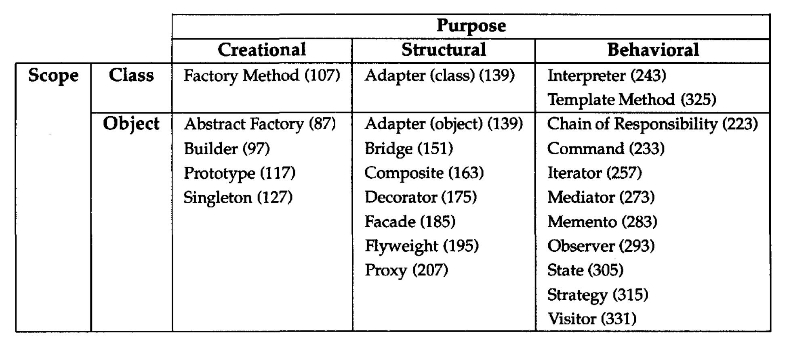

# 1.5 组织目录

设计模式在粒度和抽象层次上各不相同。
因为设计模式很多，我们需要一种方式来组织它们。
本节对设计模式进行分类，以便我们可以指代相关的模式族。
分类帮助你更快地学习目录中的模式，也可以指导寻找新模式的努力。

我们按两个标准对设计模式分类（表 1.1）。
第一个标准称为目的，反映模式做什么。
模式可以有创建型、结构型或行为型目的。
创建型模式关注对象创建的过程。
结构型模式处理类或对象的组合。
行为型模式刻画类或对象交互和分配职责的方式。

*表 1.1：设计模式空间* <br/>
<br/>

<!-- ```text -->
<!--                  +--------------------------------------------------------------------------------+ -->
<!--                  |                             Purpose                                            | -->
<!--                  +-----------------------+------------------------+-------------------------------+ -->
<!--                  | Creational            | Structural             | Behavioral                    | -->
<!-- +-------+--------+-----------------------+------------------------+-------------------------------+ -->
<!-- | Scope | Class  | Factory Method (107)  | Adapter (class) (139)  | Interpreter (243)             | -->
<!-- |       |        |                       |                        | Template Method (325)         | -->
<!-- +       +--------+-----------------------+------------------------+-------------------------------+ -->
<!-- |       | Object | Abstract Factory (87) | Adapter (object) (139) | Chain of Responsibility (223) | -->
<!-- |       |        | Builder (97)          | Bridge (151)           | Command (233)                 | -->
<!-- |       |        | Prototype (117)       | Composite (163)        | Iterator (257)                | -->
<!-- |       |        | Singleton (127)       | Decorator (175)        | Mediator (273)                | -->
<!-- |       |        |                       | Facade (185)           | Memento (283)                 | -->
<!-- |       |        |                       | Flyweight (195)        | Observer (293)                | -->
<!-- |       |        |                       | Proxy (207)            | State (305)                   | -->
<!-- |       |        |                       |                        | Strategy (315)                | -->
<!-- |       |        |                       |                        | Visitor (331)                 | -->
<!-- +-------+--------+-----------------------+------------------------+-------------------------------+ -->
<!-- ``` -->


第二个标准称为范围，指定模式主要适用于类还是对象。
类模式处理类与其子类之间的关系。
这些关系通过继承建立，所以它们是静态的 —— 在编译时固定。
对象模式处理对象关系，这些关系可以在运行时改变，更具动态性。
几乎所有模式都在某种程度上使用继承。
所以唯一被标记为 “类模式” 的是那些聚焦于类关系的模式。
注意，大多数模式属于对象范围。

创建型类模式把对象创建的某一部分推迟到子类，而创建型对象模式把它推迟到另一个对象。
结构型类模式使用继承来组合类，而结构型对象模式描述组装对象的方式。
行为型类模式使用继承来描述算法和控制流，而行为型对象模式描述一组对象如何协作来完成单个对象无法独自完成的任务。

还有其他组织模式的方式。
有些模式经常一起使用。例如，Composite 经常与 Iterator 或 Visitor 一起使用。
有些模式是替代方案：Prototype 常常是 Abstract Factory 的替代方案。
有些模式即使意图不同，也会产生相似的设计。
例如，Composite 和 Decorator 的结构图相似。

还有一种组织设计模式的方式，是根据它们在 “相关模式” 部分中如何相互引用。
[图 1.1](6.md#fig-1-6-1) 以图形方式描绘了这些关系。

显然，组织设计模式有很多方式。
对模式有多种思考方式，会加深你对它们做什么、如何比较以及何时应用它们的洞见。
