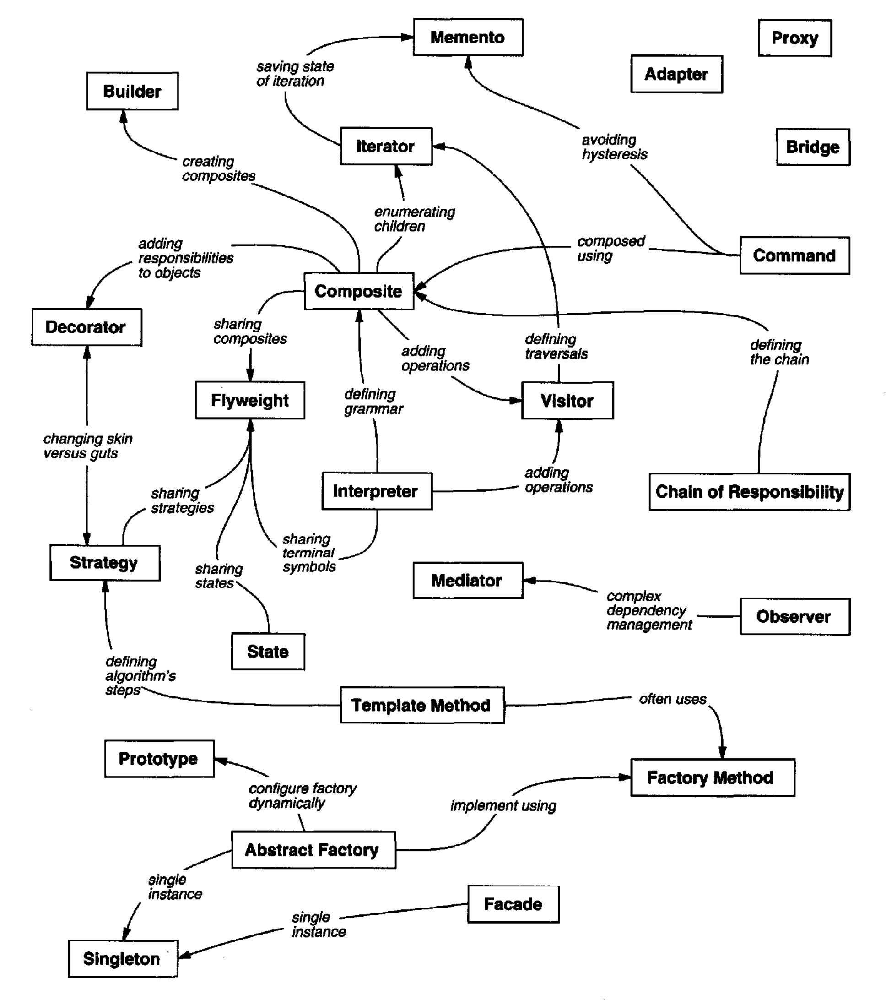
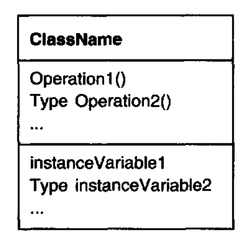
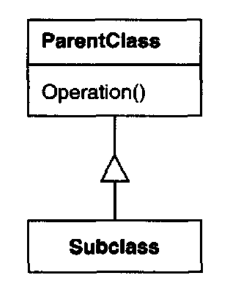
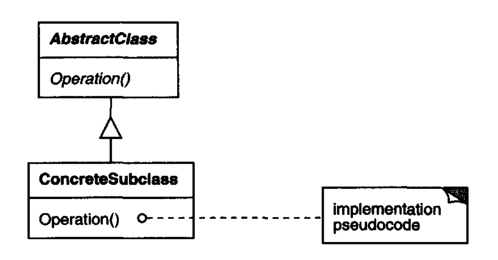
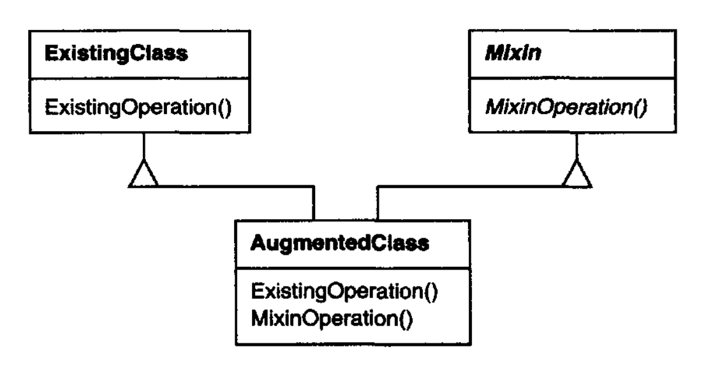
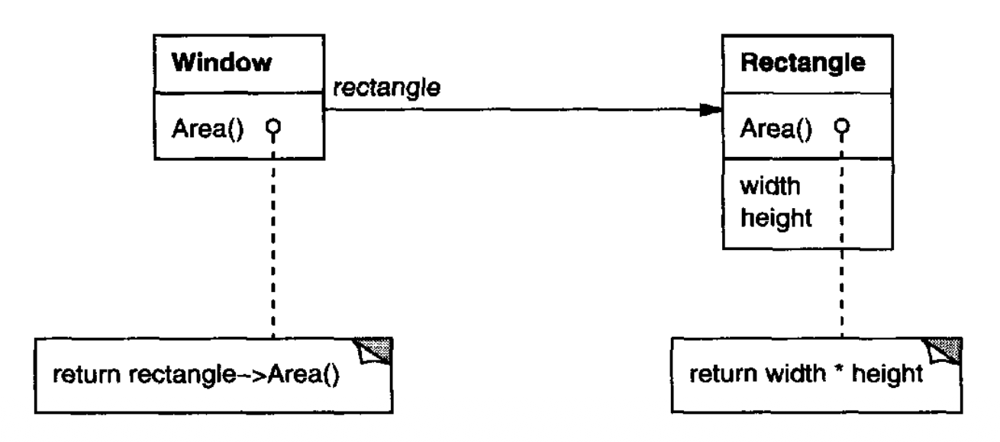

# 1.6 设计模式如何解决设计问题

设计模式以许多不同方式解决面向对象设计者日常面临的许多问题。
以下是其中一些问题，以及设计模式如何解决它们。

## 1.6.1 寻找合适的对象

面向对象程序由对象组成。
对象把数据和对这些数据进行操作的过程打包在一起。
这些过程通常被称为方法或操作。
当一个对象从客户端接收到一个请求（或消息）时，它就执行一个操作。

请求是让对象执行操作的唯一方式。
操作是改变对象内部数据的唯一方式。
由于这些限制，对象的内部状态被称为被封装的；它不能被直接访问，而且它的表示从对象外部不可见。

面向对象设计中困难的部分是把系统分解为对象。
这项任务之所以困难，是因为许多因素都会起作用：封装、粒度、依赖、灵活性、性能、演化、可复用性，等等。
它们都以常常相互冲突的方式影响分解。

面向对象设计方法论青睐许多不同的方法。
你可以写一份问题陈述，挑出名词和动词，并创建相应的类和操作。
或者你可以聚焦于系统中的协作和职责。
或者你可以对现实世界建模，并把分析期间发现的对象转化为设计。
关于哪种方法最好，总会有分歧。

<ins>设计中的许多对象来自分析模型。
但面向对象设计常常最终得到在现实世界中没有对应物的类。</ins>
其中一些是像数组这样的低层类。
另一些则层次高得多。
例如，[Composite (163)](../ch4/3.md) 模式引入了一种用于统一对待对象的抽象，而它没有物理对应物。
对现实世界的严格建模会导致一个反映今天现实但不一定反映明天现实的系统。
在设计期间涌现的抽象是让设计灵活的关键。

*图 1.1：设计模式关系*   
 

<ins>设计模式帮助你识别不那么明显的抽象，以及能够捕捉这些抽象的对象。</ins>
例如，表示过程或算法的对象在自然界中并不存在，但它们是灵活设计的关键部分。
[Strategy (315)](../ch5/9.md) 模式描述如何实现可互换的算法族。
[State (305)](../ch5/8.md) 模式把实体的每个状态表示为一个对象。
这些对象很少在分析期间甚至在设计的早期阶段被发现；它们是在让设计更灵活、更可复用的过程中较晚被发现的。

## 1.6.2 确定对象粒度

对象在大小和数量上可能差异巨大。
它们可以表示从硬件一直到整个应用程序的一切。
我们如何决定什么应该是一个对象？

设计模式也处理这个问题。[Facade (185)](../ch4/5.md) 模式描述如何把完整子系统表示为对象，
而 [Flyweight (195)](../ch4/6.md) 模式描述如何在最细粒度上支持大量对象。
其他设计模式描述把对象分解为更小对象的具体方式。
[Abstract Factory (87)](../ch3/1.md) 和 [Builder (97)](../ch3/2.md) 产生这样的对象：其唯一职责是创建其他对象。
[Visitor (331)](../ch5/11.md) 和 [Command (233)](../ch5/2.md) 产生这样的对象：其唯一职责是在另一个对象或一组对象上实现一个请求。

## 1.6.3 指定对象接口

一个对象声明的每个操作都指定操作名称、它作为参数接收的对象，以及操作的返回值。
这被称为操作的 **签名 (signature)** 。
一个对象的操作所定义的所有签名的集合称为该对象的 **接口 (interface)** 。
一个对象的接口刻画了可以发送给该对象的完整请求集。
任何与该对象接口中某个签名匹配的请求都可以发送给该对象。

**类型 (type)** 是用于表示某个特定接口的名称。
如果一个对象接受对名为 “Window” 的接口中定义的所有操作的请求，我们就说它具有 “Window” 类型。
一个对象可以有许多类型，而差异很大的对象可以共享一个类型。
一个对象接口的一部分可以由一个类型刻画，其他部分由其他类型刻画。
同一类型的两个对象只需要共享它们接口的部分。
接口可以包含其他接口作为子集。
如果一个类型的接口包含其 **超类型 (supertype)** 的接口，我们就说它是另一个类型的 **子类型 (subtype)** 。
我们常说一个子类型继承其超类型的接口。

接口是面向对象系统的基础。
对象只能通过它们的接口被了解。
不经过对象的接口，就无法知道关于它的任何事情，也无法要求它做任何事情。
一个对象的接口不说明它的实现 —— 不同对象可以自由地以不同方式实现请求。
这意味着两个实现完全不同的对象可以拥有相同的接口。

当一个请求被发送给一个对象时，实际执行的具体操作取决于请求和接收对象两者。
支持相同请求的不同对象，可能对满足这些请求的操作有不同的实现。
请求与某个对象及其某个操作在运行时的关联被称为 **动态绑定 (dynamic binding)** 。

动态绑定意味着发出一个请求并不会让你承诺某个特定实现，直到运行时才确定。
因此，你可以编写期望具有特定接口的对象的程序，并知道任何具有正确接口的对象都会接受该请求。
此外，动态绑定让你可以在运行时用具有相同接口的对象互相替换。
这种可替换性被称为 **多态 (polymorphism)** ，它是面向对象系统中的一个关键概念。
它让一个客户端对象除支持某个特定接口之外，对其他对象几乎不需要做假设。
多态简化了客户端的定义，把对象彼此解耦，并让它们可以在运行时改变彼此的关系。

设计模式通过识别接口的关键元素以及跨接口发送的数据种类，帮助你定义接口。
设计模式还可能告诉你不要把什么放进接口。
[Memento (283)](../ch5/6.md) 模式是一个很好的例子。
它描述如何封装并保存一个对象的内部状态，以便该对象以后可以恢复到那个状态。
该模式规定 Memento 对象必须定义两个接口：一个受限接口，让客户端持有和复制备忘录；
以及一个特权接口，只有原对象可以使用它来在备忘录中存储和取回状态。

设计模式还规定接口之间的关系。
特别是，它们常常要求某些类具有相似的接口，或者对某些类的接口施加约束。
例如，[Decorator (175)](../ch4/4.md) 和 [Proxy (207)](../ch4/7.md) 都要求 Decorator 和 Proxy 对象的接口与被装饰对象和被代理对象相同。
在 [Visitor (331)](../ch5/11.md) 中，Visitor 接口必须反映访问者可以访问的所有对象类。

## 1.6.4 指定对象实现

到目前为止，我们很少谈到我们实际上如何定义一个对象。
一个对象的实现由它的 **类 (class)** 定义。
类指定对象的内部数据和表示，并定义对象可以执行的操作。

我们基于 OMT 的记法（在 [附录 B](../appendix-b.md) 中总结）把一个类描绘为一个矩形，类名用粗体显示。
操作以正常字体出现在类名下方。
类定义的任何数据都出现在操作之后。
线把类名与操作、操作与数据分隔开：

 

返回类型和实例变量类型是可选的，因为我们不假设一种静态类型的实现语言。

对象通过 **实例化 (instantiating)** 一个类来创建。
该对象被称为该类的一个 **实例 (instance)** 。
实例化一个类的过程为该对象的内部数据（由 **实例变量 (instance variables)** 组成）分配存储空间，并把操作与这些数据关联起来。
通过实例化一个类，可以创建许多相似的对象实例。

一条带虚线箭头的线表示一个类实例化另一个类的对象。
箭头指向被实例化对象的类。

 

新类可以使用 **类继承 (class inheritance)** 基于现有类来定义。
当一个 **子类 (subclass)** 从 **父类 (parent class)** 继承时，它包括父类定义的所有数据和操作的定义。
作为子类实例的对象将包含子类及其父类定义的所有数据，并且能够执行这个子类及其父类定义的所有操作。
我们用一条竖线和三角形表示子类关系：

 

**抽象类 (abstract class)** 是这样一种类：其主要目的是为其子类定义一个公共接口。
抽象类会把它的部分或全部实现推迟到子类中定义的操作；因此抽象类不能被实例化。
抽象类声明但不实现的操作被称为 **抽象操作 (abstract operations)** 。
不是抽象的类被称为 **具体类 (concrete classes)** 。

子类可以细化和重定义其父类的行为。
更具体地说，一个类可以 **重写 (override)** 其父类定义的操作。
重写让子类有机会代替其父类处理请求。
类继承让你只需通过扩展现有其他类来定义类，使定义具有相关功能的对象族变得容易。

抽象类的名称以斜体显示，以区别于具体类。
斜体也用于表示抽象操作。
图可能包括某个操作实现的伪代码；如果是这样，代码将出现在一个折角框中，并通过虚线连接到它所实现的操作。

 

**混入类 (mixin class)** 是一种旨在为其他类提供可选接口或功能的类。
它类似于抽象类，因为它不打算被实例化。
混入类需要多重继承：

 

### 类继承与接口继承

理解对象的类与其类型之间的区别很重要。

对象的类定义对象如何被实现。
类定义对象的内部状态及其操作的实现。
相比之下，对象的类型只指它的接口 —— 它可以响应的请求集合。
一个对象可以有许多类型，而不同类的对象可以具有相同的类型。

当然，类和类型之间有密切关系。
因为类定义对象可以执行的操作，它也定义对象的类型。
当我们说一个对象是某个类的实例时，我们意味着该对象支持该类定义的接口。

像 C++ 和 Eiffel 这样的语言使用类来同时指定对象的类型和实现。
Smalltalk 程序不声明变量类型；因此，编译器不检查赋给变量的对象类型是否为该变量类型的子类型。
发送消息需要检查接收者的类是否实现了该消息，但不要求检查接收者是否为特定类的实例。

<ins>理解类继承与接口继承（或子类型化）之间的区别也很重要。
类继承根据另一个对象的实现来定义对象的实现。
简而言之，它是一种代码和表示共享的机制。
相比之下，接口继承（或子类型化）描述一个对象何时可以代替另一个对象使用</ins>。

这两个概念很容易混淆，因为许多语言没有明确区分它们。
在像 C++ 和 Eiffel 这样的语言中，继承既意味着接口继承也意味着实现继承。
在 C++ 中继承接口的标准方式，是从一个具有（纯）虚成员函数的类公开继承。
纯接口继承在 C++ 中可以通过从纯抽象类公开继承来近似实现。
纯实现继承或类继承可以通过私有继承来近似实现。
在 Smalltalk 中，继承只意味着实现继承。
你可以把任何类的实例赋给一个变量，只要这些实例支持对该变量值执行的操作。

尽管大多数编程语言不支持接口继承与实现继承之间的区分，人们在实践中会做出这种区分。
Smalltalk 程序员通常表现得好像子类就是子类型（尽管有一些著名的例外 [Coo92](../biblio.md#coo92) ）；C++ 程序员通过抽象类定义的类型来操作对象。

许多设计模式依赖于这种区分。
例如，[Chain of Responsibility (223)](../ch5/1.md) 中的对象必须有一个公共类型，但通常它们不共享一个公共实现。
在 [Composite (163)](../ch4/3.md) 模式中，Component 定义一个公共接口，但 Composite 常常定义一个公共实现。
[Command (233)](../ch5/2.md)、[Observer (293)](../ch5/7.md)、[State (305)](../ch5/8.md) 和 [Strategy (315)](../ch5/9.md) 常常用纯接口的抽象类来实现。

### 面向接口编程，而不是面向实现编程

类继承基本上只是一种通过复用父类中的功能来扩展应用程序功能的机制。
它让你可以基于旧对象快速定义一种新对象。
它让你几乎免费获得新实现，从现有类继承你所需的大部分内容。

<ins>然而，实现复用只是故事的一半。
继承定义具有相同接口的对象族的能力（通常通过从抽象类继承）也很重要。
为什么？因为多态依赖于它。</ins>

当继承被谨慎使用时（有些人会说正确地使用时），从抽象类派生的所有类都将共享它的接口。
这意味着子类只是添加或重写操作，而不隐藏父类的操作。
所有子类随后都可以响应该抽象类接口中的请求，使它们都成为该抽象类的子类型。

仅按照抽象类定义的接口来操作对象有两个好处：

1. 客户端始终不知道它们使用的对象的具体类型，只要这些对象遵循客户端期望的接口。

2. 客户端始终不知道实现这些对象的类。客户端只知道定义接口的抽象类。

这大大减少了子系统之间的实现依赖，从而引出以下可复用面向对象设计的原则：

> 面向接口编程，而不是面向实现编程。

不要把变量声明为特定具体类的实例。
相反，只承诺一个由抽象类定义的接口。
你会发现这是本书中设计模式的一个常见主题。

当然，你必须在系统的某个地方实例化具体类（即指定一个特定实现），而创建型模式（[Abstract Factory (87)](../ch3/1.md)、[Builder (97)](../ch3/2.md)、[Factory Method (107)](../ch3/3.md)、[Prototype (117)](../ch3/4.md) 和 [Singleton (127)](../ch3/5.md)）让你正好可以做到这一点。
通过抽象对象创建过程，这些模式给你不同的方式，在实例化时透明地把接口与其实现关联起来。
创建型模式确保你的系统是按照接口而不是实现编写的。

## 1.6.5 让复用机制发挥作用

大多数人都能理解对象、接口、类和继承等概念。
挑战在于应用它们来构建灵活、可复用的软件，而设计模式可以向你展示如何做到。

### 比较继承与组合

在面向对象系统中复用功能最常见的两种技术是类继承和 **对象组合 (object composition)** 。
正如我们已经解释的，类继承让你根据另一个类的实现来定义一个类的实现。
通过子类化进行的复用通常被称为 **白盒复用 (white-box reuse)** 。
“白盒” 一词指的是可见性：有了继承，父类的内部往往对子类可见。

对象组合是类继承的一种替代方案。
在这里，新功能是通过组装或组合对象来获得更复杂的功能。
对象组合要求被组合的对象具有定义良好的接口。
这种复用风格被称为 **黑盒复用 (black-box reuse)** ，因为对象的内部细节不可见。
对象只作为 “黑盒” 出现。

继承和组合各有优缺点。
类继承在编译时静态定义，使用起来很直接，因为它由编程语言直接支持。
类继承也让修改被复用的实现变得更容易。
当一个子类重写部分而非全部操作时，它也可能影响它继承的操作，假设这些操作调用了被重写的操作。

但类继承也有一些缺点。
首先，你不能在运行时改变从父类继承的实现，因为继承是在编译时定义的。
其次，通常更糟的是，父类往往至少定义其子类的部分物理表示。
因为继承向子类暴露其父类实现的细节，所以人们常说 “继承破坏了封装” [Sny86](../biblio.md#sny86) 。
子类的实现变得与其父类的实现紧密绑定，以至于父类实现中的任何变化都会迫使子类改变。

当你试图复用一个子类时，实现依赖可能会导致问题。
如果继承实现的任何方面不适合新的问题领域，父类就必须被重写，或被更合适的东西替换。
这种依赖限制了灵活性，并最终限制了可复用性。
对此的一种补救方法是只从抽象类继承，因为它们通常提供很少或根本不提供实现。

对象组合在运行时通过对象获取对其他对象的引用而动态定义。
组合要求对象尊重彼此的接口，这反过来要求精心设计的接口，不阻止你把一个对象与许多其他对象一起使用。
但这是有回报的。
因为对象只通过它们的接口被访问，我们不会破坏封装。
任何对象都可以在运行时被另一个具有相同类型的对象替换。
此外，因为一个对象的实现将按照对象接口来编写，实现依赖会大幅减少。

对象组合对系统设计还有另一个影响。
偏向对象组合而非类继承，有助于你让每个类保持封装并专注于一个任务。
你的类和类层次结构将保持较小，不太可能长成难以管理的怪物。
另一方面，基于对象组合的设计会有更多对象（如果类更少），而系统的行为将取决于它们的相互关系，而不是在一个类中定义。

这引出了我们面向对象设计的第二条原则：

> 偏向对象组合，而非类继承。

理想情况下，你不应该为了达到复用而必须创建新组件。
你应该能够仅通过对象组合组装现有组件，就获得所需的所有功能。
但情况很少如此，因为可用的组件集合在实践中从来都不够丰富。
通过继承进行复用，让创建可以与旧组件组合的新组件变得更容易。
因此，继承和对象组合协同工作。

尽管如此，我们的经验表明：设计者常常过度使用继承作为复用手段；
更多依赖对象组合，往往能让设计具备更好的可复用性（同时更简洁）。
在各类设计模式中，你会反复看到对象组合的应用。

### 委托

**委托 (delegation)** 是一种让组合在复用方面像继承一样强大的方式 [Lie86](../biblio.md#lie86), [JZ91](../biblio.md#jz91) 。
在委托中，有两个对象参与处理一个请求：一个接收对象把操作委托给它的委托对象。
这类似于子类把请求推迟给父类。
但在继承中，一个继承的操作总是可以通过 C++ 中的 `this` 成员变量和 Smalltalk 中的 `self` 来引用接收对象。
要用委托达到同样的效果，接收者把自身传给委托对象，让被委托的操作可以引用接收者。

例如，`Window` 类可以不把 `Rectangle` 作为子类（因为窗口恰好是矩形的），而是通过保留一个 `Rectangle` 实例变量并把特定于 `Rectangle` 的行为委托给它，来复用 `Rectangle` 的行为。
换句话说，`Window` 不 “是一个” `Rectangle`，而是 “有一个” `Rectangle`。
`Window` 现在必须显式地把请求转发给它的 `Rectangle` 实例，而以前它会继承那些操作。

下图描绘了 `Window` 类把它的 `Area` 操作委托给一个 `Rectangle` 实例。

 

一条普通箭头线表示一个类持有对另一个类实例的引用。
这个引用有一个可选名称，在这个例子中是 `rectangle`。

委托的主要优点是，它让在运行时组合行为以及改变它们的组合方式变得容易。
我们的窗口可以在运行时简单地通过把它的 `Rectangle` 实例替换为 `Circle` 实例而变成圆形，假设 `Rectangle` 和 `Circle` 具有相同的类型。

委托存在一个缺点，这一点和其他依靠对象组合提升软件灵活性的技术相同：
动态、高度参数化的软件相比更静态的软件，更难理解。
也存在运行时效率低下的问题，但从长远来看，人的效率低下更重要。
只有当委托简化多于复杂化时，它才是一个好的设计选择。
要给出确切告诉你何时使用委托的规则并不容易，因为它的效果取决于语境以及你对此有多少经验。
委托在高度程式化的方式中使用时效果最好 —— 也就是说，在标准模式中使用。

有几种设计模式使用委托。
[State (305)](../ch5/8.md)、[Strategy (315)](../ch5/9.md) 和 [Visitor (331)](../ch5/11.md) 模式依赖它。
在 State 模式中，一个对象把请求委托给一个表示其当前状态的 State 对象。
在 Strategy 模式中，一个对象把特定请求委托给一个表示执行该请求的策略的对象。
一个对象只会有一个状态，但它可以有许多针对不同请求的策略。
这两种模式的目标都是：通过更换接收委托请求的对象，来改变原对象的行为。
在 Visitor 中，对对象结构每个元素执行的操作总是被委托给 Visitor 对象。

其他模式对委托的使用较少。
[Mediator (273)](../ch5/5.md) 引入一个对象来调解其他对象之间的通信。
有时 Mediator 对象只是把操作转发给其他对象来实现它们；
另一些时候，它传递一个对自身的引用，从而使用真正的委托。
[Chain of Responsibility (223)](../ch5/1.md) 通过沿一条对象链把请求从一个对象转发到另一个对象来处理请求。
有时这个请求携带一个对接收该请求的原对象的引用，在这种情况下该模式就在使用委托。
[Bridge (151)](../ch4/2.md) 将抽象与其实现解耦。
如果抽象和某个特定实现紧密匹配，那么抽象可以简单地把操作委托给那个实现。

<ins>委托是对象组合的一个极端例子。
它表明，作为代码复用机制，你总是可以用对象组合替代继承。</ins>

### 继承与参数化类型

另一种（严格来说并非面向对象的）复用功能的技术是通过 **参数化类型 (parameterized types)** ，也称为 **泛型 (generics)**（Ada、Eiffel）和 **模板 (templates)** （C++）。
这种技术让你定义一个类型时不必指定它使用的所有其他类型。
未指定的类型在使用点作为参数提供。
例如，一个 `List` 类可以由它包含的元素类型来参数化。
要声明一个整数列表，你把类型 “integer” 作为参数提供给 `List` 参数化类型。
要声明一个 `String` 对象列表，你把 “String” 类型作为参数提供。
语言实现将为每种元素类型创建 `List` 类模板的定制版本。

<ins>参数化类型给了我们第三种（除类继承和对象组合之外）在面向对象系统中组合行为的方式。</ins>
许多设计可以用这三种技术中的任何一种来实现。
要按用于比较元素的操作来参数化一个排序例程，我们可以把比较做成

1. 由子类实现的操作（[Template Method (325)](../ch5/10.md) 的一种应用），
2. 传递给排序例程的一个对象的职责（[Strategy (315)](../ch5/9.md)），或
3. C++ 模板或 Ada 泛型的一个参数，指定用于比较元素的函数名称。

这些技术之间有重要差异。
对象组合让你在运行时改变被组合的行为，但它也需要间接层，而且可能效率较低。
继承让你为操作提供默认实现，并让子类重写它们。
参数化类型让你改变一个类可以使用的类型。
但继承和参数化类型都不能在运行时改变。
哪种方法最好取决于你的设计和实现约束。

本书中没有任何模式涉及参数化类型，尽管我们偶尔用它们来定制某个模式的 C++ 实现。
在像 Smalltalk 这样没有编译时类型检查的语言中，根本不需要参数化类型。

## 1.6.6 关联运行时结构与编译时结构

<ins>面向对象程序的运行时结构往往与其代码结构几乎没有相似之处。
代码结构在编译时被冻结；它由处于固定继承关系中的类组成。
程序的运行时结构由快速变化的、相互通信的对象网络组成。
事实上，这两种结构在很大程度上是独立的。</ins>
试图从一种理解另一种，就像试图从植物和动物的静态分类学理解活生态系统的动态，反之亦然。

考虑对象 **聚合 (aggregation)** 与 **相识 (acquaintance)** 之间的区别，以及它们在编译时和运行时如何以不同方式表现。
聚合意味着一个对象拥有或负责另一个对象。
一般来说，我们说一个对象拥有另一个对象或是另一个对象的一部分。
聚合意味着聚合对象及其拥有者具有相同的生命周期。

相识意味着一个对象仅仅知道另一个对象。
有时相识被称为 “关联” 或 “使用” 关系。
相识的对象可以请求彼此的操作，但它们不互相负责。
相识是一种比聚合更弱的关系，表明对象之间的耦合松散得多。

在我们的图中，一条普通箭头线表示相识。一条底部带菱形的箭头线表示聚合：

 

人们很容易混淆聚合和相识，因为它们常常以相同方式实现。
在 Smalltalk 中，所有变量都是对其他对象的引用。
编程语言中聚合和相识没有区别。
在 C++ 中，聚合可以通过定义作为真实实例的成员变量来实现，但更常见的是把它们定义为指向实例的指针或引用。
相识也用指针和引用来实现。

<ins>归根结底，聚合和相识更多由意图决定，而不是由显式语言机制决定。
在编译时结构中可能很难看出这种区别，但它很重要。
聚合关系往往比相识更少、更持久。
相比之下，相识关系被建立和重建得更频繁，有时只在某个操作持续期间存在。
相识也更具动态性，这使它们在源代码中更难辨别。</ins>

由于程序的运行时结构和编译时结构之间存在如此大的差异，代码显然不会揭示系统将如何工作的全部内容。
系统的运行时结构必须更多地由设计者而不是语言来强加。
对象及其类型之间的关系必须非常谨慎地设计，因为它们决定运行时结构是好是坏。

许多设计模式（特别是那些具有对象范围的模式）明确捕捉了编译时结构与运行时结构之间的区别。
[Composite (163)](../ch4/3.md) 和 [Decorator (175)](../ch4/4.md) 对于构建复杂的运行时结构特别有用。
[Observer (293)](../ch5/7.md) 涉及的运行时结构往往很难理解，除非你知道这个模式。
[Chain of Responsibility (223)](../ch5/1.md) 也会产生继承所不能揭示的通信模式。
一般来说，除非你理解这些模式，否则从代码中看不出运行时结构。

## 1.6.7 为变化而设计

<ins>最大化复用的关键在于预判新需求和对现有需求的变化，并设计你的系统使其能够相应地演化。</ins>
为了让系统对此类变化具有健壮性，你必须考虑系统在其生命周期内可能需要如何变化。
不考虑变化的设计会在未来冒重大重新设计的风险。
这些变化可能涉及类重定义和重新实现、客户端修改以及重新测试。
重新设计会影响软件系统的许多部分，而意外变化总是代价高昂。

<ins>设计模式通过确保系统能够以特定方式变化，帮助你避免这一点。
每个设计模式都让系统结构的某个方面可以独立于其他方面变化，从而使系统对某一类特定变化更健壮。</ins>

以下是一些常见的重新设计原因，以及处理它们的设计模式：

1. *通过显式指定类来创建对象。*
创建对象时指定类名，会让你承诺某个特定实现，而不是某个特定接口。
这种承诺会使未来的变化复杂化。
为了避免它，间接地创建对象。

   设计模式：[Abstract Factory (87)](../ch3/1.md)、[Factory Method (107)](../ch3/3.md)、[Prototype (117)](../ch3/4.md)。

2. *对特定操作的依赖。*
当你指定一个特定操作时，你就承诺了一种满足请求的方式。
通过避免硬编码请求，你可以让在编译时和运行时改变请求被满足的方式变得更容易。

   设计模式：[Chain of Responsibility (223)](../ch5/1.md)、[Command (233)](../ch5/2.md)。

3. *对硬件和软件平台的依赖。*
外部操作系统接口和应用程序编程接口（API）在不同的硬件和软件平台上不同。
依赖特定平台的软件将更难移植到其他平台。
它甚至可能难以在其原生平台上保持最新。
因此，重要的是设计你的系统以限制其平台依赖。

   设计模式：[Abstract Factory (87)](../ch3/1.md)、[Bridge (151)](../ch4/2.md)。

4. *对对象表示或实现的依赖。*
知道一个对象如何被表示、存储、定位或实现的客户端，可能需要在对象变化时改变。
向客户端隐藏这些信息可以防止变化级联。

   设计模式：[Abstract Factory (87)](../ch3/1.md)、[Bridge (151)](../ch4/2.md)、[Memento (283)](../ch5/6.md)、[Proxy (207)](../ch4/7.md)。

5. *算法依赖。*
算法在开发和复用期间常常被扩展、优化和替换。
依赖某个算法的对象将不得不在算法变化时改变。
因此，可能变化的算法应当被隔离。

   设计模式：[Builder (97)](../ch3/2.md)、[Iterator (257)](../ch5/4.md)、[Strategy (315)](../ch5/9.md)、[Template Method (325)](../ch5/10.md)、[Visitor (331)](../ch5/11.md)。

6. *紧耦合。*
紧耦合的类很难单独复用，因为它们相互依赖。
紧耦合导致单体系统，在这种系统中，你无法在不理解和改变许多其他类的情况下改变或移除一个类。
系统变成一团难以学习、移植和维护的密实块。

   松耦合增加了一个类可以单独复用、以及系统可以更容易被学习、移植、修改和扩展的可能性。
   设计模式使用抽象耦合和分层等技术来促进松耦合系统。

   设计模式：[Abstract Factory (87)](../ch3/1.md)、[Bridge (151)](../ch4/2.md)、[Chain of Responsibility (223)](../ch5/1.md)、[Command (233)](../ch5/2.md)、[Facade (185)](../ch4/5.md)、[Mediator (273)](../ch5/5.md)、[Observer (293)](../ch5/7.md)。

7. *通过子类化扩展功能。*
通过子类化定制一个对象往往并不容易。
每个新类都有固定的实现开销（初始化、终结等）。
定义一个子类还需要深入理解父类。
例如，重写一个操作可能需要重写另一个操作。
一个被重写的操作可能需要调用一个继承的操作。
而且子类化可能导致类的爆炸，因为即使是一个简单的扩展，你也可能不得不引入许多新子类。

   对象组合，特别是委托，为组合行为提供了比继承更灵活的替代方案。
   新功能可以通过以新方式组合现有对象来加入应用程序，而不是通过定义现有类的新子类。
   另一方面，大量使用对象组合可能使设计更难理解。许多设计模式产生的设计中，你只需定义一个子类并把它的实例与现有实例组合，就能引入定制功能。

   设计模式：[Bridge (151)](../ch4/2.md)、[Chain of Responsibility (223)](../ch5/1.md)、[Composite (163)](../ch4/3.md)、[Decorator (175)](../ch4/4.md)、[Observer (293)](../ch5/7.md)、[Strategy (315)](../ch5/9.md)。

8. *无法方便地修改类。*
有时你必须修改一个无法方便修改的类。
也许你需要源代码但没有（商业类库可能就是这种情况）。
或者任何改变都需要修改大量现有子类。
设计模式提供了在这种情况下修改类的方式。

   设计模式：[Adapter (139)](../ch4/1.md)、[Decorator (175)](../ch4/4.md)、[Visitor (331)](../ch5/11.md)。

这些例子反映了设计模式能帮助你构建到软件中的灵活性。
这种灵活性有多关键，取决于你正在构建的软件种类。
让我们看看设计模式在三大类软件开发中所扮演的角色：应用程序、工具包和框架。

### 应用程序

如果你正在构建像文档编辑器或电子表格这样的应用程序，那么内部复用、可维护性和扩展性是高度优先的。
内部复用确保你不会设计和实现超出必须的内容。
减少依赖的设计模式可以增加内部复用。
更松的耦合提高了一个类的对象可以与若干其他对象协作的可能性。
例如，当你通过隔离和封装每个操作来消除对特定操作的依赖时，你就让在不同语境中复用某个操作变得更容易。
当你消除算法依赖和表示依赖时，同样的事情也会发生。

当设计模式被用来限制平台依赖并分层系统时，它们也让应用程序更可维护。
它们通过向你展示如何扩展类层次结构以及如何利用对象组合来增强可扩展性。
减少耦合也增强可扩展性。
如果一个类不依赖大量其他类，那么单独扩展它就更容易。

### 工具包

应用程序常常会包含来自一个或多个预定义类库（称为 **工具包 (toolkits)** ）的类。
工具包是一组相关且可复用的类，旨在提供有用的通用功能。
工具包的一个例子是一组用于列表、关联表、栈等的集合类。
C++ I/O 流库是另一个例子。
工具包不对你的应用程序强加特定设计；它们只是提供能帮助你的应用程序完成工作的功能。
它们让你作为实现者避免重新创建常见功能。
工具包强调代码复用。
它们是面向对象中相当于子程序库的东西。

工具包设计可以说比应用程序设计更难，因为工具包必须在许多应用程序中工作才有用。
此外，工具包编写者无法知道那些应用程序会是什么，或它们的特殊需求。
这使得避免可能限制工具包灵活性、进而限制其适用性和有效性的假设和依赖变得更加重要。

### 框架

**框架 (framework)** 是一组相互协作的类，它们为某一特定类别的软件构成一个可复用的设计 [Deu89](../biblio.md#deu89), [JF88](../biblio.md#jf88)。
例如，一个框架可以面向为艺术绘图、音乐作曲和机械 CAD 等不同领域构建图形编辑器 [VL90](../biblio.md#vl90), [Joh92](../biblio.md#joh92) 。
另一个框架可以帮助你为不同编程语言和目标机器构建编译器 [JML92](../biblio.md#jml92) 。
还有一个框架可能帮助你构建金融建模应用程序 [BE93](../biblio.md#be93) 。
你通过创建框架中抽象类的应用程序特定子类，把框架定制到特定应用程序。

框架支配你的应用程序的架构。
它将定义总体结构、其划分为类和对象的方式、其中的关键职责、类和对象如何协作，以及控制线程。
框架预定义了这些设计参数，以便你作为应用程序设计者/实现者可以专注于应用程序的具体细节。
框架捕捉其应用领域中常见的设计决策。
因此，框架强调设计复用而非代码复用，尽管框架通常会包含你可以立即投入工作的具体子类。

这一层面的复用导致应用程序与其所基于的软件之间的控制反转。
当你使用工具包（或就此而言的传统子程序库）时，你编写应用程序的主体，并调用你想复用的代码。
当你使用框架时，你复用主体，并编写它调用的代码。你必须编写具有特定名称和调用约定的操作，但这减少了你必须做出的设计决策。

因此，你不仅可以更快地构建应用程序，而且这些应用程序具有相似的结构。
它们更容易维护，而且对用户来说似乎更一致。
另一方面，你失去了一些创作自由，因为许多设计决策已经为你做出。

<ins>如果应用程序很难设计，工具包更难，那么框架是最难的。</ins>
框架设计者在赌一种架构能适用于该领域中的所有应用程序。
对框架设计的任何实质性改变都会大大降低其好处，因为框架对应用程序的主要贡献是它所定义的架构。
因此，必须把框架设计得尽可能灵活和可扩展。

此外，因为应用程序的设计如此依赖框架，它们对框架接口的变化特别敏感。
随着框架演化，应用程序必须随之演化。
这让松耦合变得更加重要；否则，即使对框架的微小改变也会产生重大影响。

刚才讨论的设计问题对框架设计最为关键。
使用设计模式来处理这些问题的框架，比不使用的框架更有可能实现高水平的设计和代码复用。
成熟的框架通常会包含若干设计模式。
这些模式帮助使框架的架构适合许多不同的应用程序，而无需重新设计。

当框架用它使用的设计模式来记录时，还有一个额外好处 [BJ94](../biblio.md#bj94) 。
了解这些模式的人能更快地洞察框架。
即使不了解这些模式的人，也能从它们为框架文档带来的结构中受益。
增强文档对所有类型的软件都很重要，但对框架尤其重要。
框架往往有陡峭的学习曲线，必须克服之后才有用。
虽然设计模式可能不会完全拉平学习曲线，但它们可以通过让框架设计的关键元素更明确，使曲线不那么陡峭。

因为模式和框架有一些相似之处，人们常常想知道它们如何不同，甚至是否不同。
它们在三个主要方面不同：

1. *设计模式比框架更抽象。*
框架可以被体现在代码中，但只有模式的例子可以被体现在代码中。
框架的一个优势是它们可以用编程语言写下来，不仅被研究，还能直接执行和复用。
相比之下，本书中的设计模式每次使用时都必须被实现。
设计模式还解释设计的意图、取舍和结果。

2. *设计模式是比框架更小的架构元素。*
一个典型的框架包含若干设计模式，但反过来从来不是这样。

3. *设计模式的专用性低于框架。*
框架总是有特定的应用领域。
一个图形编辑器框架可能被用在工厂模拟中，但它不会被误认为是模拟框架。
相比之下，本目录中的设计模式几乎可以用在任何种类的应用程序中。
虽然肯定可能有比我们的模式更专门化的设计模式（比如用于分布式系统或并发编程的设计模式），但即使是这些也不会像框架那样支配应用程序架构。

框架正变得越来越常见和重要。
它们是面向对象系统实现最大复用的方式。
更大的面向对象应用程序最终将由相互协作的框架层组成。
应用程序中的大部分设计和代码将来自它所使用的框架，或受其影响。
