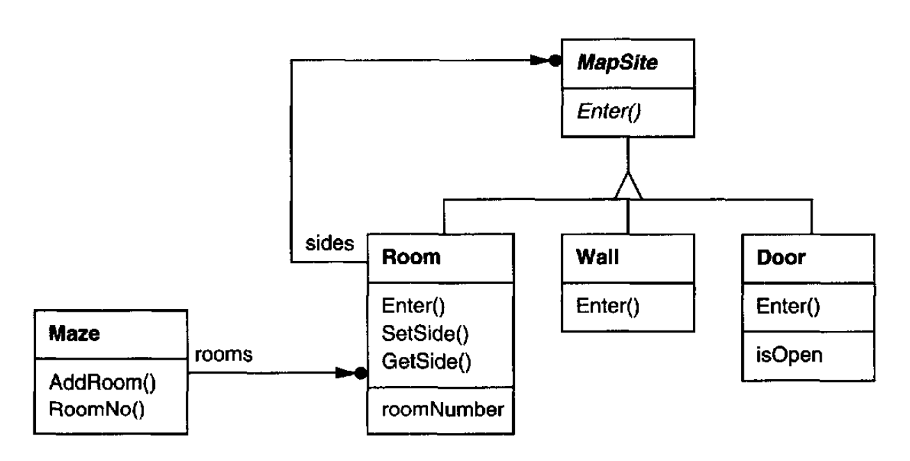

# 第 3 章 创建型模式

创建型设计模式抽象了实例化过程。
它们帮助让一个系统独立于其对象如何被创建、组合和表示。
<ins>类创建型模式使用继承来改变被实例化的类，而对象创建型模式将实例化委托给另一个对象。</ins>

随着系统演变到更多依赖对象组合而非类继承，创建型模式变得重要。
当这种情况发生时，重点从硬编码一组固定行为转向定义一小组基本行为，这些行为可以组合成任意数量的更复杂行为。
因此，用特定行为创建对象所需的不仅仅是简单地实例化一个类。

<ins>这些模式中有两个反复出现的主题。
第一，它们都封装了关于系统使用哪些具体类的知识。
第二，它们隐藏了这些类的实例如何被创建和组合在一起。</ins>
整个系统对这些对象所知道的只是由抽象类定义的接口。
因此，创建型模式在创建什么、谁来创建、如何创建以及何时创建方面给了你很大的灵活性。
它们让你能用结构和功能差异很大的 “产品” 对象来配置一个系统。
配置可以是静态的（即在编译时指定）或动态的（在运行时）。

有时创建型模式是竞争关系。
例如，在某些情况下，[Prototype (117)](4.md) 或 [Abstract Factory (87)](1.md) 都可以被有益地使用。
在其他时候，它们是互补的：[Builder (97)](2.md) 可以使用其他模式之一来实现哪些组件被构建。
[Prototype (117)](4.md) 可以在其实现中使用 [Singleton (127)](5.md)。

<ins>由于创建型模式密切相关，我们将一起研究全部五个模式，以突出它们的相似之处和差异。</ins>
我们还将使用一个共同的例子 ——为电脑游戏构建迷宫—— 来说明它们的实现。
迷宫和游戏会因模式不同而略有变化。
有时游戏只是找到走出迷宫的路线；在这种情况下，玩家可能只拥有迷宫的局部视图。
有时迷宫包含要解决的问题和要克服的危险，这些游戏可能提供已探索部分迷宫的地图。

我们将忽略迷宫中可能有什么以及迷宫游戏是单人还是多人的许多细节。
相反，我们只关注迷宫如何被创建。
我们将迷宫定义为一组房间。
一个房间知道它的邻居；可能的邻居是另一个房间、一堵墙，或通往另一个房间的门。

`Room`、`Door` 和 `Wall` 这些类定义了所有示例中使用的迷宫组件。
我们只定义这些类中对创建迷宫重要的部分。
我们将忽略玩家、显示和在迷宫中漫游的操作，以及其他与构建迷宫无关的重要功能。

下图显示了这些类之间的关系：

<br/>

每个房间有四条边。我们在 C++ 实现中使用枚举 `Direction` 来指定房间的北、南、东、西四条边：

```cpp
enum Direction {North, South, East, West};
```

Smalltalk 实现使用相应的符号来表示这些方向。

类 `MapSite` 是迷宫中所有组件的公共抽象类。
为了简化示例，`MapSite` 只定义了一个操作，`Enter`。
它的含义取决于你正在进入什么。
如果你进入一个房间，那么你的位置会改变。
如果你试图进入一扇门，那么会发生两件事之一：如果门是开着的，你就进入下一个房间。
如果门是关着的，那你就撞疼鼻子。

```cpp
class MapSite {
public:
    virtual void Enter() = 0;
};
```

`Enter` 为更复杂的游戏操作提供了简单基础。
例如，如果你在一个房间里说 “向东走”，游戏可以简单地确定哪个 `MapSite` 紧邻东侧，然后对它调用 `Enter`。
特定于子类的 `Enter` 操作会弄清楚你的位置改变了，还是你的鼻子撞疼了。
在真实游戏中，`Enter` 可以把正在移动的玩家对象作为参数。

`Room` 是 `MapSite` 的具体子类，定义了迷宫中组件之间的关键关系。
它维护对其他 `MapSite` 对象的引用，并存储一个房间号。
这个编号将标识迷宫中的房间。

```cpp
class Room : public MapSite {
public:
    Room(int roomNo);
    MapSite* GetSide(Direction) const;
    void SetSide(Direction, MapSite*);
    virtual void Enter();
private:
    MapSite* _sides[4];
    int _roomNumber;
};
```

以下类表示房间每侧出现的墙或门。

```cpp
class Wall : public MapSite {
public:
    Wall();
    virtual void Enter();
};

class Door : public MapSite {
public:
    Door(Room* = 0, Room* = 0);
    virtual void Enter();
    Room* OtherSideFrom(Room*);
private:
    Room* _room1;
    Room* _room2;
    bool _isOpen;
};
```

我们需要了解的不仅仅是迷宫的各个部分。
我们还将定义一个 `Maze` 类来表示房间的集合。
`Maze` 还可以使用其 `RoomNo` 操作，在给定房间号的情况下找到特定房间。

```cpp
class Maze {
public:
    Maze();
    void AddRoom(Room*) ;
    Room* RoomNo(int) const;
private:
    // . . .
};
```

`RoomNo` 可以使用线性搜索、哈希表，甚至简单数组来进行查找。
但这里我们不会担心这些细节。
相反，我们将专注于如何指定迷宫对象的组件。

我们定义的另一个类是 `MazeGame`，它创建迷宫。
创建迷宫的一种直接方式是使用一系列操作，将组件加入迷宫，然后将它们互相连接。
例如，下面的成员函数将创建一个由两个房间组成的迷宫，两个房间之间有一扇门：

<a id="example-3-0-1"></a>

```cpp
Maze* MazeGame::CreateMaze () {
    Maze* aMaze = new Maze;
    Room* r1 = new Room(1);
    Room* r2 = new Room (2);
    Door* theDoor = new Door(r1, r2);

    aMaze->AddRoom(r1);
    aMaze->AddRoom(r2);

    r1->SetSide(North, new Wall);
    r1->SetSide(East, theDoor);
    r1->SetSide(South, new Wall);
    r1->SetSide(West, new Wall);

    r2->SetSide(North, new Wall);
    r2->SetSide(East, new Wall);
    r2->SetSide(South, new Wall);
    r2->SetSide(West, theDoor);

    return aMaze;
}
```

考虑到这个函数所做的只是创建一个有两个房间的迷宫，它已经相当复杂了。
有明显的方法可以让它更简单。
例如，`Room` 构造函数可以提前用墙初始化各条边。
但那只是把代码移到了别处。
这个成员函数真正的问题不在于它的大小，而在于它的不灵活性。
它硬编码了迷宫布局。
改变布局意味着改变这个成员函数，要么通过重写它 ——这意味着重新实现整个东西 ——要么通过修改它的某些部分—— 这容易出错，而且不利于复用。

创建型模式展示了如何让这个设计更灵活，而不一定是更小。
特别是，它们将让改变定义迷宫组件的类变得容易。

假设你想为一个新游戏复用现有的迷宫布局，而这个新游戏包含（说来也怪）魔法迷宫。
魔法迷宫游戏有新的组件种类，比如 `DoorNeedingSpell`，一扇可以被锁住、之后只能用咒语打开的门；
以及 `EnchantedRoom`，一个可以有不寻常物品的房间，比如魔法钥匙或咒语。
你如何才能轻松地改变 `CreateMaze`，使它创建带有这些新对象类的迷宫？

在这种情况下，变化的最大障碍在于硬编码了被实例化的类。
创建型模式提供了不同的方法，从需要实例化这些类的代码中移除对具体类的显式引用：

- 如果 `CreateMaze` 调用虚函数而不是构造函数来创建它所需的房间、墙和门，那么你可以通过创建 `MazeGame` 的子类并重新定义那些虚函数来改变被实例化的类。
这种方法是 [Factory Method (107)](3.md)模式的一个例子。

- 如果 `CreateMaze` 被传入一个对象作为参数，用来创建房间、墙和门，那么你可以通过传入不同的参数来改变房间、墙和门的类。
这是 [Abstract Factory (87)](1.md) 模式的一个例子。

- 如果 `CreateMaze` 被传入一个对象，该对象能够使用添加房间、门和墙到它所构建的迷宫的操作来完整地创建一个新迷宫，
那么你可以使用继承来改变迷宫的某些部分或迷宫的构建方式。这是 [Builder (97)](2.md) 模式的一个例子。

- 如果 `CreateMaze` 由各种原型房间、门和墙对象参数化，然后它复制这些对象并加入迷宫，
那么你可以通过用不同的原型对象替换这些原型对象来改变迷宫的组成。这是 [Prototype (117)](4.md)模式的一个例子。

剩下的创建型模式 [Singleton (127)](5.md) ，可以确保每个游戏只有一个迷宫，
并且所有游戏对象都能随时访问它 —— 而不必求助于全局变量或函数。
Singleton 还让扩展或替换迷宫变得容易，而不必触碰现有代码。
