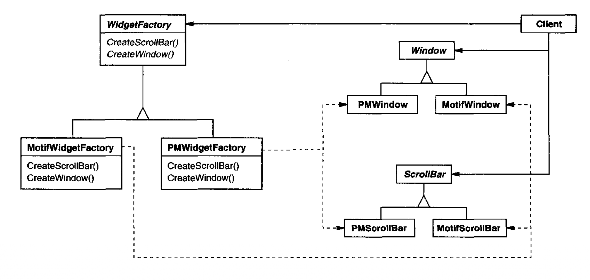
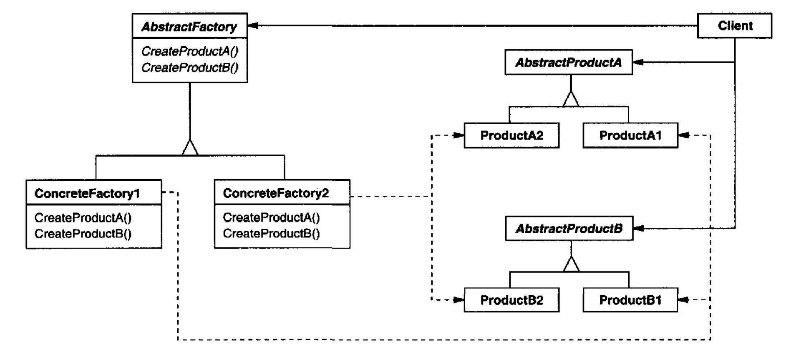

# Abstract Factory （对象创建型模式）

## 意图

提供一个用于创建相关或相互依赖对象族的接口，而无需指定它们的具体类。

## 别名

Kit

## 动机

考虑一个支持多种外观标准的用户界面工具箱，例如 Motif 和 Presentation Manager。
不同的外观标准为用户界面 “部件”（如滚动条、窗口和按钮）定义了不同的外观和行为。
为了跨外观标准可移植，应用程序不应将其部件硬编码为某一特定外观。
在整个应用程序中实例化特定于外观的部件类，会让以后改变外观变得困难。

我们可以通过定义一个抽象 `WidgetFactory` 类来解决这个问题，该类声明了用于创建每种基本部件的接口。
每种部件也都有一个抽象类，而具体子类为特定外观标准实现部件。
`WidgetFactory` 的接口有一个操作，为每个抽象部件类返回一个新的部件对象。
客户端调用这些操作来获得部件实例，但客户端并不知道它们正在使用哪些具体类。
因此客户端保持独立于当前外观。

<br/>

每个外观标准都有一个 `WidgetFactory` 的具体子类。
每个子类实现相应的操作，为该外观创建合适的部件。
例如，`MotifWidgetFactory` 上的 `CreateScrollBar` 操作实例化并返回一个 Motif 滚动条，而 `PMWidgetFactory` 上对应的操作则返回一个用于 Presentation Manager 的滚动条。
客户端完全通过 `WidgetFactory` 接口创建部件，并且不知道为某一特定外观实现部件的那些类。
换句话说，客户端只需承诺一个由抽象类定义的接口，而不是某个具体类。

`WidgetFactory` 还强制了具体部件类之间的依赖关系。
Motif 滚动条应当与 Motif 按钮和 Motif 文本编辑器一起使用，而这一约束会因使用 `MotifWidgetFactory` 而自动得到强制执行。

## 适用性

在以下情况下使用 Abstract Factory 模式

- 一个系统应当独立于其产品如何被创建、组合和表示。

- 一个系统应当用多个产品族之一来配置。

- 一族相关产品对象被设计为一起使用，而你需要强制执行这一约束。

- 你想提供一个产品类库，并且只想暴露它们的接口，而不是它们的实现。

## 结构

<br/>

## 参与者

- **AbstractFactory**（`WidgetFactory`）
  - 声明用于创建抽象产品对象的操作的接口。

- **ConcreteFactory**（`MotifWidgetFactory`、`PMWidgetFactory`）
  - 实现用于创建具体产品对象的操作。

- **AbstractProduct**（`Window`、`ScrollBar`）
  - 声明某一类型产品对象的接口。

- **ConcreteProduct**（`MotifWindow`、`MotifScrollBar`）
  - 定义由相应具体工厂创建的产品对象。
  - 实现 AbstractProduct 接口。

- **Client**
  - 只使用由 AbstractFactory 和 AbstractProduct 类声明的接口。

## 协作

- 通常，在运行时创建 `ConcreteFactory` 类的单个实例。
这个具体工厂创建具有特定实现的产品对象。
要创建不同的产品对象，客户端应当使用不同的具体工厂。

- `AbstractFactory` 将产品对象的创建推迟到它的 `ConcreteFactory` 子类。

## 结果

Abstract Factory 模式具有以下优点和缺点：

1. *它隔离了具体类。*
Abstract Factory 模式帮助你控制应用程序创建的对象类。
因为工厂封装了创建产品对象的责任和过程，它把客户端与实现类隔离开来。
客户端通过抽象接口操作实例。
产品类名被隔离在具体工厂的实现中；它们不会出现在客户端代码中。

2. *它让交换产品族变得容易。*
具体工厂的类在应用程序中只出现一次 —— 也就是它被实例化的地方。
这让改变应用程序使用的具体工厂变得容易。
它只需改变具体工厂，就可以使用不同的产品配置。
因为抽象工厂创建一个完整的产品族，整个产品族会一次性改变。
在我们的用户界面例子中，我们可以简单地通过切换相应的工厂对象并重新创建界面，从 Motif 部件切换到 Presentation Manager 部件。

3. *它促进产品之间的一致性。*
当一族中的产品对象被设计为协同工作时，应用程序一次只使用一个产品族中的对象很重要。
`AbstractFactory` 让这一点容易强制执行。

4. *支持新种类的产品很困难。*
扩展抽象工厂以生产新种类的 Product 并不容易。
这是因为 `AbstractFactory` 接口固定了可以创建的产品集合。
支持新种类的产品需要扩展工厂接口，这涉及改变 `AbstractFactory` 类及其所有子类。
我们在实现部分讨论这个问题的一种解决方案。

## 实现

以下是实现 Abstract Factory 模式的一些有用技术。

1. *工厂作为单例。*
一个应用程序通常每个产品族只需要一个 `ConcreteFactory` 实例。
所以通常最好将其实现为 [Singleton (127)](5.md)。

2. *创建产品。*
`AbstractFactory` 只声明用于创建产品的接口。
实际创建它们由 `ConcreteProduct` 子类负责。
最常见的方法是为每个产品定义一个工厂方法（参见 [Factory Method (107)](3.md) ）。
具体工厂将通过为每个产品重写工厂方法来指定其产品。
虽然这种实现很简单，但每个产品族都需要一个新的具体工厂子类，即使产品族之间只有轻微差异。

   如果可能有很多产品族，具体工厂可以使用 [Prototype (117)](4.md) 模式来实现。
   具体工厂用族中每个产品的原型实例初始化，并通过克隆其原型来创建新产品。
   基于 Prototype 的方法消除了为每个新产品族都需要一个新具体工厂类的需要。

   下面是一种在 Smalltalk 中实现基于 Prototype 的工厂的方法。
   具体工厂把要克隆的原型存储在一个名为 `partCatalog` 的字典中。
   方法 `make:` 取回原型并克隆它：

   ```smalltalk
   make: partName
       ^ (partCatalog at: partName) copy
   ```

   具体工厂有一个方法用于向目录添加部件。

   ```smalltalk
   addPart: partTemplate named: partName
       partCatalog at: partName put: partTemplate
   ```

   原型通过用符号标识它们来加入工厂：

   ```smalltalk
   aFactory adPart: aPrototype named: #ACMEWidget
   ```

   在把类视为一等对象的语言（例如 Smalltalk 和 Objective C）中，基于 Prototype 方法的一种变体是可能的。
   你可以把这些语言中的类看作一种退化的工厂，只创建一种产品。
   你可以在具体工厂中把创建各种具体产品的类存储在变量里，很像原型。
   这些类代表具体工厂创建新实例。
   你通过用产品类初始化一个具体工厂实例来定义新工厂，而不是通过子类化。
   这种方法利用了语言特性，而纯粹基于 Prototype 的方法则与语言无关。

   就像刚才讨论的 Smalltalk 中基于 Prototype 的工厂一样，基于类的版本会有一个单一实例变量 `partCatalog`，它是一个字典，键是部件的名称。
   `partCatalog` 存储的不是要克隆的原型，而是产品的类。方法 `make:` 现在看起来像这样：

   ```smalltalk
   make: partName
       (partCatalog at: partName) new
   ```

3. *定义可扩展的工厂。*
`AbstractFactory` 通常为它能生产的每种产品定义一个不同的操作。
产品的种类被编码在操作签名中。
添加一种新种类的产品需要改变 `AbstractFactory` 接口以及所有依赖它的类。

   一种更灵活但不太安全的设计是，给创建对象的操作添加一个参数。
   这个参数指定要创建的对象种类。
   它可以是类标识符、整数、字符串，或任何其他标识产品种类的东西。
   事实上，采用这种方法，`AbstractFactory` 只需要一个 `"Make"` 操作，并带一个指示要创建的对象种类的参数。
   这就是前面讨论的基于 Prototype 和基于类的抽象工厂所使用的技术。

   这种变体在像 Smalltalk 这样的动态类型语言中比在像 C++ 这样的静态类型语言中更容易使用。
   在 C++ 中，只有当所有对象都有相同的抽象基类，或者产品对象能被请求它们的客户端安全地强制转换为正确类型时，你才能使用它。
   [Factory Method (107)](3.md) 的实现部分展示了如何在 C++ 中实现这类参数化操作。

   但即使不需要强制转换，一个固有问题仍然存在：所有产品都以返回类型所给出的同一抽象接口返回给客户端。
   客户端将无法区分产品类，也无法对产品类做出安全假设。
   如果客户端需要执行特定于子类的操作，这些操作将无法通过抽象接口访问。
   尽管客户端可以执行向下转型（例如在 C++ 中使用 `dynamic-cast`），但这并不总是可行或安全，因为向下转型可能失败。
   这是高度灵活和可扩展接口的经典取舍。

## 示例代码

我们将把 Abstract Factory 模式应用于创建本章开头讨论的迷宫。

类 `MazeFactory` 可以创建迷宫的组件。
它构建房间、墙以及房间之间的门。
它可能被一个从文件读取迷宫平面图并构建相应迷宫的程序使用。
它也可能被一个随机构建迷宫的程序使用。
构建迷宫的程序接受一个 `MazeFactory` 作为参数，这样程序员就可以指定要构建的房间、墙和门的类。

```cpp
class MazeFactory {
public:
    MazeFactory();

    virtual Maze* MakeMaze() const
        { return new Maze; }
    virtual Wall* MakeWall() const
        { return new Wall; }
    virtual Room* MakeRoom(int n) const
        { return new Room(n); }
    virtual Door* MakeDoor(Room* rl, Room* r2) const
        { return new Door(rl, r2); }
```

回想一下，成员函数 `CreateMaze`（第 [84](./0.md#example-3-0-1) 页）构建一个由两个房间组成、房间之间有一扇门的小迷宫。
`CreateMaze` 硬编码了类名，使得用不同组件创建迷宫变得困难。

下面是一个 `CreateMaze` 版本，它通过接受一个 `MazeFactory` 作为参数来弥补这一缺陷：

```cpp
Maze* MazeGame::CreateMaze (MazeFactoryk factory) {
    Maze* aMaze = factory.MakeMaze();
    Room* rl = factory.MakeRoom(1);
    Room* r2 = factory.MakeRoom(2);
    Door* aDoor = factory.MakeDoor(rl, r2);

    aMaze->AddRoom(rl);
    aMaze->AddRoom(r2);

    rl->SetSide(North, factory.MakeWall());
    rl->SetSide(East, aDoor);
    rl->SetSide(South, factory.MakeWall() ) ;
    rl->SetSide(West, factory.MakeWall());

    r2->SetSide(North, factory.MakeWall());
    r2->SetSide(East, factory.MakeWall());
    r2->SetSide(South, factory.MakeWall());
    r2->SetSide(West, aDoor);

    return aMaze;
}
```

我们可以通过子类化 `MazeFactory` 来创建 `EnchantedMazeFactory`，一个用于魔法迷宫的工厂。
`EnchantedMazeFactory` 将重写不同的成员函数，并返回 `Room`、`Wall` 等的不同子类。

```cpp
class EnchantedMazeFactory : public MazeFactory {
public:
    EnchantedMazeFactory();

    virtual Room* MakeRoom(int n) const
        { return new EnchantedRoom(n, CastSpell()); }

    virtual Door* MakeDoor(Room* rl, Room* r2) const
        { return new DoorNeedingSpell(rl, r2) ; }

protected:
    Spell* CastSpell() const;
};
```

现在假设我们想做一个迷宫游戏，其中某个房间可以被安放炸弹。
如果炸弹爆炸，它至少会损坏墙壁。
我们可以让 `Room` 的一个子类跟踪房间里是否有炸弹以及炸弹是否已经爆炸。
我们还需要 `Wall` 的一个子类来跟踪墙壁受到的损坏。
我们将把这些类称为 `RoomWithABomb` 和 `BombedWall`。

我们将定义的最后一个类是 `BombedMazeFactory`，它是 `MazeFactory` 的子类，确保墙壁属于 `BombedWall` 类，房间属于 `RoomWithABomb` 类。
`BombedMazeFactory` 只需要重写两个函数：

```cpp
Wall* BombedMazeFactory::MakeWall () const {
    return new BombedWall;
}
```

```cpp
Room* BombedMazeFactory::MakeRoom(int n) const {
    return new RoomWithABomb(n);
}
```

要构建一个可能包含炸弹的简单迷宫，我们只需用一个 `BombedMazeFactory` 调用 `CreateMaze`。

```cpp
MazeGame game;
BombedMazeFactory factory;
game.CreateMaze ( factory) ,
```

`CreateMaze` 同样可以接受一个 `EnchantedMazeFactory` 实例来构建魔法迷宫。

注意，`MazeFactory` 只是一组工厂方法。
这是实现 Abstract Factory 模式最常见的方式。
还要注意，`MazeFactory` 不是抽象类；因此它同时充当 AbstractFactory 和 ConcreteFactory。
这是 Abstract Factory 模式在简单应用中的另一种常见实现。
因为 `MazeFactory` 是一个完全由工厂方法组成的具体类，所以很容易通过创建一个子类并重写需要改变的操作来创建新的 `MazeFactory`。

`CreateMaze` 使用房间上的 `SetSide` 操作来指定它们的边。
如果它用 `BombedMazeFactory` 创建房间，那么迷宫将由带有 `BombedWall` 边的 `RoomWithABomb` 对象组成。
如果 `RoomWithABomb` 必须访问 `BombedWall` 的某个特定于子类的成员，那么它就必须把对其墙壁的引用从 `Wall*` 转换为 `BombedWall*`。
只要参数实际上是一个 `BombedWall`，这种向下转型就是安全的，而如果墙壁完全由 `BombedMazeFactory` 构建，这一点就保证为真。

当然，像 Smalltalk 这样的动态类型语言不需要向下转型，但如果它们在本该期望 `Wall` 的子类的地方遇到了 `Wall`，可能会产生运行时错误。
使用 Abstract Factory 来构建墙壁，通过确保只能创建某些种类的墙壁，有助于防止这些运行时错误。

让我们考虑一下 `MazeFactory` 的 Smalltalk 版本，它有一个单一的 `make` 操作，接受要创建的对象种类作为参数。
此外，具体工厂存储它创建的产品类。

首先，我们将在 Smalltalk 中编写一个与 `CreateMaze` 等价的版本：

```smalltalk
CreateMaze: aFactory
    | rooml room2 aDoor |
    rooml := (aFactory make: #room) number: 1.
    room2 := (aFactory make: #room) number: 2.
    aDoor := (aFactory make: #door) from: rooml to: room2.
    rooml atSide: ttnorth put: (aFactory make: #wall).
    rooml atSide: #east put: aDoor.
    rooml atSide: ttsouth put: (aFactory make: #wall).
    rooml atSide: ttwest put: (aFactory make: #wall).
    room2 atSide: #north put: (aFactory make: #wall).
    room2 atSide: #east put: (aFactory make: #wall).
    room2 atSide: ttsouth put: (aFactory make: #wall).
    room2 atSide: ftwest put: aDoor.
    ~ Maze new addRoom: rooml; addRoom: rom2; yourself
```

正如我们在实现部分讨论过的，`MazeFactory` 只需要一个实例变量 `partCatalog`，用来提供一个键为组件类的字典。
还要回想一下我们是如何实现 `make:` 方法的：

```smalltalk
make: partName
    (partCatalog at: partName) new
```

现在我们可以创建 `aMazeFactory` 并用它来实现 `createMaze`。
我们将使用 `MazeGame` 类的方法 `createMazeFactory` 来创建该工厂。

```smalltalk
createMazeFactory
    " (MazeFactory new
        addPart: Wall named: #wall;
        addPart: Room named: #room;
        addPart: Door named: #door;
        yourself)
```

`BombedMazeFactory` 或 `EnchantedMazeFactory` 通过把不同的类与这些键关联起来创建。
例如，一个 `EnchantedMazeFactory` 可以这样创建：

```smalltalk
createMazeFactory
    (MazeFactory new
        addPart: Wall named: ttwall;
        addPart: EnchantedRoom named: #room;
        addPart: DoorNeedingSpell named: #door;
        yourself)
```

## 已知应用

Interviews 使用 `"Kit"` 后缀 [Lin92](../biblio.md#lin92) 来表示 AbstractFactory 类。
它定义了 `WidgetKit` 和 `DialogKit` 抽象工厂，用于生成特定外观标准的用户界面对象。
Interviews 还包括一个 `LayoutKit`，它根据所需的布局生成不同的组合对象。
例如，一个概念上水平的布局可能需要不同的组合对象，取决于文档的方向（纵向或横向）。

ET++ [WGM88](../biblio.md#wgm88) 使用 Abstract Factory 模式来实现跨不同窗口系统的可移植性（例如 X Windows 和 SunView）。
抽象基类 `WindowSystem` 定义了用于创建表示窗口系统资源的对象的接口（例如 `MakeWindow`、`MakeFont`、`MakeColor`）。
具体子类为特定窗口系统实现这些接口。
在运行时，ET++ 创建一个具体 `WindowSystem` 子类的实例，由它创建具体的系统资源对象。

## 相关模式

AbstractFactory 类通常用工厂方法实现（ [Factory Method (107)](3.md) ），但它们也可以用 [Prototype (117)](4.md) 实现。

具体工厂通常是单例（ [Singleton (127)](5.md)）。
