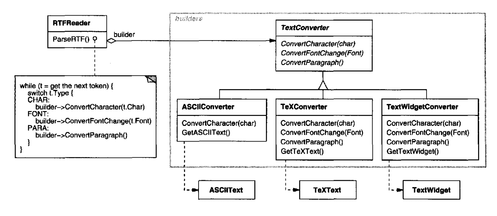
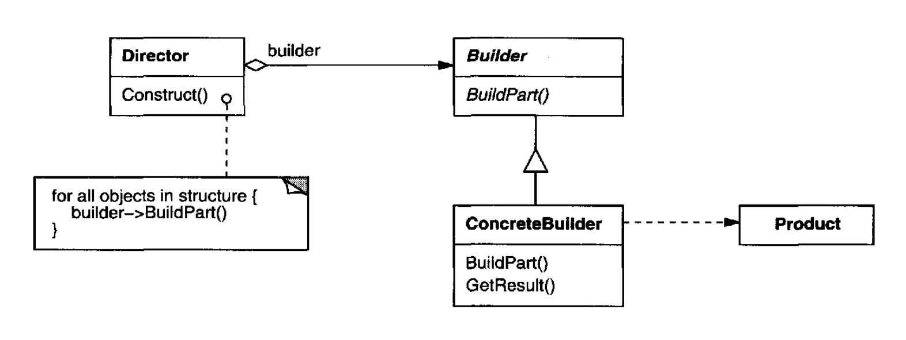
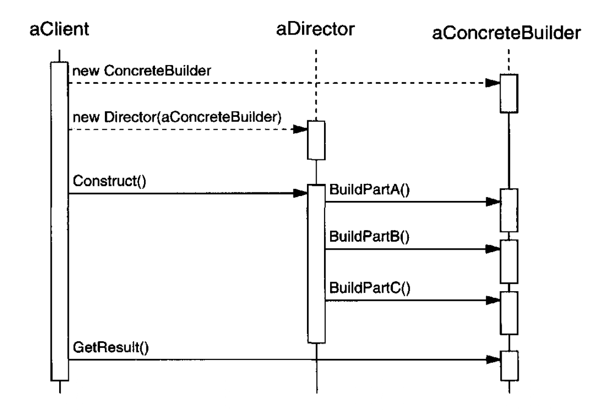

# Builder （对象创建型模式）

## 意图

将一个复杂对象的构建与其表示分离，使同一个构建过程可以创建不同的表示。

## 动机

一个针对 RTF（Rich Text Format）文档交换格式的阅读器，应该能够把 RTF 转换成许多文本格式。
该阅读器可能把 RTF 文档转换成纯 ASCII 文本，或者转换成可以交互编辑的文本部件。
然而问题在于，可能的转换数量是开放式的。
因此，应当能够在不修改阅读器的情况下添加新的转换。

一种解决方案是用一个 `TextConverter` 对象来配置 `RTFReader` 类，由它把 RTF 转换成另一种文本表示。
当 `RTFReader` 解析 RTF 文档时，它使用 `TextConverter` 来执行转换。
每当 `RTFReader` 识别出一个 RTF 记号（要么是纯文本，要么是 RTF 控制字），它就向 `TextConverter` 发出请求来转换该记号。
`TextConverter` 对象既负责执行数据转换，也负责以特定格式表示该记号。

`TextConverter` 的子类专门处理不同的转换和格式。
例如，`ASCIIConverter` 忽略除纯文本以外的任何转换请求。
另一方面，`TeXConverter` 会为所有请求实现操作，以产生一种 `TeX` 表示，捕捉文本中的所有样式信息。
`TextWidgetConverter` 将产生一个复杂的用户界面对象，让用户能够查看和编辑文本。

<br/>

每一类转换器类都把创建和组装复杂对象的机制置于一个抽象接口之后。
转换器与阅读器分离，后者负责解析 RTF 文档。

Builder 模式捕捉了所有这些关系。
每一个转换器类在模式中被称为 builder，而阅读器被称为 director。
应用到本例中，Builder 模式把解释一种文本格式的算法（即 RTF 文档的解析器）与转换后格式如何被创建和表示分离开来。
这让我们能够复用 `RTFReader` 的解析算法，从 RTF 文档创建不同的文本表示 —— 只需用 `TextConverter` 的不同子类配置 `RTFReader`。

## 适用性

在以下情况下使用 Builder 模式

- 创建复杂对象的算法应当独立于构成该对象的各个部分以及它们如何被组装。

- 构建过程必须允许被构建的对象有不同的表示。

## 结构

<br/>

## 参与者

- **Builder** （`TextConverter`）
  - 为创建 Product 对象的各个部分指定一个抽象接口。

- **ConcreteBuilder** （`ASCIIConverter`、`TeXConverter`、`TextWidgetConverter`）
  - 通过实现 Builder 接口来构建和组装产品的各个部分。
  - 定义并跟踪它所创建的表示。
  - 提供一个用于取回产品的接口（例如 `GetASCIIText`、`GetTextWidget`）。

- **Director** （`RTFReader`）
  - 使用 Builder 接口构建一个对象。

- **Product** （`ASCIIText`、`TeXText`、`TextWidget`）
  - 表示正在构建的复杂对象。ConcreteBuilder 构建产品的内部表示，并定义它被组装的过程。
  - 包括定义组成部分的类，包括用于把各部分组装成最终结果的接口。

## 协作

- 客户端创建 Director 对象，并用所需的 Builder 对象配置它。

- 每当产品的某个部分应当被构建时，Director 通知 builder。

- Builder 处理来自 director 的请求，并将各个部分加入产品。

- 客户端从 builder 取回产品。

下面的交互图说明了 Builder 和 Director 如何与客户端协作。

<br/>

## 结果

以下是 Builder 模式的关键结果：

1. *它让你能够改变产品的内部表示。*
Builder 对象为 director 提供了一个用于构建产品的抽象接口。
该接口让 builder 能够隐藏产品的表示和内部结构。
它还隐藏了产品如何被组装。
因为产品是通过抽象接口构建的，所以要改变产品的内部表示，你只需定义一种新的 builder。

2. *它隔离了构建和表示的代码。*
Builder 模式通过封装复杂对象被构建和表示的方式，提高了模块化程度。
客户端无需了解任何定义产品内部结构的类；这些类不会出现在 Builder 的接口中。
每个 ConcreteBuilder 都包含创建和组装某一特定类型产品的全部代码。
代码只写一次；然后不同的 Director 可以复用它，从同一组部件构建出 Product 的变体。
在前面的 RTF 例子中，我们可以为 RTF 以外的格式定义一个阅读器，比如 `SGMLReader`，并使用相同的 `TextConverter` 来生成 SGML 文档的 `ASCIIText`、`TeXText` 和 `TextWidget` 呈现。

3. *它让你对构建过程有更精细的控制。*
与一次性构建产品的创建型模式不同，Builder 模式在 director 的控制下逐步构建产品。
只有当产品完成时，director 才从 builder 取回它。
因此，Builder 接口比其他创建型模式更能反映构建产品的过程。
这让你对构建过程以及由此产生的产品的内部结构有更精细的控制。

## 实现

通常有一个抽象的 Builder 类，它为 director 可能要求它创建的每个组件定义一个操作。
这些操作默认什么也不做。
ConcreteBuilder 类重写它感兴趣创建的组件的操作。

以下是其他需要考虑的实现问题：

1. *组装和构建接口。*
Builder 以逐步方式构建它们的产品。
因此 Builder 类接口必须足够通用，以允许为所有类型的 concrete builder 构建产品。

   一个关键设计问题涉及构建和组装过程的模型。
   一种模型是，构建请求的结果只是被追加到产品上，这通常就足够了。
   在 RTF 例子中，builder 转换下一个 token 并将其追加到目前已经转换的文本上。

   但有时你可能需要访问较早构建的产品部分。
   在我们于示例代码中展示的 Maze 例子里，`MazeBuilder` 接口让你在现有房间之间添加一扇门。
   像自底向上构建的解析树这样的树结构是另一个例子。
   在这种情况下，builder 会把子节点返回给 director，然后 director 再把它们传回给 builder 以构建父节点。

2. *为什么不为产品设置抽象类？*
在常见情况下，具体 builder 所生产的产品在表示上差异如此之大，以至于给不同产品一个共同父类几乎没有什么好处。
在 RTF 例子中，`ASCIIText` 和 `TextWidget` 对象不太可能有一个共同接口，也不需要有一个。
因为客户端通常用适当的 concrete builder 配置 director，客户端能够知道正在使用的是 Builder 的哪个具体子类，并能够相应地处理其产品。

3. *在 Builder 中默认使用空方法。*
在 C++ 中，构建方法有意不被声明为纯虚成员函数。
它们被定义为空方法，让客户端只重写自己感兴趣的操作。

## 示例代码

我们将定义 `CreateMaze` 成员函数（第 [84](./0.md#example-3-0-1) 页）的一个变体，它接受一个 `MazeBuilder` 类的 builder 作为参数。

`MazeBuilder` 类定义了以下用于构建迷宫的接口：

```cpp
class MazeBuilder {
public:
    virtual void BuildMaze() { }
    virtual void BuildRoom(int room) { }
    virtual void BuildDoor(int roomFrom, int roomTo) { }

    virtual Maze* GetMaze() { return 0; }
protected:
    MazeBuilder();
};
```

这个接口可以创建三样东西：（1）迷宫，（2）具有特定房间号的房间，以及（3）编号房间之间的门。
`GetMaze` 操作把迷宫返回给客户端。
`MazeBuilder` 的子类将重写这个操作，以返回它们构建的迷宫。

`MazeBuilder` 的所有迷宫构建操作默认什么都不做。
它们没有被声明为纯虚函数，是为了让派生类只重写自己感兴趣的方法。

有了 `MazeBuilder` 接口，我们可以把 `CreateMaze` 成员函数改为接受这个 builder 作为参数。

```cpp
Maze* MazeGame::CreateMaze (MazeBuilder& builder) {
    builder.BuildMaze();

    builder.BuildRoom(1);
    builder.BuildRoom(2);
    builder.BuildDoor(1, 2);

    return builder.GetMaze();
}
```

把这个版本的 `CreateMaze` 与原来的版本比较一下。
注意 builder 如何隐藏了 Maze 的内部表示 ——也就是定义房间、门和墙的那些类—— 以及这些部分如何被组装成最终的迷宫。
有人可能会猜到有表示房间和门的类，但没有任何迹象表明有表示墙的类。
这让改变迷宫的表示方式变得更容易，因为 `MazeBuilder` 的任何客户端都不必改变。

像其他创建型模式一样，Builder 模式封装了对象如何被创建，在这个例子中是通过 `MazeBuilder` 定义的接口。
这意味着我们可以复用 `MazeBuilder` 来构建不同种类的迷宫。
`CreateComplexMaze` 操作给出了一个例子：

```cpp
Maze* MazeGame::CreateComplexMaze (MazeBuilder& builder) {
    builder.BuildRoom(1);
    // . . .
    builder.BuildRoom(1001);

    return builder.GetMaze();
}
```

注意 `MazeBuilder` 本身并不创建迷宫；它的主要目的只是定义用于创建迷宫的接口。
它定义空实现主要是为了方便。`MazeBuilder` 的子类才做实际工作。

子类 `StandardMazeBuilder` 是一个构建简单迷宫的实现。
它在变量 `_currentMaze` 中跟踪它正在构建的迷宫。

```cpp
class StandardMazeBuilder : public MazeBuilder {
public:
    StandardMazeBuilder();

    virtual void BuildMaze();
    virtual void BuildRoom(int);
    virtual void BuildDoor(int, int);

    virtual Maze* GetMaze ();
private:
    Direction CommonWall(Room*, Room*);
    Maze* _currentMaze;
};
```

`CommonWall` 是一个实用操作，用于确定两个房间之间公共墙的方向。

`StandardMazeBuilder` 构造函数只是初始化 `_currentMaze`。

```cpp
StandardMazeBuilder::StandardMazeBuilder () {
    _currentMaze = 0;
}
```

`BuildMaze` 实例化一个 Maze，其他操作将组装它，并最终（通过 `GetMaze`）返回给客户端。

```cpp
void StandardMazeBuilder::BuildMaze () {
    _currentMaze = new Maze;
}

Maze* StandardMazeBuilder::GetMaze () {
    return _currentMaze;
}
```

`BuildRoom` 操作创建一个房间，并在其周围建墙：

```cpp
void StandardMazeBuilder::BuildRoom (int n) {
    if (!_currentMaze->RoomNo(n)) {
        Room* room = new Room(n);
        _currentMaze->AddRoom(room);

        room->SetSide(North, new Wall);
        room->SetSide(South, new Wall);
        room->SetSide(East, new Wall);
        room->SetSide(West, new Wall);
    }
}
```

要在两个房间之间建一扇门，`StandardMazeBuilder` 会在迷宫中查找这两个房间，并找到它们相邻的墙：

```cpp
void StandardMazeBuilder::BuildDoor (int n1, int n2) {
    Room* r1 = _currentMaze->RoomNo(n1);
    Room* r2 = _currentMaze->RoomNo(n2);
    Door* d = new Door(r1, r2);

    r1->SetSide(CommonWall(r1,r2), d);
    r2->SetSide(CommonWall(r2,r1), d);
}
```

客户端现在可以把 `CreateMaze` 与 `StandardMazeBuilder` 结合使用来创建一个迷宫：

```cpp
Maze* maze;
MazeGame game;
StandardMazeBuilder builder;

game.CreateMaze(builder);
maze = builder.GetMaze();
```

我们本可以把所有 `StandardMazeBuilder` 操作都放进 `Maze`，让每个 `Maze` 构建自己。
但让 `Maze` 更小会使其更容易理解和修改，而且 `StandardMazeBuilder` 很容易与 `Maze` 分离。
最重要的是，将两者分离让你可以拥有各种 `MazeBuilder`，每个都对房间、墙和门使用不同的类。

一个更奇特的 `MazeBuilder` 是 `CountingMazeBuilder`。
这个 builder 根本不创建迷宫；它只是统计本来会被创建的不同种类的组件。

```cpp
class CountingMazeBuilder : public MazeBuilder {
public:
    CountingMazeBuilder();

    virtual void BuildMaze();
    virtual void BuildRoom(int);
    virtual void BuildDoor(int, int);
    virtual void AddWall(int, Direction);

    void GetCounts(int&, int&) const;
private:
    int _doors;
    int _rooms;
};
```

构造函数初始化计数器，而被重写的 `MazeBuilder` 操作会相应地递增它们。

```cpp
CountingMazeBuilder::CountingMazeBuilder () {
    _rooms = _doors = 0;
}

void CountingMazeBuilder::BuildRoom (int) {
    _rooms++;
}

void CountingMazeBuilder::BuildDoor (int, int) {
    _doors++;
}

void CountingMazeBuilder::GetCounts (
    int& rooms, int& doors
) const {
    rooms = _rooms;
    doors = _doors;
}
```

下面是一个客户端可能如何使用 `CountingMazeBuilder`：

```cpp
int rooms, doors;
MazeGame game;
CountingMazeBuilder builder;

game.CreateMaze(builder);
builder.GetCounts(rooms, doors);

cout << "The maze has "
     << rooms << " rooms and "
     << doors << " doors" << endl;
```

## 已知应用

RTF 转换器应用来自 ET++ [WGM88](../biblio.md#wgm88)。
它的文本构建块使用一个 builder 来处理以 RTF 格式存储的文本。

Builder 是 Smalltalk-80 [Par90](../biblio.md#par90) 中常见的模式：

- 编译器子系统中的 `Parser` 类是一个 Director，它接受一个 `ProgramNodeBuilder` 对象作为参数。
`Parser` 对象每次识别出一个语法结构时，就通知它的 `ProgramNodeBuilder` 对象。
当解析器完成时，它向 builder 请求它构建的解析树，并将其返回给客户端。

- `ClassBuilder` 是一个 builder，`Classes` 用它来为自己创建子类。
在这种情况下，一个 `Class` 既是 Director 又是 Product。

- `ByteCodeStream` 是一个 builder，它把编译后的方法创建为字节数组。
`ByteCodeStream` 是对 Builder 模式的一种非标准使用，因为它构建的复杂对象被编码为字节数组，而不是普通的 Smalltalk 对象。
但 `ByteCodeStream` 的接口是典型的 builder 接口，而且很容易用另一个把程序表示为复合对象的类来替换 `ByteCodeStream`。

来自 Adaptive Communications Environment 的 Service Configurator 框架使用 builder 来构造在运行时链接到服务器中的网络服务组件 [SS94](../biblio.md#ss94)。
这些组件用一种配置语言描述，该语言由一个 LALR(1) 解析器解析。
解析器的语义动作对 builder 执行操作，把信息加入服务组件。
在这种情况下，解析器就是 Director。

## 相关模式

[Abstract Factory (87)](1.md) 与 Builder 相似，因为它也可能构造复杂对象。
主要区别在于，Builder 模式侧重于逐步构造一个复杂对象。
Abstract Factory 的重点是产品对象族（无论是简单还是复杂）。
Builder 在最后一步返回产品，但就 Abstract Factory 模式而言，产品是立即返回的。

[Composite (163)](../ch4/3.md) 是 builder 常常构建的东西。
