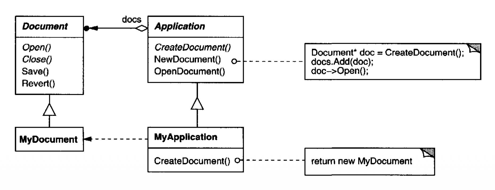
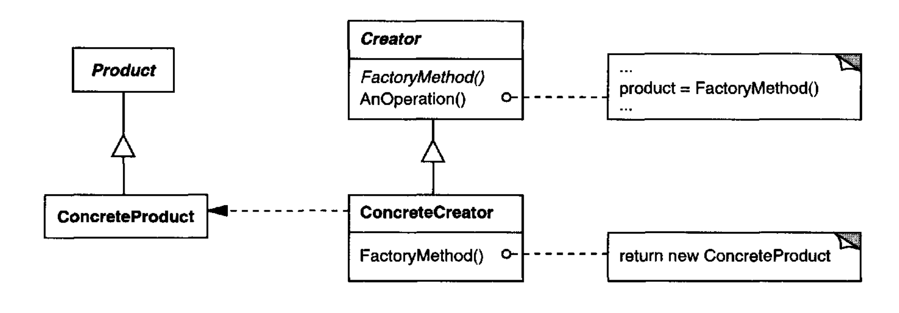
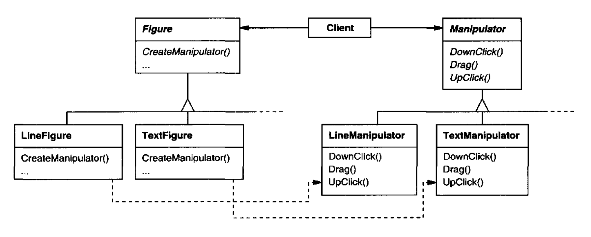

# Factory Method （类创建型模式）

## 意图

定义一个用于创建对象的接口，但让子类决定实例化哪个类。
Factory Method 让一个类将实例化推迟到子类。

## 别名

虚构造器

## 动机

框架使用抽象类来定义和维护对象之间的关系。
框架通常也负责创建这些对象。

考虑一个可以为用户呈现多个文档的应用程序框架。
这个框架中的两个关键抽象是 `Application` 和 `Document` 类。
这两个类都是抽象的，客户端必须子类化它们，以实现其应用程序特定的实现。
例如，要创建一个绘图应用程序，我们定义 `DrawingApplication` 和 `DrawingDocument` 类。
`Application` 类负责管理 `Document`，并会在需要时创建它们 —— 例如，当用户从菜单中选择 Open 或 New 时。

因为要实例化的特定 `Document` 子类是应用程序特定的，`Application` 类无法预测要实例化哪个 `Document` 子类 —— `Application` 类只知道何时应该创建一个新文档，而不知道要创建什么种类的 `Document`。
这就产生了一个困境：框架必须实例化类，但它只知道抽象类，而抽象类无法实例化。

Factory Method 模式提供了一种解决方案。
它封装了关于要创建哪个 `Document` 子类的知识，并把这种知识移出框架。

<br/>

`Application` 子类重定义 `Application` 上的抽象 `CreateDocument` 操作，以返回适当的 `Document` 子类。
一旦 `Application` 子类被实例化，它就可以在不知道其类的情况下实例化应用程序特定的 `Document`。
我们把 `CreateDocument` 称为 **工厂方法** ，因为它负责 “制造” 一个对象。

## 适用性

在以下情况下使用 Factory Method 模式

- 一个类无法预知它必须创建的对象类。

- 一个类希望其子类指定它创建的对象。

- 类将责任委托给几个辅助子类之一，而你想把哪个辅助子类是委托对象的知识局部化。

## 结构

<br/>

## 参与者

- **Product** （`Document`）
  - 定义工厂方法所创建对象的接口。

- **ConcreteProduct** （`MyDocument`）
  - 实现 Product 接口。

- **Creator** （`Application`）
  - 声明工厂方法，它返回一个 Product 类型的对象。Creator 还可以定义工厂方法的默认实现，返回一个默认的 ConcreteProduct 对象。
  - 可以调用工厂方法来创建一个 Product 对象。

- **ConcreteCreator** （`MyApplication`）
  - 重写工厂方法，以返回一个 ConcreteProduct 的实例。

## 协作

- Creator 依赖其子类来定义工厂方法，使其返回适当的 ConcreteProduct 实例。

## 结果

工厂方法消除了把应用程序特定的类绑定到代码中的需要。
代码只处理 Product 接口；因此它可以与任何用户定义的 ConcreteProduct 类一起工作。

工厂方法的一个潜在缺点是，客户端可能不得不子类化 Creator 类，仅仅为了创建一个特定的 ConcreteProduct 对象。
当客户端本来就必须子类化 Creator 类时，子类化没问题，但否则客户端现在就必须应对另一个演化点。

以下是 Factory Method 模式的两个额外结果：

1. *为子类提供钩子。*
在一个类内部用工厂方法创建对象，总是比直接创建对象更灵活。
Factory Method 给子类提供了一个钩子，用于提供对象的扩展版本。

   在 Document 例子中，`Document` 类可以定义一个名为 `CreateFileDialog` 的工厂方法，它创建一个默认的文件对话框对象，用于打开现有文档。
   `Document` 子类可以通过重写这个工厂方法来定义应用程序特定的文件对话框。
   在这种情况下，工厂方法不是抽象的，而是提供了一个合理的默认实现。

2. *连接平行类层次结构。*
在迄今为止我们考虑的例子中，工厂方法只由 Creator 调用。
但情况不一定如此；客户端会发现工厂方法很有用，尤其是在平行类层次结构的情况下。

   当一个类把它的某些职责委托给一个单独的类时，就会产生平行类层次结构。
   考虑可以被交互式操作的图形；也就是说，它们可以用鼠标拉伸、移动或旋转。
   实现这样的交互并不总是容易的。
   它通常需要存储和更新记录某一时刻操作状态的信息。
   这种状态只在操作期间需要；因此不必保存在图形对象中。
   此外，不同的图形在用户操作它们时行为不同。
   例如，拉伸一个线条图形可能产生移动一个端点的效果，而拉伸一个文本图形可能改变其行距。

   有了这些约束，更好的做法是使用一个单独的 `Manipulator` 对象来实现交互，并跟踪所需的任何特定于操作的状态。
   不同的图形将使用不同的 `Manipulator` 子类来处理特定的交互。
   由此产生的 `Manipulator` 类层次结构（至少部分地）与 `Figure` 类层次结构平行：

   <br/>

   `Figure` 类提供了一个 `CreateManipulator` 工厂方法，让客户端创建与 `Figure` 对应的 `Manipulator`。`Figure` 子类重写这个方法，以返回适合它们的 `Manipulator` 子类的实例。
   或者，`Figure` 类可以实现 `CreateManipulator` 来返回一个默认的 `Manipulator` 实例，而 `Figure` 子类可以简单地继承这个默认实现。
   这样做的 `Figure` 类不需要对应的 `Manipulator` 子类 —— 因此这些层次结构只是部分平行。

   注意工厂方法如何定义两个类层次结构之间的连接。它把哪些类属于一起的知识局部化。

## 实现

在应用 Factory Method 模式时，考虑以下问题：

1. *两种主要变体。*
Factory Method 模式的两个主要变体是：（1）Creator 类是抽象类，并且不为它声明的工厂方法提供实现的情况；（2）Creator 是具体类，并为工厂方法提供默认实现的情况。
也可能有一个定义默认实现的抽象类，但这不太常见。

   第一种情况要求子类定义实现，因为没有合理的默认值。
   它绕过了必须实例化无法预见类的困境。
   在第二种情况下，具体 Creator 使用工厂方法主要是为了灵活性。
   它遵循一条规则：“在一个单独的操作中创建对象，以便子类可以重写它们的创建方式。”
   这条规则确保子类的设计者可以在必要时改变其父类实例化的对象类。

2. *参数化工厂方法。*
该模式的另一种变体让工厂方法可以创建多种产品。
工厂方法接受一个参数，用于标识要创建的对象种类。
工厂方法创建的所有对象都将共享 Product 接口。
在 Document 例子中，`Application` 可能支持不同种类的 `Document`。
你给 `CreateDocument` 传入一个额外参数，以指定要创建的文档种类。

   Unidraw 图形编辑框架 [VL90](../biblio.md#vl90) 使用这种方法来重建保存在磁盘上的对象。
   Unidraw 定义了一个 `Creator` 类，其工厂方法 `Create` 接受一个类标识符作为参数。
   类标识符指定要实例化的类。
   当 Unidraw 把一个对象保存到磁盘时，它先写出类标识符，然后写出它的实例变量。
   当它从磁盘重建对象时，它先读取类标识符。

   一旦读取了类标识符，框架就调用 `Create`，把标识符作为参数传入。
   `Create` 查找相应类的构造函数，并用它来实例化对象。
   最后，`Create` 调用对象的 `Read` 操作，该操作读取磁盘上剩余的信息并初始化对象的实例变量。

   参数化工厂方法具有以下一般形式，其中 `MyProduct` 和 `YourProduct` 是 `Product` 的子类：

   ```cpp
   class Creator {
   public:
       virtual Product* Create(Productld);
   };

   Product* Creator::Create (Productld id) {
       if (id == MINE) return new MyProduct;
       if (id == YOURS) return new YourProduct;
       // repeat for remaining products...

       return 0;
   }
   ```

   覆盖参数化工厂方法让你能够轻松且有选择地扩展或改变 Creator 生产的产品。
   你可以为新种类的产品引入新的标识符，也可以把现有标识符与不同的产品关联起来。

   例如，子类 `MyCreator` 可以交换 `MyProduct` 和 `YourProduct`，并支持一个新的 `TheirProduct` 子类：

   ```cpp
   Product* MyCreator::Create (Productld id) {
       if (id == YOURS) return new MyProduct;
       if (id == MINE) return new YourProduct;
       // N.B.: switched YOURS and MINE

       if (id == THEIRS) return new TheirProduct;

       return Creator::Create(id); // called if all others fail
   }
   ```

   注意，这个操作最后做的一件事是在父类上调用 `Create`。
   这是因为 `MyCreator::Create` 只对 `YOURS`、`MINE` 和 `THEIRS` 的处理与父类不同。
   它对其他类不感兴趣。
   因此 `MyCreator` 扩展了所创建产品的种类，并把除少数产品之外的所有产品的创建责任推迟给它的父类。

3. *特定于语言的变体和问题。* 不同语言会产生其他有趣的变体和注意事项。

   Smalltalk 程序常常使用一个返回要实例化对象类的方法。
   Creator 工厂方法可以使用这个值来创建产品，而 ConcreteCreator 可以存储甚至计算这个值。
   结果是对要实例化的 ConcreteProduct 类型进行更晚的绑定。

   Document 例子的 Smalltalk 版本可以在 `Application` 上定义一个 `documentClass` 方法。
   `documentClass` 方法返回用于实例化文档的适当 `Document` 类。
   `MyApplication` 中 `documentClass` 的实现返回 `MyDocument` 类。
   因此在 `Application` 类中我们有

   ```smalltalk
   clientMethod
       document := self documentClass new.

   documentClass
       self subclassResponsibility
   ```

   在 `MyApplication` 类中我们有

   ```smalltalk
   documentClass
       ~ MyDocument
   ```

   它返回要被 `Application` 实例化的类 `MyDocument`。

   一种类似于参数化工厂方法、甚至更灵活的方法是，把要创建的类存储为 `Application` 的类变量。
   这样你就不必为了改变产品而子类化 `Application`。

   C++ 中的工厂方法总是虚函数，而且常常是纯虚函数。
   只是要小心不要在 Creator 的构造函数中调用工厂方法 —— ConcreteCreator 中的工厂方法那时还不可用。

   你可以通过小心地只经由按需创建产品的访问器操作来访问产品，从而避免这一点。
   构造函数不在构造函数中创建具体产品，而只是把它初始化为 0。
   访问器返回该产品。
   但首先它检查以确保产品存在，如果不存在，访问器就创建它。
   这种技术有时被称为惰性初始化。下面的代码展示了一个典型实现：

   ```cpp
   class Creator {
   public:
       Product* GetProduct();
   protected:
       virtual Product* CreateProduct();
   private:
       Product* _product;
   };

   Product* Creator::GetProduct () {
       if (_product ==0) {
           _product = CreateProduct();
       }
       return _product;
   }
   ```

4. *使用模板避免子类化。*
正如我们提到的，工厂方法的另一个潜在问题是，它们可能迫使你仅仅为了创建适当的 Product 对象而子类化。
在 C++ 中绕开这一点的另一种方法是，提供一个由 Product 类参数化的 Creator 模板子类：

   ```cpp
   class Creator {
   public:
       virtual Product* CreateProduct() = 0 ;
   };
   
   template <class TheProduct>
   class StandardCreator: public Creator {
   public:
       virtual Product* CreateProduct();
   };
   
   template <class TheProduct>
   Product* StandardCreator<TheProduct>::CreateProduct () {
       return new TheProduct;
   }
   ```

   有了这个模板，客户端只需提供产品类 —— 不需要子类化 `Creator`。

   ```cpp
   class MyProduct : public Product {
   public:
       MyProduct();
       // . . .
   };
   
   StandardCreator<MyProduct> myCreator;
   ```

5. *命名约定。*
使用命名约定来清楚表明你正在使用工厂方法，是一种好做法。
例如，MacApp Macintosh 应用程序框架 [App89](../biblio.md#app89) 总是把定义工厂方法的抽象操作声明为 `Class* DoMakeClass()`，其中 `Class` 是 Product 类。

## 示例代码

函数 `CreateMaze`（第 [84](./0.md#example-3-0-1) 页）构建并返回一个迷宫。
这个函数的一个问题是它硬编码了迷宫、房间、门和墙的类。
我们将引入工厂方法，让子类选择这些组件。

首先，我们将在 `MazeGame` 中为创建迷宫、房间、墙和门对象定义工厂方法：

```cpp
class MazeGame {
public:
    Maze* CreateMaze();

    // factory methods:

    virtual Maze* MakeMaze() const
        { return new Maze; }
    virtual Room* MakeRoom(int n) const
        { return new Room(n); }
    virtual Wall* MakeWall() const
        { return new Wall; }
    virtual Door* MakeDoor(Room* rl, Room* r2) const
        { return new Door(rl, r2); }
};
```

每个工厂方法返回给定类型的迷宫组件。
`MazeGame` 提供默认实现，返回最简单种类的迷宫、房间、墙和门。

现在我们可以重写 `CreateMaze` 来使用这些工厂方法：

```cpp
Maze* MazeGame::CreateMaze () {
    Maze* aMaze = MakeMaze (),

    Room* rl = MakeRoom (1) ,
    Room* r2 = MakeRoom(2);
    Door* theDoor = MakeDoor(rl, r2);

    aMaze->AddRoom(rl);
    aMaze->AddRoom(r2);

    rl->SetSide(North, MakeWall());
    rl->SetSide(East, theDoor);
    rl->SetSide(South, MakeWall());
    rl->SetSide(West, MakeWall());

    r2->SetSide(North, MakeWall());
    r2->SetSide(East, MakeWall());
    r2->SetSide(South, MakeWall());
    r2->SetSide(West, theDoor);

    return aMaze;
}
```

不同的游戏可以子类化 `MazeGame` 来特化迷宫的某些部分。
`MazeGame` 子类可以重定义部分或全部工厂方法，以指定产品的变化。
例如，`BombedMazeGame` 可以重定义 `Room` 和 `Wall` 产品，以返回炸弹版本：

```cpp
class BombedMazeGame : public MazeGame {
public:
    BombedMazeGame();

    virtual Wall* MakeWall() const
        { return new BombedWall; }

    virtual Room* MakeRoom(int n) const
        { return new RoomWithABomb(n); }
};
```

一个 `EnchantedMazeGame` 变体可以这样定义：

```cpp
class EnchantedMazeGame : public MazeGame {
public:
    EnchantedMazeGame();

    virtual Room* MakeRoom(int n) const
        { return new EnchantedRoom(n, CastSpell()); }

    virtual Door* MakeDoor(Room* rl, Room* r2) const
        { return new DoorNeedingSpell(rl, r2); }
protected:
    Spell* CastSpell() const;
};
```

## 已知应用

工厂方法遍及工具包和框架。
前面提到的文档例子是 MacApp 和 ET++ [WGM88](../biblio.md#wgm88) 中的典型用法。
操纵器例子来自 Unidraw。

Smalltalk-80 的 Model/View/Controller 框架中的 `View` 类有一个方法 `defaultController`，它创建一个控制器，这看起来可能是一个工厂方法 [Par90](../biblio.md#par90)。
但 `View` 的子类通过定义 `defaultControllerClass` 来指定其默认控制器的类，该方法返回 `defaultController` 从中创建实例的类。
所以 `defaultControllerClass` 才是真正的工厂方法，也就是子类应当重写的方法。

Smalltalk-80 中一个更晦涩的例子是 `Behavior`（表示类的所有对象的超类）定义的工厂方法 `parserClass`。
这使一个类能够为其源代码使用定制的解析器。
例如，客户端可以定义一个类 `SQLParser` 来分析带有嵌入式 SQL 语句的类的源代码。
`Behavior` 类实现 `parserClass` 以返回标准的 Smalltalk `Parser` 类。
包含嵌入式 SQL 语句的类重写这个方法（作为类方法）并返回 `SQLParser` 类。

IONA Technologies 的 Orbix ORB 系统 [ION94](../biblio.md#ion94) 使用 Factory Method，在对象请求对远程对象的引用时生成适当类型的代理（参见 [Proxy (207)](../ch4/7.md) ）。
Factory Method 让替换默认代理变得容易，例如替换为使用客户端缓存的代理。

## 相关模式

[Abstract Factory (87)](1.md) 通常用工厂方法实现。
Abstract Factory 模式动机中的例子也说明了 Factory Method。

工厂方法通常在 [Template Method (325)](../ch5/10.md) 中被调用。
在上面的文档例子中，`NewDocument` 是一个模板方法。

[Prototype (117)](4.md) 不需要子类化 Creator。
然而，它们通常需要在 Product 类上有一个 `Initialize` 操作。
Creator 使用 `Initialize` 来初始化对象。
Factory Method 不需要这样的操作。
