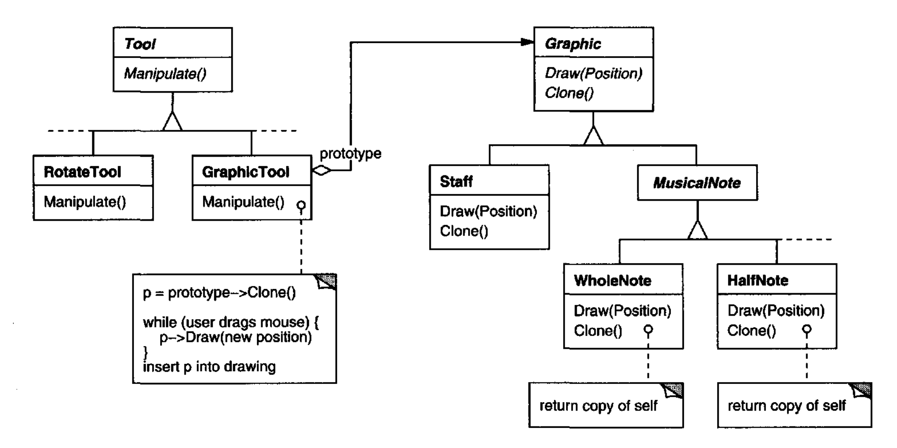
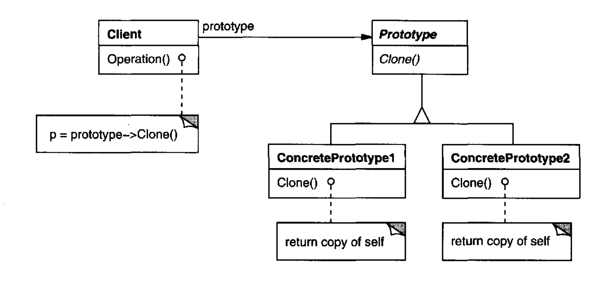

# Prototype （对象创建型模式）

## 意图

使用一个原型实例指定要创建的对象种类，并通过复制这个原型来创建新对象。

## 动机

你可以通过定制一个通用的图形编辑器框架，并添加表示音符、休止符和五线谱的新对象，来构建一个乐谱编辑器。
编辑器框架可能有一个工具面板，用于把这些音乐对象添加到乐谱中。
面板还会包括用于选择、移动以及以其他方式操作音乐对象的工具。
用户会点击四分音符工具，并用它把四分音符添加到乐谱中。
或者他们可以使用移动工具，把音符在五线谱上向上或向下移动，从而改变其音高。

假设框架为音符和五线谱等图形组件提供了一个抽象 `Graphic` 类。
此外，它还会提供一个抽象 `Tool` 类，用于定义像面板中的那些工具。
框架还预定义了一个 `GraphicTool` 子类，用于创建图形对象实例并将其加入文档。

但 `GraphicTool` 给框架设计者带来了一个问题。
音符和五线谱的类是我们应用程序特有的，但 `GraphicTool` 类属于框架。
`GraphicTool` 不知道如何创建我们音乐类的实例并加入乐谱。
我们可以为每种音乐对象子类化 `GraphicTool`，但那会产生大量仅在所实例化的音乐对象种类上不同的子类。
我们知道对象组合是子类化的一种灵活替代方案。
问题在于，框架如何利用它，按照 `GraphicTool` 应当创建的 `Graphic` 类来参数化 `GraphicTool` 实例？

解决方案在于让 `GraphicTool` 通过复制或 “克隆” 一个 `Graphic` 子类的实例来创建新的 `Graphic`。
我们把这个实例称为原型。
`GraphicTool` 由它应当克隆并加入文档的原型来参数化。
如果所有 `Graphic` 子类都支持 `Clone` 操作，那么 `GraphicTool` 就可以克隆任何种类的 `Graphic`。

所以，在我们的音乐编辑器中，每个用于创建音乐对象的工具都是一个 `GraphicTool` 实例，并用不同的原型初始化。
每个 `GraphicTool` 实例都会通过克隆其原型并把克隆加入乐谱来产生一个音乐对象。

<br/>

我们可以使用 Prototype 模式进一步减少类的数量。
我们为全音符和二分音符设置了单独的类，但这可能没有必要。
相反，它们可以是同一个类的实例，只是用不同的位图和持续时间初始化。
一个用于创建全音符的工具就变成了一个 `GraphicTool`，其原型是一个被初始化为全音符的 `MusicalNote`。
这可以大幅减少系统中的类数量。
它也让向音乐编辑器添加一种新音符变得更容易。

## 适用性

在以下情况下使用 Prototype 模式：一个系统应当独立于其产品如何被创建、组合和表示；并且

- 当要实例化的类在运行时被指定时，例如通过动态加载；或者

- 为了避免构建一个与产品类层次结构平行的工厂类层次结构；或者

- 当一个类的实例只能有少数几种不同状态组合之一时。
安装相应数量的原型并克隆它们，可能比每次手动用适当状态实例化该类更方便。

## 结构

<br/>

## 参与者

- **Prototype** （`Graphic`）
  - 声明一个用于克隆自身的接口。

- **ConcretePrototype** （`Staff`、`WholeNote`、`HalfNote`）
  - 实现一个用于克隆自身的操作。

- **Client** （`GraphicTool`）
  - 通过要求一个原型克隆自身来创建新对象。

## 协作

- 客户端要求一个原型克隆自身。

## 结果

Prototype 具有许多与 [Abstract Factory (87)](1.md) 和 [Builder (97)](2.md) 相同的结果：它向客户端隐藏具体产品类，从而减少客户端需要知道的名称数量。
此外，这些模式让客户端无需修改就能与应用程序特定的类一起工作。

Prototype 模式的额外好处列在下面。

1. *在运行时添加和移除产品。*
原型让你只需向客户端注册一个原型实例，就能把一个新的具体产品类并入系统。
这比其他创建型模式更灵活一些，因为客户端可以在运行时安装和移除原型。

2. *通过改变值来指定新对象。*
高度动态的系统让你通过对象组合来定义新行为 ——例如，通过为一个对象的变量指定值—— 而不是通过定义新类。
你实际上是通过实例化现有类并把实例注册为客户端对象的原型，来定义新种类的对象。
客户端可以通过把责任委托给原型来展现新行为。

   这种设计让用户无需编程就能定义新的 “类”。
   事实上，克隆一个原型类似于实例化一个类。
   Prototype 模式可以大大减少一个系统所需的类数量。
   在我们的音乐编辑器中，一个 `GraphicTool` 类可以创建无限多种音乐对象。

3. *通过改变结构来指定新对象。*
许多应用程序用部件和子部件构建对象。
例如，电路设计编辑器用子电路构建电路。¹ 
为了方便，这类应用程序通常让你实例化复杂的、用户定义的结构，比如一遍又一遍地使用某个特定子电路。

   Prototype 模式也支持这一点。
   我们只需把这个子电路作为原型加入可用电路元素面板。
   只要复合电路对象把 `Clone` 实现为深拷贝，具有不同结构的电路就可以作为原型。

   ¹ 这类应用程序反映了 [Composite (163)](../ch4/3.md) 和 [Decorator (175)](../ch4/4.md) 模式。

4. *减少子类化。*
[Factory Method (107)](3.md) 通常会产生一个与产品类层次结构平行的 Creator 类层次结构。
Prototype 模式让你克隆一个原型，而不是要求工厂方法制造一个新对象。
因此你根本不需要 Creator 类层次结构。
这一好处主要适用于像 C++ 这样不把类视为一等对象的语言。
像 Smalltalk 和 Objective C 这样把类视为一等对象的语言从中获益较少，因为你总是可以使用类对象作为创建者。
在这些语言中，类对象已经像原型一样起作用。

5. *用类动态配置应用程序。*
一些运行时环境让你把类动态加载到应用程序中。
Prototype 模式是在像 C++ 这样的语言中利用这类设施的关键。

   一个想要创建动态加载类实例的应用程序，将无法静态引用其构造函数。
   相反，运行时环境在加载每个类时自动创建该类的实例，并把该实例注册到原型管理器（参见实现部分）。
   然后应用程序可以向原型管理器请求新加载类的实例，也就是最初没有与程序链接的类。
   ET++ 应用程序框架 [WGM88](../biblio.md#wgm88) 有一个使用这种方案的运行时系统。

Prototype 模式的主要缺点在于，Prototype 的每个子类都必须实现 `Clone` 操作，这可能很困难。
例如，当所考虑的类已经存在时，添加 `Clone` 很困难。
当它们的内部包含不支持复制或有循环引用的对象时，实现 `Clone` 也可能很困难。

## 实现

Prototype 在像 C++ 这样的静态语言中特别有用，因为在那里类不是对象，而且运行时几乎没有或根本没有类型信息可用。
在像 Smalltalk 或 Objective C 这样实际上为每个类提供用于创建实例的原型（即类对象）的语言中，它就不那么重要。
这种模式内置于像 Self [US87](../biblio.md#us87) 这样基于原型的语言中，在这类语言里所有对象创建都通过克隆一个原型发生。

在实现 Prototype 时考虑以下问题：

1. *使用原型管理器。*
当系统中原型数量不固定时（即它们可以被动态创建和销毁），维护一个可用原型的注册表。
客户端不会自己管理原型，而是从注册表中存储和取回它们。
客户端在克隆原型之前会向注册表请求原型。
我们把这个注册表称为原型管理器 (prototype manager)。

   原型管理器是一个关联存储，返回与给定键匹配的原型。
   它有用于在某个键下注册原型和注销原型的操作。
   客户端可以在运行时改变甚至浏览注册表。
   这让客户端无需编写代码就能扩展系统并盘点系统。

2. *实现 `Clone` 操作。*
Prototype 模式最难的部分是正确实现 `Clone` 操作。
当对象结构包含循环引用时，这尤其棘手。

   大多数语言都为克隆对象提供了一些支持。
   例如，Smalltalk 提供了 `copy` 的实现，它被 `Object` 的所有子类继承。
   C++ 提供了拷贝构造函数。
   但这些设施并不能解决 “浅拷贝与深拷贝” 的问题 [GR83](../biblio.md#gr83)。
   也就是说，克隆一个对象是否也会克隆它的实例变量，还是克隆体和原对象只是共享这些变量？

   浅拷贝简单而且通常足够，这也是 Smalltalk 默认提供的。
   C++ 中默认的拷贝构造函数执行逐成员拷贝，这意味着指针将在副本和原对象之间共享。
   但克隆具有复杂结构的原型通常需要深拷贝，因为克隆体和原对象必须相互独立。
   因此你必须确保克隆体的组件是原型组件的克隆。
   克隆迫使你决定什么会被共享，如果有的话。

   如果系统中的对象提供 `Save` 和 `Load` 操作，那么你可以用它们来提供一个默认的 `Clone` 实现：
   只需保存对象并立即重新加载它。
   `Save` 操作把对象保存到内存缓冲区，`Load` 通过从缓冲区重建对象来创建副本。

3. *初始化克隆体。*
虽然有些客户端对克隆体原样就很满意，但其他客户端会希望把它的部分或全部内部状态初始化为自己选择的值。
你通常无法在 `Clone` 操作中传入这些值，因为它们的数量会因原型类而异。
有些原型可能需要多个初始化参数；其他则不需要任何参数。
在 `Clone` 操作中传递参数会妨碍统一的克隆接口。

   可能你的原型类已经定义了用于（重新）设置关键状态片段的操作。
   如果是这样，客户端可以在克隆之后立即使用这些操作。
   如果不是，那么你可能必须引入一个 `Initialize` 操作（参见示例代码部分），
   它接受初始化参数作为参数，并相应地设置克隆体的内部状态。
   注意深拷贝 `Clone` 操作 —— 在重新初始化它们之前，副本可能必须被删除（要么显式删除，要么在 `Initialize` 中删除）。

## 示例代码

我们将定义 `MazeFactory` 类（第 [92](1.md#example-3-1-1) 页）的一个子类 `MazePrototypeFactory`。
`MazePrototypeFactory` 将用它将创建的对象的原型来初始化，这样我们就不必仅仅为了改变它创建的墙或房间的类而子类化它。

`MazePrototypeFactory` 用一个接受原型作为参数的构造函数来扩展 `MazeFactory` 接口：

```cpp
class MazePrototypeFactory : public MazeFactory {
public:
    MazePrototypeFactory (Maze*, Wall*, Room*, Door*);

    virtual Maze* MakeMaze() const;
    virtual Room* MakeRoom(int) const;
    virtual Wall* MakeWall() const;
    virtual Door* MakeDoor(Room*, Room*) const;

private:
    Maze* _prototypeMaze;
    Room* _prototypeRoom;
    Wall* _prototypeWall;
    Door* _prototypeDoor;
```

新的构造函数只是初始化它的原型：

```cpp
MazePrototypeFactory::MazePrototypeFactory (
    Maze* m, Wall* w, Room* r, Door* d
) {
    _prototypeMaze = m;
    _prototypeWall = w;
    _prototypeRoom = r;
    _prototypeDoor = d;
}
```

用于创建墙、房间和门的成员函数类似：每个都克隆一个原型，然后初始化它。
下面是 `MakeWall` 和 `MakeDoor` 的定义：

```cpp
Wall* MazePrototypeFactory::MakeWall () const {
    return _prototypeWall->Clone();
}

Door* MazePrototypeFactory::MakeDoor (Room* r1, Room *r2) const {
    Door* door = _prototypeDoor->Clone();
    door->Initialize(r1, r2);
    return door;
}
```

我们可以使用 `MazePrototypeFactory` 创建一个原型或默认迷宫，只需用基本迷宫组件的原型初始化它：

```cpp
MazeGame game;
MazePrototypeFactory simpleMazeFactory(
    new Maze, new Wall, new Room, new Door
);
Maze* maze = game.CreateMaze(simpleMazeFactory);
```

要改变迷宫的类型，我们用一组不同的原型初始化 `MazePrototypeFactory`。
下面的调用创建一个带有 `BombedDoor` 和 `RoomWithABomb` 的迷宫：

```cpp
MazePrototypeFactory bombedMazeFactory(
    new Maze, new BombedWall,
    new RoomWithABomb, new Door
) ;
```

一个可以用作原型的对象，比如 `Wall` 的一个实例，必须支持 `Clone` 操作。
它还必须有一个用于克隆的拷贝构造函数。
它可能还需要一个单独的操作来重新初始化内部状态。
我们将给 `Door` 添加 `Initialize` 操作，让客户端初始化克隆体的房间。

把下面的 `Door` 定义与第 [83](0.md#example-3-0-2) 页的定义比较一下：

```cpp
class Door : public MapSite {
public:
    Door();
    Door(const Door&);

    virtual void Initialize(Room*, Room*);
    virtual Door* Clone() const;
    virtual void Enter();
    Room* OtherSideFrom(Room*);
private:
    Room* _room1;
    Room* _room2;
};

Door::Door (const Door& other) {
    _room1 = other._room1;
    _room2 = other._room2;
}

void Door::Initialize (Room* r1, Room* r2) {
    _room1 = r1;
    _room2 = r2;
}

Door* Door::Clone () const {
    return new Door(*this);
}
```

`BombedWall` 子类必须重写 `Clone` 并实现相应的拷贝构造函数。

```cpp
class BombedWall : public Wall {
public:
    BombedWall();
    BombedWall(const BombedWall&);

    virtual Wall* Clone() const;
    bool HasBomb();
private:
    bool _bomb;
};

BombedWall::BombedWall (const BombedWall& other) : Wall(other) {
    _bomb = other._bomb;
}

Wall* BombedWall::Clone () const {
    return new BombedWall(*this);
}
```

尽管 `BombedWall::Clone` 返回一个 `Wall*`，它的实现返回的是子类新实例的指针，也就是一个 `BombedWall*`。
我们在基类中这样定义 `Clone`，是为了确保克隆原型的客户端不必了解它们的具体子类。
客户端应当永远不需要把 `Clone` 的返回值向下转型为所需的类型。

在 Smalltalk 中，你可以复用从 `Object` 继承的标准 `copy` 方法来克隆任何 `MapSite`。
你可以使用 `MazeFactory` 来生成你需要的原型；例如，你可以通过提供名称 `#room` 来创建一个房间。
`MazeFactory` 有一个把名称映射到原型的 map。
它的 `make:` 方法看起来像这样：

```smalltalk
make: partName
    ^ (partCatalog at: partName) copy
```

有了用于用原型初始化 `MazeFactory` 的适当方法，你可以用以下代码创建一个简单迷宫：

```smalltalk
CreateMaze
    on: (MazeFactory new
        with: Door new named: #door;
        with: Wall new named: #wall;
        with: Room new named: #room;
        yourself)
```

其中 `CreateMaze` 的 `on:` 类方法定义会是

```smalltalk
on: aFactory
    | room1 room2 door |
    room1 := (aFactory make: #room) location: 1@1.
    room2 := (aFactory make: #room) location: 2@1.
    door := (aFactory make: #door) from: room1 to: room2.
    room1
        atSide: #north put: (aFactory make: #wall);
        atSide: #east put: door;
        atSide: #south put: (aFactory make: #wall);
        atSide: #west put: (aFactory make: #wall).
    room2
        atSide: #north put: (aFactory make: #wall);
        atSide: #east put: (aFactory make: #wall);
        atSide: #south put: (aFactory make: #wall);
        atSide: #west put: door.
    Maze new
        addRoom: room1;
        addRoom: room2;
        yourself
```

## 已知应用

Prototype 模式的第一个例子也许是 Ivan Sutherland 的 Sketchpad 系统 [Sut63](../biblio.md#sut63)。
该模式在面向对象语言中第一个广为人知的应用是在 ThingLab 中，用户可以在那里形成一个复合对象，然后通过把它安装到可复用对象库中将其提升为原型 [Bor81](../biblio.md#bor81)。
Goldberg 和 Robson 提到原型是一种模式 [GR83](../biblio.md#gr83)，但 Coplien [Cop92](../biblio.md#cop92) 给出了完整得多的描述。
他描述了与 C++ 的 Prototype 模式相关的惯用法，并给出了许多例子和变体。

Etgdb 是一个基于 ET++ 的调试器前端，它为不同的面向行调试器提供点击式界面。
每个调试器都有一个对应的 `DebuggerAdaptor` 子类。
例如，`GdbAdaptor` 把 etgdb 适配到 GNU gdb 的命令语法，而 `SunDbxAdaptor` 把 etgdb 适配到 Sun 的 dbx 调试器。
Etgdb 并没有把一组 `DebuggerAdaptor` 类硬编码到其中。
相反，它从环境变量读取要使用的适配器名称，在全局表中查找具有指定名称的原型，然后克隆该原型。
新的调试器可以通过把与该调试器配合工作的 `DebuggerAdaptor` 链接进来，从而加入 etgdb。

Mode Composer 中的 “交互技术库” 存储支持各种交互技术的对象原型 [Sha90](../biblio.md#sha90)。
Mode Composer 创建的任何交互技术都可以通过把它放入这个库来用作原型。
Prototype 模式让 Mode Composer 能够支持无限多的交互技术。

前面讨论的音乐编辑器例子基于 Unidraw 绘图框架 [VL90](../biblio.md#vl90)。

## 相关模式

Prototype 和 [Abstract Factory (87)](1.md) 在某些方面是相互竞争的模式，正如我们在本章末尾讨论的那样。
然而，它们也可以一起使用。
一个 Abstract Factory 可以存储一组原型，从中克隆并返回产品对象。

大量使用 [Composite (163)](../ch4/3.md) 和 [Decorator (175)](../ch4/4.md) 模式的设计通常也能从 Prototype 中受益。
