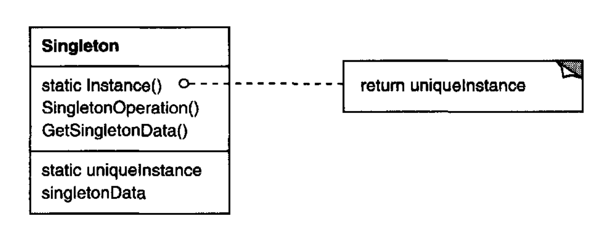

# Singleton （对象创建型模式）

## 意图

确保一个类只有一个实例，并提供一个访问它的全局点。

## 动机

对某些类来说，恰好只有一个实例很重要。
尽管一个系统中可以有很多打印机，但应该只有一个打印队列。
应该只有一个文件系统和一个窗口管理器。
一个数字滤波器会有一个 A/D 转换器。
一个会计系统将专门服务于一家公司。

我们如何确保一个类只有一个实例，并且该实例容易访问？
全局变量让对象可访问，但它不能阻止你实例化多个对象。

更好的解决方案是让类本身负责跟踪其唯一实例。
该类可以确保不能创建其他实例（通过拦截创建新对象的请求），并且可以提供一种访问该实例的方式。
这就是 Singleton 模式。

## 适用性

在以下情况下使用 Singleton 模式

- 必须恰好有一个类实例，并且它必须能从某个众所周知的访问点被客户端访问。

- 当这个唯一实例应当能够通过子类化来扩展，而客户端应当能够使用扩展实例而不修改其代码。

## 结构

<br/>

## 参与者

- **Singleton**
  - 定义一个 `Instance` 操作，让客户端访问其唯一实例。
  `Instance` 是一个类操作（即在 Smalltalk 中是类方法，在 C++ 中是静态成员函数）。

  - 可以负责创建它自己的唯一实例。

## 协作

- 客户端仅通过 Singleton 的 `Instance` 操作访问 Singleton 实例。

## 结果

Singleton 模式有几个好处：

1. *对唯一实例的受控访问。*
因为 Singleton 类封装了它的唯一实例，它可以严格控制客户端如何以及何时访问它。

2. *减少命名空间。*
Singleton 模式是对全局变量的一种改进。
它避免用存储唯一实例的全局变量污染命名空间。

3. *允许操作和表示的细化。*
Singleton 类可以被子类化，而且很容易用这个扩展类的实例配置应用程序。
你可以在运行时用你需要的类的实例配置应用程序。

4. *允许可变数量的实例。*
该模式让你容易改变主意，允许 Singleton 类有多个实例。
此外，你可以用同样的方法来控制应用程序使用的实例数量。
只需要改变授予对 Singleton 实例访问权的那个操作。

5. *比类操作更灵活。*
打包单例功能的另一种方式是使用类操作（即 C++ 中的静态成员函数或 Smalltalk 中的类方法）。
但这两种语言技术都让改变设计以允许一个类有多个实例变得困难。
此外，C++ 中的静态成员函数永远不是虚函数，所以子类不能多态地重写它们。

## 实现

使用 Singleton 模式时需要考虑以下实现问题：

1. *确保唯一实例。*
Singleton 模式把唯一实例变成类的一个普通实例，但该类被编写成只能创建一个实例。
一种常见做法是把创建实例的操作隐藏在一个类操作（即静态成员函数或类方法）之后，该操作保证只创建一个实例。
这个操作可以访问保存唯一实例的变量，并确保在返回其值之前用唯一实例初始化该变量。
这种方法确保单例在首次使用之前被创建并初始化。

   你可以在 C++ 中用 Singleton 类的静态成员函数 `Instance` 定义这个类操作。
Singleton 还定义了一个静态成员变量 `_instance`，它包含指向其唯一实例的指针。

   Singleton 类声明为

   ```cpp
   class Singleton {
   public:
       static Singleton* Instance();
   protected:
       Singleton();
   private:
       static Singleton* _instance;
   };
   ```
   
   相应的实现是
   
   ```cpp
   Singleton* Singleton::_instance = 0;
   
   Singleton* Singleton::Instance () {
       if (_instance == 0) {
           _instance = new Singleton;
       }
       return _instance;
   }
   ```

   客户端完全通过 `Instance` 成员函数访问单例。
   变量 `_instance` 被初始化为 0，而静态成员函数 `Instance` 返回它的值；如果它为 0，就用唯一实例初始化它。
   `Instance` 使用惰性初始化；它返回的值直到第一次被访问时才被创建和存储。

   注意构造函数是受保护的。
   试图直接实例化 `Singleton` 的客户端会在编译时得到错误。
   这确保只能创建一个实例。

   此外，由于 `_instance` 是指向 `Singleton` 对象的指针，
   `Instance` 成员函数可以把指向 `Singleton` 子类的指针赋给这个变量。
   我们将在示例代码中给出一个例子。

   关于 C++ 实现还有一点需要注意。
   仅仅把单例定义为全局或静态对象，然后依赖自动初始化是不够的。原因有三：

   (a) 我们无法保证静态对象只会被声明一个实例。

   (b) 我们可能在静态初始化时没有足够的信息来实例化每个单例。一个单例可能需要程序执行后期才计算出来的值。

   (c) C++ 没有定义跨翻译单元的全局对象构造函数的调用顺序 [ES90](../biblio.md#es90)。
   这意味着单例之间不能存在依赖关系；如果存在任何依赖，错误就不可避免。

   全局/静态对象方法的一个额外（尽管很小）缺点是，它强制所有单例无论是否被使用都要被创建。
   使用静态成员函数避免了所有这些间题。

   在 Smalltalk 中，返回唯一实例的函数被实现为 Singleton 类上的类方法。
   为了确保只创建一个实例，重写 `new` 操作。
   由此产生的 Singleton 类可能有以下两个类方法，其中 `SoleInstance` 是一个不在其他地方使用的类变量：

   ```smalltalk
   new
       self error: 'cannot create new object'
   
   default
       SoleInstance isNil ifTrue: [SoleInstance := super new].
       ^ SoleInstance
   ```

2. *子类化 Singleton 类。*
主要问题与其说是定义子类，不如说是安装它的唯一实例，以便客户端能够使用它。
本质上，引用单例实例的变量必须用子类的实例来初始化。
最简单的技术是在 Singleton 的 `Instance` 操作中决定你想使用哪个单例。
示例代码中的一个例子展示了如何用环境变量实现这种技术。

   选择 Singleton 子类的另一种方式是把 `Instance` 的实现从父类（例如 `MazeFactory`）中取出并放入子类。
   这让 C++ 程序员可以在链接时决定单例的类（例如，通过链接包含不同实现的目标文件），但又对单例的客户端隐藏这一点。

   链接方法在链接时固定了单例类的选择，这使得在运行时选择单例类变得困难。
   使用条件语句来决定子类更灵活，但它把可能的 Singleton 类集合硬编码了。
   这两种方法在所有情况下都不够灵活。

   一种更灵活的方法使用单例注册表。
   `Instance` 不再定义可能的 Singleton 类集合，而是由 Singleton 类在一个众所周知的注册表中按名称注册它们的单例实例。

   注册表在字符串名称和单例之间建立映射。
   当 `Instance` 需要一个单例时，它查询注册表，按名称请求该单例。
   注册表查找相应的单例（如果存在）并返回它。
   这种方法让 `Instance` 不必知道所有可能的 Singleton 类或实例。
   它所需要的只是所有 Singleton 类的一个公共接口，其中包括用于注册表的操作：
   
   ```cpp
   class Singleton {
   public:
       static void Register(const char* name, Singleton*);
       static Singleton* Instance();
   protected:
       static Singleton* Lookup(const char* name);
   private:
       static Singleton* _instance;
       static List<NameSingletonPair>* _registry;
   };
   ```
   
   `Register` 在给定名称下注册 Singleton 实例。
   为了保持注册表简单，我们让它存储一个 `NameSingletonPair` 对象列表。
   每个 `NameSingletonPair` 把一个名称映射到一个单例。
   `Lookup` 操作根据名称找到单例。
   我们假设一个环境变量指定了所需单例的名称。
   
   ```cpp
   Singleton* Singleton::Instance () {
       if (_instance ==0) {
           const char* singletonName = getenv("SINGLETON");
           // user or environment supplies this at startup

           _instance = Lookup(singletonName);
           // Lookup returns 0 if there's no such singleton
       }
       return _instance;
   }
   ```
   
   Singleton 类在哪里注册自己？一种可能是在它们的构造函数中。例如，一个 `MySingleton` 子类可以这样做：
   
   ```cpp
   MySingleton::MySingleton() {
       // . . .
       Singleton::Register("MySingleton", this);
   }
   ```
   
   当然，除非有人实例化这个类，否则构造函数不会被调用，这又回到了 Singleton 模式试图解决的问题！
   在 C++ 中，我们可以通过定义一个 `MySingleton` 的静态实例来绕开这个问题。
   例如，我们可以在包含 `MySingleton` 实现的文件中定义

   ```cpp
   static MySingleton theSingleton;
   ```
   
   Singleton 类不再负责创建单例。
   相反，它的主要责任是让所选择的单例对象在系统中可访问。
   静态对象方法仍然有一个潜在缺点 —— 即所有可能的 Singleton 子类的实例都必须被创建，否则它们就不会被注册。

## 示例代码

假设我们按第 [92](1.md#example-3-1-1) 页所述定义一个用于构建迷宫的 `MazeFactory` 类。
`MazeFactory` 定义了一个用于构建迷宫不同部分的接口。
子类可以重定义这些操作，以返回特化产品类的实例，比如 `BombedWall` 对象而不是普通 `Wall` 对象。

这里相关的是，迷宫应用程序只需要一个迷宫工厂实例，而该实例应当可供构建迷宫任何部分的代码使用。
这就是 Singleton 模式发挥作用的地方。
通过把 `MazeFactory` 做成单例，我们让迷宫对象全局可访问，而不必求助于全局变量。

为简单起见，假设我们永远不会子类化 `MazeFactory`。（我们稍后会考虑另一种情况。）
我们通过在 C++ 中添加一个静态 `Instance` 操作和一个静态 `_instance` 成员来保存唯一实例，把它做成 Singleton 类。
我们还必须保护构造函数，以防止意外实例化，那可能导致多个实例。

```cpp
class MazeFactory {
public:
    static MazeFactory* Instance();

    // existing interface goes here
protected:
    MazeFactory();
private:
    static MazeFactory* _instance;
};
```

相应的实现是

```cpp
MazeFactory* MazeFactory::_instance = 0;

MazeFactory* MazeFactory::Instance () {
    if (_instance ==0) {
        _instance = new MazeFactory;
    }
    return _instance;
}
```

现在让我们考虑当存在 `MazeFactory` 的子类，而应用程序必须决定使用哪一个时会发生什么。
我们将通过环境变量选择迷宫种类，并添加根据环境变量值实例化适当 `MazeFactory` 子类的代码。
`Instance` 操作是放置这段代码的好地方，因为它已经实例化了 `MazeFactory`：

```cpp
MazeFactory* MazeFactory::Instance () {
    if (_instance ==0) {
        const char* mazeStyle = getenv("MAZESTYLE");

        if (strcmp(mazeStyle, "bombed") == 0) {
            _instance = new BombedMazeFactory;

        } else if (strcmp(mazeStyle, "enchanted") == 0) {
            _instance = new EnchantedMazeFactory;

        // ... other possible subclasses

        } else { // default
            _instance = new MazeFactory;
        }
    }
    return _instance;
}
```

注意，每当你定义 `MazeFactory` 的新子类时，都必须修改 `Instance`。
在这个应用程序中这可能不是问题，但对于在框架中定义的抽象工厂来说，这可能是个问题。

一种可能的解决方案是使用实现部分描述的注册表方法。
动态链接在这里也可能有用 —— 它可以让应用程序不必加载所有未使用的子类。

## 已知应用

Smalltalk-80 [Par90](../biblio.md#par90) 中 Singleton 模式的一个例子是代码变更集，即 `ChangeSet current`。
一个更微妙的例子是类与其元类之间的关系。
元类是类的类，每个元类有一个实例。
元类没有名称（除非间接通过它们的唯一实例），但它们跟踪自己的唯一实例，并且通常不会创建另一个。

Interviews 用户界面工具包 [LCI+92](../biblio.md#lci92) 使用 Singleton 模式来访问其 `Session` 和 `WidgetKit` 类等的唯一实例。
`Session` 定义应用程序的主事件分派循环，存储用户的风格偏好数据库，并管理与一个或多个物理显示器的连接。
`WidgetKit` 是一个 [Abstract Factory (87)](1.md)，用于定义用户界面部件的外观。
`WidgetKit::instance()` 操作根据 `Session` 定义的环境变量确定要实例化的特定 `WidgetKit` 子类。
`Session` 上一个类似的操作确定支持单色还是彩色显示，并相应地配置单例 `Session` 实例。

## 相关模式

许多模式都可以使用 Singleton 模式来实现。
参见 [Abstract Factory (87)](1.md)、[Builder (97)](2.md) 和 [Prototype (117)](4.md)。
