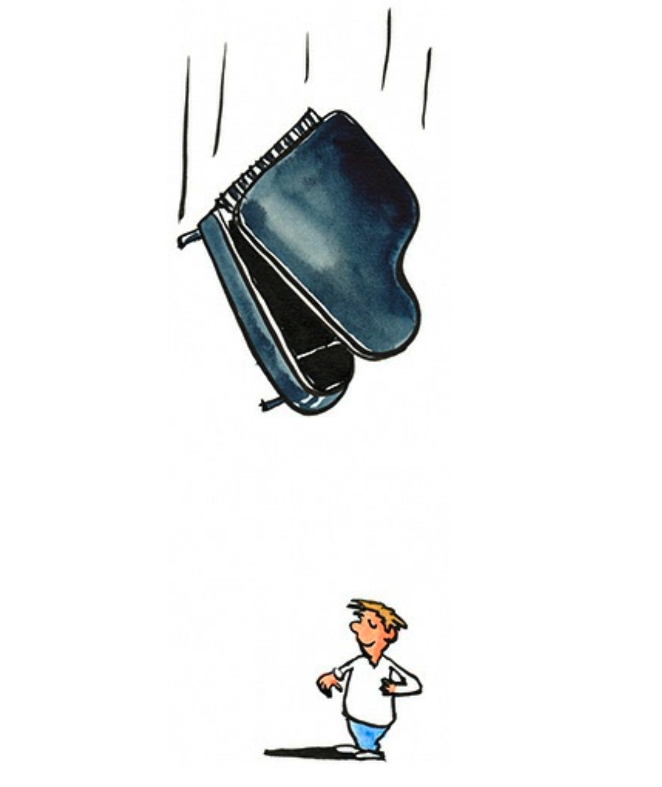
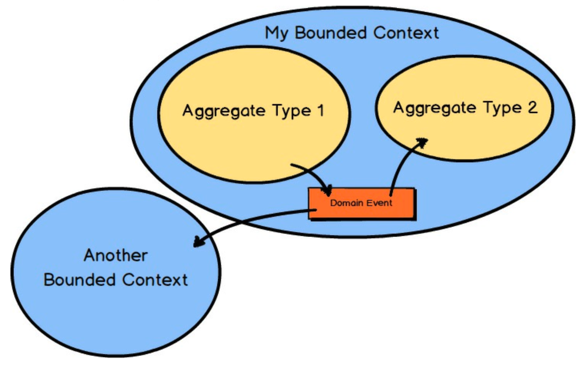

# 第一章 DDD 与我

你想提高你的技艺，并增加你在项目上的成功率。
你渴望帮助你所在的业务通过你创建的软件在新的高度上竞争。
你希望实现的软件不仅能够正确地对业务需求进行建模，而且能够使用最先进的软件架构进行扩展。
学习领域驱动设计（DDD），并快速学习它，可以帮助你实现所有这些目标，甚至更多。

DDD是一组工具，可帮助你在战略上和战术上设计和交付高价值的软件。
你的组织不可能在所有方面都做到最好，因此它最好仔细选择它必须在哪些方面表现出色。
DDD 战略开发工具可帮助你及你的团队为你的业务做出最具竞争力的软件设计选择和集成决策。

你的组织将从明确反映其核心能力的软件模型中获益最多。
DDD 战术开发工具可以帮助你及你的团队设计出有用的软件，准确地对业务独特运营进行建模。
你的组织应从其在各种基础设施（无论是内部部署还是云端）中部署其解决方案的广泛选项中受益。
通过DDD，你和你的团队可以成为带来最有效的软件设计和实现的人，这是当今竞争激烈的商业环境中取得成功所必需的。

在这本书中，我为你提炼了 DDD，对战略和战术建模工具都进行了浓缩处理。
我理解软件开发独特的需求，以及你在快节奏的行业中努力提升技艺时所面临的挑战。
你不能总是花几个月的时间来阅读像 DDD 这样的主题，然而你仍然希望尽快将 DDD 付诸实践。

我是畅销书 [Implementing Domain-Driven Design](../../impl-ddd/README.md) [IDDD](../ref.md#iddd) 的作者，我也创建并教授为期三天的 IDDD 工作坊。
现在，我还写了这本书，以高度浓缩的形式将 DDD 带给你。
这是我致力于将 DDD 带给每个软件开发团队（它应属于的地方）的一部分。
当然，我的目标也包括将 DDD 带给你。

 

## DDD 会带来痛苦吗？

你可能听说过 DDD 是一种复杂的软件开发方法。
复杂吗？
它当然并非必然复杂。
实际上，它是一组用于复杂软件项目的高级技术。
由于它的强大功能以及你需要学习的大量内容，如果没有专家指导，你自己将 DDD 付诸实践可能会令人生畏。
你可能也发现，其他一些 DDD 书籍有数百页之长，并且远非易于消化和应用。
为了在十几个 DDD 主题和工具上提供详尽的实现参考，我用了很多文字来详细解释 DDD。
那项努力的结果就是 [Implementing Domain-Driven Design](../../impl-ddd/README.md) [IDDD](../ref.md#iddd) 。
<ins>这本新的浓缩版书籍旨在尽可能快速、简单地让你熟悉 DDD 最重要的部分。
为什么？
因为有些人被更庞大的文本压倒了，需要一份精炼的指南来帮助他们迈出采用 DDD 的最初几步</ins>。
我发现，那些使用 DDD 的人会多次重温相关文献。
事实上，你甚至可能得出结论，你永远学不够，因此你会将本书作为快速参考，并在提炼技艺的过程中多次参考其他书籍以获取更多细节。
另一些人在向他们的同事和至关重要的管理团队推销 DDD 时遇到了困难。
这本书将帮助你做到这一点，不仅通过以浓缩的形式解释 DDD，而且还通过展示可用的工具来加速和管理其使用。

当然，在这本书中不可能教会你关于 DDD 的一切，因为我特意为你提炼了 DDD 技术。
如需更深入的覆盖，请参阅我的书 [Implementing Domain-Driven Design](../../impl-ddd/README.md) [IDDD](../ref.md#iddd)，并考虑参加我的为期三天的 IDDD 工作坊。
这个为期三天的强化课程，我已在全球范围内向数百名开发人员的广泛受众提供，可帮助你快速掌握 DDD。
我还在 http://ForComprehension.com 提供在线 DDD 培训。

好消息是，DDD 不必带来痛苦。
既然你可能已经在项目中处理复杂性，你可以学习使用 DDD 来减少战胜复杂性的痛苦。

## 好的、坏的和有效的设计

人们经常谈论好的设计和坏的设计。
你进行的是哪种设计？
许多软件开发团队甚至对设计连想都不想一下。
相反，他们执行我所谓的 “任务板洗牌 (the task-board shuffle)”。
这就是团队有一个开发任务列表（例如 Scrum 产品待办列表），他们便将一张便签从他们的看板 “待办” 列移到 “进行中” 列。
想出待办项并执行 “任务板洗牌” 构成了所有深思熟虑的见解，剩下的就留给编程英雄们去敲出源代码。
结果很少能像它本可以达到的那样好，而业务为此付出的代价通常是，为这种不存在的设计付出的最高价格。

这种情况经常发生，是因为在无情的日程安排下交付软件版本的压力，其中管理层使用 Scrum 主要是为了控制时间线，而不是为了 Scrum 最重要的原则之一：*知识获取 (knowledge acquisition)* 。

当我在个别企业进行咨询或教学时，我通常发现同样的情况。
软件项目处于危险之中，整个团队被雇佣来保持系统运行，日复一日地修补代码和数据。
以下是我发现的一些潜在的棘手问题，有趣的是，DDD 可以很容易地帮助团队避免这些问题。
我从更高层次的业务问题开始，然后转向更技术性的问题：

- 软件开发被视为成本中心而非利润中心。
这通常是因为企业将计算机和软件视为必要的麻烦，而非战略优势的来源。（不幸的是，如果企业文化根深蒂固，这可能无药可救。）

- 开发人员过于沉迷于技术，试图用技术而非深思熟虑的设计来解决问题。
这导致开发人员不断追逐新的 “闪亮之物”，即技术领域的最新潮流。

- 数据库被给予了过高的优先级，大多数关于解决方案的讨论都围绕着数据库和数据模型，而非业务流程和操作。

- 开发人员没有根据业务目的来恰当地命名对象和操作。
这导致业务方拥有的心智模型与开发人员交付的软件之间存在巨大的鸿沟。

- 前一个问题通常是与业务方协作不佳的结果。
业务干系人常常花费过多时间孤立地编写规范，而这些规范要么没人使用，要么只被开发人员部分采用。

- 项目估算需求旺盛，而且非常频繁地生成估算可能会增加大量时间和精力，导致软件交付物延迟。
开发人员使用 “任务板洗牌” 而非深思熟虑的设计。
他们产生了一个 “一团乱麻 (Big Ball of Mud)”（在后续章节中讨论），而不是根据业务驱动因素适当地分离模型。

- 开发人员将业务逻辑放在用户界面组件和持久化组件中。
此外，开发人员经常在业务逻辑中间执行持久化操作。

- 存在损坏、缓慢和锁定的数据库查询，阻止用户执行时间敏感的业务操作。

- 存在错误的抽象，开发人员试图通过过度泛化解决方案来满足所有当前和想象的未来需求，而不是解决实际的、具体的业务需求。

- 存在强耦合的服务，在一个服务中执行操作，而该服务直接调用另一个服务以执行平衡操作。
这种耦合常常导致业务流程中断和数据不一致，更不用说导致系统极难维护了。

这一切似乎都是在 “无设计产生低成本软件” 的精神下发生的。
而且，通常情况下，这只是企业和软件开发人员不知道还有更好的选择的问题。

“软件正在吞噬世界” [WSJ](../ref.md#wsj) ，而软件也可以吞噬你的利润，或者为你的利润奉上一场盛宴，这应该对你很重要。

重要的是要理解，无设计的想象中的经济性是一个谬论，它巧妙地愚弄了那些施加压力，要求在不进行深思熟虑的设计的情况下生产软件的人。
那是因为设计仍然从每个开发人员的大脑通过他们的指尖流出，因为他们在与代码搏斗，而没有其他人的任何输入，包括业务方。
我认为这句话很好地总结了这种情况：

> 关于设计是否必要或是否负担得起的问题，完全是无关紧要的：设计是不可避免的。
好的设计的替代品是坏的设计，而不是根本没有设计。
>
> 
——《书籍设计：实用导论》，Douglas Martin

虽然 Martin 先生的评论并非特指软件设计，但它们仍然适用于我们的技艺，在软件设计中，深思熟虑的设计无可替代。
在上述情况下，如果你有五个软件开发人员在项目中工作，无设计实际上会在一个项目中产生五种不同设计的混合体。
也就是说，你得到的是五种不同的、虚构的业务语言解释的混合体，而这些解释是在没有真正的领域专家参与的情况下开发的。

归根结底：无论我们是否承认建模，我们都在建模。
这可以类比于道路的发展方式。
一些古老的道路最初是马车道，最终被塑造成磨损严重的小径。
它们有着难以解释的转弯和分叉，只服务于少数有基本需求的人。
在某个时候，这些路径被平整，然后被铺砌，以供越来越多使用它们的旅行者的舒适。
这些临时搭建的大道今天之所以被人走，不是因为它们设计得好，而是因为它们存在。
我们当代人几乎无法理解为什么在这些路上旅行会如此不舒服和不方便。
现代道路是根据对人口、环境和可预测流量的仔细研究来规划和设计的。
两种道路都是被建模的。
一种模型使用了最低限度的、基础的心智。
另一种模型则利用了最大限度的认知。
软件可以从任一种角度来建模。

如果你担心通过深思熟虑的设计生产软件成本高昂，那就想想忍受甚至修复一个糟糕的设计将会花费多高昂的成本。
当我们谈论的是需要将你的组织与其他组织区分开来并产生可观竞争优势的软件时，尤其如此。

<ins>一个与 “好” 密切相关的词是 “有效”，它可能更准确地说明了我们在软件设计中应该追求的目标：有效设计 (effective design)</ins>。
有效设计满足业务组织的需求，使其能够通过软件将自己与竞争对手区分开来。

有效设计迫使组织理解它必须在哪些方面表现出色，并被用于指导创建正确的软件模型。

在 Scrum 中，*知识获取 (knowledge acquisition)* 是通过实验和协作学习来完成的，被称为 “购买信息” [Essential Scrum](../ref.md#essential-scrum) 。
知识从来都不是免费的，但在这本书中，我确实提供了让你加速获取知识的方法。

万一你仍然怀疑有效设计是否重要，请不要忘记一位似乎理解其重要性的人的见解：

> 大多数人错误地认为设计就是它看起来的样子。
人们认为这是一种表面装饰 —— 设计师拿到这个盒子，被告知：“让它看起来好看！” 
那不是我们认为的设计。
它不仅仅是它看起来和感觉起来的样子。设计是关于它如何工作的。
> 
——Steve Jobs

在软件中，有效设计最为重要。
鉴于是唯一的替代方案，我推荐有效设计。

 

## 战略设计

我们从最重要的战略设计开始。
除非你从战略设计开始，否则你实际上无法以有效的方式应用战术设计。
战略设计就像在进入实现细节之前使用的宽泛笔触。
它突出了对你的业务具有战略重要性的内容，如何按重要性划分工作，以及如何在需要时进行最佳集成。

首先，你将学习如何使用称为 *限界上下文 (Bounded Contexts)* 的战略设计模式来隔离你的领域模型。
与之密切配合的是，你将看到如何在明确的限界上下文内将 *通用语言 (Ubiquitous Language)* 发展为你的领域模型。

你将了解在开发模型的 *通用语言 (Ubiquitous Language)* 时，不仅与开发人员互动，而且与 *领域专家 (Domain Exprts)* 互动的重要性。
你将看到软件开发人员和领域专家团队如何协作。
这是 DDD 产生最佳结果所需的聪明且有动力的重要人员组合。
你通过协作共同开发的语言将变得通用，无所不在，贯穿团队的口头交流和软件模型。

当你进一步深入战略设计时，你将了解 *子域 (Subdomains)* 以及它们如何帮助你处理遗留系统的无界复杂性，以及如何改进你在绿地项目上的结果。
你还将看到如何使用一种称为 *上下文地图 (Context Mapping)* 的技术来集成多个 *限界上下文 (Bounded Contexts)* 。
*上下文地图 (Context Mapping)* 定义了存在于两个集成的 *限界上下文 (Bounded Contexts)* 之间的团队关系和技术机制。

 

## 战术设计

在我为你打下扎实的战略设计基础之后，你将发现 DDD 最重要的战术设计工具。
战术设计就像使用细笔来描绘领域模型的精细细节。
其中更重要的工具之一是将实体和值对象聚合到一个大小合适的集群中。这就是 *聚合 (Aggregate)* 模式。

DDD 旨在以尽可能明确的方式对领域进行建模。
使用 *领域事件 (Domain Events)* 将帮助你既进行显式建模，又与需要了解它（模型中发生的事）的系统共享已发生的事件。
感兴趣的各方可能是你自己的本地 *限界上下文 (Bounded Context)* 和其他远程 *限界上下文 (Bounded Context)* 。

 

## 学习过程与知识精炼

DDD 教导了一种思维方式，以帮助你及你的团队在了解业务核心能力时精炼知识。
这个学习过程是通过小组对话和实验进行发现的事情。
通过质疑现状并挑战你对软件模型的假设，你将学到很多，而这一至关重要的知识获取将传遍整个团队。
这是对你业务和团队的关键投资。
目标不仅应该是学习和精炼，而且应该是尽可能快地学习和精炼。
还有额外的工具可以帮助实现这些目标，可以在 [第七章](ch7/0.md) “加速与管理工具” 中找到。

## 让我们开始吧！

即使在浓缩的呈现中，也有很多关于 DDD 的东西需要学习。
所以，让我们从 [第二章](ch2/0.md) “限界上下文与通用语言的战略设计”开始吧。
