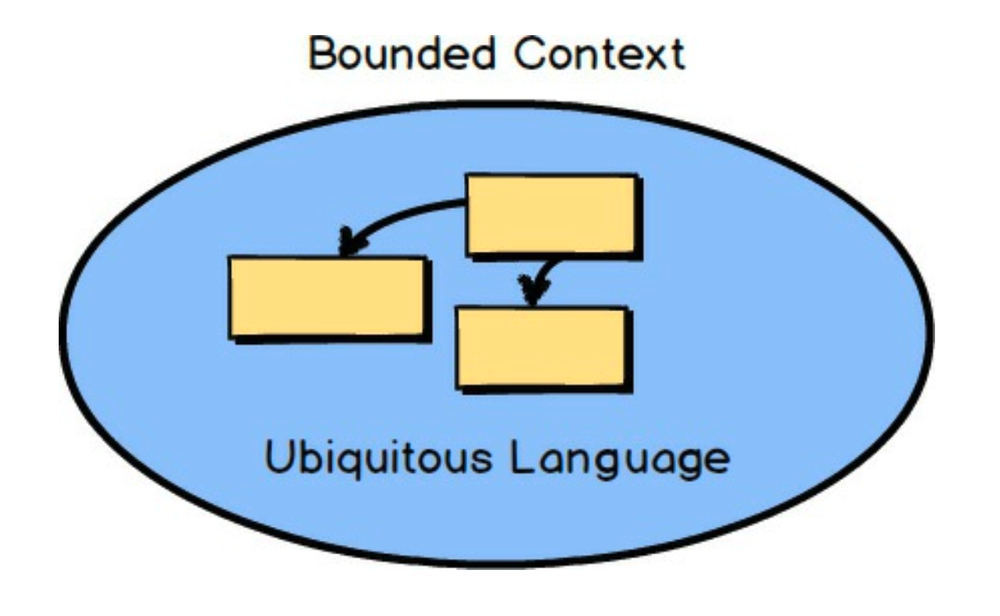
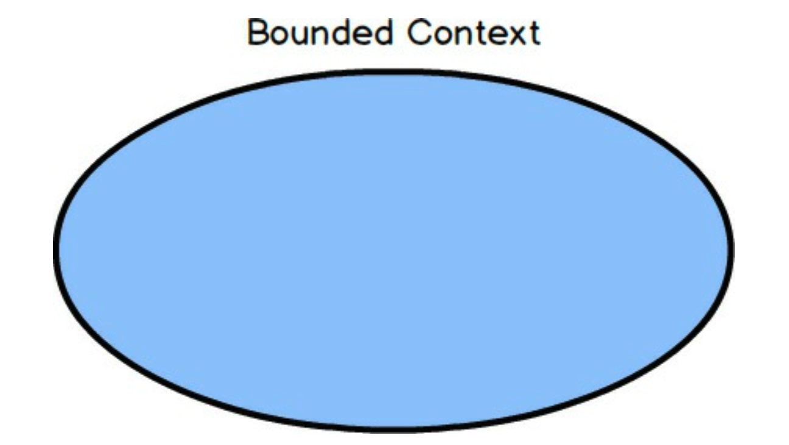
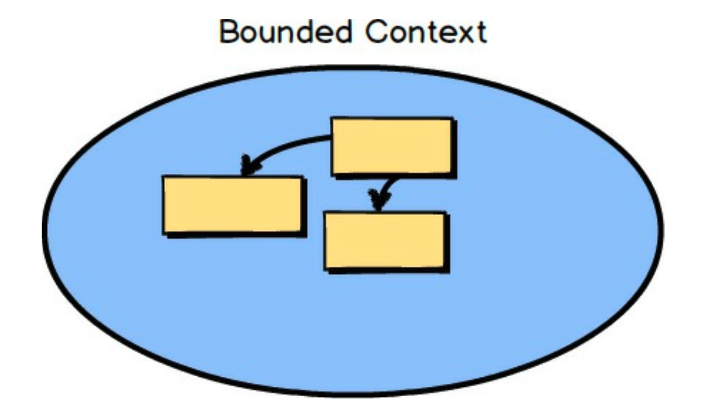
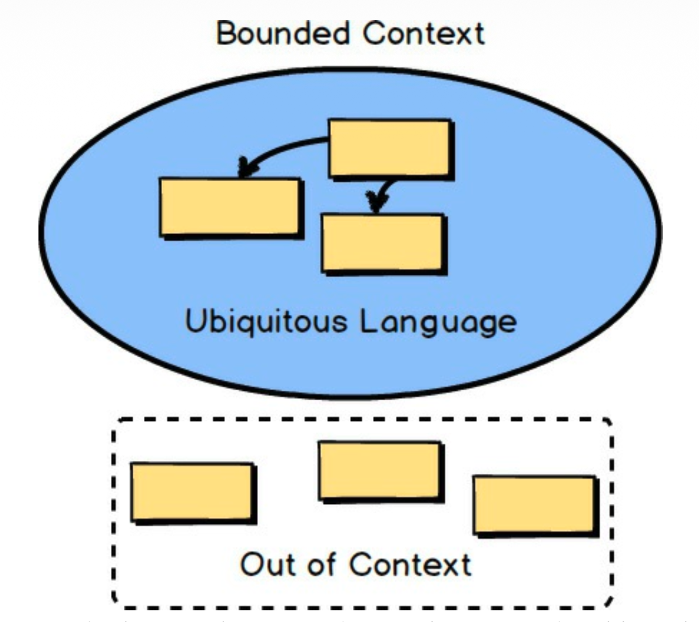
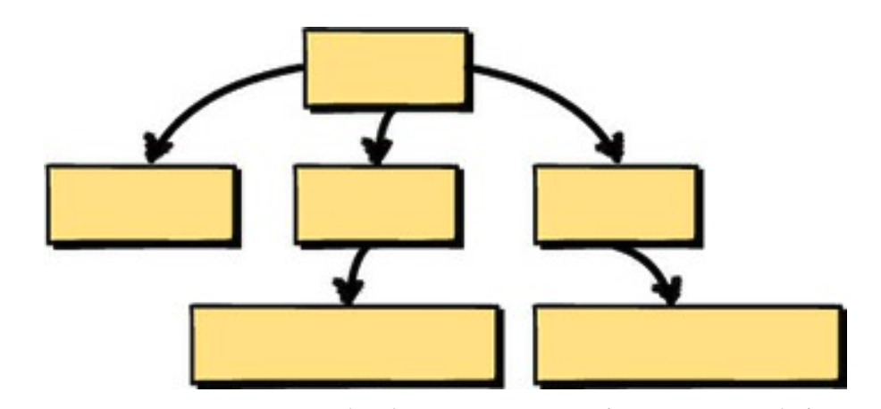
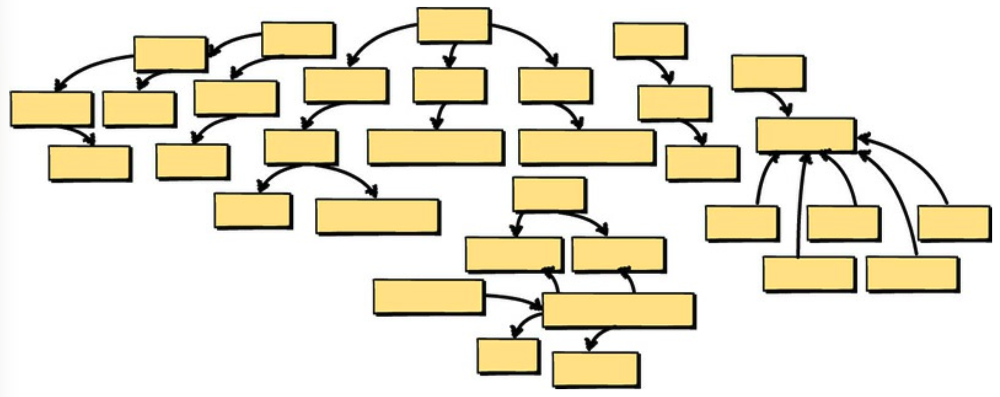
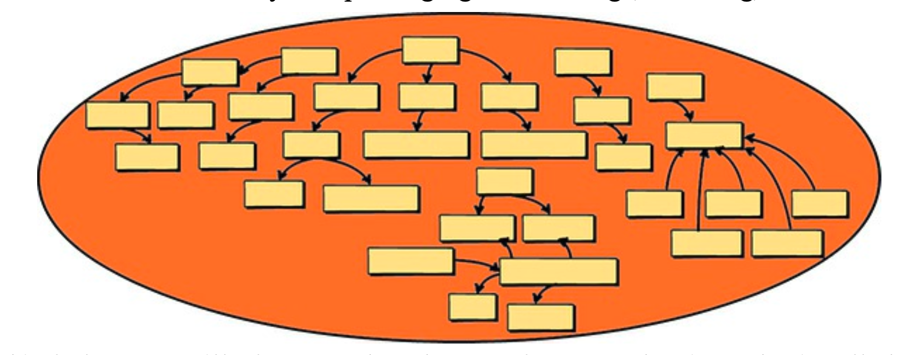

## 第二章 限界上下文与通用语言的战略设计

 

这些被称为 *限界上下文 (Bounded Contexts)* 的东西是什么？
*通用语言 (Ubiquitous Language)* 又是什么？
简而言之，DDD 主要是在一个明确的 *限界上下文 (Bounded Context)* 中对 *通用语言 (Ubiquitous Language)* 进行建模。
虽然这是真的，但这可能不是我能提供的最有帮助的描述。
让我为你分解一下。

 

<ins>首先，*限界上下文 (Bounded Context)* 是一个语义上下文边界。
这意味着在该边界内，软件模型的每个组件都具有特定的含义，并且做特定的事情。
*限界上下文 (Bounded Context)* 内部的组件是上下文特定的，并且具有语义动机</ins>。
这很简单。

当你刚开始软件建模工作时，你的 *限界上下文 (Bounded Context)* 在某种程度上是概念性的。
你可以把它看作是你的 *问题空间 (problem space)* 的一部分。
然而，随着你的模型开始具有更深层的含义和清晰度，
你的 *限界上下文 (Bounded Context)* 将迅速过渡到你的 *解决方案空间 (solution space)*，你的软件模型将以项目源代码的形式反映出来。
（问题空间和解决方案空间在边栏中有更好的解释。）
<ins>请记住，*限界上下文 (Bounded Context)* 是实现模型的地方，并且你将为每个 *限界上下文 (Bounded Context)* 拥有独立的软件工件</ins>。

---
**什么是问题空间和解决方案空间？**

你的 **问题空间** 是你在给定项目的约束下执行高层战略分析和设计步骤的地方。
你可以在讨论高层项目驱动因素并记录重要目标和风险时使用简单的图表。
在实践中， *上下文地图 (Context Maps)* 在问题空间中效果很好。
还要注意，*限界上下文 (Bounded Context)* 在需要时也可用于问题空间讨论，但也与你的解决方案空间密切相关。

你的 **解决方案空间** 是你实际实现问题空间讨论中确定为你的 *核心域 (Core Domain)* 的解决方案的地方。
当 *限界上下文 (Bounded Context)* 作为你组织的关键战略举措被开发时，它被称为 *核心域 (Core Domain)* 。
你在 *限界上下文 (Bounded Context)* 中将解决方案开发为代码，包括主要源代码和测试源代码。
你还将在解决方案空间中生成支持与其他 *限界上下文 (Bounded Context)* 集成的代码。

*「 [实现 DDD 第 2.3 节](../../impl-ddd/ch2/3.md) 中有关于 *问题空间* 和 *解决方案空间* 的详细描述」*

---

 

<ins>上下文边界内的软件模型反映了在 *限界上下文 (Bounded Context)* 中工作的团队所开发的语言，并由在该 *限界上下文 (Bounded Context)* 中创建功能的软件模型的每个成员所使用。
该语言被称为 *通用语言 (Ubiquitous Language)* ，因为它既在团队成员之间口头使用，又在软件模型中实现。
因此，*通用语言 (Ubiquitous Language)* 必须是严格的 —— 精确、确切、严格和紧凑</ins>。
在图中，*限界上下文 (Bounded Context)* 内部的方框代表模型的概念，这些概念可能被实现为类。
当 *限界上下文 (Bounded Context)* 作为你组织的关键战略举措被开发时，它被称为 *核心域 (Core Domain)* 。

与你组织使用的所有软件相比， *核心域 (Core Domain)* 是一个最重要的软件模型，因为它是实现卓越的手段。
开发 *核心域 (Core Domain)* 是为了使你的组织在竞争上区别于所有其他组织。
它至少涉及一条主要的业务线。
你的组织无法在所有方面都表现出色，甚至不应该尝试。
<ins>因此，你要明智地选择哪些应该成为你 *核心域 (Core Domain)* 的一部分，哪些不应该。
这是 DDD 的主要价值主张，你希望通过将你最好的资源投入到 *核心域 (Core Domain)* 来进行适当的投资</ins>。

 

当团队中有人使用 *通用语言 (Ubiquitous Language)* 中的表达时，团队中的每个人都能精确且明确地理解其含义。
该表达在团队中是通用的，正如团队用来定义正在开发的软件模型的所有语言一样。

当你在软件模型中考虑语言时，可以想想构成欧洲的各个国家。
在这片空间内的一个国家中，每个国家的官方语言都是明确的。
在这些国家的边界内 ——例如德国、法国和意大利—— 官方语言是确定的。
当你跨越边界时，官方语言会发生变化。
亚洲也是如此，日本说日语，而中国和韩国所说的语言在国界上明显不同。
你可以以类似的方式来思考 *限界上下文 (Bounded Context)* ，作为语言边界。
<ins>在 DDD 的情况下，这些语言是由拥有软件模型的团队所说的语言，而语言的一种显著的书面形式就是软件模型的源代码</ins>。

---
**限界上下文、团队与源代码仓库**

- <ins>应该有一个团队被分配到一个 *限界上下文 (Bounded Context)* 上工作</ins>。
- <ins>每个 *限界上下文 (Bounded Context)* 也应该有一个独立的源代码仓库</ins>。
- 一个团队可以处理多个 *限界上下文 (Bounded Contexts)* ，但多个团队不应处理单个 *限界上下文 (Bounded Context)* 。
- <ins>以分离 *通用语言 (Ubiquitous Language)* 相同的方式，清晰地分离每个 *限界上下文 (Bounded Context)* 的源代码和数据库 schema </ins>。
- 将验收测试和单元测试与主要源代码放在一起。

特别重要的是要明确，一个团队处理一个 *限界上下文 (Bounded Context)* 。
这完全消除了当另一个团队对你的源代码进行更改时产生的任何不受欢迎的意外。
你的团队拥有源代码和数据库，并定义了官方接口，必须通过其使用你的 *限界上下文 (Bounded Context)* 。
这是使用 DDD 的一个好处。

---

 

在人类语言中，术语会随着时间的推移而演变，并且跨越国界，相同或相似的词会带有含义上的细微差别。
想想西班牙使用的西班牙语单词与哥伦比亚使用的相同单词之间的差异，甚至发音也会发生变化。
这里显然有西班牙的西班牙语和哥伦比亚的西班牙语。
软件模型语言也是如此。
来自其他团队的人可能对相同的术语有不同的含义，因为他们的业务知识处于不同的上下文中；
他们正在开发一个不同的 *限界上下文 (Bounded Context)* 。
上下文之外的任何组件都不需要遵循相同的定义。
实际上，它们可能与你的团队建模的组件不同，无论是略有不同还是巨大不同。
这没问题。

 

为了理解使用 *限界上下文 (Bounded Context)* 的一个重要原因，让我们考虑软件设计中的一个常见问题。
团队往往不知道何时停止向他们的领域模型中堆砌越来越多的概念。
模型可能开始时很小且可管理……

 

<ins>但随后团队添加了更多概念，然后是更多，甚至更多。
这很快会导致一个大问题。
不仅概念过多，而且模型的语言也变得模糊，因为当你思考时，实际上在一个庞大、混乱、无界的模型中存在多种语言</ins>。

 

由于这个缺陷，团队往往会将一个全新的软件产品变成所谓的 *大泥球 (Big Ball of Mud)* 。
可以肯定的是，*大泥球 (Big Ball of Mud)* 不是什么值得骄傲的事情。
它是一个单体，而且更糟。
<ins>这是指一个系统有多个纠缠不清的模型，没有明确的边界。
它可能还需要多个团队来处理，这非常有问题。
此外，各种不相关的概念被扩展到许多模块中，并与冲突的元素相互连接</ins>。
如果这个项目有测试，运行它们可能需要很长时间，因此测试可能在特别重要的时刻被绕过。

这是试图在错误的地方、用太多人、做太多事情的产物。
任何开发和说 *通用语言 (Ubiquitous Language)* 的尝试，都将导致一种破碎且定义不清的方言，很快就会被放弃。
这种语言甚至不会像世界语 (Esperanto) 那样构思良好。
它只是一团糟，就像一个 *大泥球 (Big Ball of Mud)* 。
